This file is a merged representation of the entire codebase, combined into a single document by Repomix.
The content has been processed where security check has been disabled.

# File Summary

## Purpose
This file contains a packed representation of the entire repository's contents.
It is designed to be easily consumable by AI systems for analysis, code review,
or other automated processes.

## File Format
The content is organized as follows:
1. This summary section
2. Repository information
3. Directory structure
4. Repository files (if enabled)
5. Multiple file entries, each consisting of:
  a. A header with the file path (## File: path/to/file)
  b. The full contents of the file in a code block

## Usage Guidelines
- This file should be treated as read-only. Any changes should be made to the
  original repository files, not this packed version.
- When processing this file, use the file path to distinguish
  between different files in the repository.
- Be aware that this file may contain sensitive information. Handle it with
  the same level of security as you would the original repository.

## Notes
- Some files may have been excluded based on .gitignore rules and Repomix's configuration
- Binary files are not included in this packed representation. Please refer to the Repository Structure section for a complete list of file paths, including binary files
- Files matching patterns in .gitignore are excluded
- Files matching default ignore patterns are excluded
- Security check has been disabled - content may contain sensitive information
- Files are sorted by Git change count (files with more changes are at the bottom)

# Directory Structure
```
app/
  api/
    check-env/
      route.ts
    enrich/
      route.ts
    generate-fields/
      route.ts
    scrape/
      route.ts
  fire-enrich/
    agent-toggle.tsx
    config.ts
    csv-preview.tsx
    csv-uploader.tsx
    detail-modal.tsx
    enrichment-table.tsx
    field-mapper.tsx
    page.tsx
    README.md
    skip-list.txt
    source-context-tooltip.tsx
    unified-enrichment-view.tsx
  globals.css
  layout.tsx
  page.tsx
components/
  ui/
    accordion.tsx
    alert-dialog.tsx
    alert.tsx
    aspect-ratio.tsx
    avatar.tsx
    badge.tsx
    breadcrumb.tsx
    button.tsx
    calendar.tsx
    card.tsx
    carousel.tsx
    chart.tsx
    checkbox.tsx
    collapsible.tsx
    command.tsx
    context-menu.tsx
    dialog.tsx
    drawer.tsx
    dropdown-menu.tsx
    form.tsx
    hover-card.tsx
    input-otp.tsx
    input.tsx
    label.tsx
    logo.tsx
    menubar.tsx
    navigation-menu.tsx
    pagination.tsx
    popover.tsx
    progress.tsx
    radio-group.tsx
    resizable.tsx
    scroll-area.tsx
    select.tsx
    separator.tsx
    sheet.tsx
    sidebar.tsx
    skeleton.tsx
    slider.tsx
    sonner.tsx
    switch.tsx
    table.tsx
    tabs.tsx
    textarea.tsx
    toggle-group.tsx
    toggle.tsx
    tooltip.tsx
hooks/
  use-mobile.ts
lib/
  agent-architecture/
    agents/
      company-profile-agent.ts
      discovery-agent.ts
      funding-agent.ts
      general-agent.ts
      metrics-agent.ts
      tech-stack-agent.ts
    core/
      agent-base.ts
      types.ts
    tools/
      email-parser-tool.ts
      smart-search-tool.ts
      website-scraper-tool.ts
    index.ts
    orchestrator.ts
  services/
    firecrawl.ts
    openai.ts
    specialized-agents.ts
  strategies/
    agent-enrichment-strategy.ts
    email-parser.ts
    enrichment-strategy.ts
  types/
    field-generation.ts
    index.ts
  utils/
    email-detection.ts
    field-utils.ts
    skip-list.ts
    source-context.ts
  rate-limit.ts
  utils.ts
public/
  sample-data.csv
.env.example
.gitignore
components.json
eslint.config.mjs
LICENSE
next.config.ts
package.json
postcss.config.mjs
README.md
tailwind.config.ts
tsconfig.json
```

# Files

## File: app/api/check-env/route.ts
````typescript
import { NextResponse } from 'next/server';

export async function GET() {
  const environmentStatus = {
    FIRECRAWL_API_KEY: !!process.env.FIRECRAWL_API_KEY,
    OPENAI_API_KEY: !!process.env.OPENAI_API_KEY,
    ANTHROPIC_API_KEY: !!process.env.ANTHROPIC_API_KEY,
    FIRESTARTER_DISABLE_CREATION_DASHBOARD: process.env.FIRESTARTER_DISABLE_CREATION_DASHBOARD === 'true',
  };

  return NextResponse.json({ environmentStatus });
}
````

## File: app/api/enrich/route.ts
````typescript
import { NextRequest, NextResponse } from 'next/server';
import { AgentEnrichmentStrategy } from '@/lib/strategies/agent-enrichment-strategy';
import type { EnrichmentRequest, RowEnrichmentResult } from '@/lib/types';
import { loadSkipList, shouldSkipEmail, getSkipReason } from '@/lib/utils/skip-list';

// Use Node.js runtime for better compatibility
export const runtime = 'nodejs';

// Store active sessions in memory (in production, use Redis or similar)
const activeSessions = new Map<string, AbortController>();

export async function POST(request: NextRequest) {
  try {
    // Add request body size check
    const contentLength = request.headers.get('content-length');
    if (contentLength && parseInt(contentLength) > 5 * 1024 * 1024) { // 5MB limit
      return NextResponse.json(
        { error: 'Request body too large' },
        { status: 413 }
      );
    }

    const body: EnrichmentRequest = await request.json();
    const { rows, fields, emailColumn, nameColumn } = body;

    if (!rows || rows.length === 0) {
      return NextResponse.json(
        { error: 'No rows provided' },
        { status: 400 }
      );
    }

    if (!fields || fields.length === 0 || fields.length > 10) {
      return NextResponse.json(
        { error: 'Please provide 1-10 fields to enrich' },
        { status: 400 }
      );
    }

    if (!emailColumn) {
      return NextResponse.json(
        { error: 'Email column is required' },
        { status: 400 }
      );
    }

    // Use a more compatible UUID generation
    const sessionId = `${Date.now()}-${Math.random().toString(36).substring(2, 9)}`;
    const abortController = new AbortController();
    activeSessions.set(sessionId, abortController);

    // Check environment variables and headers for API keys
    const openaiApiKey = process.env.OPENAI_API_KEY || request.headers.get('X-OpenAI-API-Key');
    const firecrawlApiKey = process.env.FIRECRAWL_API_KEY || request.headers.get('X-Firecrawl-API-Key');
    
    if (!openaiApiKey || !firecrawlApiKey) {
      console.error('Missing API keys:', { 
        hasOpenAI: !!openaiApiKey, 
        hasFirecrawl: !!firecrawlApiKey 
      });
      return NextResponse.json(
        { error: 'Server configuration error: Missing API keys' },
        { status: 500 }
      );
    }

    // Always use the advanced agent architecture
    const strategyName = 'AgentEnrichmentStrategy';
    
    console.log(`[STRATEGY] Using ${strategyName} - Advanced multi-agent architecture with specialized agents`);
    const enrichmentStrategy = new AgentEnrichmentStrategy(
      openaiApiKey,
      firecrawlApiKey
    );

    // Load skip list
    const skipList = await loadSkipList();

    // Create a streaming response
    const encoder = new TextEncoder();
    const stream = new ReadableStream({
      async start(controller) {
        try {
          // Send session ID
          controller.enqueue(
            encoder.encode(
              `data: ${JSON.stringify({ type: 'session', sessionId })}\n\n`
            )
          );

          for (let i = 0; i < rows.length; i++) {
            // Check if cancelled
            if (abortController.signal.aborted) {
              controller.enqueue(
                encoder.encode(
                  `data: ${JSON.stringify({ type: 'cancelled' })}\n\n`
                )
              );
              break;
            }

            const row = rows[i];
            const email = row[emailColumn];
            
            // Add name to row context if nameColumn is provided
            if (nameColumn && row[nameColumn]) {
              row._name = row[nameColumn];
            }
            
            // Check if email should be skipped
            if (email && shouldSkipEmail(email, skipList)) {
              const skipReason = getSkipReason(email, skipList);
              
              // Send skip result
              const skipResult: RowEnrichmentResult = {
                rowIndex: i,
                originalData: row,
                enrichments: {},
                status: 'skipped',
                error: skipReason,
              };
              
              controller.enqueue(
                encoder.encode(
                  `data: ${JSON.stringify({
                    type: 'result',
                    result: skipResult,
                  })}\n\n`
                )
              );
              
              continue; // Skip to next row
            }
            
            // Send processing status
            controller.enqueue(
              encoder.encode(
                `data: ${JSON.stringify({
                  type: 'processing',
                  rowIndex: i,
                  totalRows: rows.length,
                })}\n\n`
              )
            );

            try {
              // Enrich the row
              console.log(`[ENRICHMENT] Processing row ${i + 1}/${rows.length} - Email: ${email} - Strategy: ${strategyName}`);
              const startTime = Date.now();
              
              // Agent strategies return RowEnrichmentResult
              const result = await enrichmentStrategy.enrichRow(
                row,
                fields,
                emailColumn,
                undefined, // onProgress
                (message: string, type: 'info' | 'success' | 'warning' | 'agent') => {
                  // Stream agent progress messages
                  controller.enqueue(
                    encoder.encode(
                      `data: ${JSON.stringify({
                        type: 'agent_progress',
                        rowIndex: i,
                        message,
                        messageType: type,
                      })}\n\n`
                    )
                  );
                }
              );
              result.rowIndex = i; // Set the correct row index
              
              const duration = Date.now() - startTime;
              console.log(`[ENRICHMENT] Completed row ${i + 1} in ${duration}ms - Fields enriched: ${Object.keys(result.enrichments).length}`);
              
              // Log which fields were successfully enriched
              const enrichedFields = Object.entries(result.enrichments)
                .filter(([, enrichment]) => enrichment.value)
                .map(([fieldName, enrichment]) => `${fieldName}: ${enrichment.value ? '✓' : '✗'}`)
                .join(', ');
              if (enrichedFields) {
                console.log(`[ENRICHMENT] Fields: ${enrichedFields}`);
              }

              // Send result
              controller.enqueue(
                encoder.encode(
                  `data: ${JSON.stringify({
                    type: 'result',
                    result,
                  })}\n\n`
                )
              );
            } catch (error) {
              // Send error for this row
              const errorResult: RowEnrichmentResult = {
                rowIndex: i,
                originalData: row,
                enrichments: {},
                status: 'error',
                error: error instanceof Error ? error.message : 'Unknown error',
              };

              controller.enqueue(
                encoder.encode(
                  `data: ${JSON.stringify({
                    type: 'result',
                    result: errorResult,
                  })}\n\n`
                )
              );
            }

            // Small delay between rows to prevent rate limiting
            await new Promise(resolve => setTimeout(resolve, 1000));
          }

          // Send completion
          controller.enqueue(
            encoder.encode(
              `data: ${JSON.stringify({ type: 'complete' })}\n\n`
            )
          );
        } catch (error) {
          controller.enqueue(
            encoder.encode(
              `data: ${JSON.stringify({
                type: 'error',
                error: error instanceof Error ? error.message : 'Unknown error',
              })}\n\n`
            )
          );
        } finally {
          activeSessions.delete(sessionId);
          controller.close();
        }
      },
    });

    return new NextResponse(stream, {
      headers: {
        'Content-Type': 'text/event-stream',
        'Cache-Control': 'no-cache',
        'Connection': 'keep-alive',
      },
    });
  } catch (error) {
    console.error('Failed to start enrichment:', error);
    return NextResponse.json(
      { 
        error: 'Failed to start enrichment',
        details: error instanceof Error ? error.message : 'Unknown error',
        timestamp: new Date().toISOString()
      },
      { status: 500 }
    );
  }
}

// Cancel endpoint
export async function DELETE(request: NextRequest) {
  const { searchParams } = new URL(request.url);
  const sessionId = searchParams.get('sessionId');

  if (!sessionId) {
    return NextResponse.json(
      { error: 'Session ID required' },
      { status: 400 }
    );
  }

  const controller = activeSessions.get(sessionId);
  if (controller) {
    controller.abort();
    activeSessions.delete(sessionId);
    return NextResponse.json({ success: true });
  }

  return NextResponse.json(
    { error: 'Session not found' },
    { status: 404 }
  );
}
````

## File: app/api/generate-fields/route.ts
````typescript
import { NextRequest, NextResponse } from 'next/server';
import OpenAI from 'openai';
import { zodResponseFormat } from 'openai/helpers/zod';
import { z } from 'zod';
import { FieldGenerationResponse } from '@/lib/types/field-generation';

export async function POST(request: NextRequest) {
  try {
    const { prompt } = await request.json();

    if (!prompt || typeof prompt !== 'string') {
      return NextResponse.json(
        { error: 'Prompt is required' },
        { status: 400 }
      );
    }

    if (!process.env.OPENAI_API_KEY) {
      return NextResponse.json(
        { error: 'OpenAI API key not configured' },
        { status: 500 }
      );
    }

    const openai = new OpenAI({
      apiKey: process.env.OPENAI_API_KEY,
    });

    const completion = await openai.chat.completions.create({
      model: 'gpt-4o',
      messages: [
        {
          role: 'system',
          content: `You are an expert at understanding data enrichment needs and converting natural language requests into structured field definitions.
          
          When the user describes what data they want to collect about companies, extract each distinct piece of information as a separate field.
          
          Guidelines:
          - Use clear, professional field names (e.g., "Company Size" not "size")
          - Provide helpful descriptions that explain what data should be found
          - Choose appropriate data types:
            - string: for text, URLs, descriptions
            - number: for counts, amounts, years
            - boolean: for yes/no questions
            - array: for lists of items
          - Include example values when helpful
          - Common fields include: Company Name, Description, Industry, Employee Count, Founded Year, Headquarters Location, Website, Funding Amount, etc.`
        },
        {
          role: 'user',
          content: prompt
        }
      ],
      response_format: {
        type: 'json_schema',
        json_schema: {
          name: 'field_generation',
          strict: true,
          schema: zodResponseFormat(FieldGenerationResponse, 'field_generation').json_schema.schema
        }
      }
    });

    const message = completion.choices[0].message;
    
    if (!message.content) {
      throw new Error('No response content');
    }
    
    const parsed = JSON.parse(message.content) as z.infer<typeof FieldGenerationResponse>;

    return NextResponse.json({
      success: true,
      data: parsed,
    });
  } catch (error) {
    console.error('Field generation error:', error);
    return NextResponse.json(
      { error: 'Failed to generate fields' },
      { status: 500 }
    );
  }
}
````

## File: app/api/scrape/route.ts
````typescript
import { NextRequest, NextResponse } from 'next/server';
import FirecrawlApp from '@mendable/firecrawl-js';
import { isRateLimited } from '@/lib/rate-limit';

interface ScrapeRequestBody {
  url?: string;
  urls?: string[];
  [key: string]: unknown;
}

interface ScrapeResult {
  success: boolean;
  data?: Record<string, unknown>;
  error?: string;
}

interface ApiError extends Error {
  status?: number;
}

export async function POST(request: NextRequest) {
  const rateLimit = await isRateLimited(request, 'scrape');
  
  if (!rateLimit.success) {
    return NextResponse.json({ 
      success: false,
      error: 'Rate limit exceeded. Please try again later.' 
    }, { 
      status: 429,
      headers: {
        'X-RateLimit-Limit': rateLimit.limit.toString(),
        'X-RateLimit-Remaining': rateLimit.remaining.toString(),
      }
    });
  }

  let apiKey = process.env.FIRECRAWL_API_KEY;
  
  if (!apiKey) {
    const headerApiKey = request.headers.get('X-Firecrawl-API-Key');
    
    if (!headerApiKey) {
      return NextResponse.json({ 
        success: false, 
        error: 'API configuration error. Please try again later or contact support.' 
      }, { status: 500 });
    }
    
    apiKey = headerApiKey;
  }

  try {
    const app = new FirecrawlApp({ apiKey });
    const body = await request.json() as ScrapeRequestBody;
    const { url, urls, ...params } = body;

    let result: ScrapeResult;

    if (url && typeof url === 'string') {
      result = await app.scrapeUrl(url, params) as ScrapeResult;
    } else if (urls && Array.isArray(urls)) {
      result = await app.batchScrapeUrls(urls, params) as ScrapeResult;
    } else {
      return NextResponse.json({ success: false, error: 'Invalid request format. Please check your input and try again.' }, { status: 400 });
    }
    
    return NextResponse.json(result);

  } catch (error: unknown) {
    console.error('Error in /api/scrape endpoint (SDK):', error);
    const err = error as ApiError;
    const errorStatus = typeof err.status === 'number' ? err.status : 500;
    return NextResponse.json({ success: false, error: 'An error occurred while processing your request. Please try again later.' }, { status: errorStatus });
  }
}
````

## File: app/fire-enrich/agent-toggle.tsx
````typescript
import { Label } from "@/components/ui/label";
import { Switch } from "@/components/ui/switch";
import { InfoIcon } from "lucide-react";
import {
  Tooltip,
  TooltipContent,
  TooltipProvider,
  TooltipTrigger,
} from "@/components/ui/tooltip";

interface AgentToggleProps {
  checked: boolean;
  onCheckedChange: (checked: boolean) => void;
  fields: { name: string; description: string }[];
}

export function AgentToggle({ checked, onCheckedChange, fields }: AgentToggleProps) {
  // Determine if specialized agents would be beneficial
  const specializedFieldPatterns = [
    'company', 'industry', 'employee', 'fund', 'invest', 'valuation',
    'ceo', 'founder', 'executive', 'product', 'service', 'tech',
    'email', 'phone', 'social', 'contact'
  ];

  const fieldNames = fields.map(f => f.name.toLowerCase());
  const fieldDescriptions = fields.map(f => f.description.toLowerCase()).join(' ');
  
  const hasSpecializedFields = specializedFieldPatterns.some(pattern => 
    fieldNames.some(name => name.includes(pattern)) ||
    fieldDescriptions.includes(pattern)
  );

  const recommendedAgents: string[] = [];
  if (fieldNames.some(n => n.includes('company') || n.includes('industry')) ||
      fieldDescriptions.includes('company')) {
    recommendedAgents.push('Company Research');
  }
  if (fieldNames.some(n => n.includes('fund') || n.includes('invest')) ||
      fieldDescriptions.includes('funding')) {
    recommendedAgents.push('Fundraising Intelligence');
  }
  if (fieldNames.some(n => n.includes('ceo') || n.includes('founder')) ||
      fieldDescriptions.includes('leadership')) {
    recommendedAgents.push('People & Leadership');
  }
  if (fieldNames.some(n => n.includes('product') || n.includes('tech')) ||
      fieldDescriptions.includes('product')) {
    recommendedAgents.push('Product & Technology');
  }

  return (
    <div className="flex items-center space-x-3">
      <Switch
        id="agent-mode"
        checked={checked}
        onCheckedChange={onCheckedChange}
      />
      <Label htmlFor="agent-mode" className="flex items-center gap-2 cursor-pointer">
        Use Specialized Agents
        <TooltipProvider>
          <Tooltip>
            <TooltipTrigger asChild>
              <InfoIcon className="h-4 w-4 text-muted-foreground" />
            </TooltipTrigger>
            <TooltipContent className="max-w-sm">
              <div className="space-y-2">
                <p className="font-semibold">Specialized Agents</p>
                <p className="text-sm">
                  Enable AI agents that are experts in specific domains like company research, 
                  fundraising, and leadership information.
                </p>
                {hasSpecializedFields && recommendedAgents.length > 0 && (
                  <>
                    <p className="text-sm font-medium mt-2">
                      Recommended for your fields:
                    </p>
                    <ul className="text-sm list-disc list-inside">
                      {recommendedAgents.map(agent => (
                        <li key={agent}>{agent}</li>
                      ))}
                    </ul>
                  </>
                )}
              </div>
            </TooltipContent>
          </Tooltip>
        </TooltipProvider>
      </Label>
      {hasSpecializedFields && (
        <span className="text-xs text-green-600 font-medium">
          ✨ Recommended
        </span>
      )}
    </div>
  );
}
````

## File: app/fire-enrich/config.ts
````typescript
// Check if running in unlimited mode (when cloned/self-hosted)
const isUnlimitedMode = process.env.FIRE_ENRICH_UNLIMITED === 'true' || 
                       process.env.NODE_ENV === 'development';

// Configuration for Fire Enrich
export const FIRE_ENRICH_CONFIG = {
  // CSV upload limits
  CSV_LIMITS: {
    MAX_ROWS: isUnlimitedMode ? Infinity : 15,
    MAX_COLUMNS: isUnlimitedMode ? Infinity : 5,
  },
  
  // Processing configuration
  PROCESSING: {
    DELAY_BETWEEN_ROWS_MS: 1000,
    MAX_RETRIES: 3,
  },
  
  // Request limits
  REQUEST_LIMITS: {
    MAX_BODY_SIZE_MB: isUnlimitedMode ? 50 : 5,
    MAX_FIELDS_PER_ENRICHMENT: isUnlimitedMode ? 50 : 10,
  },
  
  // Feature flags
  FEATURES: {
    IS_UNLIMITED: isUnlimitedMode,
  }
} as const;

// Error messages
export const ERROR_MESSAGES = {
  TOO_MANY_ROWS: `CSV file contains too many rows. Maximum allowed: ${FIRE_ENRICH_CONFIG.CSV_LIMITS.MAX_ROWS} rows`,
  TOO_MANY_COLUMNS: `CSV file contains too many columns. Maximum allowed: ${FIRE_ENRICH_CONFIG.CSV_LIMITS.MAX_COLUMNS} columns`,
  UPGRADE_PROMPT: isUnlimitedMode ? '' : 'To process larger datasets with unlimited rows and columns, clone the repository and run it locally.',
} as const;
````

## File: app/fire-enrich/csv-preview.tsx
````typescript
'use client';

import { useState, useEffect } from 'react';
import { CSVRow } from '@/lib/types';
import { detectEmailColumn, getPreviewData } from '@/lib/utils/email-detection';
import { Button } from '@/components/ui/button';
import { Select, SelectContent, SelectItem, SelectTrigger, SelectValue } from '@/components/ui/select';

interface CSVPreviewProps {
  rows: CSVRow[];
  columns: string[];
  onEmailColumnConfirmed: (columnName: string) => void;
}

export function CSVPreview({ rows, columns, onEmailColumnConfirmed }: CSVPreviewProps) {
  const [selectedColumn, setSelectedColumn] = useState<string>('');
  const [detectedColumn, setDetectedColumn] = useState<{
    columnName: string | null;
    columnIndex: number;
    confidence: number;
  } | null>(null);

  useEffect(() => {
    const detected = detectEmailColumn(rows, columns);
    setDetectedColumn(detected);
    if (detected.columnName) {
      setSelectedColumn(detected.columnName);
    }
  }, [rows, columns]);

  const previewRows = getPreviewData(rows, 5);
  const hasMoreRows = rows.length > 5;

  const handleConfirm = () => {
    if (selectedColumn) {
      onEmailColumnConfirmed(selectedColumn);
    }
  };

  return (
    <div className="space-y-3">
      <div className="flex items-center gap-4">
        <h3 className="text-sm font-semibold">Email Column Detection</h3>
        
        {detectedColumn && detectedColumn.columnName && (
          <div className="flex items-center text-xs">
            <span className="font-medium">Auto-detected:</span>
            <span className="ml-1 font-semibold">{detectedColumn.columnName}</span>
            <span className={`ml-2 ${
              detectedColumn.confidence >= 80 ? 'text-green-600' :
              detectedColumn.confidence >= 50 ? 'text-yellow-600' : 'text-red-600'
            }`}>
              ({detectedColumn.confidence}% confidence)
            </span>
          </div>
        )}
        
        <div className="flex items-center gap-2 ml-auto">
          <label className="text-xs font-medium text-gray-700">
            Select email column:
          </label>
          <Select value={selectedColumn} onValueChange={setSelectedColumn}>
            <SelectTrigger className="w-[180px] h-8">
              <SelectValue placeholder="Select column" />
            </SelectTrigger>
            <SelectContent>
              {columns.map((column) => (
                <SelectItem key={column} value={column}>
                  {column}
                </SelectItem>
              ))}
            </SelectContent>
          </Select>
        </div>
      </div>

      <div>
        <h3 className="text-sm font-semibold mb-2">Preview (First 5 Rows)</h3>
        <div className="border border-gray-200 rounded overflow-hidden">
          <div className="overflow-x-auto max-h-60">
            <table className="min-w-full divide-y divide-gray-200 text-xs">
              <thead className="bg-gray-50 sticky top-0">
                <tr>
                  {columns.map((column) => (
                    <th
                      key={column}
                      className={`px-3 py-2 text-left font-medium uppercase tracking-wider ${
                        column === selectedColumn
                          ? 'text-black bg-gray-100'
                          : 'text-gray-500'
                      }`}
                    >
                      {column}
                      {column === selectedColumn && (
                        <span className="ml-1 text-orange-600">✓</span>
                      )}
                    </th>
                  ))}
                </tr>
              </thead>
              <tbody className="bg-white divide-y divide-gray-200">
                {previewRows.map((row, index) => (
                  <tr key={index} className="hover:bg-gray-50">
                    {columns.map((column) => (
                      <td
                        key={column}
                        className={`px-3 py-1.5 whitespace-nowrap ${
                          column === selectedColumn
                            ? 'font-medium text-gray-900 bg-orange-50'
                            : 'text-gray-500'
                        }`}
                      >
                        <div className="truncate max-w-xs" title={row[column] || '-'}>
                          {row[column] || '-'}
                        </div>
                      </td>
                    ))}
                  </tr>
                ))}
                {hasMoreRows && (
                  <tr className="bg-gray-50">
                    <td
                      colSpan={columns.length}
                      className="px-3 py-2 text-center text-gray-400 italic"
                    >
                      ... and {rows.length - 5} more rows
                    </td>
                  </tr>
                )}
              </tbody>
            </table>
          </div>
        </div>
      </div>

      <div className="flex justify-end">
        <Button
          onClick={handleConfirm}
          disabled={!selectedColumn}
          variant="orange"
        >
          Confirm Email Column
        </Button>
      </div>
    </div>
  );
}
````

## File: app/fire-enrich/csv-uploader.tsx
````typescript
'use client';

import { useState, useCallback } from 'react';
import { useDropzone } from 'react-dropzone';
import Papa from 'papaparse';
import { CSVRow } from '@/lib/types';
import { Button } from '@/components/ui/button';
import { Upload, FileSpreadsheet } from 'lucide-react';
import { FIRE_ENRICH_CONFIG, ERROR_MESSAGES } from './config';

interface CSVUploaderProps {
  onUpload: (rows: CSVRow[], columns: string[]) => void;
}

export function CSVUploader({ onUpload }: CSVUploaderProps) {
  const [isProcessing, setIsProcessing] = useState(false);
  const [error, setError] = useState<string | null>(null);

  const processCSV = useCallback((file: File) => {
    setIsProcessing(true);
    setError(null);

    Papa.parse(file, {
      complete: (results) => {
        if (results.errors.length > 0) {
          setError(`CSV parsing error: ${results.errors[0].message}`);
          setIsProcessing(false);
          return;
        }

        if (!results.data || results.data.length === 0) {
          setError('CSV file is empty');
          setIsProcessing(false);
          return;
        }

        // Get headers from first row
        const headers = Object.keys(results.data[0] as object);
        const rows = results.data as CSVRow[];

        // Check column limit
        if (headers.length > FIRE_ENRICH_CONFIG.CSV_LIMITS.MAX_COLUMNS) {
          setError(
            `${ERROR_MESSAGES.TOO_MANY_COLUMNS}\n${ERROR_MESSAGES.UPGRADE_PROMPT}`
          );
          setIsProcessing(false);
          return;
        }

        // Filter out empty rows
        const validRows = rows.filter(row => 
          Object.values(row).some(value => value && String(value).trim() !== '')
        );

        if (validRows.length === 0) {
          setError('No valid data rows found in CSV');
          setIsProcessing(false);
          return;
        }

        // Check row limit
        if (validRows.length > FIRE_ENRICH_CONFIG.CSV_LIMITS.MAX_ROWS) {
          setError(
            `${ERROR_MESSAGES.TOO_MANY_ROWS}\n${ERROR_MESSAGES.UPGRADE_PROMPT}`
          );
          setIsProcessing(false);
          return;
        }

        setIsProcessing(false);
        onUpload(validRows, headers);
      },
      header: true,
      skipEmptyLines: true,
      transformHeader: (header) => header.trim(),
      transform: (value) => value.trim(),
    });
  }, [onUpload]);

  const onDrop = useCallback((acceptedFiles: File[]) => {
    if (acceptedFiles.length > 0) {
      processCSV(acceptedFiles[0]);
    }
  }, [processCSV]);

  const { getRootProps, getInputProps, isDragActive } = useDropzone({
    onDrop,
    accept: {
      'text/csv': ['.csv'],
      'application/vnd.ms-excel': ['.csv'],
    },
    maxFiles: 1,
  });

  return (
    <div className="w-full max-w-2xl mx-auto">
      <div className="text-center mb-6">
        <h2 className="text-xl font-semibold mb-1">Upload Your CSV File</h2>
        <p className="text-sm text-muted-foreground">
          Start by uploading a CSV file containing email addresses
        </p>
      </div>

      <div
        {...getRootProps()}
        className={`
          relative overflow-hidden
          border-2 border-dashed rounded-lg p-8 text-center cursor-pointer
          transition-all duration-300 ease-out
          ${isDragActive 
            ? 'border-orange-500 bg-orange-50 scale-[1.02] shadow-xl dark:bg-orange-950/20 dark:border-orange-400' 
            : 'border-zinc-300 hover:border-orange-400 bg-white hover:bg-orange-50/30 hover:shadow-lg hover:scale-[1.01] dark:border-zinc-700 dark:bg-zinc-900 dark:hover:bg-orange-950/10 dark:hover:border-orange-700'
          }
          ${isProcessing ? 'opacity-50 cursor-not-allowed' : ''}
        `}
      >
        <input {...getInputProps()} disabled={isProcessing} />
        
        {/* Background pattern */}
        <div className="absolute inset-0 opacity-5 dark:opacity-10">
          <div className="absolute inset-0" style={{
            backgroundImage: 'radial-gradient(circle at 2px 2px, #f97316 1px, transparent 1px)',
            backgroundSize: '32px 32px'
          }} />
        </div>
        
        <div className="relative">
          <div className={`
            w-16 h-16 mx-auto mb-4 rounded-xl flex items-center justify-center
            transition-all duration-300
            ${isDragActive ? 'bg-orange-500 scale-110 rotate-3' : 'bg-orange-500'}
          `}>
            <FileSpreadsheet className="w-8 h-8 text-white" />
          </div>
          
          {isDragActive ? (
            <div className="animate-fade-in">
              <p className="text-xl font-semibold text-orange-600 mb-1">Drop it here!</p>
              <p className="text-sm text-muted-foreground">We&apos;ll start processing immediately</p>
            </div>
          ) : (
            <>
              <p className="text-lg font-medium text-[#36322F] mb-1 dark:text-white">
                Drag & drop your CSV file here
              </p>
              <p className="text-sm text-muted-foreground mb-4">
                or click to browse from your computer
              </p>
              <Button 
                variant="orange"
                size="sm"
                disabled={isProcessing}
              >
                <Upload className="w-4 h-4 mr-2" />
                Select CSV File
              </Button>
            </>
          )}
        </div>
      </div>

      {error && (
        <div className="mt-6 p-4 bg-red-50 border border-red-200 text-red-700 rounded-xl animate-fade-in dark:bg-red-950/20 dark:border-red-900/30 dark:text-red-400">
          <p className="font-semibold mb-1">Error:</p>
          <p className="text-sm whitespace-pre-line">{error}</p>
        </div>
      )}

      {isProcessing && (
        <div className="mt-6 text-center animate-fade-in">
          <div className="inline-flex items-center gap-3 px-6 py-3 bg-orange-100 rounded-full">
            <div className="w-2 h-2 bg-orange-500 rounded-full animate-pulse" />
            <p className="text-sm font-medium text-orange-700">Processing CSV file...</p>
          </div>
        </div>
      )}

      <div className="mt-6 grid grid-cols-1 md:grid-cols-3 gap-3">
        <a 
          href="/sample-data.csv" 
          download="sample-data.csv"
          className="block p-3 bg-orange-50 rounded-lg border border-orange-200 dark:bg-orange-950/20 dark:border-orange-900/30 hover:bg-orange-100 dark:hover:bg-orange-950/30 transition-colors cursor-pointer"
        >
          <div className="flex items-center gap-2 mb-1">
            <div className="w-6 h-6 bg-orange-500 rounded flex items-center justify-center">
              <svg className="w-3 h-3 text-white" fill="none" stroke="currentColor" viewBox="0 0 24 24">
                <path strokeLinecap="round" strokeLinejoin="round" strokeWidth={2} d="M7 16a4 4 0 01-.88-7.903A5 5 0 1115.9 6L16 6a5 5 0 011 9.9M9 19l3 3m0 0l3-3m-3 3V10" />
              </svg>
            </div>
            <h3 className="text-sm font-medium text-[#36322F] dark:text-white">Download Sample</h3>
          </div>
          <p className="text-xs text-muted-foreground">Try our sample CSV file</p>
        </a>
        
        <div className="p-3 bg-zinc-100 rounded-lg border border-zinc-200 dark:bg-zinc-800 dark:border-zinc-700">
          <div className="flex items-center gap-2 mb-1">
            <div className="w-6 h-6 bg-[#36322F] rounded flex items-center justify-center dark:bg-zinc-700">
              <span className="text-white text-xs font-bold">@</span>
            </div>
            <h3 className="text-sm font-medium text-[#36322F] dark:text-white">Email Required</h3>
          </div>
          <p className="text-xs text-muted-foreground">Must contain email addresses</p>
        </div>
        
        <div className="p-3 bg-zinc-100 rounded-lg border border-zinc-200 dark:bg-zinc-800 dark:border-zinc-700">
          <div className="flex items-center gap-2 mb-1">
            <div className="w-6 h-6 bg-[#36322F] rounded flex items-center justify-center dark:bg-zinc-700">
              <span className="text-white text-xs font-bold">
                {FIRE_ENRICH_CONFIG.FEATURES.IS_UNLIMITED ? '∞' : FIRE_ENRICH_CONFIG.CSV_LIMITS.MAX_ROWS}
              </span>
            </div>
            <h3 className="text-sm font-medium text-[#36322F] dark:text-white">
              {FIRE_ENRICH_CONFIG.FEATURES.IS_UNLIMITED ? 'Unlimited Mode' : 'Row Limit'}
            </h3>
          </div>
          <p className="text-xs text-muted-foreground">
            {FIRE_ENRICH_CONFIG.FEATURES.IS_UNLIMITED 
              ? 'Unlimited rows and columns'
              : (
                <>
                  Demo version limited to {FIRE_ENRICH_CONFIG.CSV_LIMITS.MAX_ROWS} rows and {FIRE_ENRICH_CONFIG.CSV_LIMITS.MAX_COLUMNS} columns
                  <br />
                  <span className="text-[10px] opacity-80">(Unlimited when self-hosted)</span>
                </>
              )
            }
          </p>
        </div>
      </div>
    </div>
  );
}
````

## File: app/fire-enrich/detail-modal.tsx
````typescript
'use client';

import { useEffect } from 'react';
import { CSVRow, EnrichmentField, RowEnrichmentResult } from '@/lib/types';
import { Dialog, DialogContent, DialogHeader, DialogTitle } from '@/components/ui/dialog';
import { ExternalLink, Mail, CheckCircle, XCircle, ChevronDown } from 'lucide-react';

interface DetailModalProps {
  isOpen: boolean;
  onClose: () => void;
  row: CSVRow;
  result: RowEnrichmentResult | undefined;
  fields: EnrichmentField[];
  emailColumn?: string;
}

export function DetailModal({ isOpen, onClose, row, result, fields, emailColumn }: DetailModalProps) {
  useEffect(() => {
    const handleEscape = (e: KeyboardEvent) => {
      if (e.key === 'Escape') onClose();
    };
    
    if (isOpen) {
      document.addEventListener('keydown', handleEscape);
    }
    
    return () => {
      document.removeEventListener('keydown', handleEscape);
    };
  }, [isOpen, onClose]);

  if (!isOpen) return null;

  // Find the company name and website URL
  const companyNameField = fields.find(f => f.name === 'company_name' || f.displayName === 'Company Name');
  const companyName = companyNameField && result?.enrichments[companyNameField.name]?.value || 'Company Details';
  
  // Extract website URL from enrichments or original data
  const websiteUrlValue = result?.enrichments['website']?.value || 
                         result?.enrichments['company_website']?.value || 
                         row['website'] || 
                         row['company_website'] || 
                         '';
  const websiteUrl = typeof websiteUrlValue === 'string' ? websiteUrlValue : '';

  return (
    <Dialog open={isOpen} onOpenChange={onClose}>
      <DialogContent className="max-w-2xl max-h-[80vh] overflow-hidden bg-white">
        <DialogHeader className="bg-gradient-to-r from-gray-900 to-gray-800 text-white -m-6 mb-0 p-4 rounded-t-lg">
          <DialogTitle className="text-lg font-semibold">
            <div>
              {companyName}
              {websiteUrl && (
                <a 
                  href={websiteUrl.startsWith('http') ? websiteUrl : `https://${websiteUrl}`}
                  target="_blank"
                  rel="noopener noreferrer"
                  className="inline-flex items-center gap-1 text-gray-300 hover:text-white text-xs mt-0.5 transition-colors ml-3"
                >
                  <ExternalLink className="w-3 h-3" />
                  Visit Website
                </a>
              )}
            </div>
          </DialogTitle>
        </DialogHeader>
        
        <div className="overflow-y-auto max-h-[calc(80vh-100px)] mt-4">
          {/* Email and Basic Info */}
          <div className="mb-4">
            <div className="flex items-center gap-2">
              <Mail className="w-4 h-4 text-gray-400" />
              <span className="text-gray-900 font-medium text-sm">{emailColumn ? row[emailColumn] : Object.values(row)[0]}</span>
            </div>
          </div>
          
          {/* Enriched Data Section */}
          {result && (
            <div>
              <div className="grid grid-cols-1 md:grid-cols-2 gap-3">
                {fields.map(field => {
                  const enrichment = result.enrichments[field.name];
                  if (!enrichment) return null;
                  
                  // Skip company description as we'll show it separately
                  if (field.name === 'company_description' || field.displayName === 'Company Description') {
                    return null;
                  }
                  
                  return (
                    <div key={field.name} className="bg-gray-50 rounded-lg p-3">
                      <div className="flex items-start justify-between mb-2">
                        <h4 className="font-medium text-gray-900 text-sm">{field.displayName}</h4>
                        <div className="flex items-center gap-2">
                          {(enrichment.source || enrichment.sourceContext) && (
                            <div className="flex flex-wrap gap-1">
                              {enrichment.sourceContext && enrichment.sourceContext.length > 0 ? (
                                enrichment.sourceContext.map((ctx, idx) => (
                                  <a
                                    key={idx}
                                    href={ctx.url}
                                    target="_blank"
                                    rel="noopener noreferrer"
                                    className="inline-flex items-center px-1.5 py-0.5 rounded text-xs bg-gray-200 text-gray-600 hover:bg-gray-300"
                                    title={ctx.snippet || 'View source'}
                                  >
                                    <ExternalLink className="w-3 h-3 mr-0.5" />
                                    {new URL(ctx.url).hostname.replace('www.', '')}
                                  </a>
                                ))
                              ) : enrichment.source && (
                                enrichment.source.split(', ').map((url, idx) => (
                                  <a
                                    key={idx}
                                    href={url}
                                    target="_blank"
                                    rel="noopener noreferrer"
                                    className="inline-flex items-center px-1.5 py-0.5 rounded text-xs bg-gray-200 text-gray-600 hover:bg-gray-300"
                                  >
                                    <ExternalLink className="w-3 h-3 mr-0.5" />
                                    {(() => {
                                      try {
                                        return new URL(url).hostname.replace('www.', '');
                                      } catch {
                                        return 'Source';
                                      }
                                    })()}
                                  </a>
                                ))
                              )}
                            </div>
                          )}
                        </div>
                      </div>
                      <div className="text-gray-700 text-sm">
                        {field.type === 'boolean' ? (
                          <div className="flex items-center gap-1">
                            {enrichment.value === true || enrichment.value === 'true' || enrichment.value === 'Yes' ? (
                              <>
                                <CheckCircle className="w-4 h-4 text-green-600" />
                                <span className="text-green-700 font-medium">Yes</span>
                              </>
                            ) : (
                              <>
                                <XCircle className="w-4 h-4 text-red-600" />
                                <span className="text-red-700 font-medium">No</span>
                              </>
                            )}
                          </div>
                        ) : field.type === 'array' && Array.isArray(enrichment.value) ? (
                          <ul className="space-y-0.5 text-sm">
                            {enrichment.value.map((item, idx) => (
                              <li key={idx} className="flex items-start gap-1">
                                <span className="text-blue-600">•</span>
                                <span>{item}</span>
                              </li>
                            ))}
                          </ul>
                        ) : (
                          <p>{enrichment.value || '-'}</p>
                        )}
                      </div>
                    </div>
                  );
                })}
              </div>
              
              {/* Company Description - Full Width */}
              {fields.map(field => {
                const enrichment = result.enrichments[field.name];
                if (!enrichment || (field.name !== 'company_description' && field.displayName !== 'Company Description')) {
                  return null;
                }
                
                return (
                  <div key={field.name} className="mt-4 bg-blue-50 rounded-lg p-4">
                    <div className="flex items-start justify-between mb-2">
                      <h4 className="font-medium text-gray-900 text-sm">
                        {field.displayName}
                      </h4>
                      {enrichment.source && (
                        <div className="text-xs space-y-1">
                          {enrichment.source.split(', ').map((url, idx) => (
                            <a 
                              key={idx}
                              href={url} 
                              target="_blank" 
                              rel="noopener noreferrer"
                              className="block text-gray-600 hover:text-blue-600"
                            >
                              {(() => {
                                try {
                                  return new URL(url).hostname.replace('www.', '');
                                } catch {
                                  return 'View source';
                                }
                              })()}
                            </a>
                          ))}
                        </div>
                      )}
                    </div>
                    <p className="text-gray-700 text-sm leading-relaxed">{enrichment.value}</p>
                  </div>
                );
              })}
            </div>
          )}
          
          {/* Original Data Section - Collapsed by default */}
          <details className="mt-4 border-t pt-3">
            <summary className="cursor-pointer text-xs font-medium text-gray-600 hover:text-gray-900 flex items-center gap-1">
              <ChevronDown className="w-3 h-3" />
              View Original Data
            </summary>
            <div className="mt-2 bg-gray-50 rounded p-2 space-y-1">
              {Object.entries(row).map(([key, value]) => (
                <div key={key} className="flex text-xs">
                  <span className="font-medium text-gray-600 w-28">{key}:</span>
                  <span className="text-gray-900">{value}</span>
                </div>
              ))}
            </div>
          </details>
        </div>
      </DialogContent>
    </Dialog>
  );
}
````

## File: app/fire-enrich/enrichment-table.tsx
````typescript
'use client';

import { useState, useEffect, useCallback, useRef } from 'react';
import { CSVRow, EnrichmentField, RowEnrichmentResult } from '@/lib/types';
import { Sheet, SheetContent, SheetHeader, SheetTitle } from '@/components/ui/sheet';
import { SourceContextTooltip } from './source-context-tooltip';
import { Button } from '@/components/ui/button';
import { Card } from '@/components/ui/card';
import { Badge } from '@/components/ui/badge';
import { Label } from '@/components/ui/label';
import { Download, X, Copy, ExternalLink, Globe, Mail, Check, ChevronDown, ChevronUp, Activity, CheckCircle, AlertCircle, Info } from 'lucide-react';
import { toast } from 'sonner';

interface EnrichmentTableProps {
  rows: CSVRow[];
  fields: EnrichmentField[];
  emailColumn?: string;
}

export function EnrichmentTable({ rows, fields, emailColumn }: EnrichmentTableProps) {
  const [results, setResults] = useState<Map<number, RowEnrichmentResult>>(new Map());
  const [status, setStatus] = useState<'idle' | 'processing' | 'completed' | 'cancelled'>('idle');
  const [currentRow, setCurrentRow] = useState(-1);
  const [sessionId, setSessionId] = useState<string | null>(null);
  const [useAgents] = useState(true); // Default to using agents
  const [selectedRow, setSelectedRow] = useState<{
    isOpen: boolean;
    row: CSVRow | null;
    result: RowEnrichmentResult | undefined;
    index: number;
  }>({ isOpen: false, row: null, result: undefined, index: -1 });
  const [copiedRow, setCopiedRow] = useState<number | null>(null);
  const [expandedSources, setExpandedSources] = useState<Set<string>>(new Set());
  const [showSkipped, setShowSkipped] = useState(false);
  const [agentMessages, setAgentMessages] = useState<Array<{
    message: string;
    type: 'info' | 'success' | 'warning' | 'agent';
    timestamp: number;
    rowIndex?: number;
  }>>([]);
  const agentMessagesEndRef = useRef<HTMLDivElement>(null);
  const activityScrollRef = useRef<HTMLDivElement>(null);

  // Track when each row's data arrives
  const [rowDataArrivalTime, setRowDataArrivalTime] = useState<Map<number, number>>(new Map());
  const [cellsShown, setCellsShown] = useState<Set<string>>(new Set());
  const animationTimerRef = useRef<NodeJS.Timeout | null>(null);

  // Cleanup animation timer on unmount
  useEffect(() => {
    const timer = animationTimerRef.current;
    return () => {
      if (timer) {
        clearInterval(timer);
      }
    };
  }, []);
  
  // Auto-scroll to bottom when new agent messages arrive
  useEffect(() => {
    if (activityScrollRef.current) {
      activityScrollRef.current.scrollTop = activityScrollRef.current.scrollHeight;
    }
  }, [agentMessages]);

  // Calculate animation delay for each cell
  const getCellAnimationDelay = useCallback((rowIndex: number, fieldIndex: number) => {
    const arrivalTime = rowDataArrivalTime.get(rowIndex);
    if (!arrivalTime) return 0; // No delay if no arrival time
    
    // Reduced animation time for better UX
    const totalRowAnimationTime = 2000; // 2 seconds
    const delayPerCell = Math.min(300, totalRowAnimationTime / fields.length); // Max 300ms per cell
    
    // Add delay based on field position
    return fieldIndex * delayPerCell;
  }, [rowDataArrivalTime, fields.length]);

  const startEnrichment = useCallback(async () => {
    setStatus('processing');
    setAgentMessages([]); // Clear previous messages
    
    try {
      // Get API keys from localStorage if not in environment
      const firecrawlApiKey = localStorage.getItem('firecrawl_api_key');
      const openaiApiKey = localStorage.getItem('openai_api_key');
      
      const headers: Record<string, string> = {
        'Content-Type': 'application/json',
        ...(useAgents && { 'x-use-agents': 'true' }),
      };
      
      // Add API keys to headers if available
      if (firecrawlApiKey) {
        headers['X-Firecrawl-API-Key'] = firecrawlApiKey;
      }
      if (openaiApiKey) {
        headers['X-OpenAI-API-Key'] = openaiApiKey;
      }
      
      const response = await fetch('/api/enrich', {
        method: 'POST',
        headers,
        body: JSON.stringify({
          rows,
          fields,
          emailColumn,
          useAgents,
          useV2Architecture: true, // Use new agent architecture when agents are enabled
        }),
      });

      if (!response.ok) {
        throw new Error('Failed to start enrichment');
      }

      const reader = response.body?.getReader();
      const decoder = new TextDecoder();

      if (!reader) {
        throw new Error('No response body');
      }

      while (true) {
        const { done, value } = await reader.read();
        if (done) break;

        const text = decoder.decode(value);
        const lines = text.split('\n');

        for (const line of lines) {
          if (line.startsWith('data: ')) {
            try {
              const data = JSON.parse(line.substring(6));

              switch (data.type) {
                case 'session':
                  setSessionId(data.sessionId);
                  break;
                
                case 'processing':
                  setCurrentRow(data.rowIndex);
                  break;
                
                case 'result':
                  setResults(prev => {
                    const newMap = new Map(prev);
                    newMap.set(data.result.rowIndex, data.result);
                    return newMap;
                  });
                  // Track when this row's data arrived
                  setRowDataArrivalTime(prevTime => {
                    const newMap = new Map(prevTime);
                    newMap.set(data.result.rowIndex, Date.now());
                    return newMap;
                  });
                  
                  // Mark all cells as shown after animation completes
                  setTimeout(() => {
                    const rowCells = fields.map(f => `${data.result.rowIndex}-${f.name}`);
                    setCellsShown(prev => {
                      const newSet = new Set(prev);
                      rowCells.forEach(cell => newSet.add(cell));
                      return newSet;
                    });
                  }, 2500); // Slightly after all animations complete
                  break;
                
                case 'complete':
                  setStatus('completed');
                  // Add a final success message
                  setAgentMessages(prev => [...prev, {
                    message: 'All enrichment tasks completed successfully',
                    type: 'success',
                    timestamp: Date.now()
                  }]);
                  break;
                
                case 'cancelled':
                  setStatus('cancelled');
                  break;
                
                case 'error':
                  console.error('Enrichment error:', data.error);
                  setStatus('completed');
                  break;
                
                case 'agent_progress':
                  setAgentMessages(prev => [...prev, {
                    message: data.message,
                    type: data.messageType,
                    timestamp: Date.now(),
                    rowIndex: data.rowIndex
                  }]);
                  // Keep only last 50 messages
                  setAgentMessages(prev => prev.slice(-50));
                  break;
              }
            } catch {
              // Ignore parsing errors
            }
          }
        }
      }
    } catch (error) {
      console.error('Failed to start enrichment:', error);
      setStatus('completed');
    }
  }, [fields, rows, emailColumn, useAgents]);

  useEffect(() => {
    if (status === 'idle') {
      startEnrichment();
    }
  }, [startEnrichment, status]); // Add proper dependencies

  const cancelEnrichment = async () => {
    if (sessionId) {
      try {
        await fetch(`/api/enrich?sessionId=${sessionId}`, {
          method: 'DELETE',
        });
      } catch (error) {
        console.error('Failed to cancel enrichment:', error);
      }
      setStatus('cancelled');
      setCurrentRow(-1);
    }
  };

  const downloadCSV = () => {
    // Build headers
    const headers = [
      emailColumn || 'email',
      ...fields.map(f => f.displayName),
      ...fields.map(f => `${f.displayName}_confidence`),
      ...fields.map(f => `${f.displayName}_source`)
    ];
    
    const csvRows = [headers.map(h => `"${h}"`).join(',')];

    rows.forEach((row, index) => {
      const result = results.get(index);
      const values: string[] = [];
      
      // Add email
      const email = emailColumn ? row[emailColumn] : Object.values(row)[0];
      values.push(`"${email || ''}"`);
      
      // Add field values
      fields.forEach(field => {
        const enrichment = result?.enrichments[field.name];
        const value = enrichment?.value;
        if (value === undefined || value === null) {
          values.push('');
        } else if (Array.isArray(value)) {
          values.push(`"${value.join('; ')}"`);
        } else if (typeof value === 'string' && (value.includes(',') || value.includes('"') || value.includes('\n'))) {
          values.push(`"${value.replace(/"/g, '""')}"`);
        } else {
          values.push(String(value));
        }
      });
      
      // Add confidence scores
      fields.forEach(field => {
        const enrichment = result?.enrichments[field.name];
        values.push(enrichment?.confidence ? enrichment.confidence.toFixed(2) : '');
      });
      
      // Add sources
      fields.forEach(field => {
        const enrichment = result?.enrichments[field.name];
        if (enrichment?.sourceContext && enrichment.sourceContext.length > 0) {
          const urls = enrichment.sourceContext.map(s => s.url).join('; ');
          values.push(`"${urls}"`);
        } else if (enrichment?.source) {
          values.push(`"${enrichment.source}"`);
        } else {
          values.push('');
        }
      });

      csvRows.push(values.join(','));
    });

    const blob = new Blob([csvRows.join('\n')], { type: 'text/csv' });
    const url = URL.createObjectURL(blob);
    const a = document.createElement('a');
    a.href = url;
    a.download = `enriched_data_${new Date().toISOString().split('T')[0]}.csv`;
    a.click();
    URL.revokeObjectURL(url);
  };

  const downloadJSON = () => {
    const exportData = {
      metadata: {
        exportDate: new Date().toISOString(),
        totalRows: rows.length,
        processedRows: results.size,
        fields: fields.map(f => ({
          name: f.name,
          displayName: f.displayName,
          type: f.type
        })),
        status: status
      },
      data: rows.map((row, index) => {
        const result = results.get(index);
        const email = emailColumn ? row[emailColumn] : Object.values(row)[0];
        
        const enrichedRow: Record<string, unknown> = {
          _index: index,
          _email: email,
          _original: row,
          _status: result ? 'enriched' : 'pending'
        };
        
        if (result) {
          fields.forEach(field => {
            const enrichment = result.enrichments[field.name];
            if (enrichment) {
              enrichedRow[field.name] = {
                value: enrichment.value,
                confidence: enrichment.confidence,
                sources: enrichment.sourceContext?.map(s => s.url) || 
                        (enrichment.source ? enrichment.source.split(', ') : [])
              };
            }
          });
        }
        
        return enrichedRow;
      })
    };
    
    const blob = new Blob([JSON.stringify(exportData, null, 2)], { type: 'application/json' });
    const url = URL.createObjectURL(blob);
    const a = document.createElement('a');
    a.href = url;
    a.download = `enriched_data_${new Date().toISOString().split('T')[0]}.json`;
    a.click();
    URL.revokeObjectURL(url);
  };

  const downloadSkippedEmails = () => {
    // Get all skipped rows
    const skippedRows = rows.filter((_, index) => {
      const result = results.get(index);
      return result?.status === 'skipped';
    });

    if (skippedRows.length === 0) {
      return;
    }

    // Create CSV header
    const headers = Object.keys(skippedRows[0]);
    const csvRows = [headers.join(',')];

    // Add skipped rows with skip reason
    skippedRows.forEach((row, index) => {
      const originalIndex = rows.findIndex(r => r === row);
      const result = results.get(originalIndex);
      const values = headers.map(header => {
        const value = row[header];
        // Escape quotes and wrap in quotes if necessary
        if (typeof value === 'string' && (value.includes(',') || value.includes('"') || value.includes('\n'))) {
          return `"${value.replace(/"/g, '""')}"`;
        }
        return value || '';
      });
      
      // Add skip reason as last column
      if (index === 0) {
        csvRows[0] += ',Skip Reason';
      }
      values.push(result?.error || 'Personal email provider');
      
      csvRows.push(values.join(','));
    });

    const blob = new Blob([csvRows.join('\n')], { type: 'text/csv' });
    const url = URL.createObjectURL(blob);
    const a = document.createElement('a');
    a.href = url;
    a.download = `skipped_emails_${new Date().toISOString().split('T')[0]}.csv`;
    a.click();
    URL.revokeObjectURL(url);
  };


  const copyToClipboard = async (text: string) => {
    try {
      await navigator.clipboard.writeText(text);
    } catch (err) {
      console.error('Failed to copy:', err);
    }
  };


  const copyRowData = (rowIndex: number) => {
    const result = results.get(rowIndex);
    const row = rows[rowIndex];
    if (!result || !row) return;
    
    // Format data nicely for Google Docs
    const emailValue = emailColumn ? row[emailColumn] : '';
    let formattedData = `Email: ${emailValue}\n\n`;
    
    fields.forEach(field => {
      const enrichment = result.enrichments[field.name];
      const value = enrichment?.value;
      
      // Format the field name and value
      formattedData += `${field.displayName}: `;
      
      if (value === undefined || value === null || value === '') {
        formattedData += 'Not found';
      } else if (Array.isArray(value)) {
        formattedData += value.join(', ');
      } else if (typeof value === 'boolean') {
        formattedData += value ? 'Yes' : 'No';
      } else {
        formattedData += String(value);
      }
      
      formattedData += '\n\n';
    });
    
    copyToClipboard(formattedData.trim());
    
    // Show copied feedback
    setCopiedRow(rowIndex);
    toast.success('Row data copied to clipboard!');
    setTimeout(() => setCopiedRow(null), 2000);
  };

  const openDetailSidebar = (rowIndex: number) => {
    const row = rows[rowIndex];
    const result = results.get(rowIndex);
    setSelectedRow({ isOpen: true, row, result, index: rowIndex });
  };

  return (
    <div className="space-y-4">
      <Card className="p-4 bg-white dark:bg-zinc-900 border-zinc-200 dark:border-zinc-800">
        <div className="flex items-center justify-between">
          <div className="flex items-center gap-6">
            {/* Progress indicator */}
            <div className="flex items-center gap-3">
              <div className="relative">
                <div className={`w-12 h-12 rounded-full flex items-center justify-center ${
                  status === 'processing' ? 'bg-orange-100 dark:bg-orange-900/20' : 
                  status === 'completed' ? 'bg-green-100 dark:bg-green-900/20' : 
                  'bg-red-100 dark:bg-red-900/20'
                }`}>
                  {status === 'processing' ? (
                    <div className="w-6 h-6 border-2 border-orange-500 border-t-transparent rounded-full animate-spin" />
                  ) : status === 'completed' ? (
                    <Check className="w-6 h-6 text-green-600 dark:text-green-400" />
                  ) : (
                    <X className="w-6 h-6 text-red-600 dark:text-red-400" />
                  )}
                </div>
              </div>
              
              <div>
                <h3 className="text-sm font-semibold text-zinc-900 dark:text-zinc-100">
                  {status === 'processing' ? 'Enriching Data' : 
                   status === 'completed' ? 'Enrichment Complete' : 
                   'Enrichment Cancelled'}
                </h3>
                <div className="flex flex-col gap-0.5 mt-0.5">
                  <span className="text-xs text-zinc-600 dark:text-zinc-400">
                    {results.size} of {rows.length} rows processed
                  </span>
                  {(() => {
                    const allResults = Array.from(results.values());
                    const skippedResults = allResults.filter(r => r.status === 'skipped');
                    const skippedCount = skippedResults.length;
                    if (skippedCount > 0) {
                      return (
                        <span className="text-xs text-amber-600 dark:text-amber-400 font-medium">
                          {skippedCount} common email providers skipped (Gmail, Outlook, etc.)
                        </span>
                      );
                    }
                    return null;
                  })()}
                  {status === 'processing' && currentRow >= 0 && (
                    <span className="text-xs text-zinc-600 dark:text-zinc-400">
                      Currently processing row {currentRow + 1}
                    </span>
                  )}
                </div>
              </div>
            </div>
          </div>
          
          <div className="flex items-center gap-4">
            {(status === 'completed' || status === 'cancelled' || (status === 'processing' && results.size > 0)) && (
              <div className="flex items-center gap-3">
                {(() => {
                  const skippedCount = Array.from(results.values()).filter(r => r.status === 'skipped').length;
                  if (skippedCount > 0) {
                    return (
                      <Button
                        onClick={downloadSkippedEmails}
                        variant="orange"
                        size="sm"
                      >
                        <Download className="w-4 h-4 mr-2" />
                        Skipped Emails CSV
                      </Button>
                    );
                  }
                  return null;
                })()}
                <Button
                  onClick={downloadCSV}
                  variant="orange"
                  size="sm"
                >
                  <Download className="w-4 h-4 mr-2" />
                  Export CSV
                </Button>
                <Button
                  onClick={downloadJSON}
                  className="bg-black text-white hover:bg-zinc-900 shadow-lg shadow-black/20 dark:shadow-black/40"
                  size="sm"
                >
                  <Download className="w-4 h-4 mr-2" />
                  JSON
                </Button>
              </div>
            )}
            
            {/* Cancel button moved to the end */}
            {status === 'processing' && (
              <Button
                onClick={cancelEnrichment}
                variant="outline"
                size="sm"
                className="text-red-600 hover:text-red-700 border-red-200 hover:border-red-300 hover:bg-red-50 dark:text-red-400 dark:hover:text-red-300 dark:border-red-800 dark:hover:border-red-700 dark:hover:bg-red-950"
              >
                <X className="w-3 h-3 mr-1.5" />
                Cancel
              </Button>
            )}
          </div>
        </div>
      </Card>

      {/* Agent Progress Messages */}
      {agentMessages.length > 0 && (
        <Card className="p-3 bg-white dark:bg-zinc-900 border-zinc-200 dark:border-zinc-800">
          <h4 className="text-sm font-semibold text-zinc-700 dark:text-zinc-300 mb-2">
            Agent Activity Log
          </h4>
          <div ref={activityScrollRef} className="space-y-1 max-h-32 overflow-y-auto pr-2 text-xs">
            {agentMessages.map((msg, idx) => (
              <div
                key={idx}
                className={`flex items-start gap-2 py-0.5 ${
                  msg.type === 'agent' ? 'text-orange-600 dark:text-orange-400' :
                  msg.type === 'success' ? 'text-green-600 dark:text-green-400' :
                  msg.type === 'warning' ? 'text-amber-600 dark:text-amber-400' :
                  'text-zinc-600 dark:text-zinc-400'
                }`}
              >
                <span className="flex-shrink-0 mt-0.5">
                  {msg.type === 'agent' ? <Activity className="w-3 h-3" /> :
                   msg.type === 'success' ? <CheckCircle className="w-3 h-3" /> :
                   msg.type === 'warning' ? <AlertCircle className="w-3 h-3" /> :
                   <Info className="w-3 h-3" />}
                </span>
                <span className="flex-1">
                  {msg.rowIndex !== undefined && (
                    <span className="font-medium">Row {msg.rowIndex + 1}: </span>
                  )}
                  {msg.message}
                </span>
              </div>
            ))}
            <div ref={agentMessagesEndRef} />
          </div>
        </Card>
      )}

      <div className="overflow-hidden rounded-lg shadow-sm border border-gray-200">
        <div className="overflow-x-auto bg-white">
          <table className="min-w-full relative">
          <thead>
            <tr className="border-b-2 border-orange-100">
              <th className="sticky left-0 z-10 bg-white dark:bg-zinc-900 px-4 py-3 text-left text-sm font-semibold text-gray-700 dark:text-gray-300 border-r-2 border-orange-400 shadow-[2px_0_8px_rgba(251,146,60,0.3)]">
                {emailColumn || 'Email'}
              </th>
              {fields.map(field => (
                <th key={field.name} className="px-4 py-3 text-left text-sm font-medium text-gray-700 bg-gray-50">
                  {field.displayName}
                </th>
              ))}
            </tr>
          </thead>
          <tbody>
            {rows.map((row, index) => {
              const result = results.get(index);
              const isProcessing = currentRow === index && status === 'processing';
              
              return (
                <tr key={index} className={`
                  ${isProcessing ? 'animate-processing-row' : 
                    index % 2 === 0 ? 'bg-white' : 'bg-gray-50/50'} 
                  hover:bg-orange-50/50 transition-all duration-300 group
                `}>
                  <td className={`
                    sticky left-0 z-10 px-4 py-2 text-sm font-medium
                    ${isProcessing ? 'bg-orange-50 dark:bg-orange-950/10' : 
                      'bg-white dark:bg-zinc-900'}
                    border-r-2 border-orange-400 shadow-[2px_0_8px_rgba(251,146,60,0.3)]
                  `}>
                    <div className="space-y-1">
                      <div className="flex items-center gap-2">
                        {result && (
                          <div className="relative group/copy">
                            <button
                              onClick={() => copyRowData(index)}
                              className="text-orange-400 hover:text-orange-600 transition-all duration-200 hover:scale-110"
                              title="Copy row data"
                            >
                              <Copy className="w-4 h-4" />
                            </button>
                            <span className="absolute bottom-full left-1/2 transform -translate-x-1/2 mb-1 bg-gray-900 text-white text-xs px-2 py-1 rounded shadow-lg whitespace-nowrap opacity-0 group-hover/copy:opacity-100 transition-opacity pointer-events-none z-[100]">
                              Copy row
                              <div className="absolute top-full left-1/2 transform -translate-x-1/2 -translate-y-1/2 rotate-45 w-2 h-2 bg-gray-900"></div>
                            </span>
                            {copiedRow === index && (
                              <div className="absolute bottom-full left-1/2 transform -translate-x-1/2 mb-2 bg-gray-900 text-white text-xs px-2 py-1 rounded shadow-lg whitespace-nowrap z-[100] animate-fade-in">
                                Copied!
                                <div className="absolute top-full left-1/2 transform -translate-x-1/2 -translate-y-1/2 rotate-45 w-2 h-2 bg-gray-900"></div>
                              </div>
                            )}
                          </div>
                        )}
                        <div className="flex items-center gap-1">
                          <div className="text-gray-800 font-mono text-sm truncate max-w-[180px]">
                            {emailColumn ? row[emailColumn] : Object.values(row)[0]}
                          </div>
                          {/* Show additional columns if CSV has many columns */}
                          {Object.keys(row).length > fields.length + 1 && (
                            <div className="flex items-center gap-1 text-xs text-gray-500">
                              {Object.keys(row).slice(1, 3).map((key, idx) => (
                                <span key={idx} className="truncate max-w-[60px]" title={row[key]}>
                                  {idx > 0 && ', '}{row[key]}
                                </span>
                              ))}
                              {Object.keys(row).length > 3 && (
                                <span className="text-gray-400 font-medium">
                                  +{Object.keys(row).length - 3} more
                                </span>
                              )}
                            </div>
                          )}
                        </div>
                      </div>
                      <div className="flex items-center gap-3 text-xs">
                        <button
                          onClick={() => openDetailSidebar(index)}
                          className="text-orange-600 hover:text-orange-700 dark:text-orange-400 dark:hover:text-orange-300 font-medium hover:underline"
                        >
                          View details →
                        </button>
                      </div>
                    </div>
                  </td>
                  
                  {/* Check if this row is skipped and render a single merged cell */}
                  {result?.status === 'skipped' ? (
                    <td 
                      colSpan={fields.length}
                      className="px-4 py-3 text-sm border-l border-gray-100 bg-gray-50"
                    >
                      <div className="flex flex-col items-start gap-1">
                        <span className="inline-flex items-center px-2 py-1 bg-gray-100 text-gray-600 rounded-full text-xs font-medium">
                          Skipped
                        </span>
                        <span className="text-xs text-gray-500">
                          {result.error || 'Personal email provider'}
                        </span>
                      </div>
                    </td>
                  ) : (
                    fields.map((field, fieldIndex) => {
                      const enrichment = result?.enrichments[field.name];
                      const cellKey = `${index}-${field.name}`;
                      
                      // Check if this cell should be shown
                      const isCellShown = cellsShown.has(cellKey);
                      const rowArrivalTime = rowDataArrivalTime.get(index);
                      const cellDelay = getCellAnimationDelay(index, fieldIndex);
                      const shouldAnimate = rowArrivalTime && !isCellShown && (Date.now() - rowArrivalTime) < 2500;
                      const shouldShowData = isCellShown || (rowArrivalTime && (Date.now() - rowArrivalTime) > cellDelay);
                      
                      return (
                        <td 
                          key={field.name} 
                          className="px-4 py-2 text-sm relative border-l border-gray-100"
                        >
                          {!result ? (
                            <div className="animate-slow-pulse">
                              <div className="h-4 bg-gradient-to-r from-gray-200 to-gray-300 rounded-full w-3/4"></div>
                            </div>
                          ) : (!shouldShowData && shouldAnimate) ? (
                            <div className="animate-slow-pulse">
                              <div className="h-4 bg-gradient-to-r from-gray-200 to-gray-300 rounded-full w-3/4"></div>
                            </div>
                          ) : result?.status === 'error' ? (
                            <span className="inline-flex items-center px-2 py-1 bg-red-100 text-red-600 rounded-full text-xs font-medium">
                              Error
                            </span>
                          ) : !enrichment || enrichment.value === null || enrichment.value === undefined || enrichment.value === '' ? (
                          <div 
                            className={shouldAnimate && !isCellShown ? "animate-in fade-in slide-in-from-bottom-2" : ""}
                            style={shouldAnimate && !isCellShown ? {
                              animationDuration: '500ms',
                              animationDelay: `${cellDelay}ms`,
                              animationFillMode: 'both',
                              animationTimingFunction: 'cubic-bezier(0.4, 0, 0.2, 1)'
                            } : {}}
                          >
                            <span className="flex items-center gap-1 text-gray-400">
                              <X size={16} />
                              <span className="text-xs">No information found</span>
                            </span>
                          </div>
                        ) : (
                          <div 
                            className={shouldAnimate && !isCellShown ? "animate-in fade-in slide-in-from-bottom-2" : ""}
                            style={shouldAnimate && !isCellShown ? {
                              animationDuration: '500ms',
                              animationDelay: `${cellDelay}ms`,
                              animationFillMode: 'both',
                              animationTimingFunction: 'cubic-bezier(0.4, 0, 0.2, 1)'
                            } : {}}
                          >
                            <div className="flex flex-col gap-1">
                              <div className="font-medium text-gray-800">
                                {field.type === 'boolean' ? (
                                  <span className={`inline-flex items-center justify-center w-6 h-6 rounded-full ${
                                    enrichment.value === true || enrichment.value === 'true' || enrichment.value === 'Yes' 
                                      ? 'bg-green-100 text-green-600' 
                                      : 'bg-red-100 text-red-600'
                                  }`}>
                                    {enrichment.value === true || enrichment.value === 'true' || enrichment.value === 'Yes' ? '✓' : '✗'}
                                  </span>
                                ) : field.type === 'array' && Array.isArray(enrichment.value) ? (
                                  <div className="space-y-1">
                                    {enrichment.value.slice(0, 2).map((item, i) => (
                                      <span key={i} className="inline-block px-2 py-1 bg-orange-100 text-orange-700 rounded-full text-xs mr-1">
                                        {item}
                                      </span>
                                    ))}
                                    {enrichment.value.length > 2 && (
                                      <span className="text-xs text-gray-500 font-medium"> +{enrichment.value.length - 2} more</span>
                                    )}
                                  </div>
                                ) : (
                                  <div className="truncate max-w-xs" title={String(enrichment.value)}>
                                    {enrichment.value || '-'}
                                  </div>
                                )}
                              </div>
                              {(enrichment.source || enrichment.sourceContext) && (
                                <div className="mt-1">
                                  <SourceContextTooltip
                                    sources={enrichment.sourceContext || []}
                                    value={enrichment.value}
                                    legacySource={enrichment.source}
                                    sourceCount={enrichment.sourceCount}
                                    corroboration={enrichment.corroboration}
                                    confidence={enrichment.confidence}
                                  />
                                </div>
                              )}
                            </div>
                          </div>
                        )}
                      </td>
                    );
                  })
                  )}
                </tr>
              );
            })}
          </tbody>
        </table>
        </div>
      </div>

      <Sheet 
        open={selectedRow.isOpen} 
        onOpenChange={(open) => setSelectedRow({ ...selectedRow, isOpen: open })}
      >
        <SheetContent className="w-[550px] sm:max-w-[550px] overflow-y-auto bg-white dark:bg-zinc-900 border-l-2 border-zinc-200 dark:border-zinc-800 px-8">
          {selectedRow.row && (
            <>
              <SheetHeader className="pb-4 border-b border-zinc-200 dark:border-zinc-800">
                <SheetTitle className="text-2xl font-bold text-[#36322F] dark:text-white">
                  {emailColumn ? selectedRow.row[emailColumn] : Object.values(selectedRow.row)[0]}
                </SheetTitle>
                {/* Email and Website buttons */}
                <div className="flex items-center gap-3 mt-3">
                  {selectedRow.result && (
                    <>
                      {/* Website link */}
                      {selectedRow.result.enrichments.website?.value && (
                        <a
                          href={String(selectedRow.result.enrichments.website.value)}
                          target="_blank"
                          rel="noopener noreferrer"
                          className="text-zinc-900 hover:text-zinc-700 dark:text-zinc-100 dark:hover:text-zinc-300 flex items-center gap-1 text-sm font-medium"
                        >
                          <Globe size={16} />
                          Website
                        </a>
                      )}
                      {/* Email display */}
                      {emailColumn && selectedRow.row[emailColumn] && (
                        <span className="text-zinc-600 dark:text-zinc-400 flex items-center gap-1 text-sm">
                          <Mail size={16} />
                          {selectedRow.row[emailColumn]}
                        </span>
                      )}
                    </>
                  )}
                </div>
              </SheetHeader>
              
              <div className="mt-6 space-y-6">
                {/* Enriched Fields */}
                {selectedRow.result && (
                  <div>
                    <div className="flex items-center gap-2 mb-4">
                      <div className="h-px flex-1 bg-zinc-200 dark:bg-zinc-800" />
                      <h3 className="text-sm font-semibold text-zinc-600 dark:text-zinc-400 uppercase tracking-wider">
                        Enriched Data
                      </h3>
                      <div className="h-px flex-1 bg-zinc-200 dark:bg-zinc-800" />
                    </div>
                    
                    <div className="space-y-3">
                      {fields.map((field) => {
                        const enrichment = selectedRow.result?.enrichments[field.name];
                        if (!enrichment && enrichment !== null) return null;
                        
                        return (
                          <Card key={field.name} className="p-4 bg-zinc-50 dark:bg-zinc-800 border-zinc-200 dark:border-zinc-700">
                            <div className="flex items-start justify-between gap-2 mb-2">
                              <Label className="text-sm font-semibold text-zinc-700 dark:text-zinc-300">
                                {field.displayName}
                              </Label>
                            </div>
                            
                            <div className="text-zinc-900 dark:text-zinc-100">
                              {!enrichment || enrichment.value === null || enrichment.value === undefined || enrichment.value === '' ? (
                                <div className="flex items-center gap-2 text-zinc-400 py-2">
                                  <X size={16} />
                                  <span className="text-sm italic">No information found</span>
                                </div>
                              ) : field.type === 'array' && Array.isArray(enrichment.value) ? (
                                <div className="flex flex-wrap gap-1.5 mt-1">
                                  {enrichment.value.map((item, i) => (
                                    <Badge key={i} variant="secondary" className="bg-orange-100 text-orange-700 dark:bg-orange-900/20 dark:text-orange-400 border-orange-200 dark:border-orange-800">
                                      {item}
                                    </Badge>
                                  ))}
                                </div>
                              ) : field.type === 'boolean' ? (
                                <Badge 
                                  variant={enrichment.value === true || enrichment.value === 'true' || enrichment.value === 'Yes' ? "default" : "secondary"}
                                  className={enrichment.value === true || enrichment.value === 'true' || enrichment.value === 'Yes' 
                                    ? "bg-green-100 text-green-700 hover:bg-green-200 dark:bg-green-900/20 dark:text-green-400"
                                    : "bg-red-100 text-red-700 hover:bg-red-200 dark:bg-red-900/20 dark:text-red-400"
                                  }
                                >
                                  {enrichment.value === true || enrichment.value === 'true' || enrichment.value === 'Yes' ? 'Yes' : 'No'}
                                </Badge>
                              ) : (typeof enrichment.value === 'string' && (enrichment.value.startsWith('http://') || enrichment.value.startsWith('https://'))) ? (
                                <a 
                                  href={String(enrichment.value)}
                                  target="_blank"
                                  rel="noopener noreferrer"
                                  className="text-sm text-blue-600 hover:text-blue-800 dark:text-blue-400 dark:hover:text-blue-300 underline break-all inline-flex items-center gap-1"
                                >
                                  {enrichment.value}
                                  <ExternalLink size={12} />
                                </a>
                              ) : (
                                <p className="text-sm text-zinc-800 dark:text-zinc-200 leading-relaxed">
                                  {enrichment.value}
                                </p>
                              )}
                            </div>
                            
                            {/* Corroboration Data */}
                            {enrichment && enrichment.corroboration && (
                              <div className="mt-3 pt-3 border-t border-zinc-200 dark:border-zinc-700">
                                <div className="flex items-center gap-2 mb-2">
                                  {enrichment.corroboration.sources_agree ? (
                                    <>
                                      <div className="w-2 h-2 bg-green-500 rounded-full" />
                                      <span className="text-xs text-green-700 font-medium">All sources agree</span>
                                    </>
                                  ) : (
                                    <>
                                      <div className="w-2 h-2 bg-amber-500 rounded-full" />
                                      <span className="text-xs text-amber-700 font-medium">Sources vary</span>
                                    </>
                                  )}
                                </div>
                                <div className="space-y-2">
                                  {enrichment.corroboration.evidence
                                    .filter(e => e.value !== null)
                                    .map((evidence, idx) => (
                                      <div key={idx} className="bg-gray-50 dark:bg-zinc-900 rounded p-2 space-y-1">
                                        <div className="flex items-start justify-between gap-2">
                                          <a
                                            href={evidence.source_url}
                                            target="_blank"
                                            rel="noopener noreferrer"
                                            className="text-xs text-blue-600 hover:text-blue-800 font-medium"
                                          >
                                            {new URL(evidence.source_url).hostname} →
                                          </a>
                                        </div>
                                        {evidence.exact_text && (
                                          <p className="text-xs text-gray-600 italic">
                                            &quot;{evidence.exact_text}&quot;
                                          </p>
                                        )}
                                        <p className="text-xs font-medium text-gray-800">
                                          Found: {JSON.stringify(evidence.value)}
                                        </p>
                                      </div>
                                    ))}
                                </div>
                              </div>
                            )}
                            
                            {/* Source Context (fallback if no corroboration) */}
                            {enrichment && !enrichment.corroboration && enrichment.sourceContext && enrichment.sourceContext.length > 0 && (
                              <div className="mt-3 pt-3 border-t border-zinc-200 dark:border-zinc-700">
                                <button
                                  onClick={() => {
                                    const sourceKey = `${field.name}-sources`;
                                    setExpandedSources(prev => {
                                      const newSet = new Set<string>(prev);
                                      if (!prev.has(sourceKey)) {
                                        newSet.add(sourceKey);
                                      } else {
                                        newSet.delete(sourceKey);
                                      }
                                      return newSet;
                                    });
                                  }}
                                  className="flex items-center gap-1 text-xs font-medium text-zinc-500 dark:text-zinc-400 hover:text-zinc-700 dark:hover:text-zinc-300 transition-colors w-full"
                                >
                                  <Globe size={12} />
                                  <span>Sources ({enrichment.sourceContext.length})</span>
                                  {expandedSources.has(`${field.name}-sources`) ? <ChevronUp size={12} /> : <ChevronDown size={12} />}
                                </button>
                                {expandedSources.has(`${field.name}-sources`) && (
                                  <div className="space-y-1.5 pl-4 mt-2">
                                    {enrichment.sourceContext.map((source, idx) => (
                                      <div key={idx} className="group">
                                        <a 
                                          href={source.url}
                                          target="_blank"
                                          rel="noopener noreferrer"
                                          className="flex items-start gap-2 text-xs text-blue-600 hover:text-blue-800 dark:text-blue-400 dark:hover:text-blue-300"
                                        >
                                          <span className="text-zinc-400 dark:text-zinc-600 flex-shrink-0">•</span>
                                          <span className="break-all underline">{new URL(source.url).hostname}</span>
                                          <ExternalLink size={10} className="flex-shrink-0 mt-0.5 opacity-0 group-hover:opacity-100 transition-opacity" />
                                        </a>
                                        {source.snippet && (
                                          <p className="text-xs text-zinc-500 dark:text-zinc-400 italic mt-0.5 pl-4 line-clamp-2">
                                            &quot;{source.snippet}&quot;
                                          </p>
                                        )}
                                      </div>
                                    ))}
                                  </div>
                                )}
                              </div>
                            )}
                          </Card>
                        );
                      })}
                    </div>
                  </div>
                )}
                
                {/* Original Data */}
                <div>
                  <div className="flex items-center gap-2 mb-4">
                    <div className="h-px flex-1 bg-zinc-200 dark:bg-zinc-800" />
                    <h3 className="text-sm font-semibold text-zinc-600 dark:text-zinc-400 uppercase tracking-wider">
                      Original Data
                    </h3>
                    <div className="h-px flex-1 bg-zinc-200 dark:bg-zinc-800" />
                  </div>
                  
                  <Card className="p-4 bg-zinc-50 dark:bg-zinc-800 border-zinc-200 dark:border-zinc-700">
                    <div className="space-y-3">
                      {Object.entries(selectedRow.row).map(([key, value]) => (
                        <div key={key} className="flex items-start justify-between gap-4">
                          <Label className="text-sm font-medium text-zinc-600 dark:text-zinc-400 min-w-[120px]">
                            {key}
                          </Label>
                          <span className="text-sm text-zinc-800 dark:text-zinc-200 text-right break-all">
                            {value || <span className="italic text-zinc-400">Empty</span>}
                          </span>
                        </div>
                      ))}
                    </div>
                  </Card>
                </div>

                {/* Action Buttons */}
                <div className="pt-6 pb-4 border-t border-zinc-200 dark:border-zinc-800">
                  <div className="flex gap-3">
                    <Button
                      variant="orange"
                      className="flex-1"
                      onClick={async () => {
                        toast.info('Additional enrichment coming soon!');
                      }}
                    >
                      Add More Information
                    </Button>
                    
                    <Button
                      variant="outline"
                      className="flex-1 bg-zinc-900 text-white hover:bg-zinc-800 dark:bg-zinc-100 dark:text-zinc-900 dark:hover:bg-zinc-200 border-zinc-900 dark:border-zinc-100"
                      onClick={() => {
                        copyRowData(selectedRow.index);
                        toast.success('Row data copied to clipboard!');
                      }}
                    >
                      <Copy className="w-4 h-4 mr-2" />
                      Copy Row Data
                    </Button>
                  </div>
                </div>
              </div>
            </>
          )}
        </SheetContent>
      </Sheet>

      {/* Skipped Emails Summary */}
      {(() => {
        const skippedResults = Array.from(results.entries())
          .filter(([, result]) => result.status === 'skipped')
          .map(([index, result]) => ({
            index,
            email: emailColumn ? rows[index][emailColumn] : '',
            reason: result.error || 'Common email provider'
          }));
        
        if (skippedResults.length === 0) return null;
        
        return (
          <Card className="p-4 bg-gray-50 dark:bg-zinc-900 border-gray-200 dark:border-zinc-800 mt-4">
            <button
              onClick={() => setShowSkipped(!showSkipped)}
              className="w-full flex items-center justify-between text-left"
            >
              <div className="flex items-center gap-2">
                <Badge variant="secondary" className="bg-gray-200 text-gray-700">
                  {skippedResults.length} Skipped
                </Badge>
                <span className="text-sm text-gray-600 dark:text-gray-400">
                  Common email providers and domains excluded from enrichment
                </span>
              </div>
              {showSkipped ? (
                <ChevronUp className="w-4 h-4 text-gray-400" />
              ) : (
                <ChevronDown className="w-4 h-4 text-gray-400" />
              )}
            </button>
            
            {showSkipped && (
              <div className="mt-4 space-y-2">
                <div className="text-xs text-gray-500 mb-2">
                  These emails were skipped to save API calls and processing time:
                </div>
                <div className="grid grid-cols-1 md:grid-cols-2 lg:grid-cols-3 gap-2">
                  {skippedResults.map(({ index, email, reason }) => (
                    <div
                      key={index}
                      className="flex items-center justify-between bg-white dark:bg-zinc-800 rounded-md px-3 py-2 text-sm"
                    >
                      <span className="font-mono text-gray-700 dark:text-gray-300 truncate">
                        {email}
                      </span>
                      <span className="text-xs text-gray-500 ml-2">
                        {reason}
                      </span>
                    </div>
                  ))}
                </div>
              </div>
            )}
          </Card>
        );
      })()}
    </div>
  );
}
````

## File: app/fire-enrich/field-mapper.tsx
````typescript
'use client';

import { useState } from 'react';
import { EnrichmentField } from '@/lib/types';
import { generateVariableName } from '@/lib/utils/field-utils';
import { FieldDefinitionType } from '@/lib/types/field-generation';
import { Button } from '@/components/ui/button';
import { Input } from '@/components/ui/input';
import { Select, SelectContent, SelectItem, SelectTrigger, SelectValue } from '@/components/ui/select';
import { Loader2 } from 'lucide-react';

interface FieldMapperProps {
  columns: string[];
  onFieldsSelected: (fields: EnrichmentField[]) => void;
}

const PRESET_FIELDS: Omit<EnrichmentField, 'name'>[] = [
  {
    displayName: 'Company Name',
    description: 'The name of the company',
    type: 'string',
    required: false,
  },
  {
    displayName: 'Company Description',
    description: 'A brief description of what the company does',
    type: 'string',
    required: false,
  },
  {
    displayName: 'Industry',
    description: 'The industry or sector the company operates in',
    type: 'string',
    required: false,
  },
  {
    displayName: 'Employee Count',
    description: 'Approximate number of employees',
    type: 'number',
    required: false,
  },
  {
    displayName: 'Location',
    description: 'Company headquarters location',
    type: 'string',
    required: false,
  },
  {
    displayName: 'YC Company',
    description: 'Is this a Y Combinator company?',
    type: 'boolean',
    required: false,
  },
  {
    displayName: 'Website',
    description: 'Company website URL',
    type: 'string',
    required: false,
  },
];

export function FieldMapper({ onFieldsSelected }: FieldMapperProps) {
  const getInitialFields = () => {
    const existingNames: string[] = [];
    // Start with company description and website
    const initialPresets = [
      PRESET_FIELDS[1], // Company Description
      PRESET_FIELDS[6]  // Website
    ];
    return initialPresets.map(preset => {
      const name = generateVariableName(preset.displayName, existingNames);
      existingNames.push(name);
      return { ...preset, name };
    });
  };

  const [selectedFields, setSelectedFields] = useState<EnrichmentField[]>(getInitialFields());
  const [customField, setCustomField] = useState<{
    displayName: string;
    description: string;
    type: 'string' | 'number' | 'boolean' | 'array';
  }>({
    displayName: '',
    description: '',
    type: 'string',
  });
  const [nlPrompt, setNlPrompt] = useState('');
  const [isGenerating, setIsGenerating] = useState(false);
  const [suggestedFields, setSuggestedFields] = useState<FieldDefinitionType[]>([]);
  const [showSuggestions, setShowSuggestions] = useState(false);

  const addField = (preset: Omit<EnrichmentField, 'name'>) => {
    const existingNames = selectedFields.map(f => f.name);
    const name = generateVariableName(preset.displayName, existingNames);
    const field: EnrichmentField = { ...preset, name };
    
    if (selectedFields.length < 10 && !selectedFields.find(f => f.displayName === preset.displayName)) {
      setSelectedFields([...selectedFields, field]);
    }
  };

  const removeField = (fieldName: string) => {
    setSelectedFields(selectedFields.filter(f => f.name !== fieldName));
  };

  const addCustomField = () => {
    if (customField.displayName && customField.description && selectedFields.length < 10) {
      const existingNames = selectedFields.map(f => f.name);
      const name = generateVariableName(customField.displayName, existingNames);
      setSelectedFields([...selectedFields, {
        name,
        displayName: customField.displayName,
        description: customField.description,
        type: customField.type,
        required: false,
      }]);
      setCustomField({ displayName: '', description: '', type: 'string' });
    }
  };

  const handleProceed = () => {
    if (selectedFields.length > 0) {
      onFieldsSelected(selectedFields);
    }
  };

  const generateFieldsFromNL = async () => {
    if (!nlPrompt.trim()) return;
    
    setIsGenerating(true);
    try {
      const response = await fetch('/api/generate-fields', {
        method: 'POST',
        headers: { 'Content-Type': 'application/json' },
        body: JSON.stringify({ prompt: nlPrompt }),
      });
      
      const result = await response.json();
      if (result.success && result.data.fields) {
        setSuggestedFields(result.data.fields);
        setShowSuggestions(true);
      }
    } catch (error) {
      console.error('Failed to generate fields:', error);
    } finally {
      setIsGenerating(false);
    }
  };

  const acceptSuggestedFields = () => {
    const existingNames = selectedFields.map(f => f.name);
    const newFields = suggestedFields.map(suggestion => {
      const name = generateVariableName(suggestion.displayName, existingNames);
      existingNames.push(name);
      return {
        name,
        displayName: suggestion.displayName,
        description: suggestion.description,
        type: suggestion.type,
        required: false,
      };
    });
    
    setSelectedFields([...selectedFields, ...newFields]);
    setSuggestedFields([]);
    setShowSuggestions(false);
    setNlPrompt('');
  };


  return (
    <div className="space-y-2">
      <div>
        <h3 className="text-sm font-semibold mb-2">Select fields to enrich (max 10)</h3>
        
        {/* Preset fields */}
        <div className="mb-2">
          <p className="text-xs text-gray-600 mb-1">Quick add fields:</p>
          <div className="flex flex-wrap gap-1.5">
            {PRESET_FIELDS.map(preset => {
              const isSelected = selectedFields.find(f => f.displayName === preset.displayName) !== undefined;
              return (
                <button
                  key={preset.displayName}
                  onClick={() => addField(preset)}
                  disabled={isSelected}
                  className={`inline-flex items-center px-2.5 py-1 rounded-full text-xs font-medium transition-all ${
                    isSelected
                      ? 'bg-gray-100 text-gray-400 cursor-not-allowed'
                      : 'bg-orange-100 text-orange-900 hover:bg-orange-200'
                  }`}
                >
                  {preset.displayName}
                  {!isSelected && (
                    <svg className="ml-1 -mr-0.5 h-3 w-3" fill="currentColor" viewBox="0 0 20 20">
                      <path fillRule="evenodd" d="M10 3a1 1 0 011 1v5h5a1 1 0 110 2h-5v5a1 1 0 11-2 0v-5H4a1 1 0 110-2h5V4a1 1 0 011-1z" clipRule="evenodd" />
                    </svg>
                  )}
                </button>
              );
            })}
          </div>
        </div>

        {/* Suggested Fields Preview */}
        {showSuggestions && suggestedFields.length > 0 && (
          <div className="mb-2 p-3 bg-orange-50 rounded-lg border border-orange-200">
            <div className="flex items-center justify-between mb-2">
              <h4 className="text-sm font-semibold text-gray-900">Suggested Fields</h4>
              <div className="flex gap-2">
                <Button
                  onClick={() => {
                    setSuggestedFields([]);
                    setShowSuggestions(false);
                  }}
                  variant="outline"
                  size="sm"
                  className="h-7 px-3 text-xs border-gray-300 hover:bg-gray-100"
                >
                  Cancel All
                </Button>
                <Button
                  onClick={acceptSuggestedFields}
                  variant="orange"
                  size="sm"
                  className="h-7 px-3 text-xs"
                >
                  Accept All
                </Button>
              </div>
            </div>
            <div className="space-y-1.5">
              {suggestedFields.map((field, index) => (
                <div key={index} className="p-2.5 bg-white rounded-md border border-gray-200">
                  <div className="flex items-start gap-2">
                    <div className="flex-1">
                      <div className="font-medium text-sm text-gray-900">{field.displayName}</div>
                      <div className="text-xs text-gray-600 mt-0.5">{field.description}</div>
                    </div>
                    <div className="flex gap-0.5">
                      <button
                        onClick={() => {
                          const fieldToAdd = suggestedFields[index];
                          if (selectedFields.length < 10 && fieldToAdd.displayName && fieldToAdd.description) {
                            addField({
                              displayName: fieldToAdd.displayName,
                              description: fieldToAdd.description,
                              type: fieldToAdd.type,
                              required: false
                            });
                            const newSuggestions = suggestedFields.filter((_, i) => i !== index);
                            setSuggestedFields(newSuggestions);
                            if (newSuggestions.length === 0) {
                              setShowSuggestions(false);
                            }
                          }
                        }}
                        className="p-1 text-green-600 hover:text-green-700 hover:bg-green-50 rounded"
                        title="Accept this field"
                      >
                        <svg className="w-3.5 h-3.5" fill="none" stroke="currentColor" viewBox="0 0 24 24">
                          <path strokeLinecap="round" strokeLinejoin="round" strokeWidth={2} d="M5 13l4 4L19 7" />
                        </svg>
                      </button>
                      <button
                        onClick={() => {
                          const newSuggestions = suggestedFields.filter((_, i) => i !== index);
                          setSuggestedFields(newSuggestions);
                          if (newSuggestions.length === 0) {
                            setShowSuggestions(false);
                          }
                        }}
                        className="p-1 text-red-600 hover:text-red-700 hover:bg-red-50 rounded"
                        title="Remove this field"
                      >
                        <svg className="w-3.5 h-3.5" fill="none" stroke="currentColor" viewBox="0 0 24 24">
                          <path strokeLinecap="round" strokeLinejoin="round" strokeWidth={2} d="M6 18L18 6M6 6l12 12" />
                        </svg>
                      </button>
                    </div>
                  </div>
                </div>
              ))}
            </div>
          </div>
        )}
      </div>

      {/* Selected fields */}
      <div className="mt-2">
        <h4 className="text-xs font-medium mb-1">Selected fields ({selectedFields.length}/10):</h4>
        <div className="flex flex-wrap gap-1.5">
          {selectedFields.map(field => (
            <div
              key={field.name}
              className="inline-flex items-center px-2.5 py-1 rounded-full text-xs font-medium bg-black text-white group"
            >
              <span title={field.description}>{field.displayName}</span>
              <button
                onClick={() => removeField(field.name)}
                className="ml-1 -mr-0.5 inline-flex items-center justify-center w-4 h-4 text-gray-400 hover:text-white hover:bg-gray-700 rounded-full transition-colors"
              >
                <svg className="w-3 h-3" fill="currentColor" viewBox="0 0 20 20">
                  <path fillRule="evenodd" d="M4.293 4.293a1 1 0 011.414 0L10 8.586l4.293-4.293a1 1 0 111.414 1.414L11.414 10l4.293 4.293a1 1 0 01-1.414 1.414L10 11.414l-4.293 4.293a1 1 0 01-1.414-1.414L8.586 10 4.293 5.707a1 1 0 010-1.414z" clipRule="evenodd" />
                </svg>
              </button>
            </div>
          ))}
        </div>
      </div>

      {/* Add more fields section */}
      {selectedFields.length < 10 && (
        <div className="border-t pt-2">
          {/* Natural Language Input */}
          <div className="mb-2">
            <p className="text-xs text-gray-600 mb-1">Describe fields you want to collect:</p>
            <div className="flex gap-1">
              <Input
                type="text"
                value={nlPrompt}
                onChange={(e) => setNlPrompt(e.target.value)}
                onClick={() => setNlPrompt('')}
                onKeyDown={(e) => e.key === 'Enter' && generateFieldsFromNL()}
                placeholder="e.g., I want company bio, size, recent fundraising"
                className="flex-1 h-8 text-xs"
                disabled={isGenerating}
              />
              <Button
                onClick={generateFieldsFromNL}
                disabled={isGenerating || !nlPrompt.trim()}
                variant={isGenerating || !nlPrompt.trim() ? "secondary" : "default"}
                size="sm"
                className={isGenerating || !nlPrompt.trim() ? "" : "bg-black hover:bg-gray-800 text-white"}
              >
                {isGenerating ? (
                  <Loader2 className="h-3 w-3 animate-spin" />
                ) : (
                  'Generate'
                )}
              </Button>
            </div>
          </div>
          
          {/* Custom field */}
          <p className="text-xs text-gray-600 mb-1">Or add custom field:</p>
          <div className="grid grid-cols-3 gap-1">
            <Input
              type="text"
              placeholder="Field name"
              value={customField.displayName}
              onChange={e => setCustomField({ ...customField, displayName: e.target.value })}
              onClick={() => setCustomField({ ...customField, displayName: '' })}
              className="h-8 text-xs"
            />
            <Input
              type="text"
              placeholder="Description"
              value={customField.description}
              onChange={e => setCustomField({ ...customField, description: e.target.value })}
              onClick={() => setCustomField({ ...customField, description: '' })}
              className="h-8 text-xs"
            />
            <div className="flex gap-1">
              <Select 
                value={customField.type} 
                onValueChange={(value) => setCustomField({ ...customField, type: value as 'string' | 'number' | 'boolean' | 'array' })}
              >
                <SelectTrigger className="h-8 text-xs flex-1">
                  <SelectValue />
                </SelectTrigger>
                <SelectContent>
                  <SelectItem value="string">Text</SelectItem>
                  <SelectItem value="number">Number</SelectItem>
                  <SelectItem value="boolean">Yes/No</SelectItem>
                  <SelectItem value="array">List</SelectItem>
                </SelectContent>
              </Select>
              <Button
                onClick={addCustomField}
                disabled={!customField.displayName || !customField.description}
                variant="orange"
                size="sm"
              >
                Add
              </Button>
            </div>
          </div>
        </div>
      )}

      <Button
        onClick={handleProceed}
        disabled={selectedFields.length === 0}
        variant="orange"
        className="w-full mt-2"
      >
        Start Enrichment
      </Button>
    </div>
  );
}
````

## File: app/fire-enrich/page.tsx
````typescript
"use client";

import { useState, useEffect } from "react";
import Image from "next/image";
import Link from "next/link";
import { Button } from "@/components/ui/button";
import { ArrowLeft, ExternalLink, Loader2 } from "lucide-react";
import { CSVUploader } from "./csv-uploader";
import { UnifiedEnrichmentView } from "./unified-enrichment-view";
import { EnrichmentTable } from "./enrichment-table";
import { CSVRow, EnrichmentField } from "@/lib/types";
import {
  Dialog,
  DialogContent,
  DialogDescription,
  DialogFooter,
  DialogHeader,
  DialogTitle,
} from "@/components/ui/dialog";
import { Input } from "@/components/ui/input";
import { toast } from "sonner";

export default function CSVEnrichmentPage() {
  const [step, setStep] = useState<'upload' | 'setup' | 'enrichment'>('upload');
  const [csvData, setCsvData] = useState<{
    rows: CSVRow[];
    columns: string[];
  } | null>(null);
  const [emailColumn, setEmailColumn] = useState<string>('');
  const [selectedFields, setSelectedFields] = useState<EnrichmentField[]>([]);
  const [isCheckingEnv, setIsCheckingEnv] = useState(true);
  const [showApiKeyModal, setShowApiKeyModal] = useState(false);
  const [firecrawlApiKey, setFirecrawlApiKey] = useState<string>('');
  const [openaiApiKey, setOpenaiApiKey] = useState<string>('');
  const [isValidatingApiKey, setIsValidatingApiKey] = useState(false);
  const [missingKeys, setMissingKeys] = useState<{
    firecrawl: boolean;
    openai: boolean;
  }>({ firecrawl: false, openai: false });
  const [pendingCSVData, setPendingCSVData] = useState<{
    rows: CSVRow[];
    columns: string[];
  } | null>(null);

  // Check environment status on component mount
  useEffect(() => {
    const checkEnvironment = async () => {
      try {
        const response = await fetch('/api/check-env');
        if (!response.ok) {
          throw new Error('Failed to check environment');
        }
        const data = await response.json();
        const hasFirecrawl = data.environmentStatus.FIRECRAWL_API_KEY;
        const hasOpenAI = data.environmentStatus.OPENAI_API_KEY;
        
        if (!hasFirecrawl) {
          // Check localStorage for saved API key
          const savedKey = localStorage.getItem('firecrawl_api_key');
          if (savedKey) {
            setFirecrawlApiKey(savedKey);
          }
        }
        
        if (!hasOpenAI) {
          // Check localStorage for saved API key
          const savedKey = localStorage.getItem('openai_api_key');
          if (savedKey) {
            setOpenaiApiKey(savedKey);
          }
        }
      } catch (error) {
        console.error('Error checking environment:', error);
      } finally {
        setIsCheckingEnv(false);
      }
    };

    checkEnvironment();
  }, []);

  const handleCSVUpload = async (rows: CSVRow[], columns: string[]) => {
    // Check if we have Firecrawl API key
    const response = await fetch('/api/check-env');
    const data = await response.json();
    const hasFirecrawl = data.environmentStatus.FIRECRAWL_API_KEY;
    const hasOpenAI = data.environmentStatus.OPENAI_API_KEY;
    const savedFirecrawlKey = localStorage.getItem('firecrawl_api_key');
    const savedOpenAIKey = localStorage.getItem('openai_api_key');

    if ((!hasFirecrawl && !savedFirecrawlKey) || (!hasOpenAI && !savedOpenAIKey)) {
      // Save the CSV data temporarily and show API key modal
      setPendingCSVData({ rows, columns });
      setMissingKeys({
        firecrawl: !hasFirecrawl && !savedFirecrawlKey,
        openai: !hasOpenAI && !savedOpenAIKey,
      });
      setShowApiKeyModal(true);
    } else {
      setCsvData({ rows, columns });
      setStep('setup');
    }
  };

  const handleStartEnrichment = (email: string, fields: EnrichmentField[]) => {
    setEmailColumn(email);
    setSelectedFields(fields);
    setStep('enrichment');
  };

  const handleBack = () => {
    if (step === 'setup') {
      setStep('upload');
    } else if (step === 'enrichment') {
      setStep('setup');
    }
  };

  const resetProcess = () => {
    setStep('upload');
    setCsvData(null);
    setEmailColumn('');
    setSelectedFields([]);
  };

  const openFirecrawlWebsite = () => {
    window.open('https://www.firecrawl.dev', '_blank');
  };

  const handleApiKeySubmit = async () => {
    // Check environment again to see what's missing
    const response = await fetch('/api/check-env');
    const data = await response.json();
    const hasEnvFirecrawl = data.environmentStatus.FIRECRAWL_API_KEY;
    const hasEnvOpenAI = data.environmentStatus.OPENAI_API_KEY;
    const hasSavedFirecrawl = localStorage.getItem('firecrawl_api_key');
    const hasSavedOpenAI = localStorage.getItem('openai_api_key');
    
    const needsFirecrawl = !hasEnvFirecrawl && !hasSavedFirecrawl;
    const needsOpenAI = !hasEnvOpenAI && !hasSavedOpenAI;

    if (needsFirecrawl && !firecrawlApiKey.trim()) {
      toast.error('Please enter a valid Firecrawl API key');
      return;
    }
    
    if (needsOpenAI && !openaiApiKey.trim()) {
      toast.error('Please enter a valid OpenAI API key');
      return;
    }

    setIsValidatingApiKey(true);

    try {
      // Test the Firecrawl API key if provided
      if (firecrawlApiKey) {
        const response = await fetch('/api/scrape', {
          method: 'POST',
          headers: {
            'Content-Type': 'application/json',
            'X-Firecrawl-API-Key': firecrawlApiKey,
          },
          body: JSON.stringify({ url: 'https://example.com' }),
        });

        if (!response.ok) {
          throw new Error('Invalid Firecrawl API key');
        }
        
        // Save the API key to localStorage
        localStorage.setItem('firecrawl_api_key', firecrawlApiKey);
      }
      
      // Save OpenAI API key if provided
      if (openaiApiKey) {
        localStorage.setItem('openai_api_key', openaiApiKey);
      }

      toast.success('API keys saved successfully!');
      setShowApiKeyModal(false);

      // Process the pending CSV data
      if (pendingCSVData) {
        setCsvData(pendingCSVData);
        setStep('setup');
        setPendingCSVData(null);
      }
    } catch (error) {
      toast.error('Invalid API key. Please check and try again.');
      console.error('API key validation error:', error);
    } finally {
      setIsValidatingApiKey(false);
    }
  };

  return (
    <div className="px-4 sm:px-6 lg:px-8 py-4 max-w-7xl mx-auto font-inter">
      <div className="flex justify-between items-center">
        <Link href="https://www.firecrawl.dev/?utm_source=tool-csv-enrichment" target="_blank" rel="noopener noreferrer">
          <Image
            src="/firecrawl-logo-with-fire.png"
            alt="Firecrawl Logo"
            width={113}
            height={24}
          />
        </Link>
        <Button
          asChild
          variant="code"
          className="font-medium flex items-center gap-2"
        >
          <a
            href="https://github.com/mendableai/firecrawl/tree/main/examples"
            target="_blank"
            rel="noopener noreferrer"
          >
            <svg xmlns="http://www.w3.org/2000/svg" viewBox="0 0 16 16" fill="currentColor" className="w-4 h-4">
              <path d="M8 0C3.58 0 0 3.58 0 8c0 3.54 2.29 6.53 5.47 7.59.4.07.55-.17.55-.38 0-.19-.01-.82-.01-1.49-2.01.37-2.53-.49-2.69-.94-.09-.23-.48-.94-.82-1.13-.28-.15-.68-.52-.01-.53.63-.01 1.08.58 1.23.82.72 1.21 1.87.87 2.33.66.07-.52.28-.87.51-1.07-1.78-.2-3.64-.89-3.64-3.95 0-.87.31-1.59.82-2.15-.08-.2-.36-1.02.08-2.12 0 0 .67-.21 2.2.82.64-.18 1.32-.27 2-.27.68 0 1.36.09 2 .27 1.53-1.04 2.2-.82 2.2-.82.44 1.1.16 1.92.08 2.12.51.56.82 1.27.82 2.15 0 3.07-1.87 3.75-3.65 3.95.29.25.54.73.54 1.48 0 1.07-.01 1.93-.01 2.2 0 .21.15.46.55.38A8.013 8.013 0 0016 8c0-4.42-3.58-8-8-8z" />
            </svg>
            Use this template
          </a>
        </Button>
      </div>

      <div className="text-center pt-8 pb-6">
        <h1 className="text-[2.5rem] lg:text-[3.8rem] text-[#36322F] dark:text-white font-semibold tracking-tight leading-[0.9] opacity-0 animate-fade-up [animation-duration:500ms] [animation-delay:200ms] [animation-fill-mode:forwards]">
          <span className="relative px-1 text-transparent bg-clip-text bg-gradient-to-tr from-red-600 to-yellow-500 inline-flex justify-center items-center">
            Fire Enrich
          </span>
          <span className="block leading-[1.1] opacity-0 animate-fade-up [animation-duration:500ms] [animation-delay:400ms] [animation-fill-mode:forwards]">
            Drag, Drop, Enrich.
          </span>
        </h1>
      </div>

      {/* Main Content */}
      {isCheckingEnv ? (
        <div className="text-center py-10">
          <Loader2 className="h-8 w-8 animate-spin text-primary mx-auto mb-4" />
          <p className="text-sm text-muted-foreground">Initializing...</p>
        </div>
      ) : (
        <div className="bg-[#FBFAF9] p-4 sm:p-6 rounded-lg shadow-sm">
        {step === 'setup' && (
          <Button
            variant="code"
            size="sm"
            onClick={handleBack}
            className="mb-4 flex items-center gap-1.5"
          >
            <ArrowLeft size={16} />
            Back
          </Button>
        )}

        {step === 'upload' && (
          <CSVUploader onUpload={handleCSVUpload} />
        )}

        {step === 'setup' && csvData && (
          <UnifiedEnrichmentView
            rows={csvData.rows}
            columns={csvData.columns}
            onStartEnrichment={handleStartEnrichment}
          />
        )}

        {step === 'enrichment' && csvData && (
          <>
            <div className="mb-4">
              <h2 className="text-xl font-semibold mb-1">Enrichment Results</h2>
              <p className="text-sm text-muted-foreground">
                Click on any row to view detailed information
              </p>
            </div>
            <EnrichmentTable
              rows={csvData.rows}
              fields={selectedFields}
              emailColumn={emailColumn}
            />
            <div className="mt-6 text-center">
              <Button
                variant="orange"
                onClick={resetProcess}
              >
                Start New Enrichment
              </Button>
            </div>
          </>
        )}
        </div>
      )}

      <footer className="py-8 text-center text-sm text-gray-600 dark:text-gray-400">
        <p>
          Powered by{' '}
          <Link href="https://www.firecrawl.dev" target="_blank" rel="noopener noreferrer" className="text-orange-600 hover:text-orange-700 dark:text-orange-400 dark:hover:text-orange-300 font-medium">
            Firecrawl
          </Link>
          {' and '}
          <Link href="https://openai.com" target="_blank" rel="noopener noreferrer" className="text-orange-600 hover:text-orange-700 dark:text-orange-400 dark:hover:text-orange-300 font-medium">
            OpenAI
          </Link>
        </p>
      </footer>

      {/* API Key Modal */}
      <Dialog open={showApiKeyModal} onOpenChange={setShowApiKeyModal}>
        <DialogContent className="sm:max-w-md bg-white dark:bg-zinc-900">
          <DialogHeader>
            <DialogTitle>API Keys Required</DialogTitle>
            <DialogDescription>
              This tool requires API keys for Firecrawl and OpenAI to enrich your CSV data.
            </DialogDescription>
          </DialogHeader>
          <div className="flex flex-col gap-4 py-4">
            {missingKeys.firecrawl && (
              <>
                <Button
                  onClick={openFirecrawlWebsite}
                  variant="outline"
                  size="sm"
                  className="flex items-center justify-center gap-2 cursor-pointer"
                >
                  <ExternalLink className="h-4 w-4" />
                  Get Firecrawl API Key
                </Button>
                <div className="flex flex-col gap-2">
                  <label htmlFor="firecrawl-key" className="text-sm font-medium">
                    Firecrawl API Key
                  </label>
                  <Input
                    id="firecrawl-key"
                    type="password"
                    placeholder="fc-..."
                    value={firecrawlApiKey}
                    onChange={(e) => setFirecrawlApiKey(e.target.value)}
                    disabled={isValidatingApiKey}
                  />
                </div>
              </>
            )}
            
            {missingKeys.openai && (
              <>
                <Button
                  onClick={() => window.open('https://platform.openai.com/api-keys', '_blank')}
                  variant="outline"
                  size="sm"
                  className="flex items-center justify-center gap-2 cursor-pointer"
                >
                  <ExternalLink className="h-4 w-4" />
                  Get OpenAI API Key
                </Button>
                <div className="flex flex-col gap-2">
                  <label htmlFor="openai-key" className="text-sm font-medium">
                    OpenAI API Key
                  </label>
                  <Input
                    id="openai-key"
                    type="password"
                    placeholder="sk-..."
                    value={openaiApiKey}
                    onChange={(e) => setOpenaiApiKey(e.target.value)}
                    onKeyDown={(e) => {
                      if (e.key === 'Enter' && !isValidatingApiKey) {
                        handleApiKeySubmit();
                      }
                    }}
                    disabled={isValidatingApiKey}
                  />
                </div>
              </>
            )}
          </div>
          <DialogFooter>
            <Button
              variant="outline"
              onClick={() => setShowApiKeyModal(false)}
              disabled={isValidatingApiKey}
            >
              Cancel
            </Button>
            <Button
              onClick={handleApiKeySubmit}
              disabled={isValidatingApiKey || !firecrawlApiKey.trim()}
              variant="code"
            >
              {isValidatingApiKey ? (
                <>
                  <Loader2 className="mr-2 h-4 w-4 animate-spin" />
                  Validating...
                </>
              ) : (
                'Submit'
              )}
            </Button>
          </DialogFooter>
        </DialogContent>
      </Dialog>
    </div>
  );
}
````

## File: app/fire-enrich/README.md
````markdown
# Fire Enrich

A powerful AI-powered CSV enrichment tool that transforms basic contact lists into comprehensive business intelligence data using specialized AI agents, web scraping, and intelligent data extraction.

## Overview

Fire Enrich is an advanced data enrichment platform that takes CSV files containing company email addresses and automatically enhances them with valuable business information. Built on a sophisticated multi-agent architecture, it leverages Firecrawl for web scraping and OpenAI GPT-4 for intelligent data extraction.

## Architecture

### Core Components

#### 1. Multi-Agent System
Fire Enrich employs five specialized AI agents, each optimized for specific data extraction tasks:

- **Company Research Agent**: Extracts company fundamentals (name, description, industry, employee count)
- **Fundraising Intelligence Agent**: Discovers funding rounds, investors, and valuation data
- **Executive Research Agent**: Identifies leadership teams, founders, and key personnel
- **Product & Technology Agent**: Uncovers product offerings, tech stack, and competitive landscape
- **Contact Information Agent**: Finds emails, phone numbers, and social media profiles

#### 2. Service Layer Architecture

```
┌─────────────────┐     ┌──────────────────┐     ┌─────────────────┐
│   Frontend UI   │────▶│   API Routes     │────▶│  Service Layer  │
│  (React/Next)   │     │   (SSE Stream)   │     │                 │
└─────────────────┘     └──────────────────┘     └─────────────────┘
                                                           │
                              ┌────────────────────────────┼────────────────────┐
                              │                            │                    │
                    ┌─────────▼────────┐      ┌───────────▼──────┐   ┌─────────▼────────┐
                    │ FirecrawlService │      │  OpenAIService   │   │SpecializedAgents│
                    │  (Web Scraping)  │      │ (GPT-4 Extract)  │   │   (AI Agents)    │
                    └──────────────────┘      └──────────────────┘   └──────────────────┘
```

#### 3. Data Flow Pipeline

1. **Email Parsing**: Intelligent extraction of company information from email patterns
2. **Search Query Generation**: Creates multiple targeted search queries per company
3. **Multi-Source Scraping**: Aggregates data from multiple websites
4. **AI Synthesis**: Combines and validates information using GPT-4
5. **Confidence Scoring**: Each field includes a 0-1 confidence score
6. **Source Attribution**: Tracks origin of each data point

### User Flow

#### Step 1: CSV Upload
```
User uploads CSV → Parse with Papa Parse → Auto-detect email columns → 
Extract unique domains → Preview data structure
```

#### Step 2: Field Configuration
```
Select email column → Choose enrichment fields → Add custom fields →
Toggle agent mode → Preview enrichment plan
```

#### Step 3: Real-time Enrichment
```
For each row:
├─ Extract company from email
├─ Generate search queries
├─ Scrape multiple sources (Firecrawl)
├─ Select specialized agents
├─ Extract structured data (GPT-4)
├─ Stream results via SSE
└─ Update UI with animations
```

#### Step 4: Export Results
```
View enriched data → Click for details → Download CSV/JSON →
Includes confidence scores and sources
```

## Setup Instructions

### Prerequisites

1. **Node.js** 18+ and npm/yarn/pnpm
2. **API Keys** (see below)

### API Key Configuration

Fire Enrich requires two API keys:

#### 1. Firecrawl API Key
- Sign up at [firecrawl.dev](https://firecrawl.dev)
- Get your API key from the dashboard
- Used for web scraping and search

#### 2. OpenAI API Key
- Sign up at [platform.openai.com](https://platform.openai.com)
- Create an API key with GPT-4 access
- Used for intelligent data extraction

### Installation

1. Clone the repository:
```bash
git clone <repository-url>
cd hostedTools
```

2. Install dependencies:
```bash
pnpm install
```

3. Configure environment variables:
```bash
# Create .env.local file
FIRECRAWL_API_KEY=your_firecrawl_key
OPENAI_API_KEY=your_openai_key
```

4. Run the development server:
```bash
pnpm dev
```

5. Open [http://localhost:3000/fire-enrich](http://localhost:3000/fire-enrich)

### Alternative: Browser-based API Keys

If you prefer not to use environment variables, Fire Enrich supports entering API keys directly in the browser:
1. Visit the Fire Enrich page
2. Click "Enter API Keys" when prompted
3. Keys are stored securely in localStorage

## Features

### Smart Email Detection
- Regex-based email column detection
- Domain extraction with edge case handling
- Company name inference from email patterns

### Agent-Based Enrichment
- Specialized agents for different data types
- Dynamic agent selection based on requested fields
- Parallel processing for efficiency

### Real-time Progress Tracking
- Server-Sent Events for live updates
- Animated cell population
- Progress indicators and status messages

### Flexible Field Selection
**Preset Fields:**
- Company Name
- Industry & Description
- Employee Count
- Revenue
- Headquarters Location
- Social Media Profiles
- Leadership Team
- And more...

**Custom Fields:**
- Natural language field generation
- AI interprets your requirements
- Examples:
  - "Find the CEO's email and LinkedIn"
  - "Get their main product pricing"
  - "Find recent news mentions"

### Export Options
- **CSV Format**: Original data + enriched columns
- **JSON Format**: Complete metadata and structure
- **Confidence Scores**: Data quality indicators
- **Source URLs**: Full attribution

## Technical Details

### Performance Optimizations
- Concurrent processing with rate limiting
- Smart caching of search results
- Deduplication of search queries
- 1-second delay between rows (API protection)

### Error Handling
- Graceful degradation on API failures
- Retry logic for transient errors
- Clear error messages in UI
- Fallback to basic extraction mode

### Data Quality
- Multi-source validation
- Confidence scoring algorithm
- Source diversity tracking
- Recent data prioritization

## Advanced Configuration

### Agent Mode vs Traditional Mode

**Agent Mode** (Recommended):
- Uses specialized AI agents
- Better accuracy for specific fields
- Higher quality extraction
- Slightly slower processing

**Traditional Mode**:
- Direct GPT-4 extraction
- Faster processing
- Good for simple fields
- Lower token usage

### Field Generation Tips

1. **Be Specific**: "CEO name and email" > "contact info"
2. **Separate Concerns**: One field per data type
3. **Use Examples**: "Revenue (e.g., $10M ARR)"
4. **Leverage Context**: Mention your use case

### Rate Limits

- **Firecrawl**: Check your plan limits
- **OpenAI**: GPT-4 token limits apply
- **Processing**: 1 row per second default
- **Max Fields**: 10 per enrichment
- **To set limit higher**: Feel free to pull the GitHub repo and deploy your own version

## Troubleshooting

### Common Issues

1. **"No API Keys Found"**
   - Check environment variables
   - Try browser-based key entry
   - Verify key validity

2. **Slow Enrichment**
   - Normal: ~5-15 seconds per row
   - Check API rate limits
   - Consider traditional mode

3. **Missing Data**
   - Some companies have limited online presence
   - Check confidence scores
   - Review source URLs

4. **Export Issues**
   - Ensure enrichment is complete
   - Check browser console for errors
   - Try different export format

## Privacy & Security

- **Local Storage**: API keys stored client-side only
- **No Data Retention**: Processed data not stored server-side
- **Secure Transmission**: HTTPS for all requests
- **Source Transparency**: All data sources tracked

## Best Practices

1. **Start Small**: Test with 5-10 rows first
2. **Review Fields**: Ensure fields match your needs
3. **Check Sources**: Verify data accuracy via source URLs
4. **Monitor Progress**: Watch for errors or timeouts
5. **Export Regularly**: Download results as you go

## Support

For issues or questions:
- Use this template: [https://github.com/mendableai/fire-enrich](https://github.com/mendableai/fire-enrich)
- Check the [GitHub Issues](https://github.com/mendableai/fire-enrich/issues)
- Review error messages and logs
- Ensure API keys have sufficient credits
````

## File: app/fire-enrich/skip-list.txt
````
# Common email domains to skip during enrichment
# Free email providers
gmail.com
yahoo.com
hotmail.com
outlook.com
aol.com
icloud.com
protonmail.com
mail.com
yandex.com
zoho.com

# Temporary email services
guerrillamail.com
mailinator.com
10minutemail.com
tempmail.com
throwawaymail.com

# Educational domains (generic)
edu
ac.uk

# Generic business emails
noreply.com
no-reply.com
donotreply.com

# Test domains
example.com
test.com
localhost.com

# Other domains to skip
````

## File: app/fire-enrich/source-context-tooltip.tsx
````typescript
'use client';

import { useState, useRef, useEffect } from 'react';
import { ExternalLink, ChevronDown } from 'lucide-react';

interface SourceContextTooltipProps {
  sources: Array<{
    url: string;
    snippet: string;
    confidence?: number;
  }>;
  value: string | number | boolean | string[];
  legacySource?: string;
  sourceCount?: number;
  corroboration?: {
    evidence: Array<{
      value: string | number | boolean | string[];
      source_url: string;
      exact_text: string;
      confidence: number;
    }>;
    sources_agree: boolean;
  };
  confidence?: number;
}

export function SourceContextTooltip({ sources, legacySource, sourceCount, corroboration, confidence }: SourceContextTooltipProps) {
  const [isExpanded, setIsExpanded] = useState(false);
  const buttonRef = useRef<HTMLButtonElement>(null);
  const modalRef = useRef<HTMLDivElement>(null);
  
  // Listen for close events from other tooltips
  useEffect(() => {
    const handleCloseOthers = (event: CustomEvent) => {
      if (event.detail.excludeRef !== buttonRef.current) {
        setIsExpanded(false);
      }
    };
    
    window.addEventListener('close-other-tooltips' as unknown as keyof WindowEventMap, handleCloseOthers as EventListener);
    return () => window.removeEventListener('close-other-tooltips' as unknown as keyof WindowEventMap, handleCloseOthers as EventListener);
  }, []);
  
  // Debug log
  if (isExpanded) {
    console.log('SourceContextTooltip data:', {
      sources,
      corroboration,
      legacySource
    });
  }
  
  const getDomain = (url: string) => {
    try {
      return new URL(url).hostname.replace('www.', '');
    } catch {
      return url;
    }
  };
  
  // Filter out blocked sites
  const blockedDomains = ['linkedin.com', 'facebook.com', 'twitter.com', 'instagram.com'];
  
  const filterSources = (sourceList: Array<{ url: string; snippet: string }>) => {
    return sourceList.filter(source => {
      const domain = getDomain(source.url).toLowerCase();
      return !blockedDomains.some(blocked => domain.includes(blocked));
    });
  };
  
  // Use legacy source if no context available
  const unfilteredSources = sources && sources.length > 0 ? sources : 
    legacySource ? legacySource.split(', ').map(url => ({ url, snippet: '' })) : [];
    
  const displaySources = filterSources(unfilteredSources);
  
  // Don't render if no sources
  if (displaySources.length === 0 && !sourceCount) return null;
  
  // Always show info icon for consistency
  const hasSnippets = displaySources.some(s => s.snippet && s.snippet.length > 0);
  
  return (
    <div className="inline-block relative">
      <button
        ref={buttonRef}
        onClick={() => {
          setIsExpanded(!isExpanded);
          // Close other tooltips by dispatching a custom event
          if (!isExpanded) {
            window.dispatchEvent(new CustomEvent('close-other-tooltips', { detail: { excludeRef: buttonRef.current } }));
          }
        }}
        className="inline-flex items-center px-1.5 py-0.5 rounded text-xs font-medium bg-gray-100 text-gray-600 hover:bg-gray-200 transition-colors whitespace-nowrap"
        title={hasSnippets ? "View source quotes" : "View sources"}
      >
        <ExternalLink className="w-3 h-3 mr-0.5" />
        {sourceCount || displaySources.length} {(sourceCount || displaySources.length) === 1 ? 'source' : 'sources'}
        <ChevronDown 
          className={`w-3 h-3 ml-0.5 transform transition-transform ${isExpanded ? 'rotate-180' : ''}`}
        />
      </button>
      
      {isExpanded && (
        <div 
          ref={modalRef}
          className="absolute z-[9999] bg-white border border-gray-200 rounded-lg shadow-lg p-3 space-y-2 max-w-md left-0 mt-2" 
          style={{ 
            minWidth: '300px',
            // Position above if near bottom of viewport
            bottom: typeof window !== 'undefined' && 
                   buttonRef.current && 
                   buttonRef.current.getBoundingClientRect().bottom > window.innerHeight - 300 
                   ? '100%' 
                   : 'auto',
            top: typeof window !== 'undefined' && 
                 buttonRef.current && 
                 buttonRef.current.getBoundingClientRect().bottom > window.innerHeight - 300 
                 ? 'auto' 
                 : '100%',
            marginBottom: typeof window !== 'undefined' && 
                         buttonRef.current && 
                         buttonRef.current.getBoundingClientRect().bottom > window.innerHeight - 300 
                         ? '8px' 
                         : '0'
          }}>
          
          <div className="mb-2 pb-2 border-b border-gray-100">
            <div className="flex items-center justify-between">
              <h4 className="text-xs font-semibold text-gray-700">
                Found in {displaySources.length} {displaySources.length === 1 ? 'source' : 'sources'}
              </h4>
              {confidence && (
                <span className={`text-xs px-2 py-0.5 rounded-full ${
                  confidence >= 0.8 ? 'bg-green-100 text-green-700' :
                  confidence >= 0.5 ? 'bg-yellow-100 text-yellow-700' :
                  'bg-red-100 text-red-700'
                }`}>
                  {Math.round(confidence * 100)}% confident
                </span>
              )}
            </div>
            {corroboration && (
              <p className={`text-xs mt-1 ${
                corroboration.sources_agree ? 'text-green-600' : 'text-amber-600'
              }`}>
                Sources {corroboration.sources_agree ? 'agree' : 'have different values'}
              </p>
            )}
          </div>
          
          <div className="max-h-64 overflow-y-auto space-y-3">
            {displaySources.map((source, idx) => (
              <div key={idx} className="border border-gray-100 rounded-lg p-3 hover:border-gray-200 transition-colors">
                {source.snippet && source.snippet.length > 0 ? (
                  <div>
                    {source.snippet && source.snippet.trim() !== '' && (
                      <p className="text-xs text-gray-700 mb-2 italic leading-relaxed">
                        &quot;{source.snippet}&quot;
                      </p>
                    )}
                    <a
                      href={source.url}
                      target="_blank"
                      rel="noopener noreferrer"
                      className="inline-flex items-center gap-1 text-xs text-blue-600 hover:text-blue-800 font-medium"
                    >
                      {getDomain(source.url)}
                      <ExternalLink className="w-3 h-3" />
                    </a>
                  </div>
                ) : (
                  <a
                    href={source.url}
                    target="_blank"
                    rel="noopener noreferrer"
                    className="inline-flex items-center gap-1 text-xs text-blue-600 hover:text-blue-800"
                  >
                    {getDomain(source.url)}
                    <ExternalLink className="w-3 h-3" />
                  </a>
                )}
              </div>
            ))}
          </div>
        </div>
      )}
    </div>
  );
}
````

## File: app/fire-enrich/unified-enrichment-view.tsx
````typescript
"use client";

import { useState, useEffect } from "react";
import { Button } from "@/components/ui/button";
import { Input } from "@/components/ui/input";
import { Label } from "@/components/ui/label";
import { Select, SelectContent, SelectItem, SelectTrigger, SelectValue } from "@/components/ui/select";
import { Textarea } from "@/components/ui/textarea";
import { Card } from "@/components/ui/card";
import { Table, TableBody, TableCell, TableHead, TableHeader, TableRow } from "@/components/ui/table";
import { cn } from "@/lib/utils";
import { CSVRow, EnrichmentField } from "@/lib/types";
import { detectEmailColumn, EMAIL_REGEX } from "@/lib/utils/email-detection";
import { generateVariableName } from "@/lib/utils/field-utils";
import { X, Plus, Sparkles, ChevronDown, ChevronUp } from "lucide-react";
import { toast } from "sonner";
import { AlertCircle } from "lucide-react";
import { Alert, AlertDescription } from "@/components/ui/alert";

interface UnifiedEnrichmentViewProps {
  rows: CSVRow[];
  columns: string[];
  onStartEnrichment: (emailColumn: string, fields: EnrichmentField[]) => void;
}

const PRESET_FIELDS: EnrichmentField[] = [
  { name: 'companyName', displayName: 'Company Name', description: 'The name of the company', type: 'string', required: false },
  { name: 'companyDescription', displayName: 'Company Description', description: 'A brief description of what the company does', type: 'string', required: false },
  { name: 'industry', displayName: 'Industry', description: 'The primary industry the company operates in', type: 'string', required: false },
  { name: 'employeeCount', displayName: 'Employee Count', description: 'The number of employees at the company', type: 'number', required: false },
  { name: 'yearFounded', displayName: 'Year Founded', description: 'The year the company was founded', type: 'number', required: false },
  { name: 'headquarters', displayName: 'Headquarters', description: 'The location of the company headquarters', type: 'string', required: false },
  { name: 'revenue', displayName: 'Revenue', description: 'The annual revenue of the company', type: 'string', required: false },
  { name: 'fundingRaised', displayName: 'Funding Raised', description: 'Total funding raised by the company', type: 'string', required: false },
  { name: 'fundingStage', displayName: 'Funding Stage', description: 'The current funding stage (e.g., Pre-seed, Seed, Series A, Series B, Series C, Series D+, IPO)', type: 'string', required: false },
];

export function UnifiedEnrichmentView({ rows, columns, onStartEnrichment }: UnifiedEnrichmentViewProps) {
  const [step, setStep] = useState<1 | 2>(1);
  const [emailColumn, setEmailColumn] = useState<string>('');
  const [selectedFields, setSelectedFields] = useState<EnrichmentField[]>([
    // Default selected fields (3 fields)
    PRESET_FIELDS.find(f => f.name === 'companyName')!,
    PRESET_FIELDS.find(f => f.name === 'companyDescription')!,
    PRESET_FIELDS.find(f => f.name === 'industry')!
  ]);
  const [showManualAdd, setShowManualAdd] = useState(false);
  const [showNaturalLanguage, setShowNaturalLanguage] = useState(false);
  const [naturalLanguageInput, setNaturalLanguageInput] = useState('');
  const [suggestedFields, setSuggestedFields] = useState<EnrichmentField[]>([]);
  const [isGenerating, setIsGenerating] = useState(false);
  const [showAllRows, setShowAllRows] = useState(false);
  const [showEmailDropdown, setShowEmailDropdown] = useState(false);
  const [showEmailDropdownStep1, setShowEmailDropdownStep1] = useState(false);
  const [customField, setCustomField] = useState<{
    name: string;
    description: string;
    type: 'string' | 'number' | 'boolean' | 'array';
  }>({
    name: '',
    description: '',
    type: 'string'
  });

  // Auto-detect email column but stay on step 1 for confirmation
  useEffect(() => {
    if (rows && columns && Array.isArray(rows) && Array.isArray(columns)) {
      const detection = detectEmailColumn(rows, columns);
      if (detection.columnName && detection.confidence > 50) {
        setEmailColumn(detection.columnName);
        // Stay on step 1 to let user confirm or change
      }
    }
  }, [rows, columns]);

  // Safety check for undefined props
  if (!rows || !columns || !Array.isArray(rows) || !Array.isArray(columns)) {
    return (
      <div className="text-center p-8">
        <p className="text-muted-foreground">No data available. Please upload a CSV file.</p>
      </div>
    );
  }

  const handleAddField = (field: EnrichmentField) => {
    if (selectedFields.length >= 10) {
      toast.error("Maximum 10 fields allowed");
      return;
    }
    if (!selectedFields.find(f => f.name === field.name)) {
      setSelectedFields([...selectedFields, field]);
    }
  };

  const handleRemoveField = (fieldName: string) => {
    setSelectedFields(selectedFields.filter(f => f.name !== fieldName));
  };

  const handleGenerateFields = async () => {
    if (!naturalLanguageInput.trim()) return;
    
    setIsGenerating(true);
    try {
      const response = await fetch('/api/generate-fields', {
        method: 'POST',
        headers: { 'Content-Type': 'application/json' },
        body: JSON.stringify({ prompt: naturalLanguageInput })
      });
      
      if (!response.ok) throw new Error('Failed to generate fields');
      
      const result = await response.json();
      
      // Convert API response format to frontend format
      if (result.success && result.data && result.data.fields) {
        const convertedFields = result.data.fields.map((field: { displayName: string; description: string; type: string }) => ({
          name: generateVariableName(field.displayName, selectedFields.map(f => f.name)),
          displayName: field.displayName,
          description: field.description,
          type: field.type === 'text' ? 'string' : field.type === 'array' ? 'string' : field.type as 'string' | 'number' | 'boolean' | 'array',
          required: false
        }));
        setSuggestedFields(convertedFields);
      } else {
        throw new Error('Invalid response format');
      }
      
      setShowNaturalLanguage(false);
      setNaturalLanguageInput('');
    } catch (error) {
      console.error('Error generating fields:', error);
      toast.error('Failed to generate fields. Please try again.');
    } finally {
      setIsGenerating(false);
    }
  };

  const handleAddCustomField = () => {
    if (!customField.name || !customField.description) {
      toast.error("Please fill in all fields");
      return;
    }
    
    const fieldName = generateVariableName(customField.name, selectedFields.map(f => f.name));
    const newField: EnrichmentField = {
      name: fieldName,
      displayName: customField.name,
      description: customField.description,
      type: customField.type,
      required: false
    };
    
    handleAddField(newField);
    setCustomField({ name: '', description: '', type: 'string' });
    setShowManualAdd(false);
  };

  const displayRows = showAllRows ? rows : rows.slice(0, 3);
  const maxVisibleFields = 5;
  const startFieldIndex = Math.max(0, selectedFields.length - maxVisibleFields);
  const visibleFields = selectedFields.slice(startFieldIndex);

  return (
    <div className="space-y-6">
      {/* Table Preview at the top */}
      <div className="w-full">
        <div className="overflow-x-auto rounded-xl border border-zinc-200 bg-white shadow-sm dark:border-zinc-800 dark:bg-zinc-900">
          <Table>
            <TableHeader>
              <TableRow className="border-b-2 border-orange-100">
                {/* All columns - highlight email column */}
                {columns.map((col, idx) => {
                  const isEmailCol = col === emailColumn;
                  return (
                    <TableHead 
                      key={idx}
                      className={cn(
                        "transition-all duration-700 relative",
                        isEmailCol
                          ? "sticky left-0 z-10 bg-orange-500 text-white font-bold email-column-glow"
                          : "bg-zinc-50 font-medium text-zinc-700 dark:bg-zinc-800 dark:text-zinc-300",
                        !isEmailCol && step >= 2 && "opacity-30"
                      )}
                    >
                      <span>{col}</span>
                    </TableHead>
                  );
                })}
                {/* Preview columns for selected fields */}
                {step >= 2 && visibleFields.map((field, idx) => (
                  <TableHead 
                    key={`new-${idx}`}
                    className={cn(
                      "font-semibold transition-all duration-700 bg-orange-50 text-orange-900 dark:bg-orange-950/20 dark:text-orange-400",
                      "animate-in fade-in slide-in-from-right-2"
                    )}
                    style={{
                      animationDelay: `${idx * 100}ms`,
                      animationFillMode: 'backwards'
                    }}
                  >
                    <div className="flex items-center gap-2">
                      <span className="text-orange-500">✨</span>
                      <span>{field.displayName}</span>
                    </div>
                  </TableHead>
                ))}
                {step >= 2 && selectedFields.length > maxVisibleFields && (
                  <TableHead className="text-center text-gray-500 animate-in fade-in duration-700">
                    +{selectedFields.length - maxVisibleFields} more
                  </TableHead>
                )}
              </TableRow>
            </TableHeader>
            <TableBody>
              {displayRows.map((row, rowIdx) => (
                <TableRow key={rowIdx} className="group">
                  {/* All columns data - highlight email column */}
                  {columns.map((col, colIdx) => {
                    const isEmailCol = col === emailColumn;
                    const cellValue = row[col] || '';
                    
                    if (isEmailCol) {
                      const email = cellValue.trim();
                      const isValidEmail = email && EMAIL_REGEX.test(email);
                      return (
                        <TableCell 
                          key={colIdx}
                          className={cn(
                            "sticky left-0 z-10 bg-orange-50 transition-all duration-700",
                            "text-zinc-900 dark:bg-orange-950/20 dark:text-zinc-100",
                            rowIdx === displayRows.length - 1 && "email-column-rounded-bottom"
                          )}
                        >
                          <span className={cn(
                            "text-sm truncate block max-w-[200px] font-mono font-bold",
                            isValidEmail ? "text-zinc-900 dark:text-zinc-100" : email ? "text-red-600" : "text-gray-400"
                          )}>
                            {email || '-'}
                          </span>
                        </TableCell>
                      );
                    }
                    
                    return (
                      <TableCell 
                        key={colIdx}
                        className={cn(
                          "transition-all duration-700 bg-zinc-50/50 dark:bg-zinc-800/50",
                          step >= 2 && "opacity-30"
                        )}
                      >
                        <span className="text-sm truncate block max-w-[150px] text-gray-600">
                          {cellValue || '-'}
                        </span>
                      </TableCell>
                    );
                  })}
                  {/* Preview cells for selected fields */}
                  {step >= 2 && visibleFields.map((field, idx) => (
                    <TableCell 
                      key={`new-${idx}`}
                      className={cn(
                        "transition-all duration-700",
                        "animate-in fade-in slide-in-from-right-2"
                      )}
                      style={{
                        animationDelay: `${(idx * 100) + (rowIdx * 50)}ms`,
                        animationFillMode: 'backwards'
                      }}
                    >
                      <div className="h-5 rounded-full bg-gradient-to-r from-zinc-200 to-zinc-300 animate-pulse dark:from-zinc-700 dark:to-zinc-600" />
                    </TableCell>
                  ))}
                  {step >= 2 && selectedFields.length > maxVisibleFields && (
                    <TableCell className="text-center text-gray-400 animate-in fade-in duration-700">
                      ...
                    </TableCell>
                  )}
                </TableRow>
              ))}
            </TableBody>
          </Table>
        </div>
        {!showAllRows && rows.length > 3 && (
          <button
            onClick={() => setShowAllRows(true)}
            className="text-sm text-orange-600 hover:text-orange-700 dark:text-orange-400 dark:hover:text-orange-300 mt-2 font-medium"
          >
            Show {rows.length - 3} more rows →
          </button>
        )}
        {showAllRows && (
          <button
            onClick={() => setShowAllRows(false)}
            className="text-sm text-orange-600 hover:text-orange-700 dark:text-orange-400 dark:hover:text-orange-300 mt-2 font-medium"
          >
            Show less
          </button>
        )}
      </div>

      {/* Step content below */}
      <div className="w-full">
        {/* Step 1: Email column selection */}
        {step === 1 && (
          <div className="space-y-4">
            <Card className="p-5 border-zinc-200 dark:border-zinc-800">
              <div className="flex items-center justify-between mb-4">
                <div className="flex items-center gap-4">
                  <h3 className="text-lg font-bold text-[#36322F] dark:text-white">
                    {emailColumn ? 'Email Column Detected:' : 'Select Email Column:'}
                  </h3>
                  {emailColumn ? (
                    <>
                      <span className="font-mono text-sm bg-orange-100 px-3 py-1 rounded-full border border-orange-300 text-orange-700 dark:bg-orange-900/20 dark:border-orange-700 dark:text-orange-400 font-medium">
                        {emailColumn}
                      </span>
                      {!showEmailDropdownStep1 && (
                        <Button
                          variant="ghost"
                          size="sm"
                          onClick={() => setShowEmailDropdownStep1(true)}
                          className="text-orange-600 hover:text-orange-700 dark:text-orange-400 dark:hover:text-orange-300 px-2 py-1 h-auto"
                        >
                          Change
                        </Button>
                      )}
                      {showEmailDropdownStep1 && (
                        <Select value={emailColumn} onValueChange={(value) => {
                          setEmailColumn(value);
                          setShowEmailDropdownStep1(false);
                        }}>
                          <SelectTrigger className="w-48 bg-white border-orange-300 dark:bg-zinc-800 dark:border-orange-700">
                            <SelectValue />
                          </SelectTrigger>
                          <SelectContent className="bg-white dark:bg-zinc-800">
                            {columns.map((col) => (
                              <SelectItem key={col} value={col}>
                                {col}
                              </SelectItem>
                            ))}
                          </SelectContent>
                        </Select>
                      )}
                    </>
                  ) : (
                    <Select value={emailColumn} onValueChange={(value) => setEmailColumn(value)}>
                      <SelectTrigger className="w-64 bg-white border-orange-300 dark:bg-zinc-800 dark:border-orange-700">
                        <SelectValue placeholder="Select email column" />
                      </SelectTrigger>
                      <SelectContent className="bg-white dark:bg-zinc-800">
                        {columns.map((col) => (
                          <SelectItem key={col} value={col}>
                            {col}
                          </SelectItem>
                        ))}
                      </SelectContent>
                    </Select>
                  )}
                </div>
                
                <Button 
                  variant="orange"
                  onClick={() => setStep(2)}
                  disabled={!emailColumn}
                  className="px-6"
                >
                  Next
                </Button>
              </div>
            </Card>

            {/* Skip List Warning */}
            {emailColumn && (() => {
              const commonDomains = ['gmail.com', 'yahoo.com', 'hotmail.com', 'outlook.com', 'aol.com', 'icloud.com'];
              const skippableEmails = rows.filter(row => {
                const email = row[emailColumn]?.toLowerCase();
                if (!email) return false;
                const domain = email.split('@')[1];
                return domain && commonDomains.includes(domain);
              });
              
              if (skippableEmails.length === 0) return null;
              
              return (
                <Alert className="border-orange-200 bg-orange-50 dark:bg-orange-900/10 dark:border-orange-800">
                  <AlertCircle className="h-4 w-4 text-orange-600 dark:text-orange-400" />
                  <AlertDescription className="text-sm text-orange-800 dark:text-orange-200">
                    <strong>{skippableEmails.length} emails</strong> from common providers (Gmail, Yahoo, etc.) will be automatically skipped to save API calls.
                    These are typically personal emails without company information.
                  </AlertDescription>
                </Alert>
              );
            })()}
          </div>
        )}

        {/* Email column info for step 2+ */}
        {step >= 2 && (
          <div className="mb-4 flex items-center justify-between p-4 bg-orange-50 rounded-lg border border-orange-200 dark:bg-orange-950/20 dark:border-orange-900/30">
            <div className="flex items-center gap-2">
              <span className="text-sm font-medium text-zinc-700 dark:text-zinc-300">Email Column:</span>
              <span className="font-mono text-sm bg-white px-3 py-1 rounded-full border border-orange-300 text-orange-700 dark:bg-zinc-800 dark:border-orange-700 dark:text-orange-400">
                {emailColumn}
              </span>
            </div>
            {!showEmailDropdown && (
              <Button
                variant="ghost"
                size="sm"
                onClick={() => setShowEmailDropdown(true)}
                className="text-orange-600 hover:text-orange-700 dark:text-orange-400 dark:hover:text-orange-300"
              >
                Change
              </Button>
            )}
            {showEmailDropdown && (
              <Select value={emailColumn} onValueChange={(value) => {
                setEmailColumn(value);
                setShowEmailDropdown(false);
              }}>
                <SelectTrigger className="w-48 bg-white border-orange-300 dark:bg-zinc-800 dark:border-orange-700">
                  <SelectValue />
                </SelectTrigger>
                <SelectContent className="bg-white dark:bg-zinc-800">
                  {columns.map((col) => (
                    <SelectItem key={col} value={col}>
                      {col}
                    </SelectItem>
                  ))}
                </SelectContent>
              </Select>
            )}
          </div>
        )}

        {/* Step 2: Field Selection */}
        {step === 2 && (
          <div className="space-y-4">
            <Card className="p-4 border-zinc-200 dark:border-zinc-800">
              <div className="flex items-center justify-between mb-4">
                <h3 className="text-xl font-bold text-[#36322F] dark:text-white">
                  Select fields to enrich ({selectedFields.length}/10)
                </h3>
                {/* Selected fields counter */}
                {selectedFields.length > 0 && (
                  <div className="text-sm text-muted-foreground">
                    {selectedFields.length} field{selectedFields.length !== 1 ? 's' : ''} selected
                  </div>
                )}
              </div>
              
              {/* Preset fields */}
              <div className="space-y-3 mb-6">
                <Label>Quick add fields</Label>
                <div className="flex flex-wrap gap-2">
                  {PRESET_FIELDS.map((field) => {
                    const isSelected = selectedFields.find(f => f.name === field.name);
                    return (
                      <button
                        key={field.name}
                        disabled={selectedFields.length >= 10 && !isSelected}
                        onClick={() => isSelected ? handleRemoveField(field.name) : handleAddField(field)}
                        className={cn(
                          "px-2 py-1 text-xs rounded-full transition-all duration-200 font-medium",
                          isSelected 
                            ? "bg-zinc-900 text-white hover:bg-zinc-800 dark:bg-white dark:text-zinc-900 dark:hover:bg-zinc-100" 
                            : "bg-zinc-100 text-zinc-700 hover:bg-zinc-200 dark:bg-zinc-800 dark:text-zinc-300 dark:hover:bg-zinc-700",
                          selectedFields.length >= 10 && !isSelected && "opacity-50 cursor-not-allowed"
                        )}
                      >
                        <span className="flex items-center gap-1">
                          {field.displayName}
                          {isSelected && <X size={12} />}
                        </span>
                      </button>
                    );
                  })}
                </div>
              </div>

              {/* Add additional fields section */}
              <div className="border-t pt-6">
                <Label className="mb-4 block text-base font-semibold">Add additional fields</Label>
                
                <div className="grid grid-cols-1 md:grid-cols-2 gap-4">
                  {/* Natural Language Card */}
                  <Card className="p-4 border-orange-200 hover:border-orange-300 transition-all duration-300 dark:border-orange-900/30 dark:hover:border-orange-800/50">
                    <Button
                      variant="ghost"
                      className="w-full justify-between p-0 hover:bg-transparent"
                      onClick={() => setShowNaturalLanguage(!showNaturalLanguage)}
                    >
                      <span className="flex items-center gap-2 font-medium">
                        <Sparkles size={18} className="text-orange-500" />
                        Add with natural language
                      </span>
                      {showNaturalLanguage ? <ChevronUp size={16} /> : <ChevronDown size={16} />}
                    </Button>
                    
                    {showNaturalLanguage && (
                      <div className="mt-4 space-y-3">
                        <Textarea
                          placeholder="Describe the fields you want to add (e.g., 'I need the CEO name, company mission statement, and main product categories')"
                          value={naturalLanguageInput}
                          onChange={(e) => setNaturalLanguageInput(e.target.value)}
                          rows={3}
                          className="border-orange-200 focus:border-orange-400 dark:border-orange-900/30 dark:focus:border-orange-700"
                        />
                        <Button 
                          onClick={handleGenerateFields}
                          disabled={!naturalLanguageInput.trim() || isGenerating}
                          variant="orange"
                          className="w-full"
                        >
                          {isGenerating ? "Generating..." : "Generate Fields"}
                        </Button>
                      </div>
                    )}
                  </Card>

                  {/* Manual Add Card */}
                  <Card className="p-4 border-orange-200 hover:border-orange-300 transition-all duration-300 dark:border-orange-900/30 dark:hover:border-orange-800/50">
                    <Button
                      variant="ghost"
                      className="w-full justify-between p-0 hover:bg-transparent"
                      onClick={() => setShowManualAdd(!showManualAdd)}
                    >
                      <span className="flex items-center gap-2 font-medium">
                        <Plus size={18} className="text-orange-500" />
                        Add manually
                      </span>
                      {showManualAdd ? <ChevronUp size={16} /> : <ChevronDown size={16} />}
                    </Button>
                    
                    {showManualAdd && (
                      <div className="mt-4 space-y-3">
                        <Input
                          placeholder="Field name"
                          value={customField.name}
                          onChange={(e) => setCustomField({ ...customField, name: e.target.value })}
                          className="w-full border-orange-200 focus:border-orange-400 dark:border-orange-900/30 dark:focus:border-orange-700"
                        />
                        <Textarea
                          placeholder="Field description"
                          value={customField.description}
                          onChange={(e) => setCustomField({ ...customField, description: e.target.value })}
                          rows={2}
                          className="w-full border-orange-200 focus:border-orange-400 dark:border-orange-900/30 dark:focus:border-orange-700"
                        />
                        <Select 
                          value={customField.type} 
                          onValueChange={(value: 'string' | 'number' | 'boolean' | 'array') => 
                            setCustomField({ ...customField, type: value })
                          }
                        >
                          <SelectTrigger className="w-full border-orange-200 focus:border-orange-400">
                            <SelectValue />
                          </SelectTrigger>
                          <SelectContent>
                            <SelectItem value="string">Text</SelectItem>
                            <SelectItem value="number">Number</SelectItem>
                            <SelectItem value="boolean">Boolean</SelectItem>
                            <SelectItem value="array">List</SelectItem>
                          </SelectContent>
                        </Select>
                        <Button 
                          onClick={handleAddCustomField}
                          variant="orange"
                          className="w-full"
                        >
                          Add Field
                        </Button>
                      </div>
                    )}
                  </Card>
                </div>
              </div>

              {/* Suggested fields */}
              {suggestedFields.length > 0 && (
                <div className="mt-4 space-y-2">
                  <Label>Suggested fields</Label>
                  {suggestedFields.map((field, idx) => (
                    <Card key={idx} className="p-3">
                      <div className="flex justify-between items-start">
                        <div className="flex-1">
                          <p className="font-medium">{field.displayName}</p>
                          <p className="text-sm text-muted-foreground">{field.description}</p>
                        </div>
                        <div className="flex gap-2 ml-4">
                          <Button
                            size="sm"
                            variant="orange"
                            onClick={() => {
                              handleAddField(field);
                              setSuggestedFields(suggestedFields.filter((_, i) => i !== idx));
                            }}
                          >
                            Accept
                          </Button>
                          <Button
                            size="sm"
                            className="bg-zinc-900 text-white hover:bg-zinc-800 dark:bg-zinc-100 dark:text-zinc-900 dark:hover:bg-zinc-200"
                            onClick={() => setSuggestedFields(suggestedFields.filter((_, i) => i !== idx))}
                          >
                            Reject
                          </Button>
                        </div>
                      </div>
                    </Card>
                  ))}
                </div>
              )}

              <Button 
                variant="orange"
                className="w-full mt-6 h-10 text-base" 
                onClick={() => onStartEnrichment(emailColumn, selectedFields)}
                disabled={selectedFields.length === 0}
              >
                <span className="flex items-center gap-2">
                  <Sparkles className="w-5 h-5" />
                  Start Enrichment
                </span>
              </Button>
            </Card>
          </div>
        )}
      </div>
    </div>
  );
}
````

## File: app/globals.css
````css
@tailwind base;
@tailwind components;
@tailwind utilities;

/* Fade up animation */
@keyframes fade-up {
  from {
    opacity: 0;
    transform: translateY(20px);
  }
  to {
    opacity: 1;
    transform: translateY(0);
  }
}

.animate-fade-up {
  animation: fade-up 0.5s ease-out forwards;
}

/* Glowing border animation for email column */
@keyframes glow-pulse {
  0%, 100% {
    box-shadow: 
      0 0 20px rgba(251, 146, 60, 0.5),
      0 0 40px rgba(251, 146, 60, 0.3),
      0 0 60px rgba(251, 146, 60, 0.1);
  }
  50% {
    box-shadow: 
      0 0 30px rgba(251, 146, 60, 0.8),
      0 0 60px rgba(251, 146, 60, 0.5),
      0 0 90px rgba(251, 146, 60, 0.3);
  }
}

.email-column-glow {
  animation: glow-pulse 2s ease-in-out infinite;
  position: relative;
}

/* Rounded corners for email column */
.email-column-rounded-top {
  border-top-left-radius: 0.5rem;
  border-top-right-radius: 0.5rem;
}

.email-column-rounded-bottom {
  border-bottom-left-radius: 0.5rem;
  border-bottom-right-radius: 0.5rem;
}

.email-column-glow::before {
  content: '';
  position: absolute;
  inset: -2px;
  border-radius: 0.5rem;
  padding: 2px;
  background: linear-gradient(45deg, rgba(251, 146, 60, 0.8), rgba(251, 191, 36, 0.8));
  -webkit-mask: linear-gradient(#fff 0 0) content-box, linear-gradient(#fff 0 0);
  -webkit-mask-composite: xor;
  mask-composite: exclude;
  opacity: 0.7;
  animation: glow-pulse 2s ease-in-out infinite;
}


@layer base {
  :root {
    --background: 0 0% 100%;
    --foreground: 222 47% 11%;
    --card: 0 0% 100%;
    --card-foreground: 222 47% 11%;
    --popover: 0 0% 100%;
    --popover-foreground: 222 47% 11%;
    --primary: 350 100% 62%;
    --primary-foreground: 0 0% 100%;
    --secondary: 240 5% 96%;
    --secondary-foreground: 222 47% 11%;
    --muted: 240 5% 96%;
    --muted-foreground: 240 4% 46%;
    --accent: 240 5% 96%;
    --accent-foreground: 222 47% 11%;
    --destructive: 0 85% 60%;
    --destructive-foreground: 0 0% 100%;
    --border: 240 6% 90%;
    --input: 240 6% 90%;
    --ring: 350 100% 62%;
    --radius: 0.75rem;
    
    /* New gradient variables */
    --gradient-primary: linear-gradient(135deg, #FF6B6B 0%, #FF5E5E 25%, #FF8E53 100%);
    --gradient-secondary: linear-gradient(135deg, #667eea 0%, #764ba2 100%);
    --gradient-accent: linear-gradient(135deg, #FA8BFF 0%, #2BD2FF 52%, #2BFF88 90%);
    --gradient-subtle: linear-gradient(135deg, #FFECD2 0%, #FCB69F 100%);
    --gradient-dark: linear-gradient(135deg, #1a1a2e 0%, #16213e 100%);
    
    /* Shadow variables */
    --shadow-sm: 0 1px 2px 0 rgb(0 0 0 / 0.05);
    --shadow-md: 0 4px 6px -1px rgb(0 0 0 / 0.1), 0 2px 4px -2px rgb(0 0 0 / 0.1);
    --shadow-lg: 0 10px 15px -3px rgb(0 0 0 / 0.1), 0 4px 6px -4px rgb(0 0 0 / 0.1);
    --shadow-xl: 0 20px 25px -5px rgb(0 0 0 / 0.1), 0 8px 10px -6px rgb(0 0 0 / 0.1);
    --shadow-glow: 0 0 20px rgb(255 107 107 / 0.3);
    
    /* Animation durations and delays */
    --d-1: 150ms;
    --d-2: 300ms;
    --d-3: 500ms;
    --t-1: 200ms;
    --t-2: 400ms;
    --t-3: 600ms;
    --spring: cubic-bezier(0.175, 0.885, 0.32, 1.275);
    --ease: cubic-bezier(0.4, 0, 0.2, 1);
  }

  .dark {
    --background: 222 47% 7%;
    --foreground: 0 0% 98%;
    --card: 222 47% 9%;
    --card-foreground: 0 0% 98%;
    --popover: 222 47% 9%;
    --popover-foreground: 0 0% 98%;
    --primary: 350 100% 62%;
    --primary-foreground: 0 0% 100%;
    --secondary: 222 47% 15%;
    --secondary-foreground: 0 0% 98%;
    --muted: 222 47% 15%;
    --muted-foreground: 215 20% 65%;
    --accent: 222 47% 15%;
    --accent-foreground: 0 0% 98%;
    --destructive: 0 85% 60%;
    --destructive-foreground: 0 0% 100%;
    --border: 222 47% 20%;
    --input: 222 47% 20%;
    --ring: 350 100% 62%;
    
    /* Dark mode gradient adjustments */
    --gradient-primary: linear-gradient(135deg, #FF6B6B 0%, #FF8E53 100%);
    --gradient-secondary: linear-gradient(135deg, #667eea 0%, #764ba2 100%);
    --gradient-accent: linear-gradient(135deg, #FA8BFF 0%, #2BD2FF 52%, #2BFF88 90%);
    --gradient-subtle: linear-gradient(135deg, rgba(255, 107, 107, 0.1) 0%, rgba(255, 142, 83, 0.1) 100%);
    --gradient-dark: linear-gradient(135deg, #0f0f1e 0%, #1a1a2e 100%);
    
    /* Dark mode shadows */
    --shadow-sm: 0 1px 2px 0 rgb(0 0 0 / 0.5);
    --shadow-md: 0 4px 6px -1px rgb(0 0 0 / 0.5), 0 2px 4px -2px rgb(0 0 0 / 0.5);
    --shadow-lg: 0 10px 15px -3px rgb(0 0 0 / 0.5), 0 4px 6px -4px rgb(0 0 0 / 0.5);
    --shadow-xl: 0 20px 25px -5px rgb(0 0 0 / 0.5), 0 8px 10px -6px rgb(0 0 0 / 0.5);
    --shadow-glow: 0 0 30px rgb(255 107 107 / 0.5);
  }
}

@layer base {
  * {
    @apply border-border;
  }
  body {
    @apply bg-background text-foreground;
    font-feature-settings: "rlig" 1, "calt" 1;
  }
}

:root {
  --sidebar: hsl(0 0% 98%);
  --sidebar-foreground: hsl(240 5.3% 26.1%);
  --sidebar-primary: hsl(240 5.9% 10%);
  --sidebar-primary-foreground: hsl(0 0% 98%);
  --sidebar-accent: hsl(240 4.8% 95.9%);
  --sidebar-accent-foreground: hsl(240 5.9% 10%);
  --sidebar-border: hsl(220 13% 91%);
  --sidebar-ring: hsl(217.2 91.2% 59.8%);
}

.dark {
  --sidebar: hsl(240 5.9% 10%);
  --sidebar-foreground: hsl(240 4.8% 95.9%);
  --sidebar-primary: hsl(224.3 76.3% 48%);
  --sidebar-primary-foreground: hsl(0 0% 100%);
  --sidebar-accent: hsl(240 3.7% 15.9%);
  --sidebar-accent-foreground: hsl(240 4.8% 95.9%);
  --sidebar-border: hsl(240 3.7% 15.9%);
  --sidebar-ring: hsl(217.2 91.2% 59.8%);
}

@layer base {
  * {
    @apply border-border outline-ring/50;
  }
  body {
    @apply bg-background text-foreground;
  }
}

@keyframes text {
  to {
    background-position: 200% center;
  }
}

.animate-text {
  animation: text 5s ease infinite;
  background-size: 200% auto;
}

@keyframes fade-up {
  from {
    opacity: 0;
    transform: translateY(20px);
  }
  to {
    opacity: 1;
    transform: translateY(0);
  }
}

.animate-fade-up {
  animation-name: fade-up;
  animation-fill-mode: forwards;
}

@keyframes fade-in {
  from {
    opacity: 0;
    transform: translateY(10px);
  }
  to {
    opacity: 1;
    transform: translateY(0);
  }
}

@keyframes scale-in {
  from {
    transform: scale(0);
  }
  to {
    transform: scale(1);
  }
}

.animate-fade-in {
  animation: fade-in 0.3s ease-out forwards;
}

.animate-scale-in {
  animation: scale-in 0.2s ease-out;
}

@keyframes shimmer {
  0% {
    background-position: -1000px 0;
  }
  100% {
    background-position: 1000px 0;
  }
}

.animate-shimmer {
  background: linear-gradient(
    90deg,
    transparent 0%,
    rgba(255, 255, 255, 0.4) 50%,
    transparent 100%
  );
  background-size: 1000px 100%;
  animation: shimmer 2s infinite;
}

/* Slower pulse animation for loading cells */
@keyframes slow-pulse {
  0%, 100% {
    opacity: 1;
  }
  50% {
    opacity: .5;
  }
}

.animate-slow-pulse {
  animation: slow-pulse 2s cubic-bezier(0.4, 0, 0.6, 1) infinite;
}

/* Very slow pulse animation for processing rows */
@keyframes processing-row-pulse {
  0%, 100% {
    opacity: 1;
    background-color: rgb(254 243 199 / 0.5); /* from-orange-50 */
  }
  50% {
    opacity: 0.85;
    background-color: rgb(254 249 195 / 0.7); /* to-yellow-50 */
  }
}

.animate-processing-row {
  animation: processing-row-pulse 3s cubic-bezier(0.4, 0, 0.6, 1) infinite;
  background: linear-gradient(to right, rgb(254 243 199 / 0.5), rgb(254 249 195 / 0.5));
}

/* New animations */
@keyframes float {
  0%, 100% { transform: translateY(0px); }
  50% { transform: translateY(-20px); }
}

@keyframes pulse-glow {
  0%, 100% { 
    box-shadow: 0 0 20px rgb(255 107 107 / 0.5),
                0 0 40px rgb(255 107 107 / 0.3);
  }
  50% { 
    box-shadow: 0 0 30px rgb(255 107 107 / 0.8),
                0 0 60px rgb(255 107 107 / 0.4);
  }
}

@keyframes gradient-shift {
  0% { background-position: 0% 50%; }
  50% { background-position: 100% 50%; }
  100% { background-position: 0% 50%; }
}

@keyframes slide-up-fade {
  0% {
    opacity: 0;
    transform: translateY(40px);
  }
  100% {
    opacity: 1;
    transform: translateY(0);
  }
}

/* Utility classes */
.glass {
  background: rgba(255, 255, 255, 0.7);
  backdrop-filter: blur(10px);
  -webkit-backdrop-filter: blur(10px);
  border: 1px solid rgba(255, 255, 255, 0.2);
}

.dark .glass {
  background: rgba(0, 0, 0, 0.5);
  border: 1px solid rgba(255, 255, 255, 0.1);
}

.gradient-border {
  position: relative;
  background: linear-gradient(var(--background), var(--background)) padding-box,
              var(--gradient-primary) border-box;
  border: 2px solid transparent;
}

.gradient-text {
  background: var(--gradient-primary);
  -webkit-background-clip: text;
  -webkit-text-fill-color: transparent;
  background-clip: text;
}

.hover-lift {
  transition: all 0.3s var(--spring);
}

.hover-lift:hover {
  transform: translateY(-4px);
  box-shadow: var(--shadow-xl);
}

.animate-gradient {
  background-size: 200% 200%;
  animation: gradient-shift 3s ease infinite;
}

.animate-float {
  animation: float 6s ease-in-out infinite;
}

.animate-pulse-glow {
  animation: pulse-glow 2s ease-in-out infinite;
}

/* Premium button styles */
.btn-gradient {
  background: var(--gradient-primary);
  color: white;
  font-weight: 600;
  position: relative;
  overflow: hidden;
  transition: all 0.3s var(--ease);
}

.btn-gradient:hover {
  transform: translateY(-2px);
  box-shadow: 0 10px 20px rgb(255 107 107 / 0.3);
}

.btn-gradient::before {
  content: '';
  position: absolute;
  top: 0;
  left: -100%;
  width: 100%;
  height: 100%;
  background: linear-gradient(90deg, transparent, rgba(255,255,255,0.2), transparent);
  transition: left 0.5s;
}

.btn-gradient:hover::before {
  left: 100%;
}

/* Card hover effects */
.card-hover {
  transition: all 0.3s var(--spring);
  cursor: pointer;
}

.card-hover:hover {
  transform: translateY(-8px) scale(1.02);
  box-shadow: var(--shadow-xl);
}

/* Smooth number transitions */
.number-transition {
  transition: all 0.8s var(--spring);
}

/* Custom scrollbar */
::-webkit-scrollbar {
  width: 8px;
  height: 8px;
}

::-webkit-scrollbar-track {
  background: var(--muted);
  border-radius: 4px;
}

::-webkit-scrollbar-thumb {
  background: var(--muted-foreground);
  border-radius: 4px;
}

::-webkit-scrollbar-thumb:hover {
  background: var(--foreground);
}
````

## File: app/layout.tsx
````typescript
import type { Metadata } from "next";
import { Inter } from "next/font/google";
import { Toaster } from "sonner";
import "./globals.css";

const inter = Inter({ 
  subsets: ["latin"],
  variable: "--font-inter",
});

export const metadata: Metadata = {
  title: "Fire Enrich",
  description: "Enrich your data with AI-powered insights",
};

export default function RootLayout({
  children,
}: Readonly<{
  children: React.ReactNode;
}>) {
  return (
    <html lang="en">
      <body className={`${inter.variable} font-sans`}>
        {children}
        <Toaster />
      </body>
    </html>
  );
}
````

## File: app/page.tsx
````typescript
"use client";

import { useState, useEffect } from "react";
import Image from "next/image";
import Link from "next/link";
import { Button } from "@/components/ui/button";
import { ArrowLeft, ExternalLink, Loader2 } from "lucide-react";
import { CSVUploader } from "./fire-enrich/csv-uploader";
import { UnifiedEnrichmentView } from "./fire-enrich/unified-enrichment-view";
import { EnrichmentTable } from "./fire-enrich/enrichment-table";
import { CSVRow, EnrichmentField } from "@/lib/types";
import { FIRE_ENRICH_CONFIG } from "./fire-enrich/config";
import {
  Dialog,
  DialogContent,
  DialogDescription,
  DialogFooter,
  DialogHeader,
  DialogTitle,
} from "@/components/ui/dialog";
import { Input } from "@/components/ui/input";
import { toast } from "sonner";

export default function HomePage() {
  const [step, setStep] = useState<'upload' | 'setup' | 'enrichment'>('upload');
  const [csvData, setCsvData] = useState<{
    rows: CSVRow[];
    columns: string[];
  } | null>(null);
  const [emailColumn, setEmailColumn] = useState<string>('');
  const [selectedFields, setSelectedFields] = useState<EnrichmentField[]>([]);
  const [isCheckingEnv, setIsCheckingEnv] = useState(true);
  const [showApiKeyModal, setShowApiKeyModal] = useState(false);
  const [firecrawlApiKey, setFirecrawlApiKey] = useState<string>('');
  const [openaiApiKey, setOpenaiApiKey] = useState<string>('');
  const [isValidatingApiKey, setIsValidatingApiKey] = useState(false);
  const [missingKeys, setMissingKeys] = useState<{
    firecrawl: boolean;
    openai: boolean;
  }>({ firecrawl: false, openai: false });
  const [pendingCSVData, setPendingCSVData] = useState<{
    rows: CSVRow[];
    columns: string[];
  } | null>(null);

  // Check environment status on component mount
  useEffect(() => {
    const checkEnvironment = async () => {
      try {
        const response = await fetch('/api/check-env');
        if (!response.ok) {
          throw new Error('Failed to check environment');
        }
        const data = await response.json();
        const hasFirecrawl = data.environmentStatus.FIRECRAWL_API_KEY;
        const hasOpenAI = data.environmentStatus.OPENAI_API_KEY;
        
        if (!hasFirecrawl) {
          // Check localStorage for saved API key
          const savedKey = localStorage.getItem('firecrawl_api_key');
          if (savedKey) {
            setFirecrawlApiKey(savedKey);
          }
        }
        
        if (!hasOpenAI) {
          // Check localStorage for saved API key
          const savedKey = localStorage.getItem('openai_api_key');
          if (savedKey) {
            setOpenaiApiKey(savedKey);
          }
        }
      } catch (error) {
        console.error('Error checking environment:', error);
      } finally {
        setIsCheckingEnv(false);
      }
    };

    checkEnvironment();
  }, []);

  const handleCSVUpload = async (rows: CSVRow[], columns: string[]) => {
    // Check if we have Firecrawl API key
    const response = await fetch('/api/check-env');
    const data = await response.json();
    const hasFirecrawl = data.environmentStatus.FIRECRAWL_API_KEY;
    const hasOpenAI = data.environmentStatus.OPENAI_API_KEY;
    const savedFirecrawlKey = localStorage.getItem('firecrawl_api_key');
    const savedOpenAIKey = localStorage.getItem('openai_api_key');

    if ((!hasFirecrawl && !savedFirecrawlKey) || (!hasOpenAI && !savedOpenAIKey)) {
      // Save the CSV data temporarily and show API key modal
      setPendingCSVData({ rows, columns });
      setMissingKeys({
        firecrawl: !hasFirecrawl && !savedFirecrawlKey,
        openai: !hasOpenAI && !savedOpenAIKey,
      });
      setShowApiKeyModal(true);
    } else {
      setCsvData({ rows, columns });
      setStep('setup');
    }
  };

  const handleStartEnrichment = (email: string, fields: EnrichmentField[]) => {
    setEmailColumn(email);
    setSelectedFields(fields);
    setStep('enrichment');
  };

  const handleBack = () => {
    if (step === 'setup') {
      setStep('upload');
    } else if (step === 'enrichment') {
      setStep('setup');
    }
  };

  const resetProcess = () => {
    setStep('upload');
    setCsvData(null);
    setEmailColumn('');
    setSelectedFields([]);
  };

  const openFirecrawlWebsite = () => {
    window.open('https://www.firecrawl.dev', '_blank');
  };

  const handleApiKeySubmit = async () => {
    // Check environment again to see what's missing
    const response = await fetch('/api/check-env');
    const data = await response.json();
    const hasEnvFirecrawl = data.environmentStatus.FIRECRAWL_API_KEY;
    const hasEnvOpenAI = data.environmentStatus.OPENAI_API_KEY;
    const hasSavedFirecrawl = localStorage.getItem('firecrawl_api_key');
    const hasSavedOpenAI = localStorage.getItem('openai_api_key');
    
    const needsFirecrawl = !hasEnvFirecrawl && !hasSavedFirecrawl;
    const needsOpenAI = !hasEnvOpenAI && !hasSavedOpenAI;

    if (needsFirecrawl && !firecrawlApiKey.trim()) {
      toast.error('Please enter a valid Firecrawl API key');
      return;
    }
    
    if (needsOpenAI && !openaiApiKey.trim()) {
      toast.error('Please enter a valid OpenAI API key');
      return;
    }

    setIsValidatingApiKey(true);

    try {
      // Test the Firecrawl API key if provided
      if (firecrawlApiKey) {
        const response = await fetch('/api/scrape', {
          method: 'POST',
          headers: {
            'Content-Type': 'application/json',
            'X-Firecrawl-API-Key': firecrawlApiKey,
          },
          body: JSON.stringify({ url: 'https://example.com' }),
        });

        if (!response.ok) {
          throw new Error('Invalid Firecrawl API key');
        }
        
        // Save the API key to localStorage
        localStorage.setItem('firecrawl_api_key', firecrawlApiKey);
      }
      
      // Save OpenAI API key if provided
      if (openaiApiKey) {
        localStorage.setItem('openai_api_key', openaiApiKey);
      }

      toast.success('API keys saved successfully!');
      setShowApiKeyModal(false);

      // Process the pending CSV data
      if (pendingCSVData) {
        setCsvData(pendingCSVData);
        setStep('setup');
        setPendingCSVData(null);
      }
    } catch (error) {
      toast.error('Invalid API key. Please check and try again.');
      console.error('API key validation error:', error);
    } finally {
      setIsValidatingApiKey(false);
    }
  };

  return (
    <div className="px-4 sm:px-6 lg:px-8 py-4 max-w-7xl mx-auto font-inter">
      <div className="flex justify-between items-center">
        <Link href="https://www.firecrawl.dev/?utm_source=tool-csv-enrichment" target="_blank" rel="noopener noreferrer">
          <Image
            src="/firecrawl-logo-with-fire.png"
            alt="Firecrawl Logo"
            width={113}
            height={24}
          />
        </Link>
        <Button
          asChild
          variant="code"
          className="font-medium flex items-center gap-2"
        >
          <a
            href="https://github.com/mendableai/fire-enrich"
            target="_blank"
            rel="noopener noreferrer"
          >
            <svg xmlns="http://www.w3.org/2000/svg" viewBox="0 0 16 16" fill="currentColor" className="w-4 h-4">
              <path d="M8 0C3.58 0 0 3.58 0 8c0 3.54 2.29 6.53 5.47 7.59.4.07.55-.17.55-.38 0-.19-.01-.82-.01-1.49-2.01.37-2.53-.49-2.69-.94-.09-.23-.48-.94-.82-1.13-.28-.15-.68-.52-.01-.53.63-.01 1.08.58 1.23.82.72 1.21 1.87.87 2.33.66.07-.52.28-.87.51-1.07-1.78-.2-3.64-.89-3.64-3.95 0-.87.31-1.59.82-2.15-.08-.2-.36-1.02.08-2.12 0 0 .67-.21 2.2.82.64-.18 1.32-.27 2-.27.68 0 1.36.09 2 .27 1.53-1.04 2.2-.82 2.2-.82.44 1.1.16 1.92.08 2.12.51.56.82 1.27.82 2.15 0 3.07-1.87 3.75-3.65 3.95.29.25.54.73.54 1.48 0 1.07-.01 1.93-.01 2.2 0 .21.15.46.55.38A8.013 8.013 0 0016 8c0-4.42-3.58-8-8-8z" />
            </svg>
            Use this template
          </a>
        </Button>
      </div>

      <div className="text-center pt-8 pb-6">
        <h1 className="text-[2.5rem] lg:text-[3.8rem] text-[#36322F] dark:text-white font-semibold tracking-tight leading-[0.9] opacity-0 animate-fade-up [animation-duration:500ms] [animation-delay:200ms] [animation-fill-mode:forwards]">
          <span className="relative px-1 text-transparent bg-clip-text bg-gradient-to-tr from-red-600 to-yellow-500 inline-flex justify-center items-center">
            Fire Enrich
          </span>
          <span className="block leading-[1.1] opacity-0 animate-fade-up [animation-duration:500ms] [animation-delay:400ms] [animation-fill-mode:forwards]">
            Drag, Drop, Enrich.
          </span>
        </h1>
        <p className="text-sm text-muted-foreground mt-3 opacity-0 animate-fade-up [animation-duration:500ms] [animation-delay:600ms] [animation-fill-mode:forwards]">
          {FIRE_ENRICH_CONFIG.FEATURES.IS_UNLIMITED ? 
            'Unlimited enrichment' : 
            `Hosted limit: ${FIRE_ENRICH_CONFIG.CSV_LIMITS.MAX_ROWS} rows, ${FIRE_ENRICH_CONFIG.CSV_LIMITS.MAX_COLUMNS} columns • Self-deployment: Unlimited`
          }
        </p>
      </div>

      {/* Main Content */}
      {isCheckingEnv ? (
        <div className="text-center py-10">
          <Loader2 className="h-8 w-8 animate-spin text-primary mx-auto mb-4" />
          <p className="text-sm text-muted-foreground">Initializing...</p>
        </div>
      ) : (
        <div className="bg-[#FBFAF9] p-4 sm:p-6 rounded-lg shadow-sm">
        {step === 'setup' && (
          <Button
            variant="code"
            size="sm"
            onClick={handleBack}
            className="mb-4 flex items-center gap-1.5"
          >
            <ArrowLeft size={16} />
            Back
          </Button>
        )}

        {step === 'upload' && (
          <CSVUploader onUpload={handleCSVUpload} />
        )}

        {step === 'setup' && csvData && (
          <UnifiedEnrichmentView
            rows={csvData.rows}
            columns={csvData.columns}
            onStartEnrichment={handleStartEnrichment}
          />
        )}

        {step === 'enrichment' && csvData && (
          <>
            <div className="mb-4">
              <h2 className="text-xl font-semibold mb-1">Enrichment Results</h2>
              <p className="text-sm text-muted-foreground">
                Click on any row to view detailed information
              </p>
            </div>
            <EnrichmentTable
              rows={csvData.rows}
              fields={selectedFields}
              emailColumn={emailColumn}
            />
            <div className="mt-6 text-center">
              <Button
                variant="orange"
                onClick={resetProcess}
              >
                Start New Enrichment
              </Button>
            </div>
          </>
        )}
        </div>
      )}

      <footer className="py-8 text-center text-sm text-gray-600 dark:text-gray-400">
        <p>
          Powered by{' '}
          <Link href="https://www.firecrawl.dev" target="_blank" rel="noopener noreferrer" className="text-orange-600 hover:text-orange-700 dark:text-orange-400 dark:hover:text-orange-300 font-medium">
            Firecrawl
          </Link>
        </p>
      </footer>

      {/* API Key Modal */}
      <Dialog open={showApiKeyModal} onOpenChange={setShowApiKeyModal}>
        <DialogContent className="sm:max-w-md bg-white dark:bg-zinc-900">
          <DialogHeader>
            <DialogTitle>API Keys Required</DialogTitle>
            <DialogDescription>
              This tool requires API keys for Firecrawl and OpenAI to enrich your CSV data.
            </DialogDescription>
          </DialogHeader>
          <div className="flex flex-col gap-4 py-4">
            {missingKeys.firecrawl && (
              <>
                <Button
                  onClick={openFirecrawlWebsite}
                  variant="outline"
                  size="sm"
                  className="flex items-center justify-center gap-2 cursor-pointer"
                >
                  <ExternalLink className="h-4 w-4" />
                  Get Firecrawl API Key
                </Button>
                <div className="flex flex-col gap-2">
                  <label htmlFor="firecrawl-key" className="text-sm font-medium">
                    Firecrawl API Key
                  </label>
                  <Input
                    id="firecrawl-key"
                    type="password"
                    placeholder="fc-..."
                    value={firecrawlApiKey}
                    onChange={(e) => setFirecrawlApiKey(e.target.value)}
                    disabled={isValidatingApiKey}
                  />
                </div>
              </>
            )}
            
            {missingKeys.openai && (
              <>
                <Button
                  onClick={() => window.open('https://platform.openai.com/api-keys', '_blank')}
                  variant="outline"
                  size="sm"
                  className="flex items-center justify-center gap-2 cursor-pointer"
                >
                  <ExternalLink className="h-4 w-4" />
                  Get OpenAI API Key
                </Button>
                <div className="flex flex-col gap-2">
                  <label htmlFor="openai-key" className="text-sm font-medium">
                    OpenAI API Key
                  </label>
                  <Input
                    id="openai-key"
                    type="password"
                    placeholder="sk-..."
                    value={openaiApiKey}
                    onChange={(e) => setOpenaiApiKey(e.target.value)}
                    onKeyDown={(e) => {
                      if (e.key === 'Enter' && !isValidatingApiKey) {
                        handleApiKeySubmit();
                      }
                    }}
                    disabled={isValidatingApiKey}
                  />
                </div>
              </>
            )}
          </div>
          <DialogFooter>
            <Button
              variant="outline"
              onClick={() => setShowApiKeyModal(false)}
              disabled={isValidatingApiKey}
            >
              Cancel
            </Button>
            <Button
              onClick={handleApiKeySubmit}
              disabled={isValidatingApiKey || !firecrawlApiKey.trim()}
              variant="code"
            >
              {isValidatingApiKey ? (
                <>
                  <Loader2 className="mr-2 h-4 w-4 animate-spin" />
                  Validating...
                </>
              ) : (
                'Submit'
              )}
            </Button>
          </DialogFooter>
        </DialogContent>
      </Dialog>
    </div>
  );
}
````

## File: components/ui/accordion.tsx
````typescript
"use client"

import * as React from "react"
import * as AccordionPrimitive from "@radix-ui/react-accordion"
import { ChevronDownIcon } from "lucide-react"

import { cn } from "@/lib/utils"

function Accordion({
  ...props
}: React.ComponentProps<typeof AccordionPrimitive.Root>) {
  return <AccordionPrimitive.Root data-slot="accordion" {...props} />
}

function AccordionItem({
  className,
  ...props
}: React.ComponentProps<typeof AccordionPrimitive.Item>) {
  return (
    <AccordionPrimitive.Item
      data-slot="accordion-item"
      className={cn("border-b last:border-b-0", className)}
      {...props}
    />
  )
}

function AccordionTrigger({
  className,
  children,
  ...props
}: React.ComponentProps<typeof AccordionPrimitive.Trigger>) {
  return (
    <AccordionPrimitive.Header className="flex">
      <AccordionPrimitive.Trigger
        data-slot="accordion-trigger"
        className={cn(
          "focus-visible:border-ring focus-visible:ring-ring/50 flex flex-1 items-start justify-between gap-4 rounded-md py-4 text-left text-sm font-medium transition-all outline-none hover:underline focus-visible:ring-[3px] disabled:pointer-events-none disabled:opacity-50 [&[data-state=open]>svg]:rotate-180",
          className
        )}
        {...props}
      >
        {children}
        <ChevronDownIcon className="text-muted-foreground pointer-events-none size-4 shrink-0 translate-y-0.5 transition-transform duration-200" />
      </AccordionPrimitive.Trigger>
    </AccordionPrimitive.Header>
  )
}

function AccordionContent({
  className,
  children,
  ...props
}: React.ComponentProps<typeof AccordionPrimitive.Content>) {
  return (
    <AccordionPrimitive.Content
      data-slot="accordion-content"
      className="data-[state=closed]:animate-accordion-up data-[state=open]:animate-accordion-down overflow-hidden text-sm"
      {...props}
    >
      <div className={cn("pt-0 pb-4", className)}>{children}</div>
    </AccordionPrimitive.Content>
  )
}

export { Accordion, AccordionItem, AccordionTrigger, AccordionContent }
````

## File: components/ui/alert-dialog.tsx
````typescript
"use client"

import * as React from "react"
import * as AlertDialogPrimitive from "@radix-ui/react-alert-dialog"

import { cn } from "@/lib/utils"
import { buttonVariants } from "@/components/ui/button"

function AlertDialog({
  ...props
}: React.ComponentProps<typeof AlertDialogPrimitive.Root>) {
  return <AlertDialogPrimitive.Root data-slot="alert-dialog" {...props} />
}

function AlertDialogTrigger({
  ...props
}: React.ComponentProps<typeof AlertDialogPrimitive.Trigger>) {
  return (
    <AlertDialogPrimitive.Trigger data-slot="alert-dialog-trigger" {...props} />
  )
}

function AlertDialogPortal({
  ...props
}: React.ComponentProps<typeof AlertDialogPrimitive.Portal>) {
  return (
    <AlertDialogPrimitive.Portal data-slot="alert-dialog-portal" {...props} />
  )
}

function AlertDialogOverlay({
  className,
  ...props
}: React.ComponentProps<typeof AlertDialogPrimitive.Overlay>) {
  return (
    <AlertDialogPrimitive.Overlay
      data-slot="alert-dialog-overlay"
      className={cn(
        "data-[state=open]:animate-in data-[state=closed]:animate-out data-[state=closed]:fade-out-0 data-[state=open]:fade-in-0 fixed inset-0 z-50 bg-black/50",
        className
      )}
      {...props}
    />
  )
}

function AlertDialogContent({
  className,
  ...props
}: React.ComponentProps<typeof AlertDialogPrimitive.Content>) {
  return (
    <AlertDialogPortal>
      <AlertDialogOverlay />
      <AlertDialogPrimitive.Content
        data-slot="alert-dialog-content"
        className={cn(
          "bg-background data-[state=open]:animate-in data-[state=closed]:animate-out data-[state=closed]:fade-out-0 data-[state=open]:fade-in-0 data-[state=closed]:zoom-out-95 data-[state=open]:zoom-in-95 fixed top-[50%] left-[50%] z-50 grid w-full max-w-[calc(100%-2rem)] translate-x-[-50%] translate-y-[-50%] gap-4 rounded-lg border p-6 shadow-lg duration-200 sm:max-w-lg",
          className
        )}
        {...props}
      />
    </AlertDialogPortal>
  )
}

function AlertDialogHeader({
  className,
  ...props
}: React.ComponentProps<"div">) {
  return (
    <div
      data-slot="alert-dialog-header"
      className={cn("flex flex-col gap-2 text-center sm:text-left", className)}
      {...props}
    />
  )
}

function AlertDialogFooter({
  className,
  ...props
}: React.ComponentProps<"div">) {
  return (
    <div
      data-slot="alert-dialog-footer"
      className={cn(
        "flex flex-col-reverse gap-2 sm:flex-row sm:justify-end",
        className
      )}
      {...props}
    />
  )
}

function AlertDialogTitle({
  className,
  ...props
}: React.ComponentProps<typeof AlertDialogPrimitive.Title>) {
  return (
    <AlertDialogPrimitive.Title
      data-slot="alert-dialog-title"
      className={cn("text-lg font-semibold", className)}
      {...props}
    />
  )
}

function AlertDialogDescription({
  className,
  ...props
}: React.ComponentProps<typeof AlertDialogPrimitive.Description>) {
  return (
    <AlertDialogPrimitive.Description
      data-slot="alert-dialog-description"
      className={cn("text-muted-foreground text-sm", className)}
      {...props}
    />
  )
}

function AlertDialogAction({
  className,
  ...props
}: React.ComponentProps<typeof AlertDialogPrimitive.Action>) {
  return (
    <AlertDialogPrimitive.Action
      className={cn(buttonVariants(), className)}
      {...props}
    />
  )
}

function AlertDialogCancel({
  className,
  ...props
}: React.ComponentProps<typeof AlertDialogPrimitive.Cancel>) {
  return (
    <AlertDialogPrimitive.Cancel
      className={cn(buttonVariants({ variant: "outline" }), className)}
      {...props}
    />
  )
}

export {
  AlertDialog,
  AlertDialogPortal,
  AlertDialogOverlay,
  AlertDialogTrigger,
  AlertDialogContent,
  AlertDialogHeader,
  AlertDialogFooter,
  AlertDialogTitle,
  AlertDialogDescription,
  AlertDialogAction,
  AlertDialogCancel,
}
````

## File: components/ui/alert.tsx
````typescript
import * as React from "react"
import { cva, type VariantProps } from "class-variance-authority"

import { cn } from "@/lib/utils"

const alertVariants = cva(
  "relative w-full rounded-lg border px-4 py-3 text-sm grid has-[>svg]:grid-cols-[calc(var(--spacing)*4)_1fr] grid-cols-[0_1fr] has-[>svg]:gap-x-3 gap-y-0.5 items-start [&>svg]:size-4 [&>svg]:translate-y-0.5 [&>svg]:text-current",
  {
    variants: {
      variant: {
        default: "bg-card text-card-foreground",
        destructive:
          "text-destructive bg-card [&>svg]:text-current *:data-[slot=alert-description]:text-destructive/90",
      },
    },
    defaultVariants: {
      variant: "default",
    },
  }
)

function Alert({
  className,
  variant,
  ...props
}: React.ComponentProps<"div"> & VariantProps<typeof alertVariants>) {
  return (
    <div
      data-slot="alert"
      role="alert"
      className={cn(alertVariants({ variant }), className)}
      {...props}
    />
  )
}

function AlertTitle({ className, ...props }: React.ComponentProps<"div">) {
  return (
    <div
      data-slot="alert-title"
      className={cn(
        "col-start-2 line-clamp-1 min-h-4 font-medium tracking-tight",
        className
      )}
      {...props}
    />
  )
}

function AlertDescription({
  className,
  ...props
}: React.ComponentProps<"div">) {
  return (
    <div
      data-slot="alert-description"
      className={cn(
        "text-muted-foreground col-start-2 grid justify-items-start gap-1 text-sm [&_p]:leading-relaxed",
        className
      )}
      {...props}
    />
  )
}

export { Alert, AlertTitle, AlertDescription }
````

## File: components/ui/aspect-ratio.tsx
````typescript
"use client"

import * as AspectRatioPrimitive from "@radix-ui/react-aspect-ratio"

function AspectRatio({
  ...props
}: React.ComponentProps<typeof AspectRatioPrimitive.Root>) {
  return <AspectRatioPrimitive.Root data-slot="aspect-ratio" {...props} />
}

export { AspectRatio }
````

## File: components/ui/avatar.tsx
````typescript
"use client"

import * as React from "react"
import * as AvatarPrimitive from "@radix-ui/react-avatar"

import { cn } from "@/lib/utils"

function Avatar({
  className,
  ...props
}: React.ComponentProps<typeof AvatarPrimitive.Root>) {
  return (
    <AvatarPrimitive.Root
      data-slot="avatar"
      className={cn(
        "relative flex size-8 shrink-0 overflow-hidden rounded-full",
        className
      )}
      {...props}
    />
  )
}

function AvatarImage({
  className,
  ...props
}: React.ComponentProps<typeof AvatarPrimitive.Image>) {
  return (
    <AvatarPrimitive.Image
      data-slot="avatar-image"
      className={cn("aspect-square size-full", className)}
      {...props}
    />
  )
}

function AvatarFallback({
  className,
  ...props
}: React.ComponentProps<typeof AvatarPrimitive.Fallback>) {
  return (
    <AvatarPrimitive.Fallback
      data-slot="avatar-fallback"
      className={cn(
        "bg-muted flex size-full items-center justify-center rounded-full",
        className
      )}
      {...props}
    />
  )
}

export { Avatar, AvatarImage, AvatarFallback }
````

## File: components/ui/badge.tsx
````typescript
import * as React from "react"
import { Slot } from "@radix-ui/react-slot"
import { cva, type VariantProps } from "class-variance-authority"

import { cn } from "@/lib/utils"

const badgeVariants = cva(
  "inline-flex items-center justify-center rounded-md border px-2 py-0.5 text-xs font-medium w-fit whitespace-nowrap shrink-0 [&>svg]:size-3 gap-1 [&>svg]:pointer-events-none focus-visible:border-ring focus-visible:ring-ring/50 focus-visible:ring-[3px] aria-invalid:ring-destructive/20 dark:aria-invalid:ring-destructive/40 aria-invalid:border-destructive transition-[color,box-shadow] overflow-hidden",
  {
    variants: {
      variant: {
        default:
          "border-transparent bg-primary text-primary-foreground [a&]:hover:bg-primary/90",
        secondary:
          "border-transparent bg-secondary text-secondary-foreground [a&]:hover:bg-secondary/90",
        destructive:
          "border-transparent bg-destructive text-white [a&]:hover:bg-destructive/90 focus-visible:ring-destructive/20 dark:focus-visible:ring-destructive/40 dark:bg-destructive/60",
        outline:
          "text-foreground [a&]:hover:bg-accent [a&]:hover:text-accent-foreground",
      },
    },
    defaultVariants: {
      variant: "default",
    },
  }
)

function Badge({
  className,
  variant,
  asChild = false,
  ...props
}: React.ComponentProps<"span"> &
  VariantProps<typeof badgeVariants> & { asChild?: boolean }) {
  const Comp = asChild ? Slot : "span"

  return (
    <Comp
      data-slot="badge"
      className={cn(badgeVariants({ variant }), className)}
      {...props}
    />
  )
}

export { Badge, badgeVariants }
````

## File: components/ui/breadcrumb.tsx
````typescript
import * as React from "react"
import { Slot } from "@radix-ui/react-slot"
import { ChevronRight, MoreHorizontal } from "lucide-react"

import { cn } from "@/lib/utils"

function Breadcrumb({ ...props }: React.ComponentProps<"nav">) {
  return <nav aria-label="breadcrumb" data-slot="breadcrumb" {...props} />
}

function BreadcrumbList({ className, ...props }: React.ComponentProps<"ol">) {
  return (
    <ol
      data-slot="breadcrumb-list"
      className={cn(
        "text-muted-foreground flex flex-wrap items-center gap-1.5 text-sm break-words sm:gap-2.5",
        className
      )}
      {...props}
    />
  )
}

function BreadcrumbItem({ className, ...props }: React.ComponentProps<"li">) {
  return (
    <li
      data-slot="breadcrumb-item"
      className={cn("inline-flex items-center gap-1.5", className)}
      {...props}
    />
  )
}

function BreadcrumbLink({
  asChild,
  className,
  ...props
}: React.ComponentProps<"a"> & {
  asChild?: boolean
}) {
  const Comp = asChild ? Slot : "a"

  return (
    <Comp
      data-slot="breadcrumb-link"
      className={cn("hover:text-foreground transition-colors", className)}
      {...props}
    />
  )
}

function BreadcrumbPage({ className, ...props }: React.ComponentProps<"span">) {
  return (
    <span
      data-slot="breadcrumb-page"
      role="link"
      aria-disabled="true"
      aria-current="page"
      className={cn("text-foreground font-normal", className)}
      {...props}
    />
  )
}

function BreadcrumbSeparator({
  children,
  className,
  ...props
}: React.ComponentProps<"li">) {
  return (
    <li
      data-slot="breadcrumb-separator"
      role="presentation"
      aria-hidden="true"
      className={cn("[&>svg]:size-3.5", className)}
      {...props}
    >
      {children ?? <ChevronRight />}
    </li>
  )
}

function BreadcrumbEllipsis({
  className,
  ...props
}: React.ComponentProps<"span">) {
  return (
    <span
      data-slot="breadcrumb-ellipsis"
      role="presentation"
      aria-hidden="true"
      className={cn("flex size-9 items-center justify-center", className)}
      {...props}
    >
      <MoreHorizontal className="size-4" />
      <span className="sr-only">More</span>
    </span>
  )
}

export {
  Breadcrumb,
  BreadcrumbList,
  BreadcrumbItem,
  BreadcrumbLink,
  BreadcrumbPage,
  BreadcrumbSeparator,
  BreadcrumbEllipsis,
}
````

## File: components/ui/button.tsx
````typescript
import * as React from "react"
import { Slot } from "@radix-ui/react-slot"
import { cva, type VariantProps } from "class-variance-authority"

import { cn } from "@/lib/utils"

const buttonVariants = cva(
  "inline-flex items-center justify-center whitespace-nowrap rounded-md text-sm font-medium ring-offset-background transition-colors focus-visible:outline-none focus-visible:ring-2 focus-visible:ring-ring focus-visible:ring-offset-2 disabled:pointer-events-none disabled:opacity-50",
  {
    variants: {
      variant: {
        default: "bg-primary text-primary-foreground hover:bg-primary/90",
        destructive:
          "bg-destructive text-destructive-foreground hover:bg-destructive/90",
        outline:
          "border border-input bg-background hover:bg-accent hover:text-accent-foreground",
        secondary:
          "bg-secondary text-secondary-foreground hover:bg-secondary/80",
        ghost: "hover:bg-accent hover:text-accent-foreground",
        link: "text-primary underline-offset-4 hover:underline",
        code: "h-9 px-4 rounded-[10px] text-sm font-medium items-center transition-all duration-200 disabled:cursor-not-allowed disabled:opacity-50 bg-[#36322F] text-[#fff] hover:bg-[#4a4542] disabled:bg-[#8c8885] disabled:hover:bg-[#8c8885] [box-shadow:inset_0px_-2.108433723449707px_0px_0px_#171310,_0px_1.2048193216323853px_6.325301647186279px_0px_rgba(58,_33,_8,_58%)] hover:translate-y-[1px] hover:scale-[0.98] hover:[box-shadow:inset_0px_-1px_0px_0px_#171310,_0px_1px_3px_0px_rgba(58,_33,_8,_40%)] active:translate-y-[2px] active:scale-[0.97] active:[box-shadow:inset_0px_1px_1px_0px_#171310,_0px_1px_2px_0px_rgba(58,_33,_8,_30%)] disabled:shadow-none disabled:hover:translate-y-0 disabled:hover:scale-100",
        orange: "h-9 px-4 rounded-[10px] text-sm font-medium items-center transition-all duration-200 disabled:cursor-not-allowed disabled:opacity-50 bg-orange-500 text-white hover:bg-orange-300 dark:bg-orange-500 dark:hover:bg-orange-300 dark:text-white [box-shadow:inset_0px_-2.108433723449707px_0px_0px_#c2410c,_0px_1.2048193216323853px_6.325301647186279px_0px_rgba(234,_88,_12,_58%)] hover:translate-y-[1px] hover:scale-[0.98] hover:[box-shadow:inset_0px_-1px_0px_0px_#c2410c,_0px_1px_3px_0px_rgba(234,_88,_12,_40%)] active:translate-y-[2px] active:scale-[0.97] active:[box-shadow:inset_0px_1px_1px_0px_#c2410c,_0px_1px_2px_0px_rgba(234,_88,_12,_30%)] disabled:shadow-none disabled:hover:translate-y-0 disabled:hover:scale-100",
      },
      size: {
        default: "h-10 px-4 py-2",
        sm: "h-9 rounded-md px-3",
        lg: "h-11 rounded-md px-8",
        icon: "h-10 w-10",
      },
    },
    defaultVariants: {
      variant: "default",
      size: "default",
    },
  }
)

export interface ButtonProps
  extends React.ButtonHTMLAttributes<HTMLButtonElement>,
    VariantProps<typeof buttonVariants> {
  asChild?: boolean
}

const Button = React.forwardRef<HTMLButtonElement, ButtonProps>(
  ({ className, variant, size, asChild = false, ...props }, ref) => {
    const Comp = asChild ? Slot : "button"
    return (
      <Comp
        className={cn(buttonVariants({ variant, size, className }))}
        ref={ref}
        {...props}
      />
    )
  }
)
Button.displayName = "Button"

export { Button, buttonVariants }
````

## File: components/ui/calendar.tsx
````typescript
"use client"

import * as React from "react"
import { ChevronLeft, ChevronRight } from "lucide-react"
import { DayPicker, DayPickerProps } from "react-day-picker"

import { cn } from "@/lib/utils"
import { buttonVariants } from "@/components/ui/button"

function Calendar({
  className,
  classNames,
  showOutsideDays = true,
  ...props
}: React.ComponentProps<typeof DayPicker>) {
  return (
    <DayPicker
      showOutsideDays={showOutsideDays}
      className={cn("p-3", className)}
      classNames={{
        months: "flex flex-col sm:flex-row gap-2",
        month: "flex flex-col gap-4",
        caption: "flex justify-center pt-1 relative items-center w-full",
        caption_label: "text-sm font-medium",
        nav: "flex items-center gap-1",
        nav_button: cn(
          buttonVariants({ variant: "outline" }),
          "size-7 bg-transparent p-0 opacity-50 hover:opacity-100"
        ),
        nav_button_previous: "absolute left-1",
        nav_button_next: "absolute right-1",
        table: "w-full border-collapse space-x-1",
        head_row: "flex",
        head_cell:
          "text-muted-foreground rounded-md w-8 font-normal text-[0.8rem]",
        row: "flex w-full mt-2",
        cell: cn(
          "relative p-0 text-center text-sm focus-within:relative focus-within:z-20 [&:has([aria-selected])]:bg-accent [&:has([aria-selected].day-range-end)]:rounded-r-md",
          props.mode === "range"
            ? "[&:has(>.day-range-end)]:rounded-r-md [&:has(>.day-range-start)]:rounded-l-md first:[&:has([aria-selected])]:rounded-l-md last:[&:has([aria-selected])]:rounded-r-md"
            : "[&:has([aria-selected])]:rounded-md"
        ),
        day: cn(
          buttonVariants({ variant: "ghost" }),
          "size-8 p-0 font-normal aria-selected:opacity-100"
        ),
        day_range_start:
          "day-range-start aria-selected:bg-primary aria-selected:text-primary-foreground",
        day_range_end:
          "day-range-end aria-selected:bg-primary aria-selected:text-primary-foreground",
        day_selected:
          "bg-primary text-primary-foreground hover:bg-primary hover:text-primary-foreground focus:bg-primary focus:text-primary-foreground",
        day_today: "bg-accent text-accent-foreground",
        day_outside:
          "day-outside text-muted-foreground aria-selected:text-muted-foreground",
        day_disabled: "text-muted-foreground opacity-50",
        day_range_middle:
          "aria-selected:bg-accent aria-selected:text-accent-foreground",
        day_hidden: "invisible",
        ...classNames,
      }}
		components={
		  {
		    IconLeft: ({
		      className,
		      ...props
		    }: {
		      className?: string
		      props?: React.SVGProps<SVGSVGElement>
		    }) => <ChevronLeft className={cn("size-4", className)} {...props} />,

		    IconRight: ({
		      className,
		      ...props
		    }: {
		      className?: string
		      props?: React.SVGProps<SVGSVGElement>
		    }) => <ChevronRight className={cn("size-4", className)} {...props} />,
		  } as unknown as Partial<DayPickerProps["components"]>
		}
      {...props}
    />
  )
}

export { Calendar }
````

## File: components/ui/card.tsx
````typescript
import * as React from "react"

import { cn } from "@/lib/utils"

function Card({ className, ...props }: React.ComponentProps<"div">) {
  return (
    <div
      data-slot="card"
      className={cn(
        "bg-card text-card-foreground flex flex-col rounded-xl border py-6 shadow-sm",
        className
      )}
      {...props}
    />
  )
}

function CardHeader({ className, ...props }: React.ComponentProps<"div">) {
  return (
    <div
      data-slot="card-header"
      className={cn(
        "@container/card-header grid auto-rows-min grid-rows-[auto_auto] items-start gap-1.5 px-6 has-data-[slot=card-action]:grid-cols-[1fr_auto] [.border-b]:pb-6",
        className
      )}
      {...props}
    />
  )
}

function CardTitle({ className, ...props }: React.ComponentProps<"div">) {
  return (
    <div
      data-slot="card-title"
      className={cn("leading-none font-semibold", className)}
      {...props}
    />
  )
}

function CardDescription({ className, ...props }: React.ComponentProps<"div">) {
  return (
    <div
      data-slot="card-description"
      className={cn("text-muted-foreground text-sm", className)}
      {...props}
    />
  )
}

function CardAction({ className, ...props }: React.ComponentProps<"div">) {
  return (
    <div
      data-slot="card-action"
      className={cn(
        "col-start-2 row-span-2 row-start-1 self-start justify-self-end",
        className
      )}
      {...props}
    />
  )
}

function CardContent({ className, ...props }: React.ComponentProps<"div">) {
  return (
    <div
      data-slot="card-content"
      className={cn("px-6", className)}
      {...props}
    />
  )
}

function CardFooter({ className, ...props }: React.ComponentProps<"div">) {
  return (
    <div
      data-slot="card-footer"
      className={cn("flex items-center px-6 [.border-t]:pt-6", className)}
      {...props}
    />
  )
}

export {
  Card,
  CardHeader,
  CardFooter,
  CardTitle,
  CardAction,
  CardDescription,
  CardContent,
}
````

## File: components/ui/carousel.tsx
````typescript
"use client"

import * as React from "react"
import useEmblaCarousel, {
  type UseEmblaCarouselType,
} from "embla-carousel-react"
import { ArrowLeft, ArrowRight } from "lucide-react"

import { cn } from "@/lib/utils"
import { Button } from "@/components/ui/button"

type CarouselApi = UseEmblaCarouselType[1]
type UseCarouselParameters = Parameters<typeof useEmblaCarousel>
type CarouselOptions = UseCarouselParameters[0]
type CarouselPlugin = UseCarouselParameters[1]

type CarouselProps = {
  opts?: CarouselOptions
  plugins?: CarouselPlugin
  orientation?: "horizontal" | "vertical"
  setApi?: (api: CarouselApi) => void
}

type CarouselContextProps = {
  carouselRef: ReturnType<typeof useEmblaCarousel>[0]
  api: ReturnType<typeof useEmblaCarousel>[1]
  scrollPrev: () => void
  scrollNext: () => void
  canScrollPrev: boolean
  canScrollNext: boolean
} & CarouselProps

const CarouselContext = React.createContext<CarouselContextProps | null>(null)

function useCarousel() {
  const context = React.useContext(CarouselContext)

  if (!context) {
    throw new Error("useCarousel must be used within a <Carousel />")
  }

  return context
}

function Carousel({
  orientation = "horizontal",
  opts,
  setApi,
  plugins,
  className,
  children,
  ...props
}: React.ComponentProps<"div"> & CarouselProps) {
  const [carouselRef, api] = useEmblaCarousel(
    {
      ...opts,
      axis: orientation === "horizontal" ? "x" : "y",
    },
    plugins
  )
  const [canScrollPrev, setCanScrollPrev] = React.useState(false)
  const [canScrollNext, setCanScrollNext] = React.useState(false)

  const onSelect = React.useCallback((api: CarouselApi) => {
    if (!api) return
    setCanScrollPrev(api.canScrollPrev())
    setCanScrollNext(api.canScrollNext())
  }, [])

  const scrollPrev = React.useCallback(() => {
    api?.scrollPrev()
  }, [api])

  const scrollNext = React.useCallback(() => {
    api?.scrollNext()
  }, [api])

  const handleKeyDown = React.useCallback(
    (event: React.KeyboardEvent<HTMLDivElement>) => {
      if (event.key === "ArrowLeft") {
        event.preventDefault()
        scrollPrev()
      } else if (event.key === "ArrowRight") {
        event.preventDefault()
        scrollNext()
      }
    },
    [scrollPrev, scrollNext]
  )

  React.useEffect(() => {
    if (!api || !setApi) return
    setApi(api)
  }, [api, setApi])

  React.useEffect(() => {
    if (!api) return
    onSelect(api)
    api.on("reInit", onSelect)
    api.on("select", onSelect)

    return () => {
      api?.off("select", onSelect)
    }
  }, [api, onSelect])

  return (
    <CarouselContext.Provider
      value={{
        carouselRef,
        api: api,
        opts,
        orientation:
          orientation || (opts?.axis === "y" ? "vertical" : "horizontal"),
        scrollPrev,
        scrollNext,
        canScrollPrev,
        canScrollNext,
      }}
    >
      <div
        onKeyDownCapture={handleKeyDown}
        className={cn("relative", className)}
        role="region"
        aria-roledescription="carousel"
        data-slot="carousel"
        {...props}
      >
        {children}
      </div>
    </CarouselContext.Provider>
  )
}

function CarouselContent({ className, ...props }: React.ComponentProps<"div">) {
  const { carouselRef, orientation } = useCarousel()

  return (
    <div
      ref={carouselRef}
      className="overflow-hidden"
      data-slot="carousel-content"
    >
      <div
        className={cn(
          "flex",
          orientation === "horizontal" ? "-ml-4" : "-mt-4 flex-col",
          className
        )}
        {...props}
      />
    </div>
  )
}

function CarouselItem({ className, ...props }: React.ComponentProps<"div">) {
  const { orientation } = useCarousel()

  return (
    <div
      role="group"
      aria-roledescription="slide"
      data-slot="carousel-item"
      className={cn(
        "min-w-0 shrink-0 grow-0 basis-full",
        orientation === "horizontal" ? "pl-4" : "pt-4",
        className
      )}
      {...props}
    />
  )
}

function CarouselPrevious({
  className,
  variant = "outline",
  size = "icon",
  ...props
}: React.ComponentProps<typeof Button>) {
  const { orientation, scrollPrev, canScrollPrev } = useCarousel()

  return (
    <Button
      data-slot="carousel-previous"
      variant={variant}
      size={size}
      className={cn(
        "absolute size-8 rounded-full",
        orientation === "horizontal"
          ? "top-1/2 -left-12 -translate-y-1/2"
          : "-top-12 left-1/2 -translate-x-1/2 rotate-90",
        className
      )}
      disabled={!canScrollPrev}
      onClick={scrollPrev}
      {...props}
    >
      <ArrowLeft />
      <span className="sr-only">Previous slide</span>
    </Button>
  )
}

function CarouselNext({
  className,
  variant = "outline",
  size = "icon",
  ...props
}: React.ComponentProps<typeof Button>) {
  const { orientation, scrollNext, canScrollNext } = useCarousel()

  return (
    <Button
      data-slot="carousel-next"
      variant={variant}
      size={size}
      className={cn(
        "absolute size-8 rounded-full",
        orientation === "horizontal"
          ? "top-1/2 -right-12 -translate-y-1/2"
          : "-bottom-12 left-1/2 -translate-x-1/2 rotate-90",
        className
      )}
      disabled={!canScrollNext}
      onClick={scrollNext}
      {...props}
    >
      <ArrowRight />
      <span className="sr-only">Next slide</span>
    </Button>
  )
}

export {
  type CarouselApi,
  Carousel,
  CarouselContent,
  CarouselItem,
  CarouselPrevious,
  CarouselNext,
}
````

## File: components/ui/chart.tsx
````typescript
"use client"

import * as React from "react"
import * as RechartsPrimitive from "recharts"

import { cn } from "@/lib/utils"

// Format: { THEME_NAME: CSS_SELECTOR }
const THEMES = { light: "", dark: ".dark" } as const

export type ChartConfig = {
  [k in string]: {
    label?: React.ReactNode
    icon?: React.ComponentType
  } & (
    | { color?: string; theme?: never }
    | { color?: never; theme: Record<keyof typeof THEMES, string> }
  )
}

type ChartContextProps = {
  config: ChartConfig
}

const ChartContext = React.createContext<ChartContextProps | null>(null)

function useChart() {
  const context = React.useContext(ChartContext)

  if (!context) {
    throw new Error("useChart must be used within a <ChartContainer />")
  }

  return context
}

function ChartContainer({
  id,
  className,
  children,
  config,
  ...props
}: React.ComponentProps<"div"> & {
  config: ChartConfig
  children: React.ComponentProps<
    typeof RechartsPrimitive.ResponsiveContainer
  >["children"]
}) {
  const uniqueId = React.useId()
  const chartId = `chart-${id || uniqueId.replace(/:/g, "")}`

  return (
    <ChartContext.Provider value={{ config }}>
      <div
        data-slot="chart"
        data-chart={chartId}
        className={cn(
          "[&_.recharts-cartesian-axis-tick_text]:fill-muted-foreground [&_.recharts-cartesian-grid_line[stroke='#ccc']]:stroke-border/50 [&_.recharts-curve.recharts-tooltip-cursor]:stroke-border [&_.recharts-polar-grid_[stroke='#ccc']]:stroke-border [&_.recharts-radial-bar-background-sector]:fill-muted [&_.recharts-rectangle.recharts-tooltip-cursor]:fill-muted [&_.recharts-reference-line_[stroke='#ccc']]:stroke-border flex aspect-video justify-center text-xs [&_.recharts-dot[stroke='#fff']]:stroke-transparent [&_.recharts-layer]:outline-hidden [&_.recharts-sector]:outline-hidden [&_.recharts-sector[stroke='#fff']]:stroke-transparent [&_.recharts-surface]:outline-hidden",
          className
        )}
        {...props}
      >
        <ChartStyle id={chartId} config={config} />
        <RechartsPrimitive.ResponsiveContainer>
          {children}
        </RechartsPrimitive.ResponsiveContainer>
      </div>
    </ChartContext.Provider>
  )
}

const ChartStyle = ({ id, config }: { id: string; config: ChartConfig }) => {
  const colorConfig = Object.entries(config).filter(
    ([, config]) => config.theme || config.color
  )

  if (!colorConfig.length) {
    return null
  }

  return (
    <style
      dangerouslySetInnerHTML={{
        __html: Object.entries(THEMES)
          .map(
            ([theme, prefix]) => `
${prefix} [data-chart=${id}] {
${colorConfig
  .map(([key, itemConfig]) => {
    const color =
      itemConfig.theme?.[theme as keyof typeof itemConfig.theme] ||
      itemConfig.color
    return color ? `  --color-${key}: ${color};` : null
  })
  .join("\n")}
}
`
          )
          .join("\n"),
      }}
    />
  )
}

const ChartTooltip = RechartsPrimitive.Tooltip

function ChartTooltipContent({
  active,
  payload,
  className,
  indicator = "dot",
  hideLabel = false,
  hideIndicator = false,
  label,
  labelFormatter,
  labelClassName,
  formatter,
  color,
  nameKey,
  labelKey,
}: React.ComponentProps<typeof RechartsPrimitive.Tooltip> &
  React.ComponentProps<"div"> & {
    hideLabel?: boolean
    hideIndicator?: boolean
    indicator?: "line" | "dot" | "dashed"
    nameKey?: string
    labelKey?: string
  }) {
  const { config } = useChart()

  const tooltipLabel = React.useMemo(() => {
    if (hideLabel || !payload?.length) {
      return null
    }

    const [item] = payload
    const key = `${labelKey || item?.dataKey || item?.name || "value"}`
    const itemConfig = getPayloadConfigFromPayload(config, item, key)
    const value =
      !labelKey && typeof label === "string"
        ? config[label as keyof typeof config]?.label || label
        : itemConfig?.label

    if (labelFormatter) {
      return (
        <div className={cn("font-medium", labelClassName)}>
          {labelFormatter(value, payload)}
        </div>
      )
    }

    if (!value) {
      return null
    }

    return <div className={cn("font-medium", labelClassName)}>{value}</div>
  }, [
    label,
    labelFormatter,
    payload,
    hideLabel,
    labelClassName,
    config,
    labelKey,
  ])

  if (!active || !payload?.length) {
    return null
  }

  const nestLabel = payload.length === 1 && indicator !== "dot"

  return (
    <div
      className={cn(
        "border-border/50 bg-background grid min-w-[8rem] items-start gap-1.5 rounded-lg border px-2.5 py-1.5 text-xs shadow-xl",
        className
      )}
    >
      {!nestLabel ? tooltipLabel : null}
      <div className="grid gap-1.5">
        {payload.map((item, index) => {
          const key = `${nameKey || item.name || item.dataKey || "value"}`
          const itemConfig = getPayloadConfigFromPayload(config, item, key)
          const indicatorColor = color || item.payload.fill || item.color

          return (
            <div
              key={item.dataKey}
              className={cn(
                "[&>svg]:text-muted-foreground flex w-full flex-wrap items-stretch gap-2 [&>svg]:h-2.5 [&>svg]:w-2.5",
                indicator === "dot" && "items-center"
              )}
            >
              {formatter && item?.value !== undefined && item.name ? (
                formatter(item.value, item.name, item, index, item.payload)
              ) : (
                <>
                  {itemConfig?.icon ? (
                    <itemConfig.icon />
                  ) : (
                    !hideIndicator && (
                      <div
                        className={cn(
                          "shrink-0 rounded-[2px] border-(--color-border) bg-(--color-bg)",
                          {
                            "h-2.5 w-2.5": indicator === "dot",
                            "w-1": indicator === "line",
                            "w-0 border-[1.5px] border-dashed bg-transparent":
                              indicator === "dashed",
                            "my-0.5": nestLabel && indicator === "dashed",
                          }
                        )}
                        style={
                          {
                            "--color-bg": indicatorColor,
                            "--color-border": indicatorColor,
                          } as React.CSSProperties
                        }
                      />
                    )
                  )}
                  <div
                    className={cn(
                      "flex flex-1 justify-between leading-none",
                      nestLabel ? "items-end" : "items-center"
                    )}
                  >
                    <div className="grid gap-1.5">
                      {nestLabel ? tooltipLabel : null}
                      <span className="text-muted-foreground">
                        {itemConfig?.label || item.name}
                      </span>
                    </div>
                    {item.value && (
                      <span className="text-foreground font-mono font-medium tabular-nums">
                        {item.value.toLocaleString()}
                      </span>
                    )}
                  </div>
                </>
              )}
            </div>
          )
        })}
      </div>
    </div>
  )
}

const ChartLegend = RechartsPrimitive.Legend

function ChartLegendContent({
  className,
  hideIcon = false,
  payload,
  verticalAlign = "bottom",
  nameKey,
}: React.ComponentProps<"div"> &
  Pick<RechartsPrimitive.LegendProps, "payload" | "verticalAlign"> & {
    hideIcon?: boolean
    nameKey?: string
  }) {
  const { config } = useChart()

  if (!payload?.length) {
    return null
  }

  return (
    <div
      className={cn(
        "flex items-center justify-center gap-4",
        verticalAlign === "top" ? "pb-3" : "pt-3",
        className
      )}
    >
      {payload.map((item) => {
        const key = `${nameKey || item.dataKey || "value"}`
        const itemConfig = getPayloadConfigFromPayload(config, item, key)

        return (
          <div
            key={item.value}
            className={cn(
              "[&>svg]:text-muted-foreground flex items-center gap-1.5 [&>svg]:h-3 [&>svg]:w-3"
            )}
          >
            {itemConfig?.icon && !hideIcon ? (
              <itemConfig.icon />
            ) : (
              <div
                className="h-2 w-2 shrink-0 rounded-[2px]"
                style={{
                  backgroundColor: item.color,
                }}
              />
            )}
            {itemConfig?.label}
          </div>
        )
      })}
    </div>
  )
}

// Helper to extract item config from a payload.
function getPayloadConfigFromPayload(
  config: ChartConfig,
  payload: unknown,
  key: string
) {
  if (typeof payload !== "object" || payload === null) {
    return undefined
  }

  const payloadPayload =
    "payload" in payload &&
    typeof payload.payload === "object" &&
    payload.payload !== null
      ? payload.payload
      : undefined

  let configLabelKey: string = key

  if (
    key in payload &&
    typeof payload[key as keyof typeof payload] === "string"
  ) {
    configLabelKey = payload[key as keyof typeof payload] as string
  } else if (
    payloadPayload &&
    key in payloadPayload &&
    typeof payloadPayload[key as keyof typeof payloadPayload] === "string"
  ) {
    configLabelKey = payloadPayload[
      key as keyof typeof payloadPayload
    ] as string
  }

  return configLabelKey in config
    ? config[configLabelKey]
    : config[key as keyof typeof config]
}

export {
  ChartContainer,
  ChartTooltip,
  ChartTooltipContent,
  ChartLegend,
  ChartLegendContent,
  ChartStyle,
}
````

## File: components/ui/checkbox.tsx
````typescript
"use client"

import * as React from "react"
import * as CheckboxPrimitive from "@radix-ui/react-checkbox"
import { CheckIcon } from "lucide-react"

import { cn } from "@/lib/utils"

function Checkbox({
  className,
  ...props
}: React.ComponentProps<typeof CheckboxPrimitive.Root>) {
  return (
    <CheckboxPrimitive.Root
      data-slot="checkbox"
      className={cn(
        "peer border-input dark:bg-input/30 focus-visible:border-ring focus-visible:ring-ring/50 aria-invalid:ring-destructive/20 dark:aria-invalid:ring-destructive/40 aria-invalid:border-destructive size-4 shrink-0 rounded-[4px] border shadow-xs transition-shadow outline-none focus-visible:ring-[3px] disabled:cursor-not-allowed disabled:opacity-50",
        "data-[state=checked]:bg-zinc-900 data-[state=checked]:text-zinc-50 data-[state=checked]:border-zinc-900",
        "dark:data-[state=checked]:bg-zinc-900 dark:data-[state=checked]:text-zinc-50 dark:data-[state=checked]:border-zinc-900",
        className
      )}
      {...props}
    >
      <CheckboxPrimitive.Indicator
        data-slot="checkbox-indicator"
        className="flex items-center justify-center text-current transition-none"
      >
        <CheckIcon className="size-3.5" />
      </CheckboxPrimitive.Indicator>
    </CheckboxPrimitive.Root>
  )
}

export { Checkbox }
````

## File: components/ui/collapsible.tsx
````typescript
"use client"

import * as CollapsiblePrimitive from "@radix-ui/react-collapsible"

function Collapsible({
  ...props
}: React.ComponentProps<typeof CollapsiblePrimitive.Root>) {
  return <CollapsiblePrimitive.Root data-slot="collapsible" {...props} />
}

function CollapsibleTrigger({
  ...props
}: React.ComponentProps<typeof CollapsiblePrimitive.CollapsibleTrigger>) {
  return (
    <CollapsiblePrimitive.CollapsibleTrigger
      data-slot="collapsible-trigger"
      {...props}
    />
  )
}

function CollapsibleContent({
  ...props
}: React.ComponentProps<typeof CollapsiblePrimitive.CollapsibleContent>) {
  return (
    <CollapsiblePrimitive.CollapsibleContent
      data-slot="collapsible-content"
      {...props}
    />
  )
}

export { Collapsible, CollapsibleTrigger, CollapsibleContent }
````

## File: components/ui/command.tsx
````typescript
"use client"

import * as React from "react"
import { Command as CommandPrimitive } from "cmdk"
import { SearchIcon } from "lucide-react"

import { cn } from "@/lib/utils"
import {
  Dialog,
  DialogContent,
  DialogDescription,
  DialogHeader,
  DialogTitle,
} from "@/components/ui/dialog"

function Command({
  className,
  ...props
}: React.ComponentProps<typeof CommandPrimitive>) {
  return (
    <CommandPrimitive
      data-slot="command"
      className={cn(
        "bg-popover text-popover-foreground flex h-full w-full flex-col overflow-hidden rounded-md",
        className
      )}
      {...props}
    />
  )
}

function CommandDialog({
  title = "Command Palette",
  description = "Search for a command to run...",
  children,
  ...props
}: React.ComponentProps<typeof Dialog> & {
  title?: string
  description?: string
}) {
  return (
    <Dialog {...props}>
      <DialogHeader className="sr-only">
        <DialogTitle>{title}</DialogTitle>
        <DialogDescription>{description}</DialogDescription>
      </DialogHeader>
      <DialogContent className="overflow-hidden p-0">
        <Command className="[&_[cmdk-group-heading]]:text-muted-foreground **:data-[slot=command-input-wrapper]:h-12 [&_[cmdk-group-heading]]:px-2 [&_[cmdk-group-heading]]:font-medium [&_[cmdk-group]]:px-2 [&_[cmdk-group]:not([hidden])_~[cmdk-group]]:pt-0 [&_[cmdk-input-wrapper]_svg]:h-5 [&_[cmdk-input-wrapper]_svg]:w-5 [&_[cmdk-input]]:h-12 [&_[cmdk-item]]:px-2 [&_[cmdk-item]]:py-3 [&_[cmdk-item]_svg]:h-5 [&_[cmdk-item]_svg]:w-5">
          <>{children}</>
        </Command>
      </DialogContent>
    </Dialog>
  )
}

function CommandInput({
  className,
  ...props
}: React.ComponentProps<typeof CommandPrimitive.Input>) {
  return (
    <div
      data-slot="command-input-wrapper"
      className="flex h-9 items-center gap-2 border-b px-3"
    >
      <SearchIcon className="size-4 shrink-0 opacity-50" />
      <CommandPrimitive.Input
        data-slot="command-input"
        className={cn(
          "placeholder:text-muted-foreground flex h-10 w-full rounded-md bg-transparent py-3 text-sm outline-hidden disabled:cursor-not-allowed disabled:opacity-50",
          className
        )}
        {...props}
      />
    </div>
  )
}

function CommandList({
  className,
  ...props
}: React.ComponentProps<typeof CommandPrimitive.List>) {
  return (
    <CommandPrimitive.List
      data-slot="command-list"
      className={cn(
        "max-h-[300px] scroll-py-1 overflow-x-hidden overflow-y-auto",
        className
      )}
      {...props}
    />
  )
}

function CommandEmpty({
  ...props
}: React.ComponentProps<typeof CommandPrimitive.Empty>) {
  return (
    <CommandPrimitive.Empty
      data-slot="command-empty"
      className="py-6 text-center text-sm"
      {...props}
    />
  )
}

function CommandGroup({
  className,
  ...props
}: React.ComponentProps<typeof CommandPrimitive.Group>) {
  return (
    <CommandPrimitive.Group
      data-slot="command-group"
      className={cn(
        "text-foreground [&_[cmdk-group-heading]]:text-muted-foreground overflow-hidden p-1 [&_[cmdk-group-heading]]:px-2 [&_[cmdk-group-heading]]:py-1.5 [&_[cmdk-group-heading]]:text-xs [&_[cmdk-group-heading]]:font-medium",
        className
      )}
      {...props}
    />
  )
}

function CommandSeparator({
  className,
  ...props
}: React.ComponentProps<typeof CommandPrimitive.Separator>) {
  return (
    <CommandPrimitive.Separator
      data-slot="command-separator"
      className={cn("bg-border -mx-1 h-px", className)}
      {...props}
    />
  )
}

function CommandItem({
  className,
  ...props
}: React.ComponentProps<typeof CommandPrimitive.Item>) {
  return (
    <CommandPrimitive.Item
      data-slot="command-item"
      className={cn(
        "data-[selected=true]:bg-accent data-[selected=true]:text-accent-foreground [&_svg:not([class*='text-'])]:text-muted-foreground relative flex cursor-default items-center gap-2 rounded-sm px-2 py-1.5 text-sm outline-hidden select-none data-[disabled=true]:pointer-events-none data-[disabled=true]:opacity-50 [&_svg]:pointer-events-none [&_svg]:shrink-0 [&_svg:not([class*='size-'])]:size-4",
        className
      )}
      {...props}
    />
  )
}

function CommandShortcut({
  className,
  ...props
}: React.ComponentProps<"span">) {
  return (
    <span
      data-slot="command-shortcut"
      className={cn(
        "text-muted-foreground ml-auto text-xs tracking-widest",
        className
      )}
      {...props}
    />
  )
}

export {
  Command,
  CommandDialog,
  CommandInput,
  CommandList,
  CommandEmpty,
  CommandGroup,
  CommandItem,
  CommandShortcut,
  CommandSeparator,
}
````

## File: components/ui/context-menu.tsx
````typescript
"use client"

import * as React from "react"
import * as ContextMenuPrimitive from "@radix-ui/react-context-menu"
import { CheckIcon, ChevronRightIcon, CircleIcon } from "lucide-react"

import { cn } from "@/lib/utils"

function ContextMenu({
  ...props
}: React.ComponentProps<typeof ContextMenuPrimitive.Root>) {
  return <ContextMenuPrimitive.Root data-slot="context-menu" {...props} />
}

function ContextMenuTrigger({
  ...props
}: React.ComponentProps<typeof ContextMenuPrimitive.Trigger>) {
  return (
    <ContextMenuPrimitive.Trigger data-slot="context-menu-trigger" {...props} />
  )
}

function ContextMenuGroup({
  ...props
}: React.ComponentProps<typeof ContextMenuPrimitive.Group>) {
  return (
    <ContextMenuPrimitive.Group data-slot="context-menu-group" {...props} />
  )
}

function ContextMenuPortal({
  ...props
}: React.ComponentProps<typeof ContextMenuPrimitive.Portal>) {
  return (
    <ContextMenuPrimitive.Portal data-slot="context-menu-portal" {...props} />
  )
}

function ContextMenuSub({
  ...props
}: React.ComponentProps<typeof ContextMenuPrimitive.Sub>) {
  return <ContextMenuPrimitive.Sub data-slot="context-menu-sub" {...props} />
}

function ContextMenuRadioGroup({
  ...props
}: React.ComponentProps<typeof ContextMenuPrimitive.RadioGroup>) {
  return (
    <ContextMenuPrimitive.RadioGroup
      data-slot="context-menu-radio-group"
      {...props}
    />
  )
}

function ContextMenuSubTrigger({
  className,
  inset,
  children,
  ...props
}: React.ComponentProps<typeof ContextMenuPrimitive.SubTrigger> & {
  inset?: boolean
}) {
  return (
    <ContextMenuPrimitive.SubTrigger
      data-slot="context-menu-sub-trigger"
      data-inset={inset}
      className={cn(
        "focus:bg-accent focus:text-accent-foreground data-[state=open]:bg-accent data-[state=open]:text-accent-foreground flex cursor-default items-center rounded-sm px-2 py-1.5 text-sm outline-hidden select-none data-[inset]:pl-8 [&_svg]:pointer-events-none [&_svg]:shrink-0 [&_svg:not([class*='size-'])]:size-4",
        className
      )}
      {...props}
    >
      {children}
      <ChevronRightIcon className="ml-auto" />
    </ContextMenuPrimitive.SubTrigger>
  )
}

function ContextMenuSubContent({
  className,
  ...props
}: React.ComponentProps<typeof ContextMenuPrimitive.SubContent>) {
  return (
    <ContextMenuPrimitive.SubContent
      data-slot="context-menu-sub-content"
      className={cn(
        "bg-popover text-popover-foreground data-[state=open]:animate-in data-[state=closed]:animate-out data-[state=closed]:fade-out-0 data-[state=open]:fade-in-0 data-[state=closed]:zoom-out-95 data-[state=open]:zoom-in-95 data-[side=bottom]:slide-in-from-top-2 data-[side=left]:slide-in-from-right-2 data-[side=right]:slide-in-from-left-2 data-[side=top]:slide-in-from-bottom-2 z-50 min-w-[8rem] origin-(--radix-context-menu-content-transform-origin) overflow-hidden rounded-md border p-1 shadow-lg",
        className
      )}
      {...props}
    />
  )
}

function ContextMenuContent({
  className,
  ...props
}: React.ComponentProps<typeof ContextMenuPrimitive.Content>) {
  return (
    <ContextMenuPrimitive.Portal>
      <ContextMenuPrimitive.Content
        data-slot="context-menu-content"
        className={cn(
          "bg-popover text-popover-foreground data-[state=open]:animate-in data-[state=closed]:animate-out data-[state=closed]:fade-out-0 data-[state=open]:fade-in-0 data-[state=closed]:zoom-out-95 data-[state=open]:zoom-in-95 data-[side=bottom]:slide-in-from-top-2 data-[side=left]:slide-in-from-right-2 data-[side=right]:slide-in-from-left-2 data-[side=top]:slide-in-from-bottom-2 z-50 max-h-(--radix-context-menu-content-available-height) min-w-[8rem] origin-(--radix-context-menu-content-transform-origin) overflow-x-hidden overflow-y-auto rounded-md border p-1 shadow-md",
          className
        )}
        {...props}
      />
    </ContextMenuPrimitive.Portal>
  )
}

function ContextMenuItem({
  className,
  inset,
  variant = "default",
  ...props
}: React.ComponentProps<typeof ContextMenuPrimitive.Item> & {
  inset?: boolean
  variant?: "default" | "destructive"
}) {
  return (
    <ContextMenuPrimitive.Item
      data-slot="context-menu-item"
      data-inset={inset}
      data-variant={variant}
      className={cn(
        "focus:bg-accent focus:text-accent-foreground data-[variant=destructive]:text-destructive data-[variant=destructive]:focus:bg-destructive/10 dark:data-[variant=destructive]:focus:bg-destructive/20 data-[variant=destructive]:focus:text-destructive data-[variant=destructive]:*:[svg]:!text-destructive [&_svg:not([class*='text-'])]:text-muted-foreground relative flex cursor-default items-center gap-2 rounded-sm px-2 py-1.5 text-sm outline-hidden select-none data-[disabled]:pointer-events-none data-[disabled]:opacity-50 data-[inset]:pl-8 [&_svg]:pointer-events-none [&_svg]:shrink-0 [&_svg:not([class*='size-'])]:size-4",
        className
      )}
      {...props}
    />
  )
}

function ContextMenuCheckboxItem({
  className,
  children,
  checked,
  ...props
}: React.ComponentProps<typeof ContextMenuPrimitive.CheckboxItem>) {
  return (
    <ContextMenuPrimitive.CheckboxItem
      data-slot="context-menu-checkbox-item"
      className={cn(
        "focus:bg-accent focus:text-accent-foreground relative flex cursor-default items-center gap-2 rounded-sm py-1.5 pr-2 pl-8 text-sm outline-hidden select-none data-[disabled]:pointer-events-none data-[disabled]:opacity-50 [&_svg]:pointer-events-none [&_svg]:shrink-0 [&_svg:not([class*='size-'])]:size-4",
        className
      )}
      checked={checked}
      {...props}
    >
      <span className="pointer-events-none absolute left-2 flex size-3.5 items-center justify-center">
        <ContextMenuPrimitive.ItemIndicator>
          <CheckIcon className="size-4" />
        </ContextMenuPrimitive.ItemIndicator>
      </span>
      {children}
    </ContextMenuPrimitive.CheckboxItem>
  )
}

function ContextMenuRadioItem({
  className,
  children,
  ...props
}: React.ComponentProps<typeof ContextMenuPrimitive.RadioItem>) {
  return (
    <ContextMenuPrimitive.RadioItem
      data-slot="context-menu-radio-item"
      className={cn(
        "focus:bg-accent focus:text-accent-foreground relative flex cursor-default items-center gap-2 rounded-sm py-1.5 pr-2 pl-8 text-sm outline-hidden select-none data-[disabled]:pointer-events-none data-[disabled]:opacity-50 [&_svg]:pointer-events-none [&_svg]:shrink-0 [&_svg:not([class*='size-'])]:size-4",
        className
      )}
      {...props}
    >
      <span className="pointer-events-none absolute left-2 flex size-3.5 items-center justify-center">
        <ContextMenuPrimitive.ItemIndicator>
          <CircleIcon className="size-2 fill-current" />
        </ContextMenuPrimitive.ItemIndicator>
      </span>
      {children}
    </ContextMenuPrimitive.RadioItem>
  )
}

function ContextMenuLabel({
  className,
  inset,
  ...props
}: React.ComponentProps<typeof ContextMenuPrimitive.Label> & {
  inset?: boolean
}) {
  return (
    <ContextMenuPrimitive.Label
      data-slot="context-menu-label"
      data-inset={inset}
      className={cn(
        "text-foreground px-2 py-1.5 text-sm font-medium data-[inset]:pl-8",
        className
      )}
      {...props}
    />
  )
}

function ContextMenuSeparator({
  className,
  ...props
}: React.ComponentProps<typeof ContextMenuPrimitive.Separator>) {
  return (
    <ContextMenuPrimitive.Separator
      data-slot="context-menu-separator"
      className={cn("bg-border -mx-1 my-1 h-px", className)}
      {...props}
    />
  )
}

function ContextMenuShortcut({
  className,
  ...props
}: React.ComponentProps<"span">) {
  return (
    <span
      data-slot="context-menu-shortcut"
      className={cn(
        "text-muted-foreground ml-auto text-xs tracking-widest",
        className
      )}
      {...props}
    />
  )
}

export {
  ContextMenu,
  ContextMenuTrigger,
  ContextMenuContent,
  ContextMenuItem,
  ContextMenuCheckboxItem,
  ContextMenuRadioItem,
  ContextMenuLabel,
  ContextMenuSeparator,
  ContextMenuShortcut,
  ContextMenuGroup,
  ContextMenuPortal,
  ContextMenuSub,
  ContextMenuSubContent,
  ContextMenuSubTrigger,
  ContextMenuRadioGroup,
}
````

## File: components/ui/dialog.tsx
````typescript
"use client"

import * as React from "react"
import * as DialogPrimitive from "@radix-ui/react-dialog"
import { XIcon } from "lucide-react"

import { cn } from "@/lib/utils"

function Dialog({
  ...props
}: React.ComponentProps<typeof DialogPrimitive.Root>) {
  return <DialogPrimitive.Root data-slot="dialog" {...props} />
}

function DialogTrigger({
  ...props
}: React.ComponentProps<typeof DialogPrimitive.Trigger>) {
  return <DialogPrimitive.Trigger data-slot="dialog-trigger" {...props} />
}

function DialogPortal({
  ...props
}: React.ComponentProps<typeof DialogPrimitive.Portal>) {
  return <DialogPrimitive.Portal data-slot="dialog-portal" {...props} />
}

function DialogClose({
  ...props
}: React.ComponentProps<typeof DialogPrimitive.Close>) {
  return <DialogPrimitive.Close data-slot="dialog-close" {...props} />
}

function DialogOverlay({
  className,
  ...props
}: React.ComponentProps<typeof DialogPrimitive.Overlay>) {
  return (
    <DialogPrimitive.Overlay
      data-slot="dialog-overlay"
      className={cn(
        "data-[state=open]:animate-in data-[state=closed]:animate-out data-[state=closed]:fade-out-0 data-[state=open]:fade-in-0 fixed inset-0 z-50 bg-black/50",
        className
      )}
      {...props}
    />
  )
}

function DialogContent({
  className,
  children,
  ...props
}: React.ComponentProps<typeof DialogPrimitive.Content>) {
  return (
    <DialogPortal data-slot="dialog-portal">
      <DialogOverlay />
      <DialogPrimitive.Content
        data-slot="dialog-content"
        className={cn(
          "bg-background data-[state=open]:animate-in data-[state=closed]:animate-out data-[state=closed]:fade-out-0 data-[state=open]:fade-in-0 data-[state=closed]:zoom-out-95 data-[state=open]:zoom-in-95 fixed top-[50%] left-[50%] z-50 grid w-full max-w-[calc(100%-2rem)] translate-x-[-50%] translate-y-[-50%] gap-4 rounded-lg border p-6 shadow-lg duration-200 sm:max-w-lg",
          className
        )}
        {...props}
      >
        {children}
        <DialogPrimitive.Close className="ring-offset-background focus:ring-ring data-[state=open]:bg-accent data-[state=open]:text-muted-foreground absolute top-4 right-4 rounded-xs opacity-70 transition-opacity hover:opacity-100 focus:ring-2 focus:ring-offset-2 focus:outline-hidden disabled:pointer-events-none [&_svg]:pointer-events-none [&_svg]:shrink-0 [&_svg:not([class*='size-'])]:size-4">
          <XIcon />
          <span className="sr-only">Close</span>
        </DialogPrimitive.Close>
      </DialogPrimitive.Content>
    </DialogPortal>
  )
}

function DialogHeader({ className, ...props }: React.ComponentProps<"div">) {
  return (
    <div
      data-slot="dialog-header"
      className={cn("flex flex-col gap-2 text-center sm:text-left", className)}
      {...props}
    />
  )
}

function DialogFooter({ className, ...props }: React.ComponentProps<"div">) {
  return (
    <div
      data-slot="dialog-footer"
      className={cn(
        "flex flex-col-reverse gap-2 sm:flex-row sm:justify-end",
        className
      )}
      {...props}
    />
  )
}

function DialogTitle({
  className,
  ...props
}: React.ComponentProps<typeof DialogPrimitive.Title>) {
  return (
    <DialogPrimitive.Title
      data-slot="dialog-title"
      className={cn("text-lg leading-none font-semibold", className)}
      {...props}
    />
  )
}

function DialogDescription({
  className,
  ...props
}: React.ComponentProps<typeof DialogPrimitive.Description>) {
  return (
    <DialogPrimitive.Description
      data-slot="dialog-description"
      className={cn("text-muted-foreground text-sm", className)}
      {...props}
    />
  )
}

export {
  Dialog,
  DialogClose,
  DialogContent,
  DialogDescription,
  DialogFooter,
  DialogHeader,
  DialogOverlay,
  DialogPortal,
  DialogTitle,
  DialogTrigger,
}
````

## File: components/ui/drawer.tsx
````typescript
"use client"

import * as React from "react"
import { Drawer as DrawerPrimitive } from "vaul"

import { cn } from "@/lib/utils"

function Drawer({
  ...props
}: React.ComponentProps<typeof DrawerPrimitive.Root>) {
  return <DrawerPrimitive.Root data-slot="drawer" {...props} />
}

function DrawerTrigger({
  ...props
}: React.ComponentProps<typeof DrawerPrimitive.Trigger>) {
  return <DrawerPrimitive.Trigger data-slot="drawer-trigger" {...props} />
}

function DrawerPortal({
  ...props
}: React.ComponentProps<typeof DrawerPrimitive.Portal>) {
  return <DrawerPrimitive.Portal data-slot="drawer-portal" {...props} />
}

function DrawerClose({
  ...props
}: React.ComponentProps<typeof DrawerPrimitive.Close>) {
  return <DrawerPrimitive.Close data-slot="drawer-close" {...props} />
}

function DrawerOverlay({
  className,
  ...props
}: React.ComponentProps<typeof DrawerPrimitive.Overlay>) {
  return (
    <DrawerPrimitive.Overlay
      data-slot="drawer-overlay"
      className={cn(
        "data-[state=open]:animate-in data-[state=closed]:animate-out data-[state=closed]:fade-out-0 data-[state=open]:fade-in-0 fixed inset-0 z-50 bg-black/50",
        className
      )}
      {...props}
    />
  )
}

function DrawerContent({
  className,
  children,
  ...props
}: React.ComponentProps<typeof DrawerPrimitive.Content>) {
  return (
    <DrawerPortal data-slot="drawer-portal">
      <DrawerOverlay />
      <DrawerPrimitive.Content
        data-slot="drawer-content"
        className={cn(
          "group/drawer-content bg-background fixed z-50 flex h-auto flex-col",
          "data-[vaul-drawer-direction=top]:inset-x-0 data-[vaul-drawer-direction=top]:top-0 data-[vaul-drawer-direction=top]:mb-24 data-[vaul-drawer-direction=top]:max-h-[80vh] data-[vaul-drawer-direction=top]:rounded-b-lg data-[vaul-drawer-direction=top]:border-b",
          "data-[vaul-drawer-direction=bottom]:inset-x-0 data-[vaul-drawer-direction=bottom]:bottom-0 data-[vaul-drawer-direction=bottom]:mt-24 data-[vaul-drawer-direction=bottom]:max-h-[80vh] data-[vaul-drawer-direction=bottom]:rounded-t-lg data-[vaul-drawer-direction=bottom]:border-t",
          "data-[vaul-drawer-direction=right]:inset-y-0 data-[vaul-drawer-direction=right]:right-0 data-[vaul-drawer-direction=right]:w-3/4 data-[vaul-drawer-direction=right]:border-l data-[vaul-drawer-direction=right]:sm:max-w-sm",
          "data-[vaul-drawer-direction=left]:inset-y-0 data-[vaul-drawer-direction=left]:left-0 data-[vaul-drawer-direction=left]:w-3/4 data-[vaul-drawer-direction=left]:border-r data-[vaul-drawer-direction=left]:sm:max-w-sm",
          className
        )}
        {...props}
      >
        <div className="bg-muted mx-auto mt-4 hidden h-2 w-[100px] shrink-0 rounded-full group-data-[vaul-drawer-direction=bottom]/drawer-content:block" />
        {children}
      </DrawerPrimitive.Content>
    </DrawerPortal>
  )
}

function DrawerHeader({ className, ...props }: React.ComponentProps<"div">) {
  return (
    <div
      data-slot="drawer-header"
      className={cn("flex flex-col gap-1.5 p-4", className)}
      {...props}
    />
  )
}

function DrawerFooter({ className, ...props }: React.ComponentProps<"div">) {
  return (
    <div
      data-slot="drawer-footer"
      className={cn("mt-auto flex flex-col gap-2 p-4", className)}
      {...props}
    />
  )
}

function DrawerTitle({
  className,
  ...props
}: React.ComponentProps<typeof DrawerPrimitive.Title>) {
  return (
    <DrawerPrimitive.Title
      data-slot="drawer-title"
      className={cn("text-foreground font-semibold", className)}
      {...props}
    />
  )
}

function DrawerDescription({
  className,
  ...props
}: React.ComponentProps<typeof DrawerPrimitive.Description>) {
  return (
    <DrawerPrimitive.Description
      data-slot="drawer-description"
      className={cn("text-muted-foreground text-sm", className)}
      {...props}
    />
  )
}

export {
  Drawer,
  DrawerPortal,
  DrawerOverlay,
  DrawerTrigger,
  DrawerClose,
  DrawerContent,
  DrawerHeader,
  DrawerFooter,
  DrawerTitle,
  DrawerDescription,
}
````

## File: components/ui/dropdown-menu.tsx
````typescript
"use client"

import * as React from "react"
import * as DropdownMenuPrimitive from "@radix-ui/react-dropdown-menu"
import { CheckIcon, ChevronRightIcon, CircleIcon } from "lucide-react"

import { cn } from "@/lib/utils"

function DropdownMenu({
  ...props
}: React.ComponentProps<typeof DropdownMenuPrimitive.Root>) {
  return <DropdownMenuPrimitive.Root data-slot="dropdown-menu" {...props} />
}

function DropdownMenuPortal({
  ...props
}: React.ComponentProps<typeof DropdownMenuPrimitive.Portal>) {
  return (
    <DropdownMenuPrimitive.Portal data-slot="dropdown-menu-portal" {...props} />
  )
}

function DropdownMenuTrigger({
  ...props
}: React.ComponentProps<typeof DropdownMenuPrimitive.Trigger>) {
  return (
    <DropdownMenuPrimitive.Trigger
      data-slot="dropdown-menu-trigger"
      {...props}
    />
  )
}

function DropdownMenuContent({
  className,
  sideOffset = 4,
  ...props
}: React.ComponentProps<typeof DropdownMenuPrimitive.Content>) {
  return (
    <DropdownMenuPrimitive.Portal>
      <DropdownMenuPrimitive.Content
        data-slot="dropdown-menu-content"
        sideOffset={sideOffset}
        className={cn(
          "bg-popover text-popover-foreground data-[state=open]:animate-in data-[state=closed]:animate-out data-[state=closed]:fade-out-0 data-[state=open]:fade-in-0 data-[state=closed]:zoom-out-95 data-[state=open]:zoom-in-95 data-[side=bottom]:slide-in-from-top-2 data-[side=left]:slide-in-from-right-2 data-[side=right]:slide-in-from-left-2 data-[side=top]:slide-in-from-bottom-2 z-50 max-h-(--radix-dropdown-menu-content-available-height) min-w-[8rem] origin-(--radix-dropdown-menu-content-transform-origin) overflow-x-hidden overflow-y-auto rounded-md border p-1 shadow-md",
          className
        )}
        {...props}
      />
    </DropdownMenuPrimitive.Portal>
  )
}

function DropdownMenuGroup({
  ...props
}: React.ComponentProps<typeof DropdownMenuPrimitive.Group>) {
  return (
    <DropdownMenuPrimitive.Group data-slot="dropdown-menu-group" {...props} />
  )
}

function DropdownMenuItem({
  className,
  inset,
  variant = "default",
  ...props
}: React.ComponentProps<typeof DropdownMenuPrimitive.Item> & {
  inset?: boolean
  variant?: "default" | "destructive"
}) {
  return (
    <DropdownMenuPrimitive.Item
      data-slot="dropdown-menu-item"
      data-inset={inset}
      data-variant={variant}
      className={cn(
        "focus:bg-accent focus:text-accent-foreground data-[variant=destructive]:text-destructive data-[variant=destructive]:focus:bg-destructive/10 dark:data-[variant=destructive]:focus:bg-destructive/20 data-[variant=destructive]:focus:text-destructive data-[variant=destructive]:*:[svg]:!text-destructive [&_svg:not([class*='text-'])]:text-muted-foreground relative flex cursor-default items-center gap-2 rounded-sm px-2 py-1.5 text-sm outline-hidden select-none data-[disabled]:pointer-events-none data-[disabled]:opacity-50 data-[inset]:pl-8 [&_svg]:pointer-events-none [&_svg]:shrink-0 [&_svg:not([class*='size-'])]:size-4",
        className
      )}
      {...props}
    />
  )
}

function DropdownMenuCheckboxItem({
  className,
  children,
  checked,
  ...props
}: React.ComponentProps<typeof DropdownMenuPrimitive.CheckboxItem>) {
  return (
    <DropdownMenuPrimitive.CheckboxItem
      data-slot="dropdown-menu-checkbox-item"
      className={cn(
        "focus:bg-accent focus:text-accent-foreground relative flex cursor-default items-center gap-2 rounded-sm py-1.5 pr-2 pl-8 text-sm outline-hidden select-none data-[disabled]:pointer-events-none data-[disabled]:opacity-50 [&_svg]:pointer-events-none [&_svg]:shrink-0 [&_svg:not([class*='size-'])]:size-4",
        className
      )}
      checked={checked}
      {...props}
    >
      <span className="pointer-events-none absolute left-2 flex size-3.5 items-center justify-center">
        <DropdownMenuPrimitive.ItemIndicator>
          <CheckIcon className="size-4" />
        </DropdownMenuPrimitive.ItemIndicator>
      </span>
      {children}
    </DropdownMenuPrimitive.CheckboxItem>
  )
}

function DropdownMenuRadioGroup({
  ...props
}: React.ComponentProps<typeof DropdownMenuPrimitive.RadioGroup>) {
  return (
    <DropdownMenuPrimitive.RadioGroup
      data-slot="dropdown-menu-radio-group"
      {...props}
    />
  )
}

function DropdownMenuRadioItem({
  className,
  children,
  ...props
}: React.ComponentProps<typeof DropdownMenuPrimitive.RadioItem>) {
  return (
    <DropdownMenuPrimitive.RadioItem
      data-slot="dropdown-menu-radio-item"
      className={cn(
        "focus:bg-accent focus:text-accent-foreground relative flex cursor-default items-center gap-2 rounded-sm py-1.5 pr-2 pl-8 text-sm outline-hidden select-none data-[disabled]:pointer-events-none data-[disabled]:opacity-50 [&_svg]:pointer-events-none [&_svg]:shrink-0 [&_svg:not([class*='size-'])]:size-4",
        className
      )}
      {...props}
    >
      <span className="pointer-events-none absolute left-2 flex size-3.5 items-center justify-center">
        <DropdownMenuPrimitive.ItemIndicator>
          <CircleIcon className="size-2 fill-current" />
        </DropdownMenuPrimitive.ItemIndicator>
      </span>
      {children}
    </DropdownMenuPrimitive.RadioItem>
  )
}

function DropdownMenuLabel({
  className,
  inset,
  ...props
}: React.ComponentProps<typeof DropdownMenuPrimitive.Label> & {
  inset?: boolean
}) {
  return (
    <DropdownMenuPrimitive.Label
      data-slot="dropdown-menu-label"
      data-inset={inset}
      className={cn(
        "px-2 py-1.5 text-sm font-medium data-[inset]:pl-8",
        className
      )}
      {...props}
    />
  )
}

function DropdownMenuSeparator({
  className,
  ...props
}: React.ComponentProps<typeof DropdownMenuPrimitive.Separator>) {
  return (
    <DropdownMenuPrimitive.Separator
      data-slot="dropdown-menu-separator"
      className={cn("bg-border -mx-1 my-1 h-px", className)}
      {...props}
    />
  )
}

function DropdownMenuShortcut({
  className,
  ...props
}: React.ComponentProps<"span">) {
  return (
    <span
      data-slot="dropdown-menu-shortcut"
      className={cn(
        "text-muted-foreground ml-auto text-xs tracking-widest",
        className
      )}
      {...props}
    />
  )
}

function DropdownMenuSub({
  ...props
}: React.ComponentProps<typeof DropdownMenuPrimitive.Sub>) {
  return <DropdownMenuPrimitive.Sub data-slot="dropdown-menu-sub" {...props} />
}

function DropdownMenuSubTrigger({
  className,
  inset,
  children,
  ...props
}: React.ComponentProps<typeof DropdownMenuPrimitive.SubTrigger> & {
  inset?: boolean
}) {
  return (
    <DropdownMenuPrimitive.SubTrigger
      data-slot="dropdown-menu-sub-trigger"
      data-inset={inset}
      className={cn(
        "focus:bg-accent focus:text-accent-foreground data-[state=open]:bg-accent data-[state=open]:text-accent-foreground flex cursor-default items-center rounded-sm px-2 py-1.5 text-sm outline-hidden select-none data-[inset]:pl-8",
        className
      )}
      {...props}
    >
      {children}
      <ChevronRightIcon className="ml-auto size-4" />
    </DropdownMenuPrimitive.SubTrigger>
  )
}

function DropdownMenuSubContent({
  className,
  ...props
}: React.ComponentProps<typeof DropdownMenuPrimitive.SubContent>) {
  return (
    <DropdownMenuPrimitive.SubContent
      data-slot="dropdown-menu-sub-content"
      className={cn(
        "bg-popover text-popover-foreground data-[state=open]:animate-in data-[state=closed]:animate-out data-[state=closed]:fade-out-0 data-[state=open]:fade-in-0 data-[state=closed]:zoom-out-95 data-[state=open]:zoom-in-95 data-[side=bottom]:slide-in-from-top-2 data-[side=left]:slide-in-from-right-2 data-[side=right]:slide-in-from-left-2 data-[side=top]:slide-in-from-bottom-2 z-50 min-w-[8rem] origin-(--radix-dropdown-menu-content-transform-origin) overflow-hidden rounded-md border p-1 shadow-lg",
        className
      )}
      {...props}
    />
  )
}

export {
  DropdownMenu,
  DropdownMenuPortal,
  DropdownMenuTrigger,
  DropdownMenuContent,
  DropdownMenuGroup,
  DropdownMenuLabel,
  DropdownMenuItem,
  DropdownMenuCheckboxItem,
  DropdownMenuRadioGroup,
  DropdownMenuRadioItem,
  DropdownMenuSeparator,
  DropdownMenuShortcut,
  DropdownMenuSub,
  DropdownMenuSubTrigger,
  DropdownMenuSubContent,
}
````

## File: components/ui/form.tsx
````typescript
"use client"

import * as React from "react"
import * as LabelPrimitive from "@radix-ui/react-label"
import { Slot } from "@radix-ui/react-slot"
import {
  Controller,
  FormProvider,
  useFormContext,
  useFormState,
  type ControllerProps,
  type FieldPath,
  type FieldValues,
} from "react-hook-form"

import { cn } from "@/lib/utils"
import { Label } from "@/components/ui/label"

const Form = FormProvider

type FormFieldContextValue<
  TFieldValues extends FieldValues = FieldValues,
  TName extends FieldPath<TFieldValues> = FieldPath<TFieldValues>,
> = {
  name: TName
}

const FormFieldContext = React.createContext<FormFieldContextValue>(
  {} as FormFieldContextValue
)

const FormField = <
  TFieldValues extends FieldValues = FieldValues,
  TName extends FieldPath<TFieldValues> = FieldPath<TFieldValues>,
>({
  ...props
}: ControllerProps<TFieldValues, TName>) => {
  return (
    <FormFieldContext.Provider value={{ name: props.name }}>
      <Controller {...props} />
    </FormFieldContext.Provider>
  )
}

const useFormField = () => {
  const fieldContext = React.useContext(FormFieldContext)
  const itemContext = React.useContext(FormItemContext)
  const { getFieldState } = useFormContext()
  const formState = useFormState({ name: fieldContext.name })
  const fieldState = getFieldState(fieldContext.name, formState)

  if (!fieldContext) {
    throw new Error("useFormField should be used within <FormField>")
  }

  const { id } = itemContext

  return {
    id,
    name: fieldContext.name,
    formItemId: `${id}-form-item`,
    formDescriptionId: `${id}-form-item-description`,
    formMessageId: `${id}-form-item-message`,
    ...fieldState,
  }
}

type FormItemContextValue = {
  id: string
}

const FormItemContext = React.createContext<FormItemContextValue>(
  {} as FormItemContextValue
)

function FormItem({ className, ...props }: React.ComponentProps<"div">) {
  const id = React.useId()

  return (
    <FormItemContext.Provider value={{ id }}>
      <div
        data-slot="form-item"
        className={cn("grid gap-2", className)}
        {...props}
      />
    </FormItemContext.Provider>
  )
}

function FormLabel({
  className,
  ...props
}: React.ComponentProps<typeof LabelPrimitive.Root>) {
  const { error, formItemId } = useFormField()

  return (
    <Label
      data-slot="form-label"
      data-error={!!error}
      className={cn("data-[error=true]:text-destructive", className)}
      htmlFor={formItemId}
      {...props}
    />
  )
}

function FormControl({ ...props }: React.ComponentProps<typeof Slot>) {
  const { error, formItemId, formDescriptionId, formMessageId } = useFormField()

  return (
    <Slot
      data-slot="form-control"
      id={formItemId}
      aria-describedby={
        !error
          ? `${formDescriptionId}`
          : `${formDescriptionId} ${formMessageId}`
      }
      aria-invalid={!!error}
      {...props}
    />
  )
}

function FormDescription({ className, ...props }: React.ComponentProps<"p">) {
  const { formDescriptionId } = useFormField()

  return (
    <p
      data-slot="form-description"
      id={formDescriptionId}
      className={cn("text-muted-foreground text-sm", className)}
      {...props}
    />
  )
}

function FormMessage({ className, ...props }: React.ComponentProps<"p">) {
  const { error, formMessageId } = useFormField()
  const body = error ? String(error?.message ?? "") : props.children

  if (!body) {
    return null
  }

  return (
    <p
      data-slot="form-message"
      id={formMessageId}
      className={cn("text-destructive text-sm", className)}
      {...props}
    >
      {body}
    </p>
  )
}

export {
  useFormField,
  Form,
  FormItem,
  FormLabel,
  FormControl,
  FormDescription,
  FormMessage,
  FormField,
}
````

## File: components/ui/hover-card.tsx
````typescript
"use client"

import * as React from "react"
import * as HoverCardPrimitive from "@radix-ui/react-hover-card"

import { cn } from "@/lib/utils"

function HoverCard({
  ...props
}: React.ComponentProps<typeof HoverCardPrimitive.Root>) {
  return <HoverCardPrimitive.Root data-slot="hover-card" {...props} />
}

function HoverCardTrigger({
  ...props
}: React.ComponentProps<typeof HoverCardPrimitive.Trigger>) {
  return (
    <HoverCardPrimitive.Trigger data-slot="hover-card-trigger" {...props} />
  )
}

function HoverCardContent({
  className,
  align = "center",
  sideOffset = 4,
  ...props
}: React.ComponentProps<typeof HoverCardPrimitive.Content>) {
  return (
    <HoverCardPrimitive.Portal data-slot="hover-card-portal">
      <HoverCardPrimitive.Content
        data-slot="hover-card-content"
        align={align}
        sideOffset={sideOffset}
        className={cn(
          "bg-popover text-popover-foreground data-[state=open]:animate-in data-[state=closed]:animate-out data-[state=closed]:fade-out-0 data-[state=open]:fade-in-0 data-[state=closed]:zoom-out-95 data-[state=open]:zoom-in-95 data-[side=bottom]:slide-in-from-top-2 data-[side=left]:slide-in-from-right-2 data-[side=right]:slide-in-from-left-2 data-[side=top]:slide-in-from-bottom-2 z-50 w-64 origin-(--radix-hover-card-content-transform-origin) rounded-md border p-4 shadow-md outline-hidden",
          className
        )}
        {...props}
      />
    </HoverCardPrimitive.Portal>
  )
}

export { HoverCard, HoverCardTrigger, HoverCardContent }
````

## File: components/ui/input-otp.tsx
````typescript
"use client"

import * as React from "react"
import { OTPInput, OTPInputContext } from "input-otp"
import { MinusIcon } from "lucide-react"

import { cn } from "@/lib/utils"

function InputOTP({
  className,
  containerClassName,
  ...props
}: React.ComponentProps<typeof OTPInput> & {
  containerClassName?: string
}) {
  return (
    <OTPInput
      data-slot="input-otp"
      containerClassName={cn(
        "flex items-center gap-2 has-disabled:opacity-50",
        containerClassName
      )}
      className={cn("disabled:cursor-not-allowed", className)}
      {...props}
    />
  )
}

function InputOTPGroup({ className, ...props }: React.ComponentProps<"div">) {
  return (
    <div
      data-slot="input-otp-group"
      className={cn("flex items-center", className)}
      {...props}
    />
  )
}

function InputOTPSlot({
  index,
  className,
  ...props
}: React.ComponentProps<"div"> & {
  index: number
}) {
  const inputOTPContext = React.useContext(OTPInputContext)
  const { char, hasFakeCaret, isActive } = inputOTPContext?.slots[index] ?? {}

  return (
    <div
      data-slot="input-otp-slot"
      data-active={isActive}
      className={cn(
        "data-[active=true]:border-ring data-[active=true]:ring-ring/50 data-[active=true]:aria-invalid:ring-destructive/20 dark:data-[active=true]:aria-invalid:ring-destructive/40 aria-invalid:border-destructive data-[active=true]:aria-invalid:border-destructive dark:bg-input/30 border-input relative flex h-9 w-9 items-center justify-center border-y border-r text-sm shadow-xs transition-all outline-none first:rounded-l-md first:border-l last:rounded-r-md data-[active=true]:z-10 data-[active=true]:ring-[3px]",
        className
      )}
      {...props}
    >
      {char}
      {hasFakeCaret && (
        <div className="pointer-events-none absolute inset-0 flex items-center justify-center">
          <div className="animate-caret-blink bg-foreground h-4 w-px duration-1000" />
        </div>
      )}
    </div>
  )
}

function InputOTPSeparator({ ...props }: React.ComponentProps<"div">) {
  return (
    <div data-slot="input-otp-separator" role="separator" {...props}>
      <MinusIcon />
    </div>
  )
}

export { InputOTP, InputOTPGroup, InputOTPSlot, InputOTPSeparator }
````

## File: components/ui/input.tsx
````typescript
import * as React from "react"

import { cn } from "@/lib/utils"

function Input({ className, type, ...props }: React.ComponentProps<"input">) {
  return (
    <input
      type={type}
      data-slot="input"
      className={cn(
        "file:text-foreground placeholder:text-muted-foreground selection:bg-primary selection:text-primary-foreground dark:bg-input/30 border-input flex h-9 w-full min-w-0 rounded-md border bg-transparent px-3 py-1 text-base shadow-xs transition-[color,box-shadow] outline-none file:inline-flex file:h-7 file:border-0 file:bg-transparent file:text-sm file:font-medium disabled:pointer-events-none disabled:cursor-not-allowed disabled:opacity-50 md:text-sm",
        "focus-visible:border-ring focus-visible:ring-ring/50 focus-visible:ring-[3px]",
        "aria-invalid:ring-destructive/20 dark:aria-invalid:ring-destructive/40 aria-invalid:border-destructive",
        className
      )}
      {...props}
    />
  )
}

export { Input }
````

## File: components/ui/label.tsx
````typescript
"use client"

import * as React from "react"
import * as LabelPrimitive from "@radix-ui/react-label"

import { cn } from "@/lib/utils"

function Label({
  className,
  ...props
}: React.ComponentProps<typeof LabelPrimitive.Root>) {
  return (
    <LabelPrimitive.Root
      data-slot="label"
      className={cn(
        "flex items-center gap-2 text-sm leading-none font-medium select-none group-data-[disabled=true]:pointer-events-none group-data-[disabled=true]:opacity-50 peer-disabled:cursor-not-allowed peer-disabled:opacity-50",
        className
      )}
      {...props}
    />
  )
}

export { Label }
````

## File: components/ui/logo.tsx
````typescript
// FirecrawlLogo.tsx
import * as React from "react";
import flame from "../../public/assets/twemoji-fire.svg";   // 1️⃣ add the Twemoji file to src/ (2 KB, CC-BY 4.0)

export default function FirecrawlLogo({
  className = "",
  style,
  ...rest
}: React.SVGProps<SVGSVGElement>) {
  return (
    <svg
      width={2907}
      height={600}
      viewBox="0 0 2907 600"
      xmlns="http://www.w3.org/2000/svg"
      className={`h-auto w-full max-w-md ${className}`}
      style={{ maxHeight: 150, ...style }}
      {...rest}
    >
      <switch>
        <foreignObject
          x="0"
          y="0"
          width="600"
          height="600"
          requiredExtensions="http://www.w3.org/1999/xhtml"
        >
          <div
            style={{ fontSize: 600, lineHeight: 1 }}
          >
            🔥
          </div>
        </foreignObject>

        <image href={flame} x="0" y="0" width="600" height="600" />
      </switch>

      <path
        d="M768.456 483V119.364H993.953V166.594H823.321V277.389H977.796V324.442H823.321V483H768.456ZM1052.16 483V210.273H1105.25V483H1052.16ZM1078.97 168.192C1069.74 168.192 1061.81 165.114 1055.18 158.959C1048.67 152.685 1045.42 145.228 1045.42 136.587C1045.42 127.827 1048.67 120.37 1055.18 114.214C1061.81 107.941 1069.74 104.804 1078.97 104.804C1088.21 104.804 1096.08 107.941 1102.59 114.214C1109.22 120.37 1112.53 127.827 1112.53 136.587C1112.53 145.228 1109.22 152.685 1102.59 158.959C1096.08 165.114 1088.21 168.192 1078.97 168.192ZM1171.68 483V210.273H1222.99V253.597H1225.83C1230.8 238.919 1239.56 227.377 1252.11 218.973C1264.77 210.45 1279.1 206.189 1295.08 206.189C1298.39 206.189 1302.3 206.307 1306.8 206.544C1311.41 206.781 1315.02 207.077 1317.63 207.432V258.213C1315.5 257.621 1311.71 256.97 1306.26 256.26C1300.82 255.431 1295.37 255.017 1289.93 255.017C1277.38 255.017 1266.19 257.68 1256.37 263.007C1246.66 268.215 1238.97 275.495 1233.29 284.847C1227.61 294.08 1224.76 304.615 1224.76 316.452V483H1171.68ZM1466.35 488.504C1439.48 488.504 1416.33 482.763 1396.92 471.281C1377.63 459.681 1362.71 443.405 1352.18 422.453C1341.76 401.383 1336.55 376.703 1336.55 348.412C1336.55 320.476 1341.76 295.855 1352.18 274.548C1362.71 253.241 1377.39 236.61 1396.21 224.655C1415.15 212.699 1437.29 206.722 1462.62 206.722C1478.01 206.722 1492.92 209.267 1507.36 214.357C1521.8 219.446 1534.77 227.437 1546.25 238.327C1557.73 249.217 1566.78 263.362 1573.41 280.763C1580.04 298.045 1583.36 319.056 1583.36 343.795V362.616H1366.56V322.844H1531.33C1531.33 308.876 1528.49 296.506 1522.81 285.734C1517.13 274.844 1509.14 266.262 1498.84 259.989C1488.66 253.715 1476.7 250.578 1462.97 250.578C1448.06 250.578 1435.04 254.248 1423.91 261.587C1412.9 268.807 1404.38 278.277 1398.34 289.996C1392.42 301.596 1389.46 314.203 1389.46 327.815V358.888C1389.46 377.117 1392.66 392.624 1399.05 405.408C1405.56 418.192 1414.62 427.957 1426.22 434.705C1437.82 441.333 1451.37 444.648 1466.88 444.648C1476.94 444.648 1486.11 443.227 1494.4 440.386C1502.69 437.427 1509.85 433.047 1515.89 427.247C1521.92 421.447 1526.54 414.286 1529.73 405.763L1579.98 414.818C1575.96 429.615 1568.74 442.576 1558.32 453.703C1548.02 464.712 1535.06 473.294 1519.44 479.449C1503.93 485.486 1486.23 488.504 1466.35 488.504ZM1752.14 488.504C1725.74 488.504 1703.02 482.527 1683.96 470.571C1665.02 458.497 1650.46 441.866 1640.28 420.678C1630.1 399.489 1625.01 375.223 1625.01 347.879C1625.01 320.18 1630.22 295.737 1640.63 274.548C1651.05 253.241 1665.73 236.61 1684.67 224.655C1703.61 212.699 1725.92 206.722 1751.61 206.722C1772.32 206.722 1790.79 210.569 1807.01 218.263C1823.22 225.839 1836.3 236.492 1846.25 250.223C1856.31 263.954 1862.28 279.993 1864.18 298.341H1812.51C1809.67 285.557 1803.16 274.548 1792.98 265.315C1782.92 256.082 1769.42 251.466 1752.5 251.466C1737.7 251.466 1724.74 255.372 1713.61 263.185C1702.6 270.879 1694.02 281.887 1687.86 296.21C1681.71 310.415 1678.63 327.223 1678.63 346.636C1678.63 366.523 1681.65 383.687 1687.69 398.128C1693.72 412.569 1702.25 423.755 1713.26 431.686C1724.38 439.617 1737.46 443.582 1752.5 443.582C1762.56 443.582 1771.67 441.748 1779.84 438.078C1788.13 434.29 1795.05 428.904 1800.61 421.92C1806.3 414.937 1810.26 406.532 1812.51 396.707H1864.18C1862.28 414.345 1856.54 430.088 1846.96 443.938C1837.37 457.787 1824.52 468.677 1808.43 476.608C1792.45 484.539 1773.68 488.504 1752.14 488.504ZM1915.95 483V210.273H1967.27V253.597H1970.11C1975.08 238.919 1983.84 227.377 1996.39 218.973C2009.05 210.45 2023.37 206.189 2039.35 206.189C2042.67 206.189 2046.58 206.307 2051.07 206.544C2055.69 206.781 2059.3 207.077 2061.9 207.432V258.213C2059.77 257.621 2055.99 256.97 2050.54 256.26C2045.1 255.431 2039.65 255.017 2034.21 255.017C2021.66 255.017 2010.47 257.68 2000.65 263.007C1990.94 268.215 1983.25 275.495 1977.56 284.847C1971.88 294.08 1969.04 304.615 1969.04 316.452V483H1915.95ZM2179.77 489.037C2162.49 489.037 2146.87 485.841 2132.9 479.449C2118.93 472.938 2107.86 463.528 2099.7 451.217C2091.65 438.907 2087.62 423.814 2087.62 405.94C2087.62 390.552 2090.58 377.886 2096.5 367.943C2102.42 358 2110.41 350.128 2120.47 344.328C2130.53 338.528 2141.78 334.148 2154.21 331.189C2166.63 328.23 2179.3 325.981 2192.2 324.442C2208.54 322.548 2221.8 321.009 2231.98 319.825C2242.16 318.523 2249.55 316.452 2254.17 313.611C2258.79 310.77 2261.09 306.153 2261.09 299.761V298.518C2261.09 283.012 2256.71 270.997 2247.96 262.474C2239.31 253.952 2226.41 249.69 2209.25 249.69C2191.37 249.69 2177.29 253.656 2166.99 261.587C2156.81 269.399 2149.77 278.099 2145.86 287.688L2095.97 276.324C2101.89 259.752 2110.53 246.376 2121.89 236.196C2133.37 225.898 2146.57 218.44 2161.49 213.824C2176.4 209.089 2192.08 206.722 2208.54 206.722C2219.43 206.722 2230.97 208.024 2243.16 210.628C2255.47 213.114 2266.95 217.73 2277.61 224.477C2288.38 231.224 2297.2 240.872 2304.06 253.419C2310.93 265.848 2314.36 282.006 2314.36 301.892V483H2262.52V445.713H2260.38C2256.95 452.579 2251.8 459.326 2244.94 465.955C2238.07 472.583 2229.25 478.088 2218.48 482.467C2207.71 486.847 2194.81 489.037 2179.77 489.037ZM2191.31 446.423C2205.99 446.423 2218.54 443.523 2228.96 437.723C2239.49 431.923 2247.48 424.347 2252.93 414.996C2258.49 405.526 2261.27 395.405 2261.27 384.634V349.477C2259.38 351.371 2255.71 353.147 2250.26 354.804C2244.94 356.343 2238.84 357.704 2231.98 358.888C2225.11 359.953 2218.42 360.959 2211.91 361.906C2205.4 362.735 2199.96 363.445 2195.58 364.037C2185.28 365.339 2175.87 367.529 2167.34 370.607C2158.94 373.684 2152.19 378.123 2147.1 383.923C2142.13 389.605 2139.65 397.181 2139.65 406.651C2139.65 419.79 2144.5 429.733 2154.21 436.48C2163.91 443.109 2176.28 446.423 2191.31 446.423ZM2439.2 483L2358.94 210.273H2413.81L2467.25 410.557H2469.92L2523.54 210.273H2578.4L2631.67 409.669H2634.34L2687.42 210.273H2742.29L2662.21 483H2608.06L2552.66 286.089H2548.58L2493.18 483H2439.2ZM2840.76 119.364V483H2787.67V119.364H2840.76Z"
        fill="#36322F"
      />
    </svg>
  );
}
````

## File: components/ui/menubar.tsx
````typescript
"use client"

import * as React from "react"
import * as MenubarPrimitive from "@radix-ui/react-menubar"
import { CheckIcon, ChevronRightIcon, CircleIcon } from "lucide-react"

import { cn } from "@/lib/utils"

function Menubar({
  className,
  ...props
}: React.ComponentProps<typeof MenubarPrimitive.Root>) {
  return (
    <MenubarPrimitive.Root
      data-slot="menubar"
      className={cn(
        "bg-background flex h-9 items-center gap-1 rounded-md border p-1 shadow-xs",
        className
      )}
      {...props}
    />
  )
}

function MenubarMenu({
  ...props
}: React.ComponentProps<typeof MenubarPrimitive.Menu>) {
  return <MenubarPrimitive.Menu data-slot="menubar-menu" {...props} />
}

function MenubarGroup({
  ...props
}: React.ComponentProps<typeof MenubarPrimitive.Group>) {
  return <MenubarPrimitive.Group data-slot="menubar-group" {...props} />
}

function MenubarPortal({
  ...props
}: React.ComponentProps<typeof MenubarPrimitive.Portal>) {
  return <MenubarPrimitive.Portal data-slot="menubar-portal" {...props} />
}

function MenubarRadioGroup({
  ...props
}: React.ComponentProps<typeof MenubarPrimitive.RadioGroup>) {
  return (
    <MenubarPrimitive.RadioGroup data-slot="menubar-radio-group" {...props} />
  )
}

function MenubarTrigger({
  className,
  ...props
}: React.ComponentProps<typeof MenubarPrimitive.Trigger>) {
  return (
    <MenubarPrimitive.Trigger
      data-slot="menubar-trigger"
      className={cn(
        "focus:bg-accent focus:text-accent-foreground data-[state=open]:bg-accent data-[state=open]:text-accent-foreground flex items-center rounded-sm px-2 py-1 text-sm font-medium outline-hidden select-none",
        className
      )}
      {...props}
    />
  )
}

function MenubarContent({
  className,
  align = "start",
  alignOffset = -4,
  sideOffset = 8,
  ...props
}: React.ComponentProps<typeof MenubarPrimitive.Content>) {
  return (
    <MenubarPortal>
      <MenubarPrimitive.Content
        data-slot="menubar-content"
        align={align}
        alignOffset={alignOffset}
        sideOffset={sideOffset}
        className={cn(
          "bg-popover text-popover-foreground data-[state=open]:animate-in data-[state=closed]:fade-out-0 data-[state=open]:fade-in-0 data-[state=closed]:zoom-out-95 data-[state=open]:zoom-in-95 data-[side=bottom]:slide-in-from-top-2 data-[side=left]:slide-in-from-right-2 data-[side=right]:slide-in-from-left-2 data-[side=top]:slide-in-from-bottom-2 z-50 min-w-[12rem] origin-(--radix-menubar-content-transform-origin) overflow-hidden rounded-md border p-1 shadow-md",
          className
        )}
        {...props}
      />
    </MenubarPortal>
  )
}

function MenubarItem({
  className,
  inset,
  variant = "default",
  ...props
}: React.ComponentProps<typeof MenubarPrimitive.Item> & {
  inset?: boolean
  variant?: "default" | "destructive"
}) {
  return (
    <MenubarPrimitive.Item
      data-slot="menubar-item"
      data-inset={inset}
      data-variant={variant}
      className={cn(
        "focus:bg-accent focus:text-accent-foreground data-[variant=destructive]:text-destructive data-[variant=destructive]:focus:bg-destructive/10 dark:data-[variant=destructive]:focus:bg-destructive/20 data-[variant=destructive]:focus:text-destructive data-[variant=destructive]:*:[svg]:!text-destructive [&_svg:not([class*='text-'])]:text-muted-foreground relative flex cursor-default items-center gap-2 rounded-sm px-2 py-1.5 text-sm outline-hidden select-none data-[disabled]:pointer-events-none data-[disabled]:opacity-50 data-[inset]:pl-8 [&_svg]:pointer-events-none [&_svg]:shrink-0 [&_svg:not([class*='size-'])]:size-4",
        className
      )}
      {...props}
    />
  )
}

function MenubarCheckboxItem({
  className,
  children,
  checked,
  ...props
}: React.ComponentProps<typeof MenubarPrimitive.CheckboxItem>) {
  return (
    <MenubarPrimitive.CheckboxItem
      data-slot="menubar-checkbox-item"
      className={cn(
        "focus:bg-accent focus:text-accent-foreground relative flex cursor-default items-center gap-2 rounded-xs py-1.5 pr-2 pl-8 text-sm outline-hidden select-none data-[disabled]:pointer-events-none data-[disabled]:opacity-50 [&_svg]:pointer-events-none [&_svg]:shrink-0 [&_svg:not([class*='size-'])]:size-4",
        className
      )}
      checked={checked}
      {...props}
    >
      <span className="pointer-events-none absolute left-2 flex size-3.5 items-center justify-center">
        <MenubarPrimitive.ItemIndicator>
          <CheckIcon className="size-4" />
        </MenubarPrimitive.ItemIndicator>
      </span>
      {children}
    </MenubarPrimitive.CheckboxItem>
  )
}

function MenubarRadioItem({
  className,
  children,
  ...props
}: React.ComponentProps<typeof MenubarPrimitive.RadioItem>) {
  return (
    <MenubarPrimitive.RadioItem
      data-slot="menubar-radio-item"
      className={cn(
        "focus:bg-accent focus:text-accent-foreground relative flex cursor-default items-center gap-2 rounded-xs py-1.5 pr-2 pl-8 text-sm outline-hidden select-none data-[disabled]:pointer-events-none data-[disabled]:opacity-50 [&_svg]:pointer-events-none [&_svg]:shrink-0 [&_svg:not([class*='size-'])]:size-4",
        className
      )}
      {...props}
    >
      <span className="pointer-events-none absolute left-2 flex size-3.5 items-center justify-center">
        <MenubarPrimitive.ItemIndicator>
          <CircleIcon className="size-2 fill-current" />
        </MenubarPrimitive.ItemIndicator>
      </span>
      {children}
    </MenubarPrimitive.RadioItem>
  )
}

function MenubarLabel({
  className,
  inset,
  ...props
}: React.ComponentProps<typeof MenubarPrimitive.Label> & {
  inset?: boolean
}) {
  return (
    <MenubarPrimitive.Label
      data-slot="menubar-label"
      data-inset={inset}
      className={cn(
        "px-2 py-1.5 text-sm font-medium data-[inset]:pl-8",
        className
      )}
      {...props}
    />
  )
}

function MenubarSeparator({
  className,
  ...props
}: React.ComponentProps<typeof MenubarPrimitive.Separator>) {
  return (
    <MenubarPrimitive.Separator
      data-slot="menubar-separator"
      className={cn("bg-border -mx-1 my-1 h-px", className)}
      {...props}
    />
  )
}

function MenubarShortcut({
  className,
  ...props
}: React.ComponentProps<"span">) {
  return (
    <span
      data-slot="menubar-shortcut"
      className={cn(
        "text-muted-foreground ml-auto text-xs tracking-widest",
        className
      )}
      {...props}
    />
  )
}

function MenubarSub({
  ...props
}: React.ComponentProps<typeof MenubarPrimitive.Sub>) {
  return <MenubarPrimitive.Sub data-slot="menubar-sub" {...props} />
}

function MenubarSubTrigger({
  className,
  inset,
  children,
  ...props
}: React.ComponentProps<typeof MenubarPrimitive.SubTrigger> & {
  inset?: boolean
}) {
  return (
    <MenubarPrimitive.SubTrigger
      data-slot="menubar-sub-trigger"
      data-inset={inset}
      className={cn(
        "focus:bg-accent focus:text-accent-foreground data-[state=open]:bg-accent data-[state=open]:text-accent-foreground flex cursor-default items-center rounded-sm px-2 py-1.5 text-sm outline-none select-none data-[inset]:pl-8",
        className
      )}
      {...props}
    >
      {children}
      <ChevronRightIcon className="ml-auto h-4 w-4" />
    </MenubarPrimitive.SubTrigger>
  )
}

function MenubarSubContent({
  className,
  ...props
}: React.ComponentProps<typeof MenubarPrimitive.SubContent>) {
  return (
    <MenubarPrimitive.SubContent
      data-slot="menubar-sub-content"
      className={cn(
        "bg-popover text-popover-foreground data-[state=open]:animate-in data-[state=closed]:animate-out data-[state=closed]:fade-out-0 data-[state=open]:fade-in-0 data-[state=closed]:zoom-out-95 data-[state=open]:zoom-in-95 data-[side=bottom]:slide-in-from-top-2 data-[side=left]:slide-in-from-right-2 data-[side=right]:slide-in-from-left-2 data-[side=top]:slide-in-from-bottom-2 z-50 min-w-[8rem] origin-(--radix-menubar-content-transform-origin) overflow-hidden rounded-md border p-1 shadow-lg",
        className
      )}
      {...props}
    />
  )
}

export {
  Menubar,
  MenubarPortal,
  MenubarMenu,
  MenubarTrigger,
  MenubarContent,
  MenubarGroup,
  MenubarSeparator,
  MenubarLabel,
  MenubarItem,
  MenubarShortcut,
  MenubarCheckboxItem,
  MenubarRadioGroup,
  MenubarRadioItem,
  MenubarSub,
  MenubarSubTrigger,
  MenubarSubContent,
}
````

## File: components/ui/navigation-menu.tsx
````typescript
import * as React from "react"
import * as NavigationMenuPrimitive from "@radix-ui/react-navigation-menu"
import { cva } from "class-variance-authority"
import { ChevronDownIcon } from "lucide-react"

import { cn } from "@/lib/utils"

function NavigationMenu({
  className,
  children,
  viewport = true,
  ...props
}: React.ComponentProps<typeof NavigationMenuPrimitive.Root> & {
  viewport?: boolean
}) {
  return (
    <NavigationMenuPrimitive.Root
      data-slot="navigation-menu"
      data-viewport={viewport}
      className={cn(
        "group/navigation-menu relative flex max-w-max flex-1 items-center justify-center",
        className
      )}
      {...props}
    >
      {children}
      {viewport && <NavigationMenuViewport />}
    </NavigationMenuPrimitive.Root>
  )
}

function NavigationMenuList({
  className,
  ...props
}: React.ComponentProps<typeof NavigationMenuPrimitive.List>) {
  return (
    <NavigationMenuPrimitive.List
      data-slot="navigation-menu-list"
      className={cn(
        "group flex flex-1 list-none items-center justify-center gap-1",
        className
      )}
      {...props}
    />
  )
}

function NavigationMenuItem({
  className,
  ...props
}: React.ComponentProps<typeof NavigationMenuPrimitive.Item>) {
  return (
    <NavigationMenuPrimitive.Item
      data-slot="navigation-menu-item"
      className={cn("relative", className)}
      {...props}
    />
  )
}

const navigationMenuTriggerStyle = cva(
  "group inline-flex h-9 w-max items-center justify-center rounded-md bg-background px-4 py-2 text-sm font-medium hover:bg-accent hover:text-accent-foreground focus:bg-accent focus:text-accent-foreground disabled:pointer-events-none disabled:opacity-50 data-[state=open]:hover:bg-accent data-[state=open]:text-accent-foreground data-[state=open]:focus:bg-accent data-[state=open]:bg-accent/50 focus-visible:ring-ring/50 outline-none transition-[color,box-shadow] focus-visible:ring-[3px] focus-visible:outline-1"
)

function NavigationMenuTrigger({
  className,
  children,
  ...props
}: React.ComponentProps<typeof NavigationMenuPrimitive.Trigger>) {
  return (
    <NavigationMenuPrimitive.Trigger
      data-slot="navigation-menu-trigger"
      className={cn(navigationMenuTriggerStyle(), "group", className)}
      {...props}
    >
      {children}{" "}
      <ChevronDownIcon
        className="relative top-[1px] ml-1 size-3 transition duration-300 group-data-[state=open]:rotate-180"
        aria-hidden="true"
      />
    </NavigationMenuPrimitive.Trigger>
  )
}

function NavigationMenuContent({
  className,
  ...props
}: React.ComponentProps<typeof NavigationMenuPrimitive.Content>) {
  return (
    <NavigationMenuPrimitive.Content
      data-slot="navigation-menu-content"
      className={cn(
        "data-[motion^=from-]:animate-in data-[motion^=to-]:animate-out data-[motion^=from-]:fade-in data-[motion^=to-]:fade-out data-[motion=from-end]:slide-in-from-right-52 data-[motion=from-start]:slide-in-from-left-52 data-[motion=to-end]:slide-out-to-right-52 data-[motion=to-start]:slide-out-to-left-52 top-0 left-0 w-full p-2 pr-2.5 md:absolute md:w-auto",
        "group-data-[viewport=false]/navigation-menu:bg-popover group-data-[viewport=false]/navigation-menu:text-popover-foreground group-data-[viewport=false]/navigation-menu:data-[state=open]:animate-in group-data-[viewport=false]/navigation-menu:data-[state=closed]:animate-out group-data-[viewport=false]/navigation-menu:data-[state=closed]:zoom-out-95 group-data-[viewport=false]/navigation-menu:data-[state=open]:zoom-in-95 group-data-[viewport=false]/navigation-menu:data-[state=open]:fade-in-0 group-data-[viewport=false]/navigation-menu:data-[state=closed]:fade-out-0 group-data-[viewport=false]/navigation-menu:top-full group-data-[viewport=false]/navigation-menu:mt-1.5 group-data-[viewport=false]/navigation-menu:overflow-hidden group-data-[viewport=false]/navigation-menu:rounded-md group-data-[viewport=false]/navigation-menu:border group-data-[viewport=false]/navigation-menu:shadow group-data-[viewport=false]/navigation-menu:duration-200 **:data-[slot=navigation-menu-link]:focus:ring-0 **:data-[slot=navigation-menu-link]:focus:outline-none",
        className
      )}
      {...props}
    />
  )
}

function NavigationMenuViewport({
  className,
  ...props
}: React.ComponentProps<typeof NavigationMenuPrimitive.Viewport>) {
  return (
    <div
      className={cn(
        "absolute top-full left-0 isolate z-50 flex justify-center"
      )}
    >
      <NavigationMenuPrimitive.Viewport
        data-slot="navigation-menu-viewport"
        className={cn(
          "origin-top-center bg-popover text-popover-foreground data-[state=open]:animate-in data-[state=closed]:animate-out data-[state=closed]:zoom-out-95 data-[state=open]:zoom-in-90 relative mt-1.5 h-[var(--radix-navigation-menu-viewport-height)] w-full overflow-hidden rounded-md border shadow md:w-[var(--radix-navigation-menu-viewport-width)]",
          className
        )}
        {...props}
      />
    </div>
  )
}

function NavigationMenuLink({
  className,
  ...props
}: React.ComponentProps<typeof NavigationMenuPrimitive.Link>) {
  return (
    <NavigationMenuPrimitive.Link
      data-slot="navigation-menu-link"
      className={cn(
        "data-[active=true]:focus:bg-accent data-[active=true]:hover:bg-accent data-[active=true]:bg-accent/50 data-[active=true]:text-accent-foreground hover:bg-accent hover:text-accent-foreground focus:bg-accent focus:text-accent-foreground focus-visible:ring-ring/50 [&_svg:not([class*='text-'])]:text-muted-foreground flex flex-col gap-1 rounded-sm p-2 text-sm transition-all outline-none focus-visible:ring-[3px] focus-visible:outline-1 [&_svg:not([class*='size-'])]:size-4",
        className
      )}
      {...props}
    />
  )
}

function NavigationMenuIndicator({
  className,
  ...props
}: React.ComponentProps<typeof NavigationMenuPrimitive.Indicator>) {
  return (
    <NavigationMenuPrimitive.Indicator
      data-slot="navigation-menu-indicator"
      className={cn(
        "data-[state=visible]:animate-in data-[state=hidden]:animate-out data-[state=hidden]:fade-out data-[state=visible]:fade-in top-full z-[1] flex h-1.5 items-end justify-center overflow-hidden",
        className
      )}
      {...props}
    >
      <div className="bg-border relative top-[60%] h-2 w-2 rotate-45 rounded-tl-sm shadow-md" />
    </NavigationMenuPrimitive.Indicator>
  )
}

export {
  NavigationMenu,
  NavigationMenuList,
  NavigationMenuItem,
  NavigationMenuContent,
  NavigationMenuTrigger,
  NavigationMenuLink,
  NavigationMenuIndicator,
  NavigationMenuViewport,
  navigationMenuTriggerStyle,
}
````

## File: components/ui/pagination.tsx
````typescript
import * as React from "react"
import {
  ChevronLeftIcon,
  ChevronRightIcon,
  MoreHorizontalIcon,
} from "lucide-react"

import { cn } from "@/lib/utils"
import { Button, buttonVariants } from "@/components/ui/button"

function Pagination({ className, ...props }: React.ComponentProps<"nav">) {
  return (
    <nav
      role="navigation"
      aria-label="pagination"
      data-slot="pagination"
      className={cn("mx-auto flex w-full justify-center", className)}
      {...props}
    />
  )
}

function PaginationContent({
  className,
  ...props
}: React.ComponentProps<"ul">) {
  return (
    <ul
      data-slot="pagination-content"
      className={cn("flex flex-row items-center gap-1", className)}
      {...props}
    />
  )
}

function PaginationItem({ ...props }: React.ComponentProps<"li">) {
  return <li data-slot="pagination-item" {...props} />
}

type PaginationLinkProps = {
  isActive?: boolean
} & Pick<React.ComponentProps<typeof Button>, "size"> &
  React.ComponentProps<"a">

function PaginationLink({
  className,
  isActive,
  size = "icon",
  ...props
}: PaginationLinkProps) {
  return (
    <a
      aria-current={isActive ? "page" : undefined}
      data-slot="pagination-link"
      data-active={isActive}
      className={cn(
        buttonVariants({
          variant: isActive ? "outline" : "ghost",
          size,
        }),
        className
      )}
      {...props}
    />
  )
}

function PaginationPrevious({
  className,
  ...props
}: React.ComponentProps<typeof PaginationLink>) {
  return (
    <PaginationLink
      aria-label="Go to previous page"
      size="default"
      className={cn("gap-1 px-2.5 sm:pl-2.5", className)}
      {...props}
    >
      <ChevronLeftIcon />
      <span className="hidden sm:block">Previous</span>
    </PaginationLink>
  )
}

function PaginationNext({
  className,
  ...props
}: React.ComponentProps<typeof PaginationLink>) {
  return (
    <PaginationLink
      aria-label="Go to next page"
      size="default"
      className={cn("gap-1 px-2.5 sm:pr-2.5", className)}
      {...props}
    >
      <span className="hidden sm:block">Next</span>
      <ChevronRightIcon />
    </PaginationLink>
  )
}

function PaginationEllipsis({
  className,
  ...props
}: React.ComponentProps<"span">) {
  return (
    <span
      aria-hidden
      data-slot="pagination-ellipsis"
      className={cn("flex size-9 items-center justify-center", className)}
      {...props}
    >
      <MoreHorizontalIcon className="size-4" />
      <span className="sr-only">More pages</span>
    </span>
  )
}

export {
  Pagination,
  PaginationContent,
  PaginationLink,
  PaginationItem,
  PaginationPrevious,
  PaginationNext,
  PaginationEllipsis,
}
````

## File: components/ui/popover.tsx
````typescript
"use client"

import * as React from "react"
import * as PopoverPrimitive from "@radix-ui/react-popover"

import { cn } from "@/lib/utils"

function Popover({
  ...props
}: React.ComponentProps<typeof PopoverPrimitive.Root>) {
  return <PopoverPrimitive.Root data-slot="popover" {...props} />
}

function PopoverTrigger({
  ...props
}: React.ComponentProps<typeof PopoverPrimitive.Trigger>) {
  return <PopoverPrimitive.Trigger data-slot="popover-trigger" {...props} />
}

function PopoverContent({
  className,
  align = "center",
  sideOffset = 4,
  ...props
}: React.ComponentProps<typeof PopoverPrimitive.Content>) {
  return (
    <PopoverPrimitive.Portal>
      <PopoverPrimitive.Content
        data-slot="popover-content"
        align={align}
        sideOffset={sideOffset}
        className={cn(
          "bg-popover text-popover-foreground data-[state=open]:animate-in data-[state=closed]:animate-out data-[state=closed]:fade-out-0 data-[state=open]:fade-in-0 data-[state=closed]:zoom-out-95 data-[state=open]:zoom-in-95 data-[side=bottom]:slide-in-from-top-2 data-[side=left]:slide-in-from-right-2 data-[side=right]:slide-in-from-left-2 data-[side=top]:slide-in-from-bottom-2 z-50 w-72 origin-(--radix-popover-content-transform-origin) rounded-md border p-4 shadow-md outline-hidden",
          className
        )}
        {...props}
      />
    </PopoverPrimitive.Portal>
  )
}

function PopoverAnchor({
  ...props
}: React.ComponentProps<typeof PopoverPrimitive.Anchor>) {
  return <PopoverPrimitive.Anchor data-slot="popover-anchor" {...props} />
}

export { Popover, PopoverTrigger, PopoverContent, PopoverAnchor }
````

## File: components/ui/progress.tsx
````typescript
"use client"

import * as React from "react"
import * as ProgressPrimitive from "@radix-ui/react-progress"

import { cn } from "@/lib/utils"

function Progress({
  className,
  value,
  ...props
}: React.ComponentProps<typeof ProgressPrimitive.Root>) {
  return (
    <ProgressPrimitive.Root
      data-slot="progress"
      className={cn(
        "bg-primary/20 relative h-2 w-full overflow-hidden rounded-full",
        className
      )}
      {...props}
    >
      <ProgressPrimitive.Indicator
        data-slot="progress-indicator"
        className="bg-primary h-full w-full flex-1 transition-all"
        style={{ transform: `translateX(-${100 - (value || 0)}%)` }}
      />
    </ProgressPrimitive.Root>
  )
}

export { Progress }
````

## File: components/ui/radio-group.tsx
````typescript
"use client"

import * as React from "react"
import * as RadioGroupPrimitive from "@radix-ui/react-radio-group"
import { CircleIcon } from "lucide-react"

import { cn } from "@/lib/utils"

function RadioGroup({
  className,
  ...props
}: React.ComponentProps<typeof RadioGroupPrimitive.Root>) {
  return (
    <RadioGroupPrimitive.Root
      data-slot="radio-group"
      className={cn("grid gap-3", className)}
      {...props}
    />
  )
}

function RadioGroupItem({
  className,
  ...props
}: React.ComponentProps<typeof RadioGroupPrimitive.Item>) {
  return (
    <RadioGroupPrimitive.Item
      data-slot="radio-group-item"
      className={cn(
        "border-input text-primary focus-visible:border-ring focus-visible:ring-ring/50 aria-invalid:ring-destructive/20 dark:aria-invalid:ring-destructive/40 aria-invalid:border-destructive dark:bg-input/30 aspect-square size-4 shrink-0 rounded-full border shadow-xs transition-[color,box-shadow] outline-none focus-visible:ring-[3px] disabled:cursor-not-allowed disabled:opacity-50",
        className
      )}
      {...props}
    >
      <RadioGroupPrimitive.Indicator
        data-slot="radio-group-indicator"
        className="relative flex items-center justify-center"
      >
        <CircleIcon className="fill-primary absolute top-1/2 left-1/2 size-2 -translate-x-1/2 -translate-y-1/2" />
      </RadioGroupPrimitive.Indicator>
    </RadioGroupPrimitive.Item>
  )
}

export { RadioGroup, RadioGroupItem }
````

## File: components/ui/resizable.tsx
````typescript
"use client"

import * as React from "react"
import { GripVerticalIcon } from "lucide-react"
import * as ResizablePrimitive from "react-resizable-panels"

import { cn } from "@/lib/utils"

function ResizablePanelGroup({
  className,
  ...props
}: React.ComponentProps<typeof ResizablePrimitive.PanelGroup>) {
  return (
    <ResizablePrimitive.PanelGroup
      data-slot="resizable-panel-group"
      className={cn(
        "flex h-full w-full data-[panel-group-direction=vertical]:flex-col",
        className
      )}
      {...props}
    />
  )
}

function ResizablePanel({
  ...props
}: React.ComponentProps<typeof ResizablePrimitive.Panel>) {
  return <ResizablePrimitive.Panel data-slot="resizable-panel" {...props} />
}

function ResizableHandle({
  withHandle,
  className,
  ...props
}: React.ComponentProps<typeof ResizablePrimitive.PanelResizeHandle> & {
  withHandle?: boolean
}) {
  return (
    <ResizablePrimitive.PanelResizeHandle
      data-slot="resizable-handle"
      className={cn(
        "bg-border focus-visible:ring-ring relative flex w-px items-center justify-center after:absolute after:inset-y-0 after:left-1/2 after:w-1 after:-translate-x-1/2 focus-visible:ring-1 focus-visible:ring-offset-1 focus-visible:outline-hidden data-[panel-group-direction=vertical]:h-px data-[panel-group-direction=vertical]:w-full data-[panel-group-direction=vertical]:after:left-0 data-[panel-group-direction=vertical]:after:h-1 data-[panel-group-direction=vertical]:after:w-full data-[panel-group-direction=vertical]:after:-translate-y-1/2 data-[panel-group-direction=vertical]:after:translate-x-0 [&[data-panel-group-direction=vertical]>div]:rotate-90",
        className
      )}
      {...props}
    >
      {withHandle && (
        <div className="bg-border z-10 flex h-4 w-3 items-center justify-center rounded-xs border">
          <GripVerticalIcon className="size-2.5" />
        </div>
      )}
    </ResizablePrimitive.PanelResizeHandle>
  )
}

export { ResizablePanelGroup, ResizablePanel, ResizableHandle }
````

## File: components/ui/scroll-area.tsx
````typescript
"use client"

import * as React from "react"
import * as ScrollAreaPrimitive from "@radix-ui/react-scroll-area"

import { cn } from "@/lib/utils"

function ScrollArea({
  className,
  children,
  ...props
}: React.ComponentProps<typeof ScrollAreaPrimitive.Root>) {
  return (
    <ScrollAreaPrimitive.Root
      data-slot="scroll-area"
      className={cn("relative", className)}
      {...props}
    >
      <ScrollAreaPrimitive.Viewport
        data-slot="scroll-area-viewport"
        className="focus-visible:ring-ring/50 size-full rounded-[inherit] transition-[color,box-shadow] outline-none focus-visible:ring-[3px] focus-visible:outline-1"
      >
        {children}
      </ScrollAreaPrimitive.Viewport>
      <ScrollBar />
      <ScrollAreaPrimitive.Corner />
    </ScrollAreaPrimitive.Root>
  )
}

function ScrollBar({
  className,
  orientation = "vertical",
  ...props
}: React.ComponentProps<typeof ScrollAreaPrimitive.ScrollAreaScrollbar>) {
  return (
    <ScrollAreaPrimitive.ScrollAreaScrollbar
      data-slot="scroll-area-scrollbar"
      orientation={orientation}
      className={cn(
        "flex touch-none p-px transition-colors select-none",
        orientation === "vertical" &&
          "h-full w-2.5 border-l border-l-transparent",
        orientation === "horizontal" &&
          "h-2.5 flex-col border-t border-t-transparent",
        className
      )}
      {...props}
    >
      <ScrollAreaPrimitive.ScrollAreaThumb
        data-slot="scroll-area-thumb"
        className="bg-border relative flex-1 rounded-full"
      />
    </ScrollAreaPrimitive.ScrollAreaScrollbar>
  )
}

export { ScrollArea, ScrollBar }
````

## File: components/ui/select.tsx
````typescript
"use client"

import * as React from "react"
import * as SelectPrimitive from "@radix-ui/react-select"
import { CheckIcon, ChevronDownIcon, ChevronUpIcon } from "lucide-react"

import { cn } from "@/lib/utils"

function Select({
  ...props
}: React.ComponentProps<typeof SelectPrimitive.Root>) {
  return <SelectPrimitive.Root data-slot="select" {...props} />
}

function SelectGroup({
  ...props
}: React.ComponentProps<typeof SelectPrimitive.Group>) {
  return <SelectPrimitive.Group data-slot="select-group" {...props} />
}

function SelectValue({
  ...props
}: React.ComponentProps<typeof SelectPrimitive.Value>) {
  return <SelectPrimitive.Value data-slot="select-value" {...props} />
}

function SelectTrigger({
  className,
  size = "default",
  children,
  ...props
}: React.ComponentProps<typeof SelectPrimitive.Trigger> & {
  size?: "sm" | "default"
}) {
  return (
    <SelectPrimitive.Trigger
      data-slot="select-trigger"
      data-size={size}
      className={cn(
        "border-input data-[placeholder]:text-muted-foreground [&_svg:not([class*='text-'])]:text-muted-foreground focus-visible:border-ring focus-visible:ring-ring/50 aria-invalid:ring-destructive/20 dark:aria-invalid:ring-destructive/40 aria-invalid:border-destructive dark:bg-input/30 dark:hover:bg-input/50 flex w-fit items-center justify-between gap-2 rounded-md border bg-transparent px-3 py-2 text-sm whitespace-nowrap shadow-xs transition-[color,box-shadow] outline-none focus-visible:ring-[3px] disabled:cursor-not-allowed disabled:opacity-50 data-[size=default]:h-9 data-[size=sm]:h-8 *:data-[slot=select-value]:line-clamp-1 *:data-[slot=select-value]:flex *:data-[slot=select-value]:items-center *:data-[slot=select-value]:gap-2 [&_svg]:pointer-events-none [&_svg]:shrink-0 [&_svg:not([class*='size-'])]:size-4",
        className
      )}
      {...props}
    >
      {children}
      <SelectPrimitive.Icon asChild>
        <ChevronDownIcon className="size-4 opacity-50" />
      </SelectPrimitive.Icon>
    </SelectPrimitive.Trigger>
  )
}

function SelectContent({
  className,
  children,
  position = "popper",
  ...props
}: React.ComponentProps<typeof SelectPrimitive.Content>) {
  return (
    <SelectPrimitive.Portal>
      <SelectPrimitive.Content
        data-slot="select-content"
        className={cn(
          "bg-popover text-popover-foreground data-[state=open]:animate-in data-[state=closed]:animate-out data-[state=closed]:fade-out-0 data-[state=open]:fade-in-0 data-[state=closed]:zoom-out-95 data-[state=open]:zoom-in-95 data-[side=bottom]:slide-in-from-top-2 data-[side=left]:slide-in-from-right-2 data-[side=right]:slide-in-from-left-2 data-[side=top]:slide-in-from-bottom-2 relative z-50 max-h-(--radix-select-content-available-height) min-w-[8rem] origin-(--radix-select-content-transform-origin) overflow-x-hidden overflow-y-auto rounded-md border shadow-md",
          position === "popper" &&
            "data-[side=bottom]:translate-y-1 data-[side=left]:-translate-x-1 data-[side=right]:translate-x-1 data-[side=top]:-translate-y-1",
          className
        )}
        position={position}
        {...props}
      >
        <SelectScrollUpButton />
        <SelectPrimitive.Viewport
          className={cn(
            "p-1",
            position === "popper" &&
              "h-[var(--radix-select-trigger-height)] w-full min-w-[var(--radix-select-trigger-width)] scroll-my-1"
          )}
        >
          {children}
        </SelectPrimitive.Viewport>
        <SelectScrollDownButton />
      </SelectPrimitive.Content>
    </SelectPrimitive.Portal>
  )
}

function SelectLabel({
  className,
  ...props
}: React.ComponentProps<typeof SelectPrimitive.Label>) {
  return (
    <SelectPrimitive.Label
      data-slot="select-label"
      className={cn("text-muted-foreground px-2 py-1.5 text-xs", className)}
      {...props}
    />
  )
}

function SelectItem({
  className,
  children,
  ...props
}: React.ComponentProps<typeof SelectPrimitive.Item>) {
  return (
    <SelectPrimitive.Item
      data-slot="select-item"
      className={cn(
        "focus:bg-accent focus:text-accent-foreground [&_svg:not([class*='text-'])]:text-muted-foreground relative flex w-full cursor-default items-center gap-2 rounded-sm py-1.5 pr-8 pl-2 text-sm outline-hidden select-none data-[disabled]:pointer-events-none data-[disabled]:opacity-50 [&_svg]:pointer-events-none [&_svg]:shrink-0 [&_svg:not([class*='size-'])]:size-4 *:[span]:last:flex *:[span]:last:items-center *:[span]:last:gap-2",
        className
      )}
      {...props}
    >
      <span className="absolute right-2 flex size-3.5 items-center justify-center">
        <SelectPrimitive.ItemIndicator>
          <CheckIcon className="size-4" />
        </SelectPrimitive.ItemIndicator>
      </span>
      <SelectPrimitive.ItemText>{children}</SelectPrimitive.ItemText>
    </SelectPrimitive.Item>
  )
}

function SelectSeparator({
  className,
  ...props
}: React.ComponentProps<typeof SelectPrimitive.Separator>) {
  return (
    <SelectPrimitive.Separator
      data-slot="select-separator"
      className={cn("bg-border pointer-events-none -mx-1 my-1 h-px", className)}
      {...props}
    />
  )
}

function SelectScrollUpButton({
  className,
  ...props
}: React.ComponentProps<typeof SelectPrimitive.ScrollUpButton>) {
  return (
    <SelectPrimitive.ScrollUpButton
      data-slot="select-scroll-up-button"
      className={cn(
        "flex cursor-default items-center justify-center py-1",
        className
      )}
      {...props}
    >
      <ChevronUpIcon className="size-4" />
    </SelectPrimitive.ScrollUpButton>
  )
}

function SelectScrollDownButton({
  className,
  ...props
}: React.ComponentProps<typeof SelectPrimitive.ScrollDownButton>) {
  return (
    <SelectPrimitive.ScrollDownButton
      data-slot="select-scroll-down-button"
      className={cn(
        "flex cursor-default items-center justify-center py-1",
        className
      )}
      {...props}
    >
      <ChevronDownIcon className="size-4" />
    </SelectPrimitive.ScrollDownButton>
  )
}

export {
  Select,
  SelectContent,
  SelectGroup,
  SelectItem,
  SelectLabel,
  SelectScrollDownButton,
  SelectScrollUpButton,
  SelectSeparator,
  SelectTrigger,
  SelectValue,
}
````

## File: components/ui/separator.tsx
````typescript
"use client"

import * as React from "react"
import * as SeparatorPrimitive from "@radix-ui/react-separator"

import { cn } from "@/lib/utils"

function Separator({
  className,
  orientation = "horizontal",
  decorative = true,
  ...props
}: React.ComponentProps<typeof SeparatorPrimitive.Root>) {
  return (
    <SeparatorPrimitive.Root
      data-slot="separator-root"
      decorative={decorative}
      orientation={orientation}
      className={cn(
        "bg-border shrink-0 data-[orientation=horizontal]:h-px data-[orientation=horizontal]:w-full data-[orientation=vertical]:h-full data-[orientation=vertical]:w-px",
        className
      )}
      {...props}
    />
  )
}

export { Separator }
````

## File: components/ui/sheet.tsx
````typescript
"use client"

import * as React from "react"
import * as SheetPrimitive from "@radix-ui/react-dialog"
import { XIcon } from "lucide-react"

import { cn } from "@/lib/utils"

function Sheet({ ...props }: React.ComponentProps<typeof SheetPrimitive.Root>) {
  return <SheetPrimitive.Root data-slot="sheet" {...props} />
}

function SheetTrigger({
  ...props
}: React.ComponentProps<typeof SheetPrimitive.Trigger>) {
  return <SheetPrimitive.Trigger data-slot="sheet-trigger" {...props} />
}

function SheetClose({
  ...props
}: React.ComponentProps<typeof SheetPrimitive.Close>) {
  return <SheetPrimitive.Close data-slot="sheet-close" {...props} />
}

function SheetPortal({
  ...props
}: React.ComponentProps<typeof SheetPrimitive.Portal>) {
  return <SheetPrimitive.Portal data-slot="sheet-portal" {...props} />
}

function SheetOverlay({
  className,
  ...props
}: React.ComponentProps<typeof SheetPrimitive.Overlay>) {
  return (
    <SheetPrimitive.Overlay
      data-slot="sheet-overlay"
      className={cn(
        "data-[state=open]:animate-in data-[state=closed]:animate-out data-[state=closed]:fade-out-0 data-[state=open]:fade-in-0 fixed inset-0 z-50 bg-black/50",
        className
      )}
      {...props}
    />
  )
}

function SheetContent({
  className,
  children,
  side = "right",
  ...props
}: React.ComponentProps<typeof SheetPrimitive.Content> & {
  side?: "top" | "right" | "bottom" | "left"
}) {
  return (
    <SheetPortal>
      <SheetOverlay />
      <SheetPrimitive.Content
        data-slot="sheet-content"
        className={cn(
          "bg-background data-[state=open]:animate-in data-[state=closed]:animate-out fixed z-50 flex flex-col gap-4 shadow-lg transition ease-in-out data-[state=closed]:duration-300 data-[state=open]:duration-500",
          side === "right" &&
            "data-[state=closed]:slide-out-to-right data-[state=open]:slide-in-from-right inset-y-0 right-0 h-full w-3/4 border-l sm:max-w-sm",
          side === "left" &&
            "data-[state=closed]:slide-out-to-left data-[state=open]:slide-in-from-left inset-y-0 left-0 h-full w-3/4 border-r sm:max-w-sm",
          side === "top" &&
            "data-[state=closed]:slide-out-to-top data-[state=open]:slide-in-from-top inset-x-0 top-0 h-auto border-b",
          side === "bottom" &&
            "data-[state=closed]:slide-out-to-bottom data-[state=open]:slide-in-from-bottom inset-x-0 bottom-0 h-auto border-t",
          className
        )}
        {...props}
      >
        {children}
        <SheetPrimitive.Close className="ring-offset-background focus:ring-ring data-[state=open]:bg-secondary absolute top-4 right-4 rounded-xs opacity-70 transition-opacity hover:opacity-100 focus:ring-2 focus:ring-offset-2 focus:outline-hidden disabled:pointer-events-none">
          <XIcon className="size-4" />
          <span className="sr-only">Close</span>
        </SheetPrimitive.Close>
      </SheetPrimitive.Content>
    </SheetPortal>
  )
}

function SheetHeader({ className, ...props }: React.ComponentProps<"div">) {
  return (
    <div
      data-slot="sheet-header"
      className={cn("flex flex-col gap-1.5 p-4", className)}
      {...props}
    />
  )
}

function SheetFooter({ className, ...props }: React.ComponentProps<"div">) {
  return (
    <div
      data-slot="sheet-footer"
      className={cn("mt-auto flex flex-col gap-2 p-4", className)}
      {...props}
    />
  )
}

function SheetTitle({
  className,
  ...props
}: React.ComponentProps<typeof SheetPrimitive.Title>) {
  return (
    <SheetPrimitive.Title
      data-slot="sheet-title"
      className={cn("text-foreground font-semibold", className)}
      {...props}
    />
  )
}

function SheetDescription({
  className,
  ...props
}: React.ComponentProps<typeof SheetPrimitive.Description>) {
  return (
    <SheetPrimitive.Description
      data-slot="sheet-description"
      className={cn("text-muted-foreground text-sm", className)}
      {...props}
    />
  )
}

export {
  Sheet,
  SheetTrigger,
  SheetClose,
  SheetContent,
  SheetHeader,
  SheetFooter,
  SheetTitle,
  SheetDescription,
}
````

## File: components/ui/sidebar.tsx
````typescript
"use client"

import * as React from "react"
import { Slot } from "@radix-ui/react-slot"
import { VariantProps, cva } from "class-variance-authority"
import { PanelLeftIcon } from "lucide-react"

import { useIsMobile } from "@/hooks/use-mobile"
import { cn } from "@/lib/utils"
import { Button } from "@/components/ui/button"
import { Input } from "@/components/ui/input"
import { Separator } from "@/components/ui/separator"
import {
  Sheet,
  SheetContent,
  SheetDescription,
  SheetHeader,
  SheetTitle,
} from "@/components/ui/sheet"
import { Skeleton } from "@/components/ui/skeleton"
import {
  Tooltip,
  TooltipContent,
  TooltipProvider,
  TooltipTrigger,
} from "@/components/ui/tooltip"

const SIDEBAR_COOKIE_NAME = "sidebar_state"
const SIDEBAR_COOKIE_MAX_AGE = 60 * 60 * 24 * 7
const SIDEBAR_WIDTH = "16rem"
const SIDEBAR_WIDTH_MOBILE = "18rem"
const SIDEBAR_WIDTH_ICON = "3rem"
const SIDEBAR_KEYBOARD_SHORTCUT = "b"

type SidebarContextProps = {
  state: "expanded" | "collapsed"
  open: boolean
  setOpen: (open: boolean) => void
  openMobile: boolean
  setOpenMobile: (open: boolean) => void
  isMobile: boolean
  toggleSidebar: () => void
}

const SidebarContext = React.createContext<SidebarContextProps | null>(null)

function useSidebar() {
  const context = React.useContext(SidebarContext)
  if (!context) {
    throw new Error("useSidebar must be used within a SidebarProvider.")
  }

  return context
}

function SidebarProvider({
  defaultOpen = true,
  open: openProp,
  onOpenChange: setOpenProp,
  className,
  style,
  children,
  ...props
}: React.ComponentProps<"div"> & {
  defaultOpen?: boolean
  open?: boolean
  onOpenChange?: (open: boolean) => void
}) {
  const isMobile = useIsMobile()
  const [openMobile, setOpenMobile] = React.useState(false)

  // This is the internal state of the sidebar.
  // We use openProp and setOpenProp for control from outside the component.
  const [_open, _setOpen] = React.useState(defaultOpen)
  const open = openProp ?? _open
  const setOpen = React.useCallback(
    (value: boolean | ((value: boolean) => boolean)) => {
      const openState = typeof value === "function" ? value(open) : value
      if (setOpenProp) {
        setOpenProp(openState)
      } else {
        _setOpen(openState)
      }

      // This sets the cookie to keep the sidebar state.
      document.cookie = `${SIDEBAR_COOKIE_NAME}=${openState}; path=/; max-age=${SIDEBAR_COOKIE_MAX_AGE}`
    },
    [setOpenProp, open]
  )

  // Helper to toggle the sidebar.
  const toggleSidebar = React.useCallback(() => {
    return isMobile ? setOpenMobile((open) => !open) : setOpen((open) => !open)
  }, [isMobile, setOpen, setOpenMobile])

  // Adds a keyboard shortcut to toggle the sidebar.
  React.useEffect(() => {
    const handleKeyDown = (event: KeyboardEvent) => {
      if (
        event.key === SIDEBAR_KEYBOARD_SHORTCUT &&
        (event.metaKey || event.ctrlKey)
      ) {
        event.preventDefault()
        toggleSidebar()
      }
    }

    window.addEventListener("keydown", handleKeyDown)
    return () => window.removeEventListener("keydown", handleKeyDown)
  }, [toggleSidebar])

  // We add a state so that we can do data-state="expanded" or "collapsed".
  // This makes it easier to style the sidebar with Tailwind classes.
  const state = open ? "expanded" : "collapsed"

  const contextValue = React.useMemo<SidebarContextProps>(
    () => ({
      state,
      open,
      setOpen,
      isMobile,
      openMobile,
      setOpenMobile,
      toggleSidebar,
    }),
    [state, open, setOpen, isMobile, openMobile, setOpenMobile, toggleSidebar]
  )

  return (
    <SidebarContext.Provider value={contextValue}>
      <TooltipProvider delayDuration={0}>
        <div
          data-slot="sidebar-wrapper"
          style={
            {
              "--sidebar-width": SIDEBAR_WIDTH,
              "--sidebar-width-icon": SIDEBAR_WIDTH_ICON,
              ...style,
            } as React.CSSProperties
          }
          className={cn(
            "group/sidebar-wrapper has-data-[variant=inset]:bg-sidebar flex min-h-svh w-full",
            className
          )}
          {...props}
        >
          {children}
        </div>
      </TooltipProvider>
    </SidebarContext.Provider>
  )
}

function Sidebar({
  side = "left",
  variant = "sidebar",
  collapsible = "offcanvas",
  className,
  children,
  ...props
}: React.ComponentProps<"div"> & {
  side?: "left" | "right"
  variant?: "sidebar" | "floating" | "inset"
  collapsible?: "offcanvas" | "icon" | "none"
}) {
  const { isMobile, state, openMobile, setOpenMobile } = useSidebar()

  if (collapsible === "none") {
    return (
      <div
        data-slot="sidebar"
        className={cn(
          "bg-sidebar text-sidebar-foreground flex h-full w-(--sidebar-width) flex-col",
          className
        )}
        {...props}
      >
        {children}
      </div>
    )
  }

  if (isMobile) {
    return (
      <Sheet open={openMobile} onOpenChange={setOpenMobile} {...props}>
        <SheetContent
          data-sidebar="sidebar"
          data-slot="sidebar"
          data-mobile="true"
          className="bg-sidebar text-sidebar-foreground w-(--sidebar-width) p-0 [&>button]:hidden"
          style={
            {
              "--sidebar-width": SIDEBAR_WIDTH_MOBILE,
            } as React.CSSProperties
          }
          side={side}
        >
          <SheetHeader className="sr-only">
            <SheetTitle>Sidebar</SheetTitle>
            <SheetDescription>Displays the mobile sidebar.</SheetDescription>
          </SheetHeader>
          <div className="flex h-full w-full flex-col">{children}</div>
        </SheetContent>
      </Sheet>
    )
  }

  return (
    <div
      className="group peer text-sidebar-foreground hidden md:block"
      data-state={state}
      data-collapsible={state === "collapsed" ? collapsible : ""}
      data-variant={variant}
      data-side={side}
      data-slot="sidebar"
    >
      {/* This is what handles the sidebar gap on desktop */}
      <div
        data-slot="sidebar-gap"
        className={cn(
          "relative w-(--sidebar-width) bg-transparent transition-[width] duration-200 ease-linear",
          "group-data-[collapsible=offcanvas]:w-0",
          "group-data-[side=right]:rotate-180",
          variant === "floating" || variant === "inset"
            ? "group-data-[collapsible=icon]:w-[calc(var(--sidebar-width-icon)+(--spacing(4)))]"
            : "group-data-[collapsible=icon]:w-(--sidebar-width-icon)"
        )}
      />
      <div
        data-slot="sidebar-container"
        className={cn(
          "fixed inset-y-0 z-10 hidden h-svh w-(--sidebar-width) transition-[left,right,width] duration-200 ease-linear md:flex",
          side === "left"
            ? "left-0 group-data-[collapsible=offcanvas]:left-[calc(var(--sidebar-width)*-1)]"
            : "right-0 group-data-[collapsible=offcanvas]:right-[calc(var(--sidebar-width)*-1)]",
          // Adjust the padding for floating and inset variants.
          variant === "floating" || variant === "inset"
            ? "p-2 group-data-[collapsible=icon]:w-[calc(var(--sidebar-width-icon)+(--spacing(4))+2px)]"
            : "group-data-[collapsible=icon]:w-(--sidebar-width-icon) group-data-[side=left]:border-r group-data-[side=right]:border-l",
          className
        )}
        {...props}
      >
        <div
          data-sidebar="sidebar"
          data-slot="sidebar-inner"
          className="bg-sidebar group-data-[variant=floating]:border-sidebar-border flex h-full w-full flex-col group-data-[variant=floating]:rounded-lg group-data-[variant=floating]:border group-data-[variant=floating]:shadow-sm"
        >
          {children}
        </div>
      </div>
    </div>
  )
}

function SidebarTrigger({
  className,
  onClick,
  ...props
}: React.ComponentProps<typeof Button>) {
  const { toggleSidebar } = useSidebar()

  return (
    <Button
      data-sidebar="trigger"
      data-slot="sidebar-trigger"
      variant="ghost"
      size="icon"
      className={cn("size-7", className)}
      onClick={(event) => {
        onClick?.(event)
        toggleSidebar()
      }}
      {...props}
    >
      <PanelLeftIcon />
      <span className="sr-only">Toggle Sidebar</span>
    </Button>
  )
}

function SidebarRail({ className, ...props }: React.ComponentProps<"button">) {
  const { toggleSidebar } = useSidebar()

  return (
    <button
      data-sidebar="rail"
      data-slot="sidebar-rail"
      aria-label="Toggle Sidebar"
      tabIndex={-1}
      onClick={toggleSidebar}
      title="Toggle Sidebar"
      className={cn(
        "hover:after:bg-sidebar-border absolute inset-y-0 z-20 hidden w-4 -translate-x-1/2 transition-all ease-linear group-data-[side=left]:-right-4 group-data-[side=right]:left-0 after:absolute after:inset-y-0 after:left-1/2 after:w-[2px] sm:flex",
        "in-data-[side=left]:cursor-w-resize in-data-[side=right]:cursor-e-resize",
        "[[data-side=left][data-state=collapsed]_&]:cursor-e-resize [[data-side=right][data-state=collapsed]_&]:cursor-w-resize",
        "hover:group-data-[collapsible=offcanvas]:bg-sidebar group-data-[collapsible=offcanvas]:translate-x-0 group-data-[collapsible=offcanvas]:after:left-full",
        "[[data-side=left][data-collapsible=offcanvas]_&]:-right-2",
        "[[data-side=right][data-collapsible=offcanvas]_&]:-left-2",
        className
      )}
      {...props}
    />
  )
}

function SidebarInset({ className, ...props }: React.ComponentProps<"main">) {
  return (
    <main
      data-slot="sidebar-inset"
      className={cn(
        "bg-background relative flex w-full flex-1 flex-col",
        "md:peer-data-[variant=inset]:m-2 md:peer-data-[variant=inset]:ml-0 md:peer-data-[variant=inset]:rounded-xl md:peer-data-[variant=inset]:shadow-sm md:peer-data-[variant=inset]:peer-data-[state=collapsed]:ml-2",
        className
      )}
      {...props}
    />
  )
}

function SidebarInput({
  className,
  ...props
}: React.ComponentProps<typeof Input>) {
  return (
    <Input
      data-slot="sidebar-input"
      data-sidebar="input"
      className={cn("bg-background h-8 w-full shadow-none", className)}
      {...props}
    />
  )
}

function SidebarHeader({ className, ...props }: React.ComponentProps<"div">) {
  return (
    <div
      data-slot="sidebar-header"
      data-sidebar="header"
      className={cn("flex flex-col gap-2 p-2", className)}
      {...props}
    />
  )
}

function SidebarFooter({ className, ...props }: React.ComponentProps<"div">) {
  return (
    <div
      data-slot="sidebar-footer"
      data-sidebar="footer"
      className={cn("flex flex-col gap-2 p-2", className)}
      {...props}
    />
  )
}

function SidebarSeparator({
  className,
  ...props
}: React.ComponentProps<typeof Separator>) {
  return (
    <Separator
      data-slot="sidebar-separator"
      data-sidebar="separator"
      className={cn("bg-sidebar-border mx-2 w-auto", className)}
      {...props}
    />
  )
}

function SidebarContent({ className, ...props }: React.ComponentProps<"div">) {
  return (
    <div
      data-slot="sidebar-content"
      data-sidebar="content"
      className={cn(
        "flex min-h-0 flex-1 flex-col gap-2 overflow-auto group-data-[collapsible=icon]:overflow-hidden",
        className
      )}
      {...props}
    />
  )
}

function SidebarGroup({ className, ...props }: React.ComponentProps<"div">) {
  return (
    <div
      data-slot="sidebar-group"
      data-sidebar="group"
      className={cn("relative flex w-full min-w-0 flex-col p-2", className)}
      {...props}
    />
  )
}

function SidebarGroupLabel({
  className,
  asChild = false,
  ...props
}: React.ComponentProps<"div"> & { asChild?: boolean }) {
  const Comp = asChild ? Slot : "div"

  return (
    <Comp
      data-slot="sidebar-group-label"
      data-sidebar="group-label"
      className={cn(
        "text-sidebar-foreground/70 ring-sidebar-ring flex h-8 shrink-0 items-center rounded-md px-2 text-xs font-medium outline-hidden transition-[margin,opacity] duration-200 ease-linear focus-visible:ring-2 [&>svg]:size-4 [&>svg]:shrink-0",
        "group-data-[collapsible=icon]:-mt-8 group-data-[collapsible=icon]:opacity-0",
        className
      )}
      {...props}
    />
  )
}

function SidebarGroupAction({
  className,
  asChild = false,
  ...props
}: React.ComponentProps<"button"> & { asChild?: boolean }) {
  const Comp = asChild ? Slot : "button"

  return (
    <Comp
      data-slot="sidebar-group-action"
      data-sidebar="group-action"
      className={cn(
        "text-sidebar-foreground ring-sidebar-ring hover:bg-sidebar-accent hover:text-sidebar-accent-foreground absolute top-3.5 right-3 flex aspect-square w-5 items-center justify-center rounded-md p-0 outline-hidden transition-transform focus-visible:ring-2 [&>svg]:size-4 [&>svg]:shrink-0",
        // Increases the hit area of the button on mobile.
        "after:absolute after:-inset-2 md:after:hidden",
        "group-data-[collapsible=icon]:hidden",
        className
      )}
      {...props}
    />
  )
}

function SidebarGroupContent({
  className,
  ...props
}: React.ComponentProps<"div">) {
  return (
    <div
      data-slot="sidebar-group-content"
      data-sidebar="group-content"
      className={cn("w-full text-sm", className)}
      {...props}
    />
  )
}

function SidebarMenu({ className, ...props }: React.ComponentProps<"ul">) {
  return (
    <ul
      data-slot="sidebar-menu"
      data-sidebar="menu"
      className={cn("flex w-full min-w-0 flex-col gap-1", className)}
      {...props}
    />
  )
}

function SidebarMenuItem({ className, ...props }: React.ComponentProps<"li">) {
  return (
    <li
      data-slot="sidebar-menu-item"
      data-sidebar="menu-item"
      className={cn("group/menu-item relative", className)}
      {...props}
    />
  )
}

const sidebarMenuButtonVariants = cva(
  "peer/menu-button flex w-full items-center gap-2 overflow-hidden rounded-md p-2 text-left text-sm outline-hidden ring-sidebar-ring transition-[width,height,padding] hover:bg-sidebar-accent hover:text-sidebar-accent-foreground focus-visible:ring-2 active:bg-sidebar-accent active:text-sidebar-accent-foreground disabled:pointer-events-none disabled:opacity-50 group-has-data-[sidebar=menu-action]/menu-item:pr-8 aria-disabled:pointer-events-none aria-disabled:opacity-50 data-[active=true]:bg-sidebar-accent data-[active=true]:font-medium data-[active=true]:text-sidebar-accent-foreground data-[state=open]:hover:bg-sidebar-accent data-[state=open]:hover:text-sidebar-accent-foreground group-data-[collapsible=icon]:size-8! group-data-[collapsible=icon]:p-2! [&>span:last-child]:truncate [&>svg]:size-4 [&>svg]:shrink-0",
  {
    variants: {
      variant: {
        default: "hover:bg-sidebar-accent hover:text-sidebar-accent-foreground",
        outline:
          "bg-background shadow-[0_0_0_1px_hsl(var(--sidebar-border))] hover:bg-sidebar-accent hover:text-sidebar-accent-foreground hover:shadow-[0_0_0_1px_hsl(var(--sidebar-accent))]",
      },
      size: {
        default: "h-8 text-sm",
        sm: "h-7 text-xs",
        lg: "h-12 text-sm group-data-[collapsible=icon]:p-0!",
      },
    },
    defaultVariants: {
      variant: "default",
      size: "default",
    },
  }
)

function SidebarMenuButton({
  asChild = false,
  isActive = false,
  variant = "default",
  size = "default",
  tooltip,
  className,
  ...props
}: React.ComponentProps<"button"> & {
  asChild?: boolean
  isActive?: boolean
  tooltip?: string | React.ComponentProps<typeof TooltipContent>
} & VariantProps<typeof sidebarMenuButtonVariants>) {
  const Comp = asChild ? Slot : "button"
  const { isMobile, state } = useSidebar()

  const button = (
    <Comp
      data-slot="sidebar-menu-button"
      data-sidebar="menu-button"
      data-size={size}
      data-active={isActive}
      className={cn(sidebarMenuButtonVariants({ variant, size }), className)}
      {...props}
    />
  )

  if (!tooltip) {
    return button
  }

  if (typeof tooltip === "string") {
    tooltip = {
      children: tooltip,
    }
  }

  return (
    <Tooltip>
      <TooltipTrigger asChild>{button}</TooltipTrigger>
      <TooltipContent
        side="right"
        align="center"
        hidden={state !== "collapsed" || isMobile}
        {...tooltip}
      />
    </Tooltip>
  )
}

function SidebarMenuAction({
  className,
  asChild = false,
  showOnHover = false,
  ...props
}: React.ComponentProps<"button"> & {
  asChild?: boolean
  showOnHover?: boolean
}) {
  const Comp = asChild ? Slot : "button"

  return (
    <Comp
      data-slot="sidebar-menu-action"
      data-sidebar="menu-action"
      className={cn(
        "text-sidebar-foreground ring-sidebar-ring hover:bg-sidebar-accent hover:text-sidebar-accent-foreground peer-hover/menu-button:text-sidebar-accent-foreground absolute top-1.5 right-1 flex aspect-square w-5 items-center justify-center rounded-md p-0 outline-hidden transition-transform focus-visible:ring-2 [&>svg]:size-4 [&>svg]:shrink-0",
        // Increases the hit area of the button on mobile.
        "after:absolute after:-inset-2 md:after:hidden",
        "peer-data-[size=sm]/menu-button:top-1",
        "peer-data-[size=default]/menu-button:top-1.5",
        "peer-data-[size=lg]/menu-button:top-2.5",
        "group-data-[collapsible=icon]:hidden",
        showOnHover &&
          "peer-data-[active=true]/menu-button:text-sidebar-accent-foreground group-focus-within/menu-item:opacity-100 group-hover/menu-item:opacity-100 data-[state=open]:opacity-100 md:opacity-0",
        className
      )}
      {...props}
    />
  )
}

function SidebarMenuBadge({
  className,
  ...props
}: React.ComponentProps<"div">) {
  return (
    <div
      data-slot="sidebar-menu-badge"
      data-sidebar="menu-badge"
      className={cn(
        "text-sidebar-foreground pointer-events-none absolute right-1 flex h-5 min-w-5 items-center justify-center rounded-md px-1 text-xs font-medium tabular-nums select-none",
        "peer-hover/menu-button:text-sidebar-accent-foreground peer-data-[active=true]/menu-button:text-sidebar-accent-foreground",
        "peer-data-[size=sm]/menu-button:top-1",
        "peer-data-[size=default]/menu-button:top-1.5",
        "peer-data-[size=lg]/menu-button:top-2.5",
        "group-data-[collapsible=icon]:hidden",
        className
      )}
      {...props}
    />
  )
}

function SidebarMenuSkeleton({
  className,
  showIcon = false,
  ...props
}: React.ComponentProps<"div"> & {
  showIcon?: boolean
}) {
  // Random width between 50 to 90%.
  const width = React.useMemo(() => {
    return `${Math.floor(Math.random() * 40) + 50}%`
  }, [])

  return (
    <div
      data-slot="sidebar-menu-skeleton"
      data-sidebar="menu-skeleton"
      className={cn("flex h-8 items-center gap-2 rounded-md px-2", className)}
      {...props}
    >
      {showIcon && (
        <Skeleton
          className="size-4 rounded-md"
          data-sidebar="menu-skeleton-icon"
        />
      )}
      <Skeleton
        className="h-4 max-w-(--skeleton-width) flex-1"
        data-sidebar="menu-skeleton-text"
        style={
          {
            "--skeleton-width": width,
          } as React.CSSProperties
        }
      />
    </div>
  )
}

function SidebarMenuSub({ className, ...props }: React.ComponentProps<"ul">) {
  return (
    <ul
      data-slot="sidebar-menu-sub"
      data-sidebar="menu-sub"
      className={cn(
        "border-sidebar-border mx-3.5 flex min-w-0 translate-x-px flex-col gap-1 border-l px-2.5 py-0.5",
        "group-data-[collapsible=icon]:hidden",
        className
      )}
      {...props}
    />
  )
}

function SidebarMenuSubItem({
  className,
  ...props
}: React.ComponentProps<"li">) {
  return (
    <li
      data-slot="sidebar-menu-sub-item"
      data-sidebar="menu-sub-item"
      className={cn("group/menu-sub-item relative", className)}
      {...props}
    />
  )
}

function SidebarMenuSubButton({
  asChild = false,
  size = "md",
  isActive = false,
  className,
  ...props
}: React.ComponentProps<"a"> & {
  asChild?: boolean
  size?: "sm" | "md"
  isActive?: boolean
}) {
  const Comp = asChild ? Slot : "a"

  return (
    <Comp
      data-slot="sidebar-menu-sub-button"
      data-sidebar="menu-sub-button"
      data-size={size}
      data-active={isActive}
      className={cn(
        "text-sidebar-foreground ring-sidebar-ring hover:bg-sidebar-accent hover:text-sidebar-accent-foreground active:bg-sidebar-accent active:text-sidebar-accent-foreground [&>svg]:text-sidebar-accent-foreground flex h-7 min-w-0 -translate-x-px items-center gap-2 overflow-hidden rounded-md px-2 outline-hidden focus-visible:ring-2 disabled:pointer-events-none disabled:opacity-50 aria-disabled:pointer-events-none aria-disabled:opacity-50 [&>span:last-child]:truncate [&>svg]:size-4 [&>svg]:shrink-0",
        "data-[active=true]:bg-sidebar-accent data-[active=true]:text-sidebar-accent-foreground",
        size === "sm" && "text-xs",
        size === "md" && "text-sm",
        "group-data-[collapsible=icon]:hidden",
        className
      )}
      {...props}
    />
  )
}

export {
  Sidebar,
  SidebarContent,
  SidebarFooter,
  SidebarGroup,
  SidebarGroupAction,
  SidebarGroupContent,
  SidebarGroupLabel,
  SidebarHeader,
  SidebarInput,
  SidebarInset,
  SidebarMenu,
  SidebarMenuAction,
  SidebarMenuBadge,
  SidebarMenuButton,
  SidebarMenuItem,
  SidebarMenuSkeleton,
  SidebarMenuSub,
  SidebarMenuSubButton,
  SidebarMenuSubItem,
  SidebarProvider,
  SidebarRail,
  SidebarSeparator,
  SidebarTrigger,
  useSidebar,
}
````

## File: components/ui/skeleton.tsx
````typescript
import { cn } from "@/lib/utils"

function Skeleton({ className, ...props }: React.ComponentProps<"div">) {
  return (
    <div
      data-slot="skeleton"
      className={cn("bg-accent animate-pulse rounded-md", className)}
      {...props}
    />
  )
}

export { Skeleton }
````

## File: components/ui/slider.tsx
````typescript
"use client"

import * as React from "react"
import * as SliderPrimitive from "@radix-ui/react-slider"

import { cn } from "@/lib/utils"

function Slider({
  className,
  defaultValue,
  value,
  min = 0,
  max = 100,
  ...props
}: React.ComponentProps<typeof SliderPrimitive.Root>) {
  const _values = React.useMemo(
    () =>
      Array.isArray(value)
        ? value
        : Array.isArray(defaultValue)
          ? defaultValue
          : [min, max],
    [value, defaultValue, min, max]
  )

  return (
    <SliderPrimitive.Root
      data-slot="slider"
      defaultValue={defaultValue}
      value={value}
      min={min}
      max={max}
      className={cn(
        "relative flex w-full touch-none items-center select-none data-[disabled]:opacity-50 data-[orientation=vertical]:h-full data-[orientation=vertical]:min-h-44 data-[orientation=vertical]:w-auto data-[orientation=vertical]:flex-col",
        className
      )}
      {...props}
    >
      <SliderPrimitive.Track
        data-slot="slider-track"
        className={cn(
          "bg-muted relative grow overflow-hidden rounded-full data-[orientation=horizontal]:h-1.5 data-[orientation=horizontal]:w-full data-[orientation=vertical]:h-full data-[orientation=vertical]:w-1.5"
        )}
      >
        <SliderPrimitive.Range
          data-slot="slider-range"
          className={cn(
            "bg-primary absolute data-[orientation=horizontal]:h-full data-[orientation=vertical]:w-full"
          )}
        />
      </SliderPrimitive.Track>
      {Array.from({ length: _values.length }, (_, index) => (
        <SliderPrimitive.Thumb
          data-slot="slider-thumb"
          key={index}
          className="border-primary bg-background ring-ring/50 block size-4 shrink-0 rounded-full border shadow-sm transition-[color,box-shadow] hover:ring-4 focus-visible:ring-4 focus-visible:outline-hidden disabled:pointer-events-none disabled:opacity-50"
        />
      ))}
    </SliderPrimitive.Root>
  )
}

export { Slider }
````

## File: components/ui/sonner.tsx
````typescript
"use client"

import { useTheme } from "next-themes"
import { Toaster as Sonner, ToasterProps } from "sonner"

const Toaster = ({ ...props }: ToasterProps) => {
  const { theme = "system" } = useTheme()

  return (
    <Sonner
      theme={theme as ToasterProps["theme"]}
      className="toaster group"
      style={
        {
          "--normal-bg": "var(--popover)",
          "--normal-text": "var(--popover-foreground)",
          "--normal-border": "var(--border)",
        } as React.CSSProperties
      }
      {...props}
    />
  )
}

export { Toaster }
````

## File: components/ui/switch.tsx
````typescript
"use client"

import * as React from "react"
import * as SwitchPrimitive from "@radix-ui/react-switch"

import { cn } from "@/lib/utils"

function Switch({
  className,
  ...props
}: React.ComponentProps<typeof SwitchPrimitive.Root>) {
  return (
    <SwitchPrimitive.Root
      data-slot="switch"
      className={cn(
        "peer data-[state=checked]:bg-primary data-[state=unchecked]:bg-input focus-visible:border-ring focus-visible:ring-ring/50 dark:data-[state=unchecked]:bg-input/80 inline-flex h-[1.15rem] w-8 shrink-0 items-center rounded-full border border-transparent shadow-xs transition-all outline-none focus-visible:ring-[3px] disabled:cursor-not-allowed disabled:opacity-50",
        className
      )}
      {...props}
    >
      <SwitchPrimitive.Thumb
        data-slot="switch-thumb"
        className={cn(
          "bg-background dark:data-[state=unchecked]:bg-foreground dark:data-[state=checked]:bg-primary-foreground pointer-events-none block size-4 rounded-full ring-0 transition-transform data-[state=checked]:translate-x-[calc(100%-2px)] data-[state=unchecked]:translate-x-0"
        )}
      />
    </SwitchPrimitive.Root>
  )
}

export { Switch }
````

## File: components/ui/table.tsx
````typescript
"use client"

import * as React from "react"

import { cn } from "@/lib/utils"

function Table({ className, ...props }: React.ComponentProps<"table">) {
  return (
    <div
      data-slot="table-container"
      className="relative w-full overflow-x-auto"
    >
      <table
        data-slot="table"
        className={cn("w-full caption-bottom text-sm", className)}
        {...props}
      />
    </div>
  )
}

function TableHeader({ className, ...props }: React.ComponentProps<"thead">) {
  return (
    <thead
      data-slot="table-header"
      className={cn("[&_tr]:border-b", className)}
      {...props}
    />
  )
}

function TableBody({ className, ...props }: React.ComponentProps<"tbody">) {
  return (
    <tbody
      data-slot="table-body"
      className={cn("[&_tr:last-child]:border-0", className)}
      {...props}
    />
  )
}

function TableFooter({ className, ...props }: React.ComponentProps<"tfoot">) {
  return (
    <tfoot
      data-slot="table-footer"
      className={cn(
        "bg-muted/50 border-t font-medium [&>tr]:last:border-b-0",
        className
      )}
      {...props}
    />
  )
}

function TableRow({ className, ...props }: React.ComponentProps<"tr">) {
  return (
    <tr
      data-slot="table-row"
      className={cn(
        "hover:bg-muted/50 data-[state=selected]:bg-muted border-b transition-colors",
        className
      )}
      {...props}
    />
  )
}

function TableHead({ className, ...props }: React.ComponentProps<"th">) {
  return (
    <th
      data-slot="table-head"
      className={cn(
        "text-foreground h-10 px-2 text-left align-middle font-medium whitespace-nowrap [&:has([role=checkbox])]:pr-0 [&>[role=checkbox]]:translate-y-[2px]",
        className
      )}
      {...props}
    />
  )
}

function TableCell({ className, ...props }: React.ComponentProps<"td">) {
  return (
    <td
      data-slot="table-cell"
      className={cn(
        "p-2 align-middle whitespace-nowrap [&:has([role=checkbox])]:pr-0 [&>[role=checkbox]]:translate-y-[2px]",
        className
      )}
      {...props}
    />
  )
}

function TableCaption({
  className,
  ...props
}: React.ComponentProps<"caption">) {
  return (
    <caption
      data-slot="table-caption"
      className={cn("text-muted-foreground mt-4 text-sm", className)}
      {...props}
    />
  )
}

export {
  Table,
  TableHeader,
  TableBody,
  TableFooter,
  TableHead,
  TableRow,
  TableCell,
  TableCaption,
}
````

## File: components/ui/tabs.tsx
````typescript
"use client"

import * as React from "react"
import * as TabsPrimitive from "@radix-ui/react-tabs"

import { cn } from "@/lib/utils"

function Tabs({
  className,
  ...props
}: React.ComponentProps<typeof TabsPrimitive.Root>) {
  return (
    <TabsPrimitive.Root
      data-slot="tabs"
      className={cn("flex flex-col gap-2", className)}
      {...props}
    />
  )
}

function TabsList({
  className,
  ...props
}: React.ComponentProps<typeof TabsPrimitive.List>) {
  return (
    <TabsPrimitive.List
      data-slot="tabs-list"
      className={cn(
        "bg-muted text-muted-foreground inline-flex h-9 w-fit items-center justify-center rounded-lg p-[3px]",
        className
      )}
      {...props}
    />
  )
}

function TabsTrigger({
  className,
  ...props
}: React.ComponentProps<typeof TabsPrimitive.Trigger>) {
  return (
    <TabsPrimitive.Trigger
      data-slot="tabs-trigger"
      className={cn(
        "data-[state=active]:bg-background dark:data-[state=active]:text-foreground focus-visible:border-ring focus-visible:ring-ring/50 focus-visible:outline-ring dark:data-[state=active]:border-input dark:data-[state=active]:bg-input/30 text-foreground dark:text-muted-foreground inline-flex h-[calc(100%-1px)] flex-1 items-center justify-center gap-1.5 rounded-md border border-transparent px-2 py-1 text-sm font-medium whitespace-nowrap transition-[color,box-shadow] focus-visible:ring-[3px] focus-visible:outline-1 disabled:pointer-events-none disabled:opacity-50 data-[state=active]:shadow-sm [&_svg]:pointer-events-none [&_svg]:shrink-0 [&_svg:not([class*='size-'])]:size-4",
        className
      )}
      {...props}
    />
  )
}

function TabsContent({
  className,
  ...props
}: React.ComponentProps<typeof TabsPrimitive.Content>) {
  return (
    <TabsPrimitive.Content
      data-slot="tabs-content"
      className={cn("flex-1 outline-none", className)}
      {...props}
    />
  )
}

export { Tabs, TabsList, TabsTrigger, TabsContent }
````

## File: components/ui/textarea.tsx
````typescript
import * as React from "react"

import { cn } from "@/lib/utils"

function Textarea({ className, ...props }: React.ComponentProps<"textarea">) {
  return (
    <textarea
      data-slot="textarea"
      className={cn(
        "border-input placeholder:text-muted-foreground focus-visible:border-ring focus-visible:ring-ring/50 aria-invalid:ring-destructive/20 dark:aria-invalid:ring-destructive/40 aria-invalid:border-destructive dark:bg-input/30 flex field-sizing-content min-h-16 w-full rounded-md border bg-transparent px-3 py-2 text-base shadow-xs transition-[color,box-shadow] outline-none focus-visible:ring-[3px] disabled:cursor-not-allowed disabled:opacity-50 md:text-sm",
        className
      )}
      {...props}
    />
  )
}

export { Textarea }
````

## File: components/ui/toggle-group.tsx
````typescript
"use client"

import * as React from "react"
import * as ToggleGroupPrimitive from "@radix-ui/react-toggle-group"
import { type VariantProps } from "class-variance-authority"

import { cn } from "@/lib/utils"
import { toggleVariants } from "@/components/ui/toggle"

const ToggleGroupContext = React.createContext<
  VariantProps<typeof toggleVariants>
>({
  size: "default",
  variant: "default",
})

function ToggleGroup({
  className,
  variant,
  size,
  children,
  ...props
}: React.ComponentProps<typeof ToggleGroupPrimitive.Root> &
  VariantProps<typeof toggleVariants>) {
  return (
    <ToggleGroupPrimitive.Root
      data-slot="toggle-group"
      data-variant={variant}
      data-size={size}
      className={cn(
        "group/toggle-group flex w-fit items-center rounded-md data-[variant=outline]:shadow-xs",
        className
      )}
      {...props}
    >
      <ToggleGroupContext.Provider value={{ variant, size }}>
        {children}
      </ToggleGroupContext.Provider>
    </ToggleGroupPrimitive.Root>
  )
}

function ToggleGroupItem({
  className,
  children,
  variant,
  size,
  ...props
}: React.ComponentProps<typeof ToggleGroupPrimitive.Item> &
  VariantProps<typeof toggleVariants>) {
  const context = React.useContext(ToggleGroupContext)

  return (
    <ToggleGroupPrimitive.Item
      data-slot="toggle-group-item"
      data-variant={context.variant || variant}
      data-size={context.size || size}
      className={cn(
        toggleVariants({
          variant: context.variant || variant,
          size: context.size || size,
        }),
        "min-w-0 flex-1 shrink-0 rounded-none shadow-none first:rounded-l-md last:rounded-r-md focus:z-10 focus-visible:z-10 data-[variant=outline]:border-l-0 data-[variant=outline]:first:border-l",
        className
      )}
      {...props}
    >
      {children}
    </ToggleGroupPrimitive.Item>
  )
}

export { ToggleGroup, ToggleGroupItem }
````

## File: components/ui/toggle.tsx
````typescript
"use client"

import * as React from "react"
import * as TogglePrimitive from "@radix-ui/react-toggle"
import { cva, type VariantProps } from "class-variance-authority"

import { cn } from "@/lib/utils"

const toggleVariants = cva(
  "inline-flex items-center justify-center gap-2 rounded-md text-sm font-medium hover:bg-muted hover:text-muted-foreground disabled:pointer-events-none disabled:opacity-50 data-[state=on]:bg-accent data-[state=on]:text-accent-foreground [&_svg]:pointer-events-none [&_svg:not([class*='size-'])]:size-4 [&_svg]:shrink-0 focus-visible:border-ring focus-visible:ring-ring/50 focus-visible:ring-[3px] outline-none transition-[color,box-shadow] aria-invalid:ring-destructive/20 dark:aria-invalid:ring-destructive/40 aria-invalid:border-destructive whitespace-nowrap",
  {
    variants: {
      variant: {
        default: "bg-transparent",
        outline:
          "border border-input bg-transparent shadow-xs hover:bg-accent hover:text-accent-foreground",
      },
      size: {
        default: "h-9 px-2 min-w-9",
        sm: "h-8 px-1.5 min-w-8",
        lg: "h-10 px-2.5 min-w-10",
      },
    },
    defaultVariants: {
      variant: "default",
      size: "default",
    },
  }
)

function Toggle({
  className,
  variant,
  size,
  ...props
}: React.ComponentProps<typeof TogglePrimitive.Root> &
  VariantProps<typeof toggleVariants>) {
  return (
    <TogglePrimitive.Root
      data-slot="toggle"
      className={cn(toggleVariants({ variant, size, className }))}
      {...props}
    />
  )
}

export { Toggle, toggleVariants }
````

## File: components/ui/tooltip.tsx
````typescript
"use client"

import * as React from "react"
import * as TooltipPrimitive from "@radix-ui/react-tooltip"

import { cn } from "@/lib/utils"

function TooltipProvider({
  delayDuration = 0,
  ...props
}: React.ComponentProps<typeof TooltipPrimitive.Provider>) {
  return (
    <TooltipPrimitive.Provider
      data-slot="tooltip-provider"
      delayDuration={delayDuration}
      {...props}
    />
  )
}

function Tooltip({
  ...props
}: React.ComponentProps<typeof TooltipPrimitive.Root>) {
  return (
    <TooltipProvider>
      <TooltipPrimitive.Root data-slot="tooltip" {...props} />
    </TooltipProvider>
  )
}

function TooltipTrigger({
  ...props
}: React.ComponentProps<typeof TooltipPrimitive.Trigger>) {
  return <TooltipPrimitive.Trigger data-slot="tooltip-trigger" {...props} />
}

function TooltipContent({
  className,
  sideOffset = 0,
  children,
  ...props
}: React.ComponentProps<typeof TooltipPrimitive.Content>) {
  return (
    <TooltipPrimitive.Portal>
      <TooltipPrimitive.Content
        data-slot="tooltip-content"
        sideOffset={sideOffset}
        className={cn(
          "bg-primary text-primary-foreground animate-in fade-in-0 zoom-in-95 data-[state=closed]:animate-out data-[state=closed]:fade-out-0 data-[state=closed]:zoom-out-95 data-[side=bottom]:slide-in-from-top-2 data-[side=left]:slide-in-from-right-2 data-[side=right]:slide-in-from-left-2 data-[side=top]:slide-in-from-bottom-2 z-50 w-fit origin-(--radix-tooltip-content-transform-origin) rounded-md px-3 py-1.5 text-xs text-balance",
          className
        )}
        {...props}
      >
        {children}
        <TooltipPrimitive.Arrow className="bg-primary fill-primary z-50 size-2.5 translate-y-[calc(-50%_-_2px)] rotate-45 rounded-[2px]" />
      </TooltipPrimitive.Content>
    </TooltipPrimitive.Portal>
  )
}

export { Tooltip, TooltipTrigger, TooltipContent, TooltipProvider }
````

## File: hooks/use-mobile.ts
````typescript
import * as React from "react"

const MOBILE_BREAKPOINT = 768

export function useIsMobile() {
  const [isMobile, setIsMobile] = React.useState<boolean | undefined>(undefined)

  React.useEffect(() => {
    const mql = window.matchMedia(`(max-width: ${MOBILE_BREAKPOINT - 1}px)`)
    const onChange = () => {
      setIsMobile(window.innerWidth < MOBILE_BREAKPOINT)
    }
    mql.addEventListener("change", onChange)
    setIsMobile(window.innerWidth < MOBILE_BREAKPOINT)
    return () => mql.removeEventListener("change", onChange)
  }, [])

  return !!isMobile
}
````

## File: lib/agent-architecture/agents/company-profile-agent.ts
````typescript
import { Agent, Tool } from '@openai/agents';
import { z } from 'zod';
import { createWebsiteScraperTool } from '../tools/website-scraper-tool';
import { createSmartSearchTool } from '../tools/smart-search-tool';

const ProfileResult = z.object({
  industry: z.string().describe('Primary industry or sector'),
  headquarters: z.string().describe('Headquarters location (City, State/Country)'),
  yearFounded: z.number().min(1800).max(new Date().getFullYear()).describe('Year the company was founded'),
  companyType: z.enum(['Public', 'Private', 'Subsidiary', 'Non-profit', 'Unknown']).describe('Type of company'),
  confidence: z.record(z.string(), z.number()).describe('Confidence scores for each field'),
  sources: z.record(z.string(), z.array(z.string())).describe('Source URLs for each field'),
});

export function createCompanyProfileAgent(firecrawlApiKey: string) {
  console.log('[AGENT-PROFILE] Creating Company Profile Agent');
  
  return new Agent({
    name: 'Company Profile Agent',
    
    instructions: `You are the Company Profile Agent - specialist in company background and characteristics.
    
    You receive company name and website from the Discovery Agent.
    
    YOUR MISSION:
    1. Industry/Sector - Use standard categories (SaaS, Fintech, Healthcare, etc.)
    2. Headquarters - City, State/Country format
    3. Year Founded - Must be reasonable (1800-current year)
    4. Company Type - Public, Private, Subsidiary, or Non-profit
    
    SEARCH STRATEGIES:
    1. First check the company website (About, Company, History pages)
    2. Search for "{companyName} headquarters founded year"
    3. Look for press releases or official announcements
    4. Search business news for company information
    
    VALIDATION RULES:
    - Industry: Use properly capitalized, recognized categories (e.g., "Technology", "Healthcare", "Finance", "E-commerce")
    - Location: Must be a real place with proper capitalization (e.g., "San Francisco, CA", "New York, NY")
    - Year: Must be between 1800 and current year
    - Company names: Use official capitalization (e.g., "OneTrust" not "onetrust", "Sideguide" not "SideGuide")
    - If uncertain, mark confidence as lower
    
    IMPORTANT: Build on the Discovery Agent's findings. Don't re-discover basic info.`,
    
    tools: [
      createWebsiteScraperTool(firecrawlApiKey) as unknown as Tool<unknown>,
      createSmartSearchTool(firecrawlApiKey, 'business') as unknown as Tool<unknown>,
    ],
    
    outputType: ProfileResult,
  });
}
````

## File: lib/agent-architecture/agents/discovery-agent.ts
````typescript
import { Agent, Tool } from '@openai/agents';
import { z } from 'zod';
import { createWebsiteScraperTool } from '../tools/website-scraper-tool';
import { createSmartSearchTool } from '../tools/smart-search-tool';

const DiscoveryResult = z.object({
  companyName: z.string().describe('Official company name'),
  website: z.string().url().describe('Primary company website'),
  description: z.string().describe('Brief description of what the company does'),
  domain: z.string().describe('Primary domain extracted from email or discovered'),
  confidence: z.record(z.string(), z.number()).describe('Confidence scores for each field'),
  sources: z.record(z.string(), z.array(z.string())).describe('Source URLs for each field'),
});

export function createDiscoveryAgent(firecrawlApiKey: string) {
  console.log('[AGENT-DISCOVERY] Creating Discovery Agent');
  
  return new Agent({
    name: 'Discovery Agent',
    
    instructions: `You are the Discovery Agent - the first line of company identification.
    
    Your mission is to establish the foundational company information from an email address.
    
    PROCESS:
    1. Extract domain from email (e.g., john@acme.com -> acme.com)
    2. Try to access the company website directly (https://[domain])
    3. If direct access fails (timeout, 404, etc), implement fallback strategy:
       a. Search for "[domain]" company official website
       b. Search for site:[domain] about
       c. Try domain without TLD as company name
       d. Search for email domain [domain] company information
    4. If all searches fail, make intelligent inferences from the domain
    
    EXTRACTION PRIORITIES:
    - Company Name: Look for official name in title, about page, or headers
      * Clean common suffixes like "| Official Website", "- Home", etc.
      * If not found, try to extract from "About [Company]" patterns
      * Look for patterns like "Welcome to [Company]", "[Company] - Leading...", etc.
      * Check for company name in meta tags, particularly og:site_name
      * For known tech companies, use proper casing (e.g., "OneTrust" not "Onetrust")
      * Last resort: use cleaned domain name with proper capitalization
    - Website: Confirm the primary domain (might differ from email domain)
    - Description: Find a concise description of what the company does
      * Check meta descriptions, about sections, mission statements
      * Look for "We are/help/provide/build" patterns
    
    FALLBACK STRATEGIES:
    - When website is unreachable, ALWAYS try multiple search queries
    - Use both exact domain search and company name variations
    - If no data found, provide domain-based inferences with low confidence
    
    CONFIDENCE SCORING:
    - 0.95-1.0: Data from company's own website
    - 0.85-0.94: Data from reputable business databases
    - 0.70-0.84: Data from news articles or press releases
    - 0.30-0.69: Inferred from search results or domain patterns
    - Below 0.30: Pure domain-based inference
    
    IMPORTANT: Never return empty results. Always provide at least domain-based inferences.`,
    
    tools: [
      createWebsiteScraperTool(firecrawlApiKey) as unknown as Tool<unknown>,
      createSmartSearchTool(firecrawlApiKey, 'discovery') as unknown as Tool<unknown>,
    ],
    
    outputType: DiscoveryResult,
  });
}
````

## File: lib/agent-architecture/agents/funding-agent.ts
````typescript
import { Agent, Tool } from '@openai/agents';
import { z } from 'zod';
import { createSmartSearchTool } from '../tools/smart-search-tool';

const FundingResult = z.object({
  fundingStage: z.enum([
    'Pre-seed', 'Seed', 'Series A', 'Series B', 'Series C', 'Series D', 'Series E+',
    'IPO', 'Acquired', 'Bootstrapped', 'Unknown'
  ]).describe('Latest funding stage'),
  lastFundingAmount: z.string().optional().describe('Amount raised in last round (e.g., "$10M")'),
  lastFundingDate: z.string().optional().describe('Date of last funding round'),
  totalRaised: z.string().optional().describe('Total funding raised to date'),
  valuation: z.string().optional().describe('Company valuation if available'),
  investors: z.array(z.string()).optional().describe('List of notable investors'),
  acquirer: z.string().optional().describe('Acquiring company if acquired'),
  confidence: z.record(z.string(), z.number()).describe('Confidence scores for each field'),
  sources: z.record(z.string(), z.array(z.string())).describe('Source URLs for each field'),
});

export function createFundingAgent(firecrawlApiKey: string) {
  return new Agent({
    name: 'Funding Agent',
    
    instructions: `You are the Funding Agent - specialist in investment and funding data.
    
    You receive company information from previous agents.
    
    YOUR MISSION:
    1. Funding Stage - Latest round (Seed, Series A/B/C, etc.)
    2. Funding Amounts - Last round and total raised
    3. Investors - Focus on lead investors
    4. Valuation - If publicly available
    5. Special cases - Bootstrapped, Acquired, IPO
    
    SEARCH STRATEGIES:
    1. Search "{companyName} funding announcement {currentYear}"
    2. Look for TechCrunch, Forbes, Reuters articles
    3. Search "{companyName} raises series"
    4. Check for acquisition announcements
    5. Look for IPO news if relevant
    
    SPECIAL CASES:
    - Bootstrapped: No external funding found
    - Acquired: Include acquirer and acquisition details
    - Public: Note IPO date and current market cap
    
    DATA VALIDATION:
    - Amounts must include currency (usually USD)
    - Verify amounts are in millions (M) or billions (B)
    - Dates should be in YYYY or Month YYYY format
    - Only include well-known or lead investors
    
    IMPORTANT: Focus on recent and verified information. Old funding rounds are less relevant.`,
    
    tools: [
      createSmartSearchTool(firecrawlApiKey, 'news') as unknown as Tool<unknown>,
      createSmartSearchTool(firecrawlApiKey, 'business') as unknown as Tool<unknown>,
    ],
    
    outputType: FundingResult,
  });
}
````

## File: lib/agent-architecture/agents/general-agent.ts
````typescript
import { EnrichmentField, EnrichmentResult } from '../core/types';

interface GeneralAgentContext {
  companyName?: string;
  discoveredData?: Record<string, unknown>;
  emailContext?: {
    companyDomain?: string;
    companyNameGuess?: string;
  };
}

interface GeneralAgentTools {
  search: (query: string, options?: { limit?: number; scrapeOptions?: { formats?: string[] } }) => Promise<SearchResult[]>;
  scrape: (url: string) => Promise<ScrapeResult>;
  extractStructuredData: (content: string, fields: EnrichmentField[], context: unknown) => Promise<Record<string, EnrichmentResult>>;
}

interface SearchResult {
  url: string;
  title?: string;
  markdown?: string;
  content?: string;
}

interface ScrapeResult {
  success: boolean;
  markdown?: string;
  html?: string;
}

export class GeneralAgent {
  name = 'general-agent';
  description = 'Handles miscellaneous fields that don\'t fit into specific categories like executives, custom data points, etc.';
  private tools: GeneralAgentTools;

  constructor(tools: GeneralAgentTools) {
    this.tools = tools;
  }

  async execute(
    context: GeneralAgentContext,
    fields: EnrichmentField[]
  ): Promise<Record<string, EnrichmentResult>> {
    console.log('[AGENT-GENERAL] Starting General Information Phase');
    
    const companyName = context.companyName || 
                       context.discoveredData?.companyName ||
                       context.emailContext?.companyNameGuess;
    
    const companyDomain = context.emailContext?.companyDomain;
    
    console.log(`[AGENT-GENERAL] Company name: ${companyName || 'Not found'}`);
    console.log(`[AGENT-GENERAL] Company domain: ${companyDomain || 'Not found'}`);
    console.log(`[AGENT-GENERAL] Fields to enrich: ${fields.map(f => f.name).join(', ')}`);
    
    if (!companyName && !companyDomain) {
      console.log('[AGENT-GENERAL] No company name or domain available, skipping general phase');
      return {};
    }
    
    const results: Record<string, EnrichmentResult> = {};
    
    try {
      // Build search queries based on the fields requested
      const searchQueries = this.buildSearchQueries(fields, companyName as string | undefined, companyDomain);
      
      console.log(`[AGENT-GENERAL] Built ${searchQueries.length} search queries`);
      
      let allSearchResults: SearchResult[] = [];
      
      for (const query of searchQueries) {
        try {
          console.log(`[AGENT-GENERAL] Searching: ${query}`);
          const searchResults = await this.tools.search(query, { 
            limit: 3,
            scrapeOptions: { formats: ['markdown'] }
          });
          
          if (searchResults && searchResults.length > 0) {
            console.log(`[AGENT-GENERAL] Found ${searchResults.length} results`);
            allSearchResults = allSearchResults.concat(searchResults);
          }
        } catch (error) {
          console.log(`[AGENT-GENERAL] Search failed for query "${query}": ${error instanceof Error ? error.message : String(error)}`);
        }
      }
      
      // Also try to scrape the company website for executive info
      if (companyDomain && this.hasExecutiveFields(fields)) {
        try {
          console.log(`[AGENT-GENERAL] Scraping company website for executive info`);
          const aboutUrl = `https://${companyDomain}/about`;
          const teamUrl = `https://${companyDomain}/team`;
          const leadershipUrl = `https://${companyDomain}/leadership`;
          
          for (const url of [aboutUrl, teamUrl, leadershipUrl]) {
            try {
              const scraped = await this.tools.scrape(url);
              if (scraped.success && scraped.markdown) {
                allSearchResults.push({
                  url,
                  title: 'Company Leadership Page',
                  markdown: scraped.markdown,
                  content: scraped.markdown
                });
                console.log(`[AGENT-GENERAL] Successfully scraped ${url}`);
                break; // Stop after first successful scrape
              }
            } catch (error) {
              // Continue to next URL
              console.log(`[AGENT-GENERAL] Failed to scrape ${url}: ${error instanceof Error ? error.message : String(error)}`);
            }
          }
        } catch (error) {
          console.log(`[AGENT-GENERAL] Failed to scrape company website: ${error instanceof Error ? error.message : String(error)}`);
        }
      }
      
      // Deduplicate by URL
      const uniqueResults = Array.from(
        new Map(allSearchResults.map(r => [r.url, r])).values()
      );
      
      console.log(`[AGENT-GENERAL] Total unique results: ${uniqueResults.length}`);
      
      if (uniqueResults.length === 0) {
        console.log('[AGENT-GENERAL] No search results found');
        return {};
      }
      
      // Combine content for extraction
      const combinedContent = uniqueResults
        .slice(0, 10) // Limit to top 10 results
        .map(r => `URL: ${r.url}\nTitle: ${r.title || 'No title'}\nContent:\n${r.markdown || r.content || ''}`)
        .filter(Boolean)
        .join('\n\n---\n\n');
      
      // Extract structured data
      const enrichmentContext = {
        companyName,
        companyDomain,
        targetDomain: companyDomain,
        instruction: `Extract the requested information about ${companyName || companyDomain}.
        
        For executive names (CEO, CTO, CFO, etc.):
        - Look for mentions like "CEO", "Chief Executive Officer", "founder and CEO", etc.
        - Extract the person's full name
        - Be careful to match the title exactly as requested
        
        For other custom fields:
        - Extract exactly what is asked for
        - Only include information that is explicitly stated
        - Do not make assumptions or inferences`,
        ...(context as Record<string, unknown>)
      };
      
      const enrichmentResults = await this.tools.extractStructuredData(
        combinedContent,
        fields,
        enrichmentContext
      );
      
      // Process results
      for (const [fieldName, enrichment] of Object.entries(enrichmentResults)) {
        if (enrichment && enrichment.value) {
          results[fieldName] = enrichment;
        }
      }
      
      console.log(`[AGENT-GENERAL] Extracted ${Object.keys(results).length} fields`);
      
    } catch (error) {
      console.error('[AGENT-GENERAL] Error during general information extraction:', error);
    }
    
    return results;
  }
  
  private buildSearchQueries(fields: EnrichmentField[], companyName?: string, companyDomain?: string): string[] {
    const queries: string[] = [];
    
    // Group fields by type
    const executiveFields = fields.filter(f => this.isExecutiveField(f));
    const otherFields = fields.filter(f => !this.isExecutiveField(f));
    
    // Build queries for executive fields
    if (executiveFields.length > 0) {
      const titles = executiveFields.map(f => this.extractTitle(f)).filter(Boolean);
      
      if (companyName) {
        queries.push(`"${companyName}" leadership team executives ${titles.join(' ')}`);
        queries.push(`"${companyName}" CEO CTO CFO founders management team`);
        queries.push(`site:linkedin.com/in "${companyName}" ${titles.join(' OR ')}`);
      }
      
      if (companyDomain) {
        queries.push(`site:${companyDomain} team leadership about executives`);
      }
    }
    
    // Build queries for other fields
    for (const field of otherFields) {
      const fieldTerms = this.getSearchTermsForField(field);
      
      if (companyName) {
        queries.push(`"${companyName}" ${fieldTerms}`);
      }
      
      if (companyDomain) {
        queries.push(`site:${companyDomain} ${fieldTerms}`);
      }
    }
    
    // Add news search for recent information
    if (companyName && fields.length > 0) {
      queries.push(`"${companyName}" news announcement ${new Date().getFullYear()}`);
    }
    
    return queries;
  }
  
  private hasExecutiveFields(fields: EnrichmentField[]): boolean {
    return fields.some(f => this.isExecutiveField(f));
  }
  
  private isExecutiveField(field: EnrichmentField): boolean {
    const name = field.name.toLowerCase();
    const desc = field.description.toLowerCase();
    
    const executiveTitles = ['ceo', 'cto', 'cfo', 'coo', 'cmo', 'cpo', 'chief', 'founder', 'president', 'director'];
    
    return executiveTitles.some(title => name.includes(title) || desc.includes(title));
  }
  
  private extractTitle(field: EnrichmentField): string {
    const name = field.name.toLowerCase();
    const desc = field.description.toLowerCase();
    
    // Map common variations to standard titles
    if (name.includes('ceo') || desc.includes('chief executive')) return 'CEO';
    if (name.includes('cto') || desc.includes('chief technology')) return 'CTO';
    if (name.includes('cfo') || desc.includes('chief financial')) return 'CFO';
    if (name.includes('coo') || desc.includes('chief operating')) return 'COO';
    if (name.includes('cmo') || desc.includes('chief marketing')) return 'CMO';
    if (name.includes('cpo') || desc.includes('chief product')) return 'CPO';
    if (name.includes('founder')) return 'founder';
    if (name.includes('president')) return 'president';
    
    return field.name;
  }
  
  private getSearchTermsForField(field: EnrichmentField): string {
    // Generate search terms based on field name and description
    const terms = [field.name];
    
    // Add related terms from description
    if (field.description) {
      // Extract key phrases from description
      const keyPhrases = field.description
        .toLowerCase()
        .replace(/[^\w\s]/g, ' ')
        .split(/\s+/)
        .filter(word => word.length > 3 && !['this', 'that', 'what', 'when', 'where', 'which'].includes(word));
      
      terms.push(...keyPhrases.slice(0, 3)); // Add top 3 key words
    }
    
    return terms.join(' ');
  }
}
````

## File: lib/agent-architecture/agents/metrics-agent.ts
````typescript
import { Agent, Tool } from '@openai/agents';
import { z } from 'zod';
import { createWebsiteScraperTool } from '../tools/website-scraper-tool';
import { createSmartSearchTool } from '../tools/smart-search-tool';

const MetricsResult = z.object({
  employeeCount: z.string().describe('Employee count or range (e.g., "50-100", "1000+")'),
  revenue: z.string().optional().describe('Annual revenue (e.g., "$10M", "$100M ARR")'),
  growthRate: z.string().optional().describe('Growth rate if available'),
  isEstimate: z.record(z.string(), z.boolean()).describe('Whether each metric is an estimate'),
  confidence: z.record(z.string(), z.number()).describe('Confidence scores for each field'),
  sources: z.record(z.string(), z.array(z.string())).describe('Source URLs for each field'),
});

export function createMetricsAgent(firecrawlApiKey: string) {
  return new Agent({
    name: 'Metrics Agent',
    
    instructions: `You are the Metrics Agent - expert in company size and financial metrics.
    
    You receive company information from previous agents.
    
    YOUR TARGETS:
    1. Employee Count - Use ranges (10-50, 50-100, 100-500, 500-1000, 1000+)
    2. Revenue - Include currency and type (ARR, annual revenue)
    3. Growth Rate - Year-over-year if available
    
    SEARCH STRATEGIES:
    1. Check company website (careers page often hints at size)
    2. Search "{companyName} employees team size {currentYear}"
    3. Look at job postings volume (many openings = growing/larger company)
    4. Search for funding announcements (often mention metrics)
    5. Industry reports and databases
    
    ESTIMATION GUIDELINES:
    - If exact data unavailable, provide reasonable estimates
    - Mark estimates clearly in isEstimate field
    - Use industry benchmarks:
      * B2B SaaS: ~$150-250k revenue per employee
      * Enterprise: ~$200-400k revenue per employee
      * Consumer: ~$100-200k revenue per employee
    
    FORMATTING:
    - Employee Count: Always use ranges unless exact number is known
    - Revenue: Include currency symbol and suffix (K, M, B)
    - Be transparent about estimates vs. confirmed data`,
    
    tools: [
      createWebsiteScraperTool(firecrawlApiKey) as unknown as Tool<unknown>,
      createSmartSearchTool(firecrawlApiKey, 'metrics') as unknown as Tool<unknown>,
    ],
    
    outputType: MetricsResult,
  });
}
````

## File: lib/agent-architecture/agents/tech-stack-agent.ts
````typescript
import { EnrichmentField, EnrichmentResult } from '../core/types';

interface TechStackAgentContext {
  companyName?: string;
  discoveredData?: Record<string, unknown>;
  emailContext?: {
    companyDomain?: string;
    companyNameGuess?: string;
  };
}

interface TechStackAgentTools {
  search: (query: string, options?: { limit?: number; scrapeOptions?: { formats?: string[] } }) => Promise<SearchResult[]>;
  scrape: (url: string) => Promise<ScrapeResult>;
  extractStructuredData: (content: string, fields: EnrichmentField[], context: unknown) => Promise<Record<string, EnrichmentResult>>;
}

interface SearchResult {
  url: string;
  title?: string;
  markdown?: string;
  content?: string;
  description?: string;
}

interface ScrapeResult {
  success: boolean;
  markdown?: string;
  html?: string;
}

export class TechStackAgent {
  name = 'tech-stack-agent';
  description = 'Discovers technology stack, programming languages, and frameworks used by the company';
  private tools: TechStackAgentTools;

  constructor(tools: TechStackAgentTools) {
    this.tools = tools;
  }

  async execute(
    context: TechStackAgentContext,
    fields: EnrichmentField[]
  ): Promise<Record<string, EnrichmentResult>> {
    console.log('[AGENT-TECH-STACK] Starting Tech Stack Phase');
    
    const companyName = context.companyName || 
                       context.discoveredData?.companyName ||
                       context.emailContext?.companyNameGuess;
    
    const companyDomain = context.emailContext?.companyDomain;
    
    console.log(`[AGENT-TECH-STACK] Company name: ${companyName || 'Not found'}`);
    console.log(`[AGENT-TECH-STACK] Company domain: ${companyDomain || 'Not found'}`);
    console.log(`[AGENT-TECH-STACK] Fields to enrich: ${fields.map(f => f.name).join(', ')}`);
    
    if (!companyName && !companyDomain) {
      console.log('[AGENT-TECH-STACK] No company name or domain available, skipping tech stack phase');
      return {};
    }
    
    const results: Record<string, EnrichmentResult> = {};
    
    try {
      // Search for GitHub repositories
      const githubQuery = companyName 
        ? `site:github.com "${companyName}" OR "${(companyName as string).toLowerCase().replace(/\s+/g, '-')}"`
        : `site:github.com "${companyDomain?.replace('.com', '').replace('.io', '').replace('.ai', '')}"`;
      
      console.log(`[AGENT-TECH-STACK] GitHub search query: ${githubQuery}`);
      
      const githubResults = await this.tools.search(githubQuery, { limit: 3 });
      console.log(`[AGENT-TECH-STACK] Found ${githubResults.length} GitHub results`);
      
      // Also search for tech stack information on their website
      let websiteContent = '';
      let websiteHtml = '';
      
      if (companyDomain) {
        try {
          console.log(`[AGENT-TECH-STACK] Scraping company website for tech info: https://${companyDomain}`);
          const websiteData = await this.tools.scrape(`https://${companyDomain}`);
          if (websiteData.success) {
            websiteContent = websiteData.markdown || '';
            websiteHtml = websiteData.html || '';
            console.log(`[AGENT-TECH-STACK] Website scrape successful, content length: ${websiteContent.length}`);
          }
        } catch (error) {
          console.log(`[AGENT-TECH-STACK] Website scrape failed: ${error instanceof Error ? error.message : String(error)}`);
        }
      }
      
      // Search for tech stack mentions
      const techSearchQuery = `"${companyName || companyDomain}" "tech stack" "built with" "powered by" "technologies" "programming languages" framework`;
      console.log(`[AGENT-TECH-STACK] Tech stack search query: ${techSearchQuery}`);
      
      const techResults = await this.tools.search(techSearchQuery, { limit: 3 });
      console.log(`[AGENT-TECH-STACK] Found ${techResults.length} tech stack results`);
      
      // Combine all content for extraction
      const allContent = [
        ...githubResults.map(r => `URL: ${r.url}\nTitle: ${r.title}\nContent:\n${r.markdown || r.description}`),
        ...techResults.map(r => `URL: ${r.url}\nTitle: ${r.title}\nContent:\n${r.markdown || r.description}`),
        websiteContent ? `URL: https://${companyDomain}\nTitle: Company Website\nContent:\n${websiteContent}` : ''
      ].filter(Boolean).join('\n\n---\n\n');
      
      // Extract structured data using OpenAI
      const enrichmentResults = await this.tools.extractStructuredData(
        allContent,
        fields,
        {
          companyName,
          companyDomain,
          instruction: 'Focus on extracting technology stack, programming languages, frameworks, and tools used by the company. Look for GitHub repositories, technology mentions, and development tools.'
        } as unknown
      );
      
      // Process results
      for (const [fieldName, enrichment] of Object.entries(enrichmentResults)) {
        if (enrichment && enrichment.value) {
          results[fieldName] = enrichment;
          
          // Add HTML field if requested
          const htmlField = fields.find((f: EnrichmentField) => 
            f.name.toLowerCase().includes('html') || 
            f.name.toLowerCase().includes('webpage')
          );
          
          if (htmlField && websiteHtml) {
            results[htmlField.name] = {
              field: htmlField.name,
              value: websiteHtml.substring(0, 50000), // Limit HTML size
              confidence: 1.0,
              source: `https://${companyDomain}`,
              sourceContext: [{
                url: `https://${companyDomain}`,
                snippet: 'Full HTML content of company website'
              }]
            };
          }
        }
      }
      
      console.log(`[AGENT-TECH-STACK] Extracted ${Object.keys(results).length} tech stack fields`);
      
    } catch (error) {
      console.error('[AGENT-TECH-STACK] Error during tech stack discovery:', error);
    }
    
    return results;
  }
}
````

## File: lib/agent-architecture/core/agent-base.ts
````typescript
import { z } from 'zod';
import OpenAI from 'openai';

export interface AgentContext<T = unknown> {
  input: T;
  history: Message[];
  metadata?: Record<string, unknown>;
}

export interface Message {
  role: 'system' | 'user' | 'assistant';
  content: string;
}

export interface HandoffConfig<T = unknown> {
  agent: BaseAgent<unknown, unknown>;
  when?: (context: AgentContext<T>) => boolean;
  inputTransform?: (input: T) => unknown;
  onHandoff?: (context: AgentContext<T>, targetAgent: BaseAgent<unknown, unknown>) => void;
}

export abstract class BaseAgent<TInput = unknown, TOutput = unknown> {
  protected openai: OpenAI;
  
  constructor(
    public name: string,
    public description: string,
    protected apiKey: string,
    public inputSchema?: z.ZodSchema<TInput>,
    public outputSchema?: z.ZodSchema<TOutput>
  ) {
    this.openai = new OpenAI({ apiKey });
  }
  
  abstract instructions(context: AgentContext<TInput>): string;
  
  abstract tools(): OpenAI.ChatCompletionTool[];
  
  handoffs(): HandoffConfig<TInput>[] {
    return [];
  }
  
  async execute(context: AgentContext<TInput>): Promise<TOutput> {
    const messages: OpenAI.ChatCompletionMessageParam[] = [
      {
        role: 'system',
        content: this.instructions(context),
      },
      ...context.history,
      {
        role: 'user',
        content: JSON.stringify(context.input),
      },
    ];
    
    const tools = this.tools();
    const handoffs = this.handoffs();
    
    // Add handoff tools
    const handoffTools: OpenAI.ChatCompletionTool[] = handoffs.map((handoff) => ({
      type: 'function' as const,
      function: {
        name: `handoff_to_${handoff.agent.name.toLowerCase().replace(/\s+/g, '_')}`,
        description: `Hand off to ${handoff.agent.name}: ${handoff.agent.description}`,
        parameters: {
          type: 'object',
          properties: {
            data: {
              type: 'object',
              description: 'Data to pass to the next agent'
            }
          },
          required: ['data']
        },
      },
    }));
    
    const allTools = [...tools, ...handoffTools];
    
    const response = await this.openai.chat.completions.create({
      model: 'gpt-4o',
      messages,
      tools: allTools.length > 0 ? allTools : undefined,
      response_format: this.outputSchema ? { type: 'json_object' } : undefined,
    });
    
    const message = response.choices[0].message;
    
    // Check for handoffs
    if (message.tool_calls) {
      for (const toolCall of message.tool_calls) {
        const handoffIndex = handoffTools.findIndex(
          t => t.function.name === toolCall.function.name
        );
        
        if (handoffIndex >= 0) {
          const handoff = handoffs[handoffIndex];
          const handoffInput = JSON.parse(toolCall.function.arguments);
          
          // Execute handoff
          if (handoff.onHandoff) {
            handoff.onHandoff(context, handoff.agent);
          }
          
          const transformedInput = handoff.inputTransform 
            ? handoff.inputTransform(handoffInput)
            : handoffInput;
          
          const handoffContext: AgentContext<unknown> = {
            input: transformedInput,
            history: [...context.history, {
              role: message.role,
              content: message.content || ''
            }],
            metadata: { ...context.metadata, previousAgent: this.name },
          };
          
          return await handoff.agent.execute(handoffContext) as TOutput;
        }
      }
      
      // Handle regular tool calls
      // ... implement tool execution
    }
    
    // Parse output
    if (this.outputSchema && message.content) {
      try {
        const parsed = JSON.parse(message.content);
        return this.outputSchema.parse(parsed);
      } catch (error) {
        console.error('Failed to parse agent output:', error instanceof Error ? error.message : String(error));
        throw error;
      }
    }
    
    return message.content as TOutput;
  }
}
````

## File: lib/agent-architecture/core/types.ts
````typescript
import { z } from 'zod';

// Email context that flows through all agents
export const EmailContext = z.object({
  email: z.string().email(),
  domain: z.string(),
  companyDomain: z.string().optional(),
  personalName: z.string().optional(),
  companyNameGuess: z.string().optional(),
  isPersonalEmail: z.boolean(),
});

export type EmailContext = z.infer<typeof EmailContext>;

// Enrichment field definition
export const EnrichmentFieldSchema = z.object({
  name: z.string(),
  displayName: z.string(),
  description: z.string(),
  type: z.enum(['string', 'number', 'boolean', 'array']),
  required: z.boolean().default(false),
});

export type EnrichmentField = z.infer<typeof EnrichmentFieldSchema>;

// Handoff data between agents
export const EnrichmentHandoff = z.object({
  email: z.string().email(),
  emailContext: EmailContext,
  requestedFields: z.array(EnrichmentFieldSchema),
  discoveredData: z.record(z.string(), z.any()).optional(),
  currentAgent: z.string().optional(),
  processedFields: z.array(z.string()).optional(),
});

export type EnrichmentHandoff = z.infer<typeof EnrichmentHandoff>;

// Result from each agent
export const AgentResult = z.object({
  fields: z.record(z.string(), z.any()),
  confidence: z.record(z.string(), z.number()),
  sources: z.record(z.string(), z.array(z.string())),
  errors: z.record(z.string(), z.string()).optional(),
});

export type AgentResult = z.infer<typeof AgentResult>;

// Final enrichment result
export interface EnrichmentResult {
  field: string;
  value: string | number | boolean | string[] | null;
  confidence: number;
  source?: string;
  sourceContext?: Array<{
    url: string;
    snippet: string;
  }>;
}

export interface RowEnrichmentResult {
  rowIndex: number;
  originalData: Record<string, string>;
  enrichments: Record<string, EnrichmentResult>;
  status: 'pending' | 'processing' | 'completed' | 'error' | 'skipped';
  error?: string;
}
````

## File: lib/agent-architecture/tools/email-parser-tool.ts
````typescript
import { tool } from '@openai/agents';
import { z } from 'zod';
import { EmailContext } from '../core/types';

export function createEmailParserTool() {
  return tool({
    name: 'parse_email',
    description: 'Extract context from an email address',
    parameters: z.object({
      email: z.string().email().describe('Email address to parse'),
    }),
    async execute({ email }) {
      const [localPart, domain] = email.split('@');
      
      // Extract personal name from email
      const personalName = extractPersonalName(localPart);
      
      // Determine if it's a personal email
      const personalDomains = ['gmail.com', 'yahoo.com', 'outlook.com', 'hotmail.com', 'aol.com'];
      const isPersonalEmail = personalDomains.includes(domain.toLowerCase());
      
      // Extract company domain and guess company name
      const companyDomain = isPersonalEmail ? undefined : domain;
      const companyNameGuess = companyDomain ? guessCompanyName(companyDomain) : undefined;
      
      const context: EmailContext = {
        email,
        domain,
        companyDomain,
        personalName,
        companyNameGuess,
        isPersonalEmail,
      };
      
      return context;
    },
  });
}

function extractPersonalName(localPart: string): string {
  // john.doe -> John Doe
  // jdoe -> J Doe
  // john_smith -> John Smith
  // john-smith -> John Smith
  const cleaned = localPart
    .replace(/[._-]/g, ' ')
    .replace(/[0-9]+/g, '')
    .trim();
    
  const parts = cleaned.split(' ').filter(Boolean);
  
  return parts
    .map(part => part.charAt(0).toUpperCase() + part.slice(1).toLowerCase())
    .join(' ');
}

function guessCompanyName(domain: string): string {
  // Known company mappings for proper capitalization
  const knownCompanies: Record<string, string> = {
    'onetrust': 'OneTrust',
    'sideguide': 'Sideguide',
    'frontapp': 'Front',
    'shippo': 'Shippo',
    'lattice': 'Lattice',
    'pilot': 'Pilot',
    'fundera': 'Fundera',
    'flexport': 'Flexport',
    'triplebyte': 'Triplebyte',
    'zola': 'Zola',
    'pinterest': 'Pinterest',
    'brex': 'Brex',
    'deel': 'Deel',
    'scale': 'Scale AI',
    'wiz': 'Wiz',
  };
  
  // Remove common TLDs and subdomains
  const cleaned = domain
    .replace(/^(www|app|api|mail|email)\./i, '')
    .replace(/\.(com|io|co|net|org|ai|app|dev|tech|xyz|me|us|uk|ca|au|de|fr|jp|cn|in|br)$/i, '');
  
  // Check if it's a known company
  const lowerCleaned = cleaned.toLowerCase();
  if (knownCompanies[lowerCleaned]) {
    return knownCompanies[lowerCleaned];
  }
  
  // Handle special cases
  // acme-corp.com -> Acme Corp
  // my-company -> My Company
  const words = cleaned
    .split(/[-.]/)
    .filter(Boolean)
    .map(word => word.charAt(0).toUpperCase() + word.slice(1).toLowerCase());
  
  return words.join(' ');
}
````

## File: lib/agent-architecture/tools/smart-search-tool.ts
````typescript
import { z } from 'zod';
import FirecrawlApp from '@mendable/firecrawl-js';

export type SearchType = 'discovery' | 'business' | 'news' | 'technical' | 'metrics';

interface SearchContext {
  companyName?: string;
  companyDomain?: string;
  industry?: string;
  location?: string;
}

interface SearchResult {
  url: string;
  title?: string;
  markdown?: string;
  content?: string;
}

interface ProcessedResult extends SearchResult {
  relevance: number;
  domain: string;
}

export function createSmartSearchTool(firecrawlApiKey: string, searchType: SearchType, onProgress?: (message: string, type: 'info' | 'success' | 'warning' | 'agent') => void) {
  const firecrawl = new FirecrawlApp({ apiKey: firecrawlApiKey });
  
  return {
    name: `search_${searchType}`,
    description: `Smart search for ${searchType} information using Firecrawl SERP that returns markdown contents of page results`,
    parameters: z.object({
      queries: z.array(z.string()).describe('Search queries to try'),
      targetField: z.string().describe('The field we are trying to enrich'),
      context: z.object({
        companyName: z.string().optional(),
        companyDomain: z.string().optional(),
        industry: z.string().optional(),
        location: z.string().optional(),
      }).optional().describe('Context to enhance search queries'),
    }),
    
    async execute({ queries, targetField, context }: { queries: string[]; targetField: string; context?: SearchContext }) {
      const allResults: ProcessedResult[] = [];
      
      for (const query of queries) {
        try {
          // Enhance query based on search type and context
          const enhancedQuery = enhanceQuery(query, searchType, context);
          
          console.log(`🔍 Searching: ${enhancedQuery}`);
          if (onProgress) {
            onProgress(`Executing search: ${enhancedQuery.substring(0, 80)}...`, 'info');
          }
          
          const results = await firecrawl.search(enhancedQuery, {
            limit: searchType === 'discovery' ? 3 : 5,
            scrapeOptions: {
              formats: ['markdown'],
              onlyMainContent: true,
            }
          });
          
          // Process and rank results
          if (results && results.data && Array.isArray(results.data)) {
            if (onProgress) {
              onProgress(`Processing ${results.data.length} results from search`, 'info');
            }
            for (const result of results.data) {
              if (!result || !result.url) continue;
              
              const relevance = calculateRelevance({
                url: result.url || '',
                title: result.title,
                markdown: result.markdown,
                content: result.markdown
              }, targetField, context, searchType);
              
              allResults.push({
                url: result.url,
                title: result.title || '',
                content: result.markdown || '',
                relevance,
                domain: new URL(result.url).hostname,
              });
            }
          } else {
            console.log(`No results returned for query: ${enhancedQuery}`);
          }
        } catch (error) {
          console.error(`Search failed for query: ${query}`, error instanceof Error ? error.message : String(error));
        }
      }
      
      // Sort by relevance and deduplicate by domain
      const uniqueResults = deduplicateByDomain(allResults)
        .sort((a, b) => b.relevance - a.relevance)
        .slice(0, 10);
      
      if (onProgress) {
        onProgress(`Ranked ${uniqueResults.length} unique results by relevance`, 'success');
      }
      
      return uniqueResults;
    },
  };
}

function enhanceQuery(query: string, searchType: SearchType, context?: SearchContext): string {
  let enhanced = query;
  
  // Add year for time-sensitive searches
  if (searchType === 'metrics' || searchType === 'news') {
    const year = new Date().getFullYear();
    if (!query.includes(year.toString())) {
      enhanced += ` ${year}`;
    }
  }
  
  // Add location context if available
  if (context?.location && searchType === 'business') {
    enhanced += ` ${context.location}`;
  }
  
  // Add industry context for technical searches
  if (context?.industry && searchType === 'technical') {
    enhanced += ` ${context.industry}`;
  }
  
  return enhanced;
}

function calculateRelevance(
  result: SearchResult, 
  _targetField: string, 
  context: SearchContext | undefined,
  searchType: SearchType
): number {
  let score = 0.5; // Base score
  
  const url = result.url.toLowerCase();
  const domain = new URL(result.url).hostname.toLowerCase();
  
  // Boost for company's own domain
  if (context?.companyDomain && domain.includes(context.companyDomain.toLowerCase())) {
    score += 0.3;
  }
  
  // Boost for trusted sources based on search type
  const trustedSources = {
    discovery: ['about', 'company', 'who-we-are'],
    business: ['crunchbase', 'pitchbook', 'zoominfo', 'dnb.com'],
    news: ['techcrunch', 'forbes', 'reuters', 'bloomberg', 'businesswire'],
    technical: ['github', 'producthunt', 'g2.com', 'capterra'],
    metrics: ['linkedin', 'glassdoor', 'indeed', 'builtin'],
  };
  
  const relevantSources = trustedSources[searchType] || [];
  if (relevantSources.some(source => url.includes(source))) {
    score += 0.2;
  }
  
  // Boost for recent content (check if title/content contains recent year)
  const currentYear = new Date().getFullYear();
  const recentYears = [currentYear, currentYear - 1];
  const contentText = (result.title + ' ' + (result.content || '')).toLowerCase();
  
  if (recentYears.some(year => contentText.includes(year.toString()))) {
    score += 0.1;
  }
  
  // Penalty for obviously irrelevant domains
  const irrelevantDomains = ['wikipedia.org', 'facebook.com', 'twitter.com', 'instagram.com'];
  if (irrelevantDomains.some(domain => url.includes(domain))) {
    score -= 0.3;
  }
  
  return Math.max(0, Math.min(1, score));
}

function deduplicateByDomain(results: ProcessedResult[]): ProcessedResult[] {
  const seen = new Map<string, ProcessedResult>();
  
  for (const result of results) {
    const existing = seen.get(result.domain);
    if (!existing || result.relevance > existing.relevance) {
      seen.set(result.domain, result);
    }
  }
  
  return Array.from(seen.values());
}
````

## File: lib/agent-architecture/tools/website-scraper-tool.ts
````typescript
import { z } from 'zod';
import FirecrawlApp from '@mendable/firecrawl-js';

interface ScrapeResult {
  success: boolean;
  markdown?: string;
  html?: string;
  metadata?: Record<string, unknown>;
}

export function createWebsiteScraperTool(firecrawlApiKey: string, onProgress?: (message: string, type: 'info' | 'success' | 'warning' | 'agent') => void) {
  const firecrawl = new FirecrawlApp({ apiKey: firecrawlApiKey });
  
  return {
    name: 'scrape_website',
    description: 'Scrape a specific webpage for information',
    parameters: z.object({
      url: z.string().url().describe('URL to scrape'),
      targetFields: z.array(z.string()).describe('Fields we are looking for'),
      selectors: z.object({
        about: z.array(z.string()).optional(),
        contact: z.array(z.string()).optional(),
        team: z.array(z.string()).optional(),
      }).optional().describe('CSS selectors to focus on specific sections'),
    }),
    
    async execute({ url, targetFields }: { url: string; targetFields: string[]; selectors?: { about?: string[]; contact?: string[]; team?: string[] } }) {
      try {
        console.log(`🌐 Scraping: ${url}`);
        if (onProgress) {
          onProgress(`Starting to scrape ${url}`, 'info');
        }
        
        const result = await firecrawl.scrapeUrl(url, {
          formats: ['markdown', 'html'],
          onlyMainContent: true,
          waitFor: 2000, // Wait for dynamic content
        });
        
        if (!result.success) {
          throw new Error(`Failed to scrape ${url}`);
        }
        
        if (onProgress) {
          onProgress(`Successfully scraped ${url} (${result.markdown?.length || 0} chars)`, 'success');
        }
        
        // Extract structured data from the page
        const extractedData: Record<string, unknown> = {};
        if (onProgress) {
          onProgress(`Extracting ${targetFields.length} fields from scraped content...`, 'info');
        }
        
        // Try to extract company name from various sources
        if (targetFields.includes('Company Name') || targetFields.includes('companyName')) {
          extractedData.companyName = extractCompanyName(result);
        }
        
        // Extract description
        if (targetFields.includes('Company Description') || targetFields.includes('description')) {
          extractedData.description = extractDescription(result);
        }
        
        // Extract location/headquarters
        if (targetFields.includes('Location') || targetFields.includes('headquarters')) {
          extractedData.location = extractLocation(result);
        }
        
        // Extract industry
        if (targetFields.includes('Industry') || targetFields.includes('industry')) {
          extractedData.industry = extractIndustry(result);
        }
        
        const extractedCount = Object.keys(extractedData).length;
        if (onProgress && extractedCount > 0) {
          onProgress(`Extracted ${extractedCount} fields from website`, 'success');
        }
        
        return {
          url,
          extractedData,
          rawContent: result.markdown?.substring(0, 5000), // Limit size
          metadata: result.metadata,
        };
      } catch (error) {
        console.error(`Failed to scrape ${url}:`, error);
        if (onProgress) {
          onProgress(`Failed to scrape ${url}: ${error instanceof Error ? error.message : 'Unknown error'}`, 'warning');
        }
        return {
          url,
          error: error instanceof Error ? error.message : 'Unknown error',
          extractedData: {},
        };
      }
    },
  };
}

function extractCompanyName(result: ScrapeResult): string | null {
  const markdown = result.markdown || '';
  const metadata = result.metadata || {};
  
  // Try metadata first
  if (metadata.title && typeof metadata.title === 'string') {
    // Clean common suffixes
    const cleaned = metadata.title
      .replace(/\s*[\||-]\s*Official\s*(Website|Site)?\s*$/i, '')
      .replace(/\s*[\||-]\s*Home\s*$/i, '')
      .replace(/\s*[\||-]\s*About\s*.*$/i, '')
      .trim();
    
    if (cleaned && cleaned.length > 2 && cleaned.length < 100) {
      return cleaned;
    }
  }
  
  // Look for h1 headers
  const h1Match = markdown.match(/^#\s+([^#\n]+)/m);
  if (h1Match) {
    const h1Text = h1Match[1].trim();
    if (h1Text.length > 2 && h1Text.length < 100) {
      return h1Text;
    }
  }
  
  // Look for "About [Company]" patterns
  const aboutMatch = markdown.match(/About\s+([A-Z][A-Za-z0-9\s&.-]+?)(?:\s*[\n|,.])/);
  if (aboutMatch) {
    return aboutMatch[1].trim();
  }
  
  return null;
}

function extractDescription(result: ScrapeResult): string | null {
  const markdown = result.markdown || '';
  const metadata = result.metadata || {};
  
  // Try meta description first
  if (metadata.description && typeof metadata.description === 'string' && metadata.description.length > 20) {
    return metadata.description as string;
  }
  
  // Look for mission/about sections
  const patterns = [
    /(?:Our\s+)?(?:Mission|Vision|About|Who\s+We\s+Are)[\s:]+([^\n]+(?:\n[^\n]+){0,2})/i,
    /We\s+(?:are|help|provide|build|create)\s+([^\n]+(?:\n[^\n]+){0,2})/i,
    /^([A-Z][^.!?]+(?:help|provide|build|create|enable|empower)[^.!?]+[.!?])/m,
  ];
  
  for (const pattern of patterns) {
    const match = markdown.match(pattern);
    if (match) {
      const desc = match[1].trim()
        .replace(/\n+/g, ' ')
        .replace(/\s+/g, ' ');
      
      if (desc.length > 30 && desc.length < 500) {
        return desc;
      }
    }
  }
  
  // Fall back to first substantive paragraph
  const paragraphs = markdown.split(/\n\n+/).filter((p) => p.length > 50);
  if (paragraphs.length > 0) {
    return paragraphs[0].substring(0, 300).trim();
  }
  
  return null;
}

function extractLocation(result: ScrapeResult): string | null {
  const markdown = result.markdown || '';
  
  // Location patterns
  const patterns = [
    /(?:Headquarters|HQ|Based\s+in|Located\s+in)[\s:]+([A-Za-z\s,]+?)(?:\n|$)/i,
    /(?:Address|Office)[\s:]+([A-Za-z0-9\s,.-]+?)(?:\n|$)/i,
    /([A-Z][a-z]+(?:,\s*[A-Z]{2})?)\s*(?:USA|United\s+States|U\.S\.|US)/,
    /([A-Z][a-z]+,\s*[A-Z][a-z]+)/, // City, Country
  ];
  
  for (const pattern of patterns) {
    const match = markdown.match(pattern);
    if (match) {
      const location = match[1].trim();
      // Validate it looks like a location
      if (location.length > 3 && location.length < 100 && /[A-Za-z]/.test(location)) {
        return location;
      }
    }
  }
  
  return null;
}

function extractIndustry(result: ScrapeResult): string | null {
  const markdown = result.markdown || '';
  const content = markdown.toLowerCase();
  
  // Industry keywords mapping
  const industries = {
    'SaaS': ['saas', 'software as a service', 'cloud platform', 'subscription software'],
    'Fintech': ['fintech', 'financial technology', 'payments', 'banking technology'],
    'Healthcare': ['healthcare', 'medical', 'healthtech', 'digital health'],
    'E-commerce': ['ecommerce', 'e-commerce', 'online retail', 'marketplace'],
    'EdTech': ['edtech', 'education technology', 'learning platform', 'online education'],
    'AI/ML': ['artificial intelligence', 'machine learning', 'ai platform', 'ml platform'],
    'Cybersecurity': ['cybersecurity', 'security platform', 'data protection', 'infosec'],
    'MarTech': ['martech', 'marketing technology', 'marketing platform', 'advertising tech'],
    'InsurTech': ['insurtech', 'insurance technology', 'digital insurance'],
    'Real Estate': ['proptech', 'real estate', 'property technology'],
  };
  
  // Count keyword matches
  const matches: Record<string, number> = {};
  
  for (const [industry, keywords] of Object.entries(industries)) {
    let count = 0;
    for (const keyword of keywords) {
      if (content.includes(keyword)) {
        count++;
      }
    }
    if (count > 0) {
      matches[industry] = count;
    }
  }
  
  // Return the industry with most matches
  const sorted = Object.entries(matches).sort((a, b) => b[1] - a[1]);
  if (sorted.length > 0) {
    return sorted[0][0];
  }
  
  // Look for explicit industry mentions
  const industryMatch = markdown.match(/(?:Industry|Sector)[\s:]+([A-Za-z\s&-]+?)(?:\n|,|\.|$)/i);
  if (industryMatch) {
    return industryMatch[1].trim();
  }
  
  return null;
}
````

## File: lib/agent-architecture/index.ts
````typescript
import { AgentOrchestrator } from './orchestrator';

export { AgentOrchestrator } from './orchestrator';
export * from './core/types';

// Factory function for easy initialization
export function createAgentOrchestrator(
  firecrawlApiKey: string,
  openaiApiKey: string
) {
  return new AgentOrchestrator(firecrawlApiKey, openaiApiKey);
}
````

## File: lib/agent-architecture/orchestrator.ts
````typescript
import { EmailContext, RowEnrichmentResult } from './core/types';
import { EnrichmentResult, SearchResult, EnrichmentField } from '../types';
import { parseEmail } from '../strategies/email-parser';
import { FirecrawlService } from '../services/firecrawl';
import { OpenAIService } from '../services/openai';

export class AgentOrchestrator {
  private firecrawl: FirecrawlService;
  private openai: OpenAIService;
  
  constructor(
    private firecrawlApiKey: string,
    private openaiApiKey: string
  ) {
    this.firecrawl = new FirecrawlService(firecrawlApiKey);
    this.openai = new OpenAIService(openaiApiKey);
  }
  
  async enrichRow(
    row: Record<string, string>,
    fields: EnrichmentField[],
    emailColumn: string,
    onProgress?: (field: string, value: unknown) => void,
    onAgentProgress?: (message: string, type: 'info' | 'success' | 'warning' | 'agent') => void
  ): Promise<RowEnrichmentResult> {
    const email = row[emailColumn];
    console.log(`[Orchestrator] Starting enrichment for email: ${email}`);
    
    interface OrchestrationContext extends Record<string, unknown> {
      email: string;
      emailContext: EmailContext;
      discoveredData: Record<string, unknown>;
      companyName?: string;
    }
    
    if (!email) {
      return {
        rowIndex: 0,
        originalData: row,
        enrichments: {},
        status: 'error',
        error: 'No email found',
      };
    }
    
    try {
      // Step 1: Extract email context
      console.log(`[Orchestrator] Extracting email context from: ${email}`);
      const emailContext = this.extractEmailContext(email);
      console.log(`[Orchestrator] Email context: domain=${emailContext.domain}, company=${emailContext.companyNameGuess || 'unknown'}`);
      
      // Step 2: Categorize fields
      const fieldCategories = this.categorizeFields(fields);
      console.log(`[Orchestrator] Field categories: discovery=${fieldCategories.discovery.length}, profile=${fieldCategories.profile.length}, metrics=${fieldCategories.metrics.length}, funding=${fieldCategories.funding.length}, techStack=${fieldCategories.techStack.length}, other=${fieldCategories.other.length}`);
      
      // Log which agents will be used
      const agentsToUse = [];
      if (fieldCategories.discovery.length > 0) agentsToUse.push('discovery-agent');
      if (fieldCategories.profile.length > 0) agentsToUse.push('company-profile-agent');
      if (fieldCategories.metrics.length > 0) agentsToUse.push('metrics-agent');
      if (fieldCategories.funding.length > 0) agentsToUse.push('funding-agent');
      if (fieldCategories.techStack.length > 0) agentsToUse.push('tech-stack-agent');
      if (fieldCategories.other.length > 0) agentsToUse.push('general-agent');
      
      console.log(`[Orchestrator] Agents to be used: ${agentsToUse.join(', ')}`);
      console.log(`[Orchestrator] Agent execution order: ${agentsToUse.join(' → ')}`);
      
      // Send initial agent progress
      if (onAgentProgress) {
        onAgentProgress(`Planning enrichment strategy for ${emailContext.companyNameGuess || emailContext.domain}`, 'info');
        onAgentProgress(`Agent pipeline: ${agentsToUse.map(a => a.replace('-agent', '').replace('-', ' ')).join(' → ')}`, 'info');
      }
      
      // Step 3: Progressive enrichment
      const enrichments: Record<string, unknown> = {};
      const context: OrchestrationContext = { email, emailContext, discoveredData: {} };
      
      // Discovery phase (company identity)
      if (fieldCategories.discovery.length > 0) {
        console.log(`[Orchestrator] Activating DISCOVERY-AGENT for fields: ${fieldCategories.discovery.map(f => f.name).join(', ')}`);
        if (onAgentProgress) {
          onAgentProgress(`Discovery Agent: Identifying company from ${emailContext.domain}`, 'agent');
          onAgentProgress(`Target fields: ${fieldCategories.discovery.map(f => f.name).join(', ')}`, 'info');
        }
        const discoveryResults = await this.runDiscoveryPhase(
          context,
          fieldCategories.discovery,
          onAgentProgress
        );
        console.log(`[Orchestrator] DISCOVERY-AGENT completed, found ${Object.keys(discoveryResults).length} values`);
        if (onAgentProgress && Object.keys(discoveryResults).length > 0) {
          onAgentProgress(`Discovery complete: Found ${Object.keys(discoveryResults).length} fields`, 'success');
        }
        Object.assign(enrichments, discoveryResults);
        Object.assign(context.discoveredData, discoveryResults);
        
        // If we found a company name, update the context
        const companyNameField = Object.keys(discoveryResults).find(key => 
          key.toLowerCase().includes('company') && key.toLowerCase().includes('name')
        );
        if (companyNameField && discoveryResults[companyNameField]) {
          // Extract the value from the EnrichmentResult object
          const companyNameResult = discoveryResults[companyNameField] as { value?: unknown } | unknown;
          const companyNameValue = (companyNameResult && typeof companyNameResult === 'object' && 'value' in companyNameResult) ? companyNameResult.value : companyNameResult;
          (context as OrchestrationContext).companyName = companyNameValue as string;
          console.log(`[Orchestrator] Updated context with company name: ${(context as OrchestrationContext).companyName}`);
        }
        
        // Report progress
        for (const [field, value] of Object.entries(discoveryResults)) {
          if (value && onProgress) {
            onProgress(field, value);
          }
        }
      }
      
      // Profile phase (industry, location, etc)
      if (fieldCategories.profile.length > 0) {
        console.log(`[Orchestrator] Activating COMPANY-PROFILE-AGENT for fields: ${fieldCategories.profile.map(f => f.name).join(', ')}`);
        if (onAgentProgress) {
          onAgentProgress(`Profile Agent: Gathering company details`, 'agent');
          onAgentProgress(`Target fields: ${fieldCategories.profile.map(f => f.name).join(', ')}`, 'info');
        }
        const profileResults = await this.runProfilePhase(
          context,
          fieldCategories.profile,
          onAgentProgress
        );
        console.log(`[Orchestrator] COMPANY-PROFILE-AGENT completed, found ${Object.keys(profileResults).length} values`);
        if (onAgentProgress && Object.keys(profileResults).length > 0) {
          onAgentProgress(`Profile complete: Found ${Object.keys(profileResults).length} fields`, 'success');
        }
        Object.assign(enrichments, profileResults);
        
        for (const [field, value] of Object.entries(profileResults)) {
          if (value && onProgress) {
            onProgress(field, value);
          }
        }
      }
      
      // Metrics phase (employee count, revenue)
      if (fieldCategories.metrics.length > 0) {
        console.log(`[Orchestrator] Activating METRICS-AGENT for fields: ${fieldCategories.metrics.map(f => f.name).join(', ')}`);
        if (onAgentProgress) {
          onAgentProgress(`Metrics Agent: Analyzing company metrics`, 'agent');
          onAgentProgress(`Target fields: ${fieldCategories.metrics.map(f => f.name).join(', ')}`, 'info');
        }
        const metricsResults = await this.runMetricsPhase(
          context,
          fieldCategories.metrics,
          onAgentProgress
        );
        console.log(`[Orchestrator] METRICS-AGENT completed, found ${Object.keys(metricsResults).length} values`);
        if (onAgentProgress && Object.keys(metricsResults).length > 0) {
          onAgentProgress(`Metrics complete: Found ${Object.keys(metricsResults).length} fields`, 'success');
        }
        Object.assign(enrichments, metricsResults);
        
        for (const [field, value] of Object.entries(metricsResults)) {
          if (value && onProgress) {
            onProgress(field, value);
          }
        }
      }
      
      // Funding phase
      if (fieldCategories.funding.length > 0) {
        console.log(`[Orchestrator] Activating FUNDING-AGENT for fields: ${fieldCategories.funding.map(f => f.name).join(', ')}`);
        if (onAgentProgress) {
          onAgentProgress(`Funding Agent: Researching investment data`, 'agent');
          onAgentProgress(`Target fields: ${fieldCategories.funding.map(f => f.name).join(', ')}`, 'info');
        }
        const fundingResults = await this.runFundingPhase(
          context,
          fieldCategories.funding,
          onAgentProgress
        );
        console.log(`[Orchestrator] FUNDING-AGENT completed, found ${Object.keys(fundingResults).length} values`);
        if (onAgentProgress && Object.keys(fundingResults).length > 0) {
          onAgentProgress(`Funding complete: Found ${Object.keys(fundingResults).length} fields`, 'success');
        }
        Object.assign(enrichments, fundingResults);
        
        for (const [field, value] of Object.entries(fundingResults)) {
          if (value && onProgress) {
            onProgress(field, value);
          }
        }
      }
      
      // Tech Stack phase
      if (fieldCategories.techStack.length > 0) {
        console.log(`[Orchestrator] Activating TECH-STACK-AGENT for fields: ${fieldCategories.techStack.map(f => f.name).join(', ')}`);
        if (onAgentProgress) {
          onAgentProgress(`Tech Stack Agent: Detecting technologies`, 'agent');
          onAgentProgress(`Target fields: ${fieldCategories.techStack.map(f => f.name).join(', ')}`, 'info');
        }
        const techStackResults = await this.runTechStackPhase(
          context,
          fieldCategories.techStack,
          onAgentProgress
        );
        console.log(`[Orchestrator] TECH-STACK-AGENT completed, found ${Object.keys(techStackResults).length} values`);
        if (onAgentProgress && Object.keys(techStackResults).length > 0) {
          onAgentProgress(`Tech Stack complete: Found ${Object.keys(techStackResults).length} fields`, 'success');
        }
        Object.assign(enrichments, techStackResults);
        
        for (const [field, value] of Object.entries(techStackResults)) {
          if (value && onProgress) {
            onProgress(field, value);
          }
        }
      }
      
      // General phase (CEO names, custom fields, etc)
      if (fieldCategories.other.length > 0) {
        console.log(`[Orchestrator] Activating GENERAL-AGENT for fields: ${fieldCategories.other.map(f => f.name).join(', ')}`);
        if (onAgentProgress) {
          onAgentProgress(`General Agent: Extracting custom information`, 'agent');
          onAgentProgress(`Target fields: ${fieldCategories.other.map(f => f.name).join(', ')}`, 'info');
        }
        const generalResults = await this.runGeneralPhase(
          context,
          fieldCategories.other,
          onAgentProgress
        );
        console.log(`[ORCHESTRATOR] GENERAL-AGENT completed, found ${Object.keys(generalResults).length} values`);
        if (onAgentProgress && Object.keys(generalResults).length > 0) {
          onAgentProgress(`General complete: Found ${Object.keys(generalResults).length} fields`, 'success');
        }
        Object.assign(enrichments, generalResults);
        
        for (const [field, value] of Object.entries(generalResults)) {
          if (value && onProgress) {
            onProgress(field, value);
          }
        }
      }
      
      // Convert to enrichment result format
      const enrichmentResults = this.formatEnrichmentResults(enrichments, fields);
      
      // Log final enrichment summary
      const enrichedFields = Object.entries(enrichmentResults).filter(([, r]) => r.value).map(([name]) => name);
      const missingFields = fields.filter(f => !enrichmentResults[f.name]?.value).map(f => f.name);
      
      console.log(`[Orchestrator] ====== ENRICHMENT SUMMARY ======`);
      console.log(`[Orchestrator] Email: ${email}`);
      console.log(`[Orchestrator] Successfully enriched: ${enrichedFields.length}/${fields.length} fields`);
      if (enrichedFields.length > 0) {
        console.log(`[Orchestrator] Enriched fields: ${enrichedFields.join(', ')}`);
      }
      if (missingFields.length > 0) {
        console.log(`[Orchestrator] Missing fields: ${missingFields.join(', ')}`);
      }
      console.log(`[Orchestrator] ================================`);
      
      return {
        rowIndex: 0,
        originalData: row,
        enrichments: enrichmentResults,
        status: 'completed',
      };
    } catch (error) {
      console.error('Orchestrator error:', error);
      return {
        rowIndex: 0,
        originalData: row,
        enrichments: {},
        status: 'error',
        error: error instanceof Error ? error.message : 'Unknown error',
      };
    }
  }
  
  private extractEmailContext(email: string): EmailContext {
    const parsed = parseEmail(email);
    const [, domain] = email.split('@');
    
    const personalDomains = ['gmail.com', 'yahoo.com', 'outlook.com', 'hotmail.com'];
    const isPersonalEmail = personalDomains.includes(domain.toLowerCase());
    
    return {
      email,
      domain,
      companyDomain: isPersonalEmail ? undefined : domain,
      personalName: parsed?.firstName && parsed?.lastName 
        ? `${parsed.firstName} ${parsed.lastName}` 
        : undefined,
      companyNameGuess: parsed?.companyName,
      isPersonalEmail,
    };
  }
  
  private categorizeFields(fields: EnrichmentField[]) {
    console.log(`[Orchestrator] Categorizing ${fields.length} fields for agent assignment...`);
    
    const categories = {
      discovery: [] as EnrichmentField[],
      profile: [] as EnrichmentField[],
      metrics: [] as EnrichmentField[],
      funding: [] as EnrichmentField[],
      techStack: [] as EnrichmentField[],
      other: [] as EnrichmentField[],
    };
    
    for (const field of fields) {
      const name = field.name.toLowerCase();
      const desc = field.description.toLowerCase();
      
      if (name.includes('company') && name.includes('name') || 
          name.includes('website') || 
          name.includes('description') && name.includes('company') ||
          desc.includes('company name') ||
          desc.includes('company description')) {
        categories.discovery.push(field);
      } else if (name.includes('industry') || 
                 name.includes('location') || 
                 name.includes('headquarter') ||
                 name.includes('founded')) {
        categories.profile.push(field);
      } else if (name.includes('employee') || 
                 name.includes('revenue') || 
                 name.includes('size')) {
        categories.metrics.push(field);
      } else if (name.includes('fund') || 
                 name.includes('invest') || 
                 name.includes('valuation')) {
        categories.funding.push(field);
      } else if (name.includes('tech') && name.includes('stack') || 
                 name.includes('technolog') || 
                 name.includes('framework') ||
                 name.includes('language') ||
                 name.includes('github') ||
                 desc.includes('tech stack') ||
                 desc.includes('programming') ||
                 desc.includes('technology')) {
        categories.techStack.push(field);
      } else {
        categories.other.push(field);
      }
    }
    
    return categories;
  }
  
  private async runDiscoveryPhase(
    context: Record<string, unknown>,
    fields: EnrichmentField[],
    onAgentProgress?: (message: string, type: 'info' | 'success' | 'warning' | 'agent') => void
  ): Promise<Record<string, unknown>> {
    console.log('[AGENT-DISCOVERY] Starting Discovery Phase');
    const ctxEmail = context['email'] as string;
    const ctxEmailContext = context['emailContext'] as EmailContext;
    console.log(`[AGENT-DISCOVERY] Email: ${ctxEmail}`);
    console.log(`[AGENT-DISCOVERY] Domain: ${ctxEmailContext.domain}`);
    console.log(`[AGENT-DISCOVERY] Fields to discover: ${fields.map(f => f.name).join(', ')}`);
    
    const results: Record<string, unknown> = {};
    
    // Try direct website access first
    if (ctxEmailContext.companyDomain) {
      const websiteUrl = `https://${ctxEmailContext.companyDomain}`;
      console.log(`[AGENT-DISCOVERY] Attempting direct website scrape: ${websiteUrl}`);
      if (onAgentProgress) {
        onAgentProgress(`Attempting to access ${ctxEmailContext.companyDomain} directly...`, 'info');
      }
      try {
        const scraped = await this.firecrawl.scrapeUrl(websiteUrl);
        
        if (scraped.data && scraped.data.markdown && this.isValidCompanyWebsite({ markdown: scraped.data.markdown, metadata: scraped.data as Record<string, unknown> })) {
          console.log(`[AGENT-DISCOVERY] Website scrape successful, content length: ${scraped.data.markdown?.length || 0}`);
          if (onAgentProgress) {
            onAgentProgress(`Successfully accessed company website (${scraped.data.markdown?.length || 0} chars)`, 'success');
            onAgentProgress(`Extracting data from website content...`, 'info');
          }
          
          // Extract company name
          const companyNameField = fields.find(f => 
            f.name.toLowerCase().includes('company') && f.name.toLowerCase().includes('name')
          );
          if (companyNameField) {
            const companyName = this.extractCompanyName({ markdown: scraped.data.markdown, metadata: scraped.data as Record<string, unknown>, url: websiteUrl });
            if (companyName) {
              console.log(`[AGENT-DISCOVERY] Found company name: ${String(companyName)}`);
              if (onAgentProgress) {
                onAgentProgress(`Extracted company name: ${String(companyName)}`, 'success');
              }
              results[companyNameField.name] = {
                field: companyNameField.name,
                value: companyName,
                confidence: 0.9,
                source: websiteUrl,
                sourceContext: [{
                  url: websiteUrl,
                  snippet: `Found on company website`
                }]
              };
            }
          }
          
          // Extract website
          const websiteField = fields.find(f => f.name.toLowerCase().includes('website'));
          if (websiteField) {
            results[websiteField.name] = {
              field: websiteField.name,
              value: websiteUrl,
              confidence: 1.0,
              source: websiteUrl,
              sourceContext: [{
                url: websiteUrl,
                snippet: `Primary domain from direct access`
              }]
            };
          }
          
          // Extract description
          const descField = fields.find(f => 
            f.name.toLowerCase().includes('description') || 
            f.description.toLowerCase().includes('description')
          );
          if (descField) {
            const description = this.extractDescription({ markdown: scraped.data.markdown, metadata: scraped.data as Record<string, unknown> });
            if (description) {
              if (onAgentProgress) {
                onAgentProgress(`Extracted company description (${description.length} chars)`, 'success');
              }
              results[descField.name] = {
                field: descField.name,
                value: description,
                confidence: 0.85,
                source: websiteUrl,
                sourceContext: [{
                  url: websiteUrl,
                  snippet: description.substring(0, 200) + (description.length > 200 ? '...' : '')
                }]
              };
            }
          }
        }
      } catch (error) {
        const errorMessage = error instanceof Error ? error.message : String(error);
        console.log(`[AGENT-DISCOVERY] Direct website access failed: ${errorMessage}`);
        console.log('[AGENT-DISCOVERY] Activating fallback strategy...');
        if (onAgentProgress) {
          onAgentProgress(`Direct website access failed: ${errorMessage.substring(0, 100)}`, 'warning');
          onAgentProgress(`Activating search fallback strategy...`, 'info');
        }
      }
    } else {
      console.log('[AGENT-DISCOVERY] No company domain available, skipping direct scrape');
    }
    
    // If we still need fields, use search
    const missingFields = fields.filter(f => !results[f.name]);
    if (missingFields.length > 0) {
      console.log(`[AGENT-DISCOVERY] Missing fields after direct scrape: ${missingFields.map(f => f.name).join(', ')}`);
      console.log('[AGENT-DISCOVERY] Initiating search phase...');
      
      // Build search queries in order of priority
      const searchQueries = [];
      
      // 1. Try domain-based search first
      if (ctxEmailContext.companyDomain) {
        searchQueries.push(`"${ctxEmailContext.companyDomain}" company official website`);
        searchQueries.push(`site:${ctxEmailContext.companyDomain} about`);
      }
      
      // 2. Try company name guess from email
      if (ctxEmailContext.companyNameGuess) {
        searchQueries.push(`"${ctxEmailContext.companyNameGuess}" company official website`);
      }
      
      // 3. Try domain without TLD as company name
      if (ctxEmailContext.companyDomain) {
        const domainPart = ctxEmailContext.companyDomain.split('.')[0];
        searchQueries.push(`"${domainPart}" company website about`);
      }
      
      // 4. General search with email domain
      if (ctxEmailContext.domain) {
        searchQueries.push(`email domain ${ctxEmailContext.domain} company information`);
      }
      
      console.log(`[AGENT-DISCOVERY] Search queries to try: ${searchQueries.length}`);
      if (onAgentProgress) {
        onAgentProgress(`Prepared ${searchQueries.length} search queries for fallback`, 'info');
      }
      
      interface DiscoverySearchResult {
        url: string;
        title?: string;
        markdown?: string;
        content?: string;
      }
      
      let allSearchResults: DiscoverySearchResult[] = [];
      for (const query of searchQueries) {
        if (allSearchResults.length >= 5) break; // Limit total results
        
        try {
          console.log(`[AGENT-DISCOVERY] Searching: ${query}`);
          if (onAgentProgress) {
            onAgentProgress(`Search ${searchQueries.indexOf(query) + 1}/${searchQueries.length}: ${query.substring(0, 60)}...`, 'info');
          }
          const searchResults = await this.firecrawl.search(
            query,
            { limit: 3 }
          );
          
          if (searchResults && searchResults.length > 0) {
            console.log(`[AGENT-DISCOVERY] Found ${searchResults.length} results for query`);
            if (onAgentProgress) {
              onAgentProgress(`Found ${searchResults.length} search results`, 'success');
            }
            allSearchResults = allSearchResults.concat(searchResults as DiscoverySearchResult[]);
          }
        } catch (searchError) {
          console.log(`[AGENT-DISCOVERY] Search failed for query "${query}": ${searchError}`);
        }
      }
      
      // Deduplicate results by URL
      const uniqueResults = Array.from(
        new Map(allSearchResults.map(r => [r.url, r])).values()
      );
      
      console.log(`[AGENT-DISCOVERY] Total unique search results: ${uniqueResults.length}`);
      if (onAgentProgress && uniqueResults.length > 0) {
        onAgentProgress(`Processing ${uniqueResults.length} unique search results...`, 'info');
      }
      
      if (uniqueResults.length > 0) {
        // Filter out invalid results
        const validResults = uniqueResults.filter(result => {
          if (!result.markdown || result.markdown.length < 100) return false;
          
          // Check for domain parking indicators in search results
          const lowerContent = (result.markdown || '').toLowerCase();
          const lowerTitle = (result.title || '').toLowerCase();
          
          const parkingIndicators = [
            'domain for sale',
            'buy this domain',
            'make an offer',
            'domain parking',
            'checkout the full domain details'
          ];
          
          for (const indicator of parkingIndicators) {
            if (lowerContent.includes(indicator) || lowerTitle.includes(indicator)) {
              console.log(`[AGENT-DISCOVERY] Filtering out domain parking result: ${result.url}`);
              return false;
            }
          }
          
          return true;
        });
        
        console.log(`[AGENT-DISCOVERY] Valid search results after filtering: ${validResults.length}`);
        if (onAgentProgress) {
          onAgentProgress(`Filtered to ${validResults.length} valid results`, validResults.length > 0 ? 'success' : 'warning');
        }
        
        if (validResults.length > 0) {
          if (onAgentProgress) {
            onAgentProgress(`Extracting data from search results...`, 'info');
          }
          // Process search results to extract missing fields
          const extractedData = await this.extractFromSearchResults(
            validResults,
            missingFields,
            context,
            onAgentProgress
          );
          
          Object.assign(results, extractedData);
          if (onAgentProgress && Object.keys(extractedData).length > 0) {
            onAgentProgress(`Extracted ${Object.keys(extractedData).length} fields from search results`, 'success');
          }
        } else {
          console.log('[AGENT-DISCOVERY] No valid search results after filtering');
          if (onAgentProgress) {
            onAgentProgress(`No valid search results found`, 'warning');
          }
        }
      } else {
        console.log('[AGENT-DISCOVERY] No search results found, using domain-based fallback');
        if (onAgentProgress) {
          onAgentProgress(`No search results found, using domain-based inference`, 'warning');
        }
        // Last resort: use domain-based inference
        const fallbackData = this.inferFromDomain(ctxEmailContext, missingFields);
        Object.assign(results, fallbackData);
        if (onAgentProgress && Object.keys(fallbackData).length > 0) {
          onAgentProgress(`Inferred ${Object.keys(fallbackData).length} fields from domain`, 'info');
        }
      }
    }
    
    return results;
  }
  
  private async runProfilePhase(
    context: Record<string, unknown>,
    fields: EnrichmentField[],
    onAgentProgress?: (message: string, type: 'info' | 'success' | 'warning' | 'agent') => void
  ): Promise<Record<string, unknown>> {
    console.log('[AGENT-PROFILE] Starting Profile Phase');
    // Look for company name in discovered data or context
    const ctxDiscoveredData = context['discoveredData'] as Record<string, unknown>;
    const companyNameField = Object.keys(ctxDiscoveredData).find(key => 
      key.toLowerCase().includes('company') && key.toLowerCase().includes('name')
    );
    const ctxCompanyName = context['companyName'] as string | undefined;
    const ctxEmailContext = context['emailContext'] as EmailContext;
    const fieldValue = ctxDiscoveredData[companyNameField || ''] as { value?: unknown } | unknown;
    const companyName = ctxCompanyName || 
                       (companyNameField && fieldValue ? 
                         ((fieldValue && typeof fieldValue === 'object' && 'value' in fieldValue) ? fieldValue.value : fieldValue) : null) ||
                       ctxEmailContext?.companyNameGuess;
    
    console.log(`[AGENT-PROFILE] Company name: ${companyName || 'Not found'}`);
    console.log(`[AGENT-PROFILE] Fields to enrich: ${fields.map(f => f.name).join(', ')}`);
    if (onAgentProgress) {
      onAgentProgress(`Using company name: ${companyName || 'Unknown'}`, 'info');
    }
    
    if (!companyName) {
      console.log('[AGENT-PROFILE] No company name available, skipping profile phase');
      return {};
    }
    
    // Search for profile information
    // Prioritize company's own domain if available
    const domainQuery = ctxEmailContext?.companyDomain 
      ? `site:${ctxEmailContext.companyDomain} OR ` 
      : '';
    const searchQuery = `${domainQuery}"${String(companyName)}" headquarters industry "founded in" "year founded" location "based in" about`;
    console.log(`[AGENT-PROFILE] Search query: ${searchQuery}`);
    
    if (onAgentProgress) {
      onAgentProgress(`Search query: ${searchQuery.substring(0, 100)}...`, 'info');
      onAgentProgress(`Searching for profile information...`, 'info');
    }
    
    const searchResults = await this.firecrawl.search(searchQuery, { limit: 5, scrapeContent: true });
    
    console.log(`[AGENT-PROFILE] Found ${searchResults.length} search results`);
    
    if (onAgentProgress) {
      if (searchResults.length > 0) {
        onAgentProgress(`Found ${searchResults.length} sources with profile data`, 'success');
        onAgentProgress(`Starting corroborated extraction for fields: ${fields.map(f => f.name).join(', ')}`, 'info');
      } else {
        onAgentProgress(`No search results found for profile data`, 'warning');
      }
    }
    
    // Use OpenAI to extract structured data
    const targetCompanyNotice = `\n\n[IMPORTANT: You are looking for information about "${String(companyName)}" ONLY. Ignore information about other companies.]\n\n`;
    const trimmedResults = this.trimSearchResultsContent(searchResults, 250000); // Smaller limit for profile phase
    const combinedContent = targetCompanyNotice + trimmedResults;
    
    // Use corroboration method if available, otherwise fallback
    // Include domain info to help with company matching
    const enrichmentContext: Record<string, string> = {};
    if (companyName && typeof companyName === 'string') enrichmentContext.companyName = companyName;
    if (ctxEmailContext?.companyDomain) enrichmentContext.targetDomain = ctxEmailContext.companyDomain;
    
    const enrichmentResults = typeof this.openai.extractStructuredDataWithCorroboration === 'function'
      ? await this.openai.extractStructuredDataWithCorroboration(
          combinedContent,
          fields,
          enrichmentContext
        )
      : await this.openai.extractStructuredDataOriginal(
          combinedContent,
          fields,
          enrichmentContext
        );
    
    // Add source URLs to each result (only if not already present from corroboration)
    const blockedDomains = ['linkedin.com', 'facebook.com', 'twitter.com', 'instagram.com'];
    for (const [fieldName, enrichment] of Object.entries(enrichmentResults)) {
      if (enrichment && enrichment.value) {
        // Filter out blocked domains
        const filteredResults = searchResults.filter(r => {
          try {
            const domain = new URL(r.url).hostname.toLowerCase();
            return !blockedDomains.some(blocked => domain.includes(blocked));
          } catch {
            return true;
          }
        });
        
        // Only add source if not already present
        if (!enrichment.source) {
          enrichment.source = filteredResults.slice(0, 2).map(r => r.url).join(', ');
        }
        // Update sourceContext with actual URLs
        if (enrichment.sourceContext && enrichment.sourceContext.length > 0) {
          // If we have source quotes from the LLM, keep them as-is if they have valid URLs
          const hasValidUrls = enrichment.sourceContext.some(ctx => ctx.url && ctx.url !== 'extracted');
          if (!hasValidUrls) {
            // Try to match the quote to actual sources
            const existingQuote = enrichment.sourceContext[0].snippet;
            if (existingQuote) {
              // Find which source contains this quote
              const matchingSource = filteredResults.find(r => {
                const content = (r.markdown || '').toLowerCase();
                return content.includes(existingQuote.toLowerCase().substring(0, 50));
              });
              
              if (matchingSource) {
                enrichment.sourceContext = [{
                  url: matchingSource.url,
                  snippet: existingQuote
                }];
              } else {
                // If we can't match, show the first valid source with the quote
                enrichment.sourceContext = filteredResults.slice(0, 1).map(r => ({
                  url: r.url,
                  snippet: existingQuote
                }));
              }
            }
          }
        } else {
          // Fallback to finding snippets if LLM didn't provide them
          const { findRelevantSnippet } = await import('../utils/source-context');
          console.log(`[SOURCE-CONTEXT] Using fallback snippet extraction for ${fieldName}`);
          
          enrichment.sourceContext = filteredResults.map(r => {
            const snippet = findRelevantSnippet(
              r.markdown || '',
              enrichment.value,
              fieldName
            );
            
            if (!snippet) {
              console.log(`[SOURCE-CONTEXT] No snippet found for ${fieldName} value "${enrichment.value}" in ${r.url}`);
            }
            
            return {
              url: r.url,
              snippet
            };
          }).filter(ctx => {
            const hasSnippet = ctx.snippet && ctx.snippet.length > 0;
            if (!hasSnippet) {
              console.log(`[SOURCE-CONTEXT] Filtering out empty snippet for ${fieldName} from ${ctx.url}`);
            }
            return hasSnippet;
          }).slice(0, 5);
          
          console.log(`[SOURCE-CONTEXT] Final source context for ${fieldName}: ${enrichment.sourceContext.length} sources`);
        }
      }
    }
    
    return enrichmentResults;
  }
  
  private async runMetricsPhase(
    context: Record<string, unknown>,
    fields: EnrichmentField[],
    onAgentProgress?: (message: string, type: 'info' | 'success' | 'warning' | 'agent') => void
  ): Promise<Record<string, unknown>> {
    console.log('[AGENT-METRICS] Starting Metrics Phase');
    // Look for company name in discovered data or context
    const ctxDiscoveredData = context['discoveredData'] as Record<string, unknown>;
    const companyNameField = Object.keys(ctxDiscoveredData).find(key => 
      key.toLowerCase().includes('company') && key.toLowerCase().includes('name')
    );
    const ctxCompanyName = context['companyName'] as string | undefined;
    const ctxEmailContext = context['emailContext'] as EmailContext;
    const fieldValue = ctxDiscoveredData[companyNameField || ''] as { value?: unknown } | unknown;
    const companyName = ctxCompanyName || 
                       (companyNameField && fieldValue ? 
                         ((fieldValue && typeof fieldValue === 'object' && 'value' in fieldValue) ? fieldValue.value : fieldValue) : null) ||
                       ctxEmailContext?.companyNameGuess;
    
    console.log(`[AGENT-METRICS] Company name: ${companyName || 'Not found'}`);
    console.log(`[AGENT-METRICS] Fields to enrich: ${fields.map(f => f.name).join(', ')}`);
    
    if (!companyName) {
      console.log('[AGENT-METRICS] No company name available, skipping metrics phase');
      return {};
    }
    
    // Search for metrics
    const year = new Date().getFullYear();
    // Prioritize company's own domain if available
    const domainQuery = ctxEmailContext?.companyDomain 
      ? `site:${ctxEmailContext.companyDomain} OR ` 
      : '';
    // Use multiple search strategies for better coverage
    const searchQuery = `${domainQuery}"${String(companyName)}" employees "team size" revenue "annual revenue" ARR MRR ${year} ${year-1}`;
    console.log(`[AGENT-METRICS] Search query: ${searchQuery}`);
    
    if (onAgentProgress) {
      onAgentProgress(`Searching for metrics data...`, 'info');
      onAgentProgress(`Query: ${searchQuery.substring(0, 100)}...`, 'info');
    }
    
    const searchResults = await this.firecrawl.search(searchQuery, { limit: 5, scrapeContent: true });
    
    console.log(`[AGENT-METRICS] Found ${searchResults.length} search results`);
    if (onAgentProgress) {
      onAgentProgress(`Found ${searchResults.length} sources with metrics data`, searchResults.length > 0 ? 'success' : 'warning');
    }
    
    // Extract metrics with OpenAI
    const combinedContent = this.trimSearchResultsContent(searchResults, 250000);
    
    if (onAgentProgress && searchResults.length > 0) {
      onAgentProgress(`Extracting metrics from ${searchResults.length} sources...`, 'info');
    }
    
    // Use corroboration method if available, otherwise fallback
    // Include domain info to help with company matching
    const enrichmentContext: Record<string, string> = {};
    if (companyName && typeof companyName === 'string') enrichmentContext.companyName = companyName;
    if (ctxEmailContext?.companyDomain) enrichmentContext.targetDomain = ctxEmailContext.companyDomain;
    
    const enrichmentResults = typeof this.openai.extractStructuredDataWithCorroboration === 'function'
      ? await this.openai.extractStructuredDataWithCorroboration(
          combinedContent,
          fields,
          enrichmentContext
        )
      : await this.openai.extractStructuredDataOriginal(
          combinedContent,
          fields,
          enrichmentContext
        );
    
    // Add source URLs to each result (only if not already present from corroboration)
    const blockedDomains = ['linkedin.com', 'facebook.com', 'twitter.com', 'instagram.com'];
    for (const [fieldName, enrichment] of Object.entries(enrichmentResults)) {
      if (enrichment && enrichment.value) {
        // Filter out blocked domains
        const filteredResults = searchResults.filter(r => {
          try {
            const domain = new URL(r.url).hostname.toLowerCase();
            return !blockedDomains.some(blocked => domain.includes(blocked));
          } catch {
            return true;
          }
        });
        
        // Only add source if not already present
        if (!enrichment.source) {
          enrichment.source = filteredResults.slice(0, 2).map(r => r.url).join(', ');
        }
        // Update sourceContext with actual URLs
        if (enrichment.sourceContext && enrichment.sourceContext.length > 0) {
          // If we have source quotes from the LLM, keep them as-is if they have valid URLs
          const hasValidUrls = enrichment.sourceContext.some(ctx => ctx.url && ctx.url !== 'extracted');
          if (!hasValidUrls) {
            // Try to match the quote to actual sources
            const existingQuote = enrichment.sourceContext[0].snippet;
            if (existingQuote) {
              // Find which source contains this quote
              const matchingSource = filteredResults.find(r => {
                const content = (r.markdown || '').toLowerCase();
                return content.includes(existingQuote.toLowerCase().substring(0, 50));
              });
              
              if (matchingSource) {
                enrichment.sourceContext = [{
                  url: matchingSource.url,
                  snippet: existingQuote
                }];
              } else {
                // If we can't match, show the first valid source with the quote
                enrichment.sourceContext = filteredResults.slice(0, 1).map(r => ({
                  url: r.url,
                  snippet: existingQuote
                }));
              }
            }
          }
        } else {
          // Fallback to finding snippets if LLM didn't provide them
          const { findRelevantSnippet } = await import('../utils/source-context');
          console.log(`[SOURCE-CONTEXT] Using fallback snippet extraction for ${fieldName}`);
          
          enrichment.sourceContext = filteredResults.map(r => {
            const snippet = findRelevantSnippet(
              r.markdown || '',
              enrichment.value,
              fieldName
            );
            
            if (!snippet) {
              console.log(`[SOURCE-CONTEXT] No snippet found for ${fieldName} value "${enrichment.value}" in ${r.url}`);
            }
            
            return {
              url: r.url,
              snippet
            };
          }).filter(ctx => {
            const hasSnippet = ctx.snippet && ctx.snippet.length > 0;
            if (!hasSnippet) {
              console.log(`[SOURCE-CONTEXT] Filtering out empty snippet for ${fieldName} from ${ctx.url}`);
            }
            return hasSnippet;
          }).slice(0, 5);
          
          console.log(`[SOURCE-CONTEXT] Final source context for ${fieldName}: ${enrichment.sourceContext.length} sources`);
        }
      }
    }
    
    return enrichmentResults;
  }
  
  private async runFundingPhase(
    context: Record<string, unknown>,
    fields: EnrichmentField[],
    onAgentProgress?: (message: string, type: 'info' | 'success' | 'warning' | 'agent') => void
  ): Promise<Record<string, unknown>> {
    console.log('[AGENT-FUNDING] Starting Funding Phase');
    // Look for company name in discovered data or context
    const ctxDiscoveredData = context['discoveredData'] as Record<string, unknown>;
    const companyNameField = Object.keys(ctxDiscoveredData).find(key => 
      key.toLowerCase().includes('company') && key.toLowerCase().includes('name')
    );
    const ctxCompanyName = context['companyName'] as string | undefined;
    const ctxEmailContext = context['emailContext'] as EmailContext;
    const fieldValue = ctxDiscoveredData[companyNameField || ''] as { value?: unknown } | unknown;
    const companyName = ctxCompanyName || 
                       (companyNameField && fieldValue ? 
                         ((fieldValue && typeof fieldValue === 'object' && 'value' in fieldValue) ? fieldValue.value : fieldValue) : null) ||
                       ctxEmailContext?.companyNameGuess;
    
    console.log(`[AGENT-FUNDING] Company name: ${companyName || 'Not found'}`);
    console.log(`[AGENT-FUNDING] Fields to enrich: ${fields.map(f => f.name).join(', ')}`);
    
    if (!companyName) {
      console.log('[AGENT-FUNDING] No company name available, skipping funding phase');
      return {};
    }
    
    // Search for funding information
    // Prioritize company's own domain if available
    const domainQuery = ctxEmailContext?.companyDomain 
      ? `site:${ctxEmailContext.companyDomain} OR ` 
      : '';
    const searchQuery = `${domainQuery}"${String(companyName)}" funding "raised" "series" investment "total funding" valuation investors`;
    console.log(`[AGENT-FUNDING] Search query: ${searchQuery}`);
    
    if (onAgentProgress) {
      onAgentProgress(`Searching for funding information...`, 'info');
      onAgentProgress(`Query: ${searchQuery.substring(0, 100)}...`, 'info');
    }
    
    const searchResults = await this.firecrawl.search(searchQuery, { limit: 5, scrapeContent: true });
    
    console.log(`[AGENT-FUNDING] Found ${searchResults.length} search results`);
    if (onAgentProgress) {
      onAgentProgress(`Found ${searchResults.length} sources with funding data`, searchResults.length > 0 ? 'success' : 'warning');
    }
    
    // Extract funding data
    const combinedContent = this.trimSearchResultsContent(searchResults, 250000);
    
    if (onAgentProgress && searchResults.length > 0) {
      onAgentProgress(`Extracting funding data from sources...`, 'info');
    }
    
    // Use corroboration method if available, otherwise fallback
    // Include domain info to help with company matching
    const enrichmentContext: Record<string, string> = {};
    if (companyName && typeof companyName === 'string') enrichmentContext.companyName = companyName;
    if (ctxEmailContext?.companyDomain) enrichmentContext.targetDomain = ctxEmailContext.companyDomain;
    
    const enrichmentResults = typeof this.openai.extractStructuredDataWithCorroboration === 'function'
      ? await this.openai.extractStructuredDataWithCorroboration(
          combinedContent,
          fields,
          enrichmentContext
        )
      : await this.openai.extractStructuredDataOriginal(
          combinedContent,
          fields,
          enrichmentContext
        );
    
    // Add source URLs to each result (only if not already present from corroboration)
    const blockedDomains = ['linkedin.com', 'facebook.com', 'twitter.com', 'instagram.com'];
    for (const [fieldName, enrichment] of Object.entries(enrichmentResults)) {
      if (enrichment && enrichment.value) {
        // Filter out blocked domains
        const filteredResults = searchResults.filter(r => {
          try {
            const domain = new URL(r.url).hostname.toLowerCase();
            return !blockedDomains.some(blocked => domain.includes(blocked));
          } catch {
            return true;
          }
        });
        
        // Only add source if not already present
        if (!enrichment.source) {
          enrichment.source = filteredResults.slice(0, 2).map(r => r.url).join(', ');
        }
        // Update sourceContext with actual URLs
        if (enrichment.sourceContext && enrichment.sourceContext.length > 0) {
          // If we have source quotes from the LLM, keep them as-is if they have valid URLs
          const hasValidUrls = enrichment.sourceContext.some(ctx => ctx.url && ctx.url !== 'extracted');
          if (!hasValidUrls) {
            // Try to match the quote to actual sources
            const existingQuote = enrichment.sourceContext[0].snippet;
            if (existingQuote) {
              // Find which source contains this quote
              const matchingSource = filteredResults.find(r => {
                const content = (r.markdown || '').toLowerCase();
                return content.includes(existingQuote.toLowerCase().substring(0, 50));
              });
              
              if (matchingSource) {
                enrichment.sourceContext = [{
                  url: matchingSource.url,
                  snippet: existingQuote
                }];
              } else {
                // If we can't match, show the first valid source with the quote
                enrichment.sourceContext = filteredResults.slice(0, 1).map(r => ({
                  url: r.url,
                  snippet: existingQuote
                }));
              }
            }
          }
        } else {
          // Fallback to finding snippets if LLM didn't provide them
          const { findRelevantSnippet } = await import('../utils/source-context');
          console.log(`[SOURCE-CONTEXT] Using fallback snippet extraction for ${fieldName}`);
          
          enrichment.sourceContext = filteredResults.map(r => {
            const snippet = findRelevantSnippet(
              r.markdown || '',
              enrichment.value,
              fieldName
            );
            
            if (!snippet) {
              console.log(`[SOURCE-CONTEXT] No snippet found for ${fieldName} value "${enrichment.value}" in ${r.url}`);
            }
            
            return {
              url: r.url,
              snippet
            };
          }).filter(ctx => {
            const hasSnippet = ctx.snippet && ctx.snippet.length > 0;
            if (!hasSnippet) {
              console.log(`[SOURCE-CONTEXT] Filtering out empty snippet for ${fieldName} from ${ctx.url}`);
            }
            return hasSnippet;
          }).slice(0, 5);
          
          console.log(`[SOURCE-CONTEXT] Final source context for ${fieldName}: ${enrichment.sourceContext.length} sources`);
        }
      }
    }
    
    return enrichmentResults;
  }
  
  private async runTechStackPhase(
    context: Record<string, unknown>,
    fields: EnrichmentField[],
    onAgentProgress?: (message: string, type: 'info' | 'success' | 'warning' | 'agent') => void
  ): Promise<Record<string, unknown>> {
    console.log('[AGENT-TECH-STACK] Starting Tech Stack Phase');
    // Look for company name in discovered data or context
    const ctxDiscoveredData = context['discoveredData'] as Record<string, unknown>;
    const companyNameField = Object.keys(ctxDiscoveredData).find(key => 
      key.toLowerCase().includes('company') && key.toLowerCase().includes('name')
    );
    const ctxCompanyName = context['companyName'] as string | undefined;
    const ctxEmailContext = context['emailContext'] as EmailContext;
    const fieldValue = ctxDiscoveredData[companyNameField || ''] as { value?: unknown } | unknown;
    const companyName = ctxCompanyName || 
                       (companyNameField && fieldValue ? 
                         ((fieldValue && typeof fieldValue === 'object' && 'value' in fieldValue) ? fieldValue.value : fieldValue) : null) ||
                       ctxEmailContext?.companyNameGuess;
    
    const companyDomain = ctxEmailContext?.companyDomain;
    
    console.log(`[AGENT-TECH-STACK] Company name: ${companyName || 'Not found'}`);
    console.log(`[AGENT-TECH-STACK] Company domain: ${companyDomain || 'Not found'}`);
    console.log(`[AGENT-TECH-STACK] Fields to enrich: ${fields.map(f => f.name).join(', ')}`);
    
    if (onAgentProgress) {
      onAgentProgress(`Using company: ${companyName || companyDomain || 'Unknown'}`, 'info');
    }
    
    if (!companyName && !companyDomain) {
      console.log('[AGENT-TECH-STACK] No company name or domain available, skipping tech stack phase');
      return {};
    }
    
    // Search for GitHub repositories
    const githubQuery = companyName && typeof companyName === 'string'
      ? `site:github.com "${companyName}" OR "${companyName.toLowerCase().replace(/\s+/g, '-')}"`
      : `site:github.com "${companyDomain?.replace('.com', '').replace('.io', '').replace('.ai', '')}"`;
    
    console.log(`[AGENT-TECH-STACK] GitHub search query: ${githubQuery}`);
    
    if (onAgentProgress) {
      onAgentProgress(`Searching GitHub for repositories...`, 'info');
      onAgentProgress(`Query: ${githubQuery.substring(0, 80)}...`, 'info');
    }
    
    let githubResults: SearchResult[] = [];
    try {
      const searchResponse = await this.firecrawl.search(githubQuery, { 
        limit: 3,
        scrapeContent: true
      });
      
      // Validate that these are actual GitHub URLs
      githubResults = (searchResponse || []).filter(result => {
        if (!result || !result.url) return false;
        try {
          const url = new URL(result.url);
          return url.hostname === 'github.com' && url.pathname.includes('/');
        } catch {
          return false;
        }
      });
      
      console.log(`[AGENT-TECH-STACK] Found ${githubResults.length} valid GitHub results`);
      if (githubResults.length > 0) {
        console.log(`[AGENT-TECH-STACK] GitHub URLs: ${githubResults.map(r => r.url).join(', ')}`);
      }
    } catch (error) {
      console.log(`[AGENT-TECH-STACK] GitHub search failed: ${error}`);
      githubResults = [];
    }
    
    // Analyze HTML from company website for tech stack detection
    let websiteHtml = '';
    let detectedTechnologies: string[] = [];
    
    if (companyDomain) {
      try {
        console.log(`[AGENT-TECH-STACK] Fetching HTML from company website for analysis`);
        const websiteData = await this.firecrawl.scrapeUrl(`https://${companyDomain}`);
        if (websiteData.data && websiteData.data.html) {
          websiteHtml = websiteData.data.html;
          console.log(`[AGENT-TECH-STACK] HTML fetched, length: ${websiteHtml.length}`);
          
          // Analyze HTML for technology indicators
          detectedTechnologies = this.analyzeTechStackFromHtml(websiteHtml);
          console.log(`[AGENT-TECH-STACK] Detected technologies from HTML: ${detectedTechnologies.join(', ')}`);
        }
      } catch (error) {
        console.log(`[AGENT-TECH-STACK] Failed to fetch HTML: ${error}`);
      }
    }
    
    // Search for tech stack mentions
    const techSearchQuery = `"${companyName || companyDomain}" "tech stack" "built with" "powered by" technologies framework`;
    console.log(`[AGENT-TECH-STACK] Tech stack search query: ${techSearchQuery}`);
    
    if (onAgentProgress) {
      onAgentProgress(`Searching for technology stack information...`, 'info');
    }
    
    const techResults = await this.firecrawl.search(techSearchQuery, { 
      limit: 3,
      scrapeContent: true
    });
    console.log(`[AGENT-TECH-STACK] Found ${techResults.length} tech stack results`);
    
    if (onAgentProgress) {
      onAgentProgress(`Found ${techResults.length} sources with tech stack data`, techResults.length > 0 ? 'success' : 'info');
    }
    
    // Combine all search results
    const allSearchResults = [...githubResults, ...techResults];
    
    // Create combined content including detected technologies
    let combinedContent = this.trimSearchResultsContent(allSearchResults, 200000); // Smaller limit for tech stack
    
    // Add detected technologies from HTML analysis
    if (detectedTechnologies.length > 0) {
      combinedContent = `DETECTED TECHNOLOGIES FROM HTML ANALYSIS:\n${detectedTechnologies.join(', ')}\n\n---\n\n` + combinedContent;
    }
    
    // Validate we have actual content before extraction
    const hasValidGithubContent = githubResults.length > 0 && 
      githubResults.some(r => r.markdown && r.markdown.length > 100);
    
    const hasValidTechContent = techResults.length > 0 && 
      techResults.some(r => r.markdown && r.markdown.length > 100);
    
    // If we don't have good search results and no detected technologies, use minimal approach
    if (!hasValidGithubContent && !hasValidTechContent && detectedTechnologies.length === 0) {
      console.log('[AGENT-TECH-STACK] No valid tech stack information found, returning empty results');
      return {};
    }
    
    // Extract structured data
    const enrichmentContext: Record<string, string> = {};
    if (companyName && typeof companyName === 'string') enrichmentContext.companyName = companyName;
    if (companyDomain) {
      enrichmentContext.companyDomain = companyDomain;
      enrichmentContext.targetDomain = companyDomain;
    }
    enrichmentContext.instruction = `CRITICAL: Only extract technology information that is EXPLICITLY mentioned in the provided content.
      
      DO NOT hallucinate or infer technologies.
      DO NOT make up GitHub URLs - only use URLs that actually appear in the search results.
      
      For tech stack fields:
      - Only include technologies that are explicitly mentioned
      - If HTML analysis detected technologies, you can include those
      - Do not guess based on company type or industry
      - If no tech stack information is found, return null
      
      Detected technologies from HTML (if any): ${detectedTechnologies.length > 0 ? detectedTechnologies.join(', ') : 'None'}
      
      Valid GitHub URLs found (if any): ${githubResults.map(r => r.url).join(', ') || 'None'}`;
    if (detectedTechnologies.length > 0) {
      enrichmentContext.detectedTechnologies = detectedTechnologies.join(', ');
    }
    if (githubResults.length > 0) {
      enrichmentContext.validGithubUrls = githubResults.map(r => r.url).join(', ');
    }
    
    const enrichmentResults = typeof this.openai.extractStructuredDataWithCorroboration === 'function'
      ? await this.openai.extractStructuredDataWithCorroboration(
          combinedContent,
          fields,
          enrichmentContext
        )
      : await this.openai.extractStructuredDataOriginal(
          combinedContent,
          fields,
          enrichmentContext
        );
    
    
    // Add source URLs to results and validate GitHub sources
    const blockedDomains = ['linkedin.com', 'facebook.com', 'twitter.com', 'instagram.com'];
    for (const [fieldName, enrichment] of Object.entries(enrichmentResults)) {
      if (enrichment && enrichment.value) {
        // Filter out blocked domains
        const filteredResults = allSearchResults.filter(r => {
          try {
            const domain = new URL(r.url).hostname.toLowerCase();
            return !blockedDomains.some(blocked => domain.includes(blocked));
          } catch {
            return true;
          }
        });
        
        // Validate GitHub sources in the enrichment
        if (enrichment.sourceContext && Array.isArray(enrichment.sourceContext)) {
          enrichment.sourceContext = enrichment.sourceContext.filter(ctx => {
            if (!ctx.url) return false;
            
            // If it claims to be a GitHub URL, verify it was in our search results
            if (ctx.url.includes('github.com')) {
              const isValidGithub = githubResults.some(r => r.url === ctx.url);
              if (!isValidGithub) {
                console.log(`[AGENT-TECH-STACK] Removing hallucinated GitHub URL: ${ctx.url}`);
                return false;
              }
            }
            return true;
          });
        }
        
        // Only add source if not already present
        if (!enrichment.source) {
          enrichment.source = filteredResults.slice(0, 2).map(r => r.url).join(', ');
        }
        
        // Additional validation for tech stack values
        const field = fields.find(f => f.name === fieldName);
        if (field && field.type === 'array' && Array.isArray(enrichment.value)) {
          // Remove generic or unlikely technologies
          const genericTechs = ['website', 'web', 'internet', 'computer', 'software', 'technology', 'platform'];
          enrichment.value = enrichment.value.filter(tech => {
            const techLower = String(tech).toLowerCase();
            return !genericTechs.includes(techLower) && techLower.length > 1;
          });
          
          // If no valid technologies remain, keep empty array
          // (enrichment.value is already an empty array at this point)
        }
      }
    }
    
    return enrichmentResults;
  }
  
  private async runGeneralPhase(
    context: Record<string, unknown>,
    fields: EnrichmentField[],
    onAgentProgress?: (message: string, type: 'info' | 'success' | 'warning' | 'agent') => void
  ): Promise<Record<string, unknown>> {
    console.log('[AGENT-GENERAL] Starting General Information Phase');
    // Look for company name in discovered data or context
    const ctxDiscoveredData = context['discoveredData'] as Record<string, unknown>;
    const companyNameField = Object.keys(ctxDiscoveredData).find(key => 
      key.toLowerCase().includes('company') && key.toLowerCase().includes('name')
    );
    const ctxCompanyName = context['companyName'] as string | undefined;
    const ctxEmailContext = context['emailContext'] as EmailContext;
    const fieldValue = ctxDiscoveredData[companyNameField || ''] as { value?: unknown } | unknown;
    const companyName = ctxCompanyName || 
                       (companyNameField && fieldValue ? 
                         ((fieldValue && typeof fieldValue === 'object' && 'value' in fieldValue) ? fieldValue.value : fieldValue) : null) ||
                       ctxEmailContext?.companyNameGuess;
    
    const companyDomain = ctxEmailContext?.companyDomain;
    
    console.log(`[AGENT-GENERAL] Company name: ${companyName || 'Not found'}`);
    console.log(`[AGENT-GENERAL] Company domain: ${companyDomain || 'Not found'}`);
    console.log(`[AGENT-GENERAL] Fields to enrich: ${fields.map(f => f.name).join(', ')}`);
    
    if (onAgentProgress) {
      onAgentProgress(`Using company: ${companyName || companyDomain || 'Unknown'}`, 'info');
    }
    
    if (!companyName && !companyDomain) {
      console.log('[AGENT-GENERAL] No company name or domain available, skipping general phase');
      return {};
    }
    
    // Build targeted search queries for the requested fields
    const searchQueries = this.buildGeneralSearchQueries(fields, typeof companyName === 'string' ? companyName : undefined, companyDomain);
    
    if (onAgentProgress && searchQueries.length > 0) {
      onAgentProgress(`Prepared ${searchQueries.length} search queries for custom fields`, 'info');
    }
    
    let allSearchResults: SearchResult[] = [];
    
    for (let i = 0; i < searchQueries.length; i++) {
      const query = searchQueries[i];
      try {
        console.log(`[AGENT-GENERAL] Searching: ${query}`);
        if (onAgentProgress) {
          onAgentProgress(`Search ${i + 1}/${searchQueries.length}: ${query.substring(0, 60)}...`, 'info');
        }
        const searchResults = await this.firecrawl.search(query, { limit: 3, scrapeContent: true });
        
        if (searchResults && searchResults.length > 0) {
          console.log(`[AGENT-GENERAL] Found ${searchResults.length} results`);
          if (onAgentProgress) {
            onAgentProgress(`Found ${searchResults.length} results`, 'success');
          }
          allSearchResults = allSearchResults.concat(searchResults);
        }
      } catch (error) {
        console.log(`[AGENT-GENERAL] Search failed: ${error}`);
      }
    }
    
    // Also try to scrape specific pages for executive info
    if (companyDomain && this.hasExecutiveFields(fields)) {
      if (onAgentProgress) {
        onAgentProgress(`Checking company website for executive information...`, 'info');
      }
      
      const executiveUrls = [
        `https://${companyDomain}/about`,
        `https://${companyDomain}/team`,
        `https://${companyDomain}/leadership`,
        `https://${companyDomain}/about-us`,
        `https://${companyDomain}/our-team`
      ];
      
      for (let i = 0; i < executiveUrls.length; i++) {
        const url = executiveUrls[i];
        try {
          if (onAgentProgress) {
            onAgentProgress(`Checking ${url.split('/').pop()} page...`, 'info');
          }
          const scraped = await this.firecrawl.scrapeUrl(url);
          if (scraped.data && scraped.data.markdown) {
            allSearchResults.push({
              url,
              title: 'Company Leadership Page',
              description: 'Company leadership and team information',
              markdown: scraped.data.markdown || ''
            });
            console.log(`[AGENT-GENERAL] Successfully scraped ${url}`);
            if (onAgentProgress) {
              onAgentProgress(`Found executive information on ${url.split('/').pop()} page`, 'success');
            }
            break; // Stop after first successful scrape
          }
        } catch {
          // Continue to next URL
        }
      }
    }
    
    // Deduplicate by URL
    const uniqueResults = Array.from(
      new Map(allSearchResults.map(r => [r.url, r])).values()
    );
    
    console.log(`[AGENT-GENERAL] Total unique results: ${uniqueResults.length}`);
    
    if (uniqueResults.length === 0) {
      console.log('[AGENT-GENERAL] No search results found');
      return {};
    }
    
    // Use trimmed content for extraction
    const combinedContent = this.trimSearchResultsContent(uniqueResults, 200000);
    
    // Extract structured data
    const enrichmentContext: Record<string, string> = {};
    if (companyName && typeof companyName === 'string') enrichmentContext.companyName = companyName;
    if (companyDomain) {
      enrichmentContext.companyDomain = companyDomain;
      enrichmentContext.targetDomain = companyDomain;
    }
    enrichmentContext.instruction = `Extract the requested information about ${companyName || companyDomain}.
      
      For executive names (CEO, CTO, CFO, etc.):
      - Look for mentions like "CEO", "Chief Executive Officer", "founder and CEO", etc.
      - Extract the person's full name
      - Be careful to match the title exactly as requested
      
      For other custom fields:
      - Extract exactly what is asked for
      - Only include information that is explicitly stated
      - Do not make assumptions or inferences`;
    
    const enrichmentResults = typeof this.openai.extractStructuredDataWithCorroboration === 'function'
      ? await this.openai.extractStructuredDataWithCorroboration(
          combinedContent,
          fields,
          enrichmentContext
        )
      : await this.openai.extractStructuredDataOriginal(
          combinedContent,
          fields,
          enrichmentContext
        );
    
    const foundFields = Object.keys(enrichmentResults).filter(k => enrichmentResults[k]?.value);
    if (onAgentProgress && foundFields.length > 0) {
      onAgentProgress(`Successfully extracted ${foundFields.length} custom fields`, 'success');
    }
    
    // Add source URLs to results
    const blockedDomains = ['linkedin.com', 'facebook.com', 'twitter.com', 'instagram.com'];
    for (const [, enrichment] of Object.entries(enrichmentResults)) {
      if (enrichment && enrichment.value) {
        // Filter out blocked domains
        const filteredResults = uniqueResults.filter(r => {
          try {
            const domain = new URL(r.url).hostname.toLowerCase();
            return !blockedDomains.some(blocked => domain.includes(blocked));
          } catch {
            return true;
          }
        });
        
        // Only add source if not already present
        if (!enrichment.source) {
          enrichment.source = filteredResults.slice(0, 2).map(r => r.url).join(', ');
        }
      }
    }
    
    return enrichmentResults;
  }
  
  private buildGeneralSearchQueries(fields: EnrichmentField[], companyName?: string, companyDomain?: string): string[] {
    const queries: string[] = [];
    
    // Group fields by type
    const executiveFields = fields.filter(f => this.isExecutiveField(f));
    const otherFields = fields.filter(f => !this.isExecutiveField(f));
    
    // Build queries for executive fields
    if (executiveFields.length > 0) {
      const titles = executiveFields.map(f => this.extractTitle(f)).filter(Boolean);
      
      if (companyName) {
        queries.push(`"${String(companyName)}" leadership team executives ${titles.join(' ')}`);
        queries.push(`"${String(companyName)}" CEO CTO CFO founders management`);
      }
      
      if (companyDomain) {
        queries.push(`site:${companyDomain} team leadership about executives`);
      }
    }
    
    // Build queries for other fields
    for (const field of otherFields) {
      const fieldTerms = this.getSearchTermsForField(field);
      
      if (companyName) {
        queries.push(`"${String(companyName)}" ${fieldTerms}`);
      }
      
      if (companyDomain) {
        queries.push(`site:${companyDomain} ${fieldTerms}`);
      }
    }
    
    return queries;
  }
  
  private hasExecutiveFields(fields: EnrichmentField[]): boolean {
    return fields.some(f => this.isExecutiveField(f));
  }
  
  private isExecutiveField(field: EnrichmentField): boolean {
    const name = field.name.toLowerCase();
    const desc = field.description.toLowerCase();
    
    const executiveTitles = ['ceo', 'cto', 'cfo', 'coo', 'cmo', 'cpo', 'chief', 'founder', 'president', 'director'];
    
    return executiveTitles.some(title => name.includes(title) || desc.includes(title));
  }
  
  private extractTitle(field: EnrichmentField): string {
    const name = field.name.toLowerCase();
    const desc = field.description.toLowerCase();
    
    // Map common variations to standard titles
    if (name.includes('ceo') || desc.includes('chief executive')) return 'CEO';
    if (name.includes('cto') || desc.includes('chief technology')) return 'CTO';
    if (name.includes('cfo') || desc.includes('chief financial')) return 'CFO';
    if (name.includes('coo') || desc.includes('chief operating')) return 'COO';
    if (name.includes('cmo') || desc.includes('chief marketing')) return 'CMO';
    if (name.includes('cpo') || desc.includes('chief product')) return 'CPO';
    if (name.includes('founder')) return 'founder';
    if (name.includes('president')) return 'president';
    
    return field.name;
  }
  
  private getSearchTermsForField(field: EnrichmentField): string {
    // Generate search terms based on field name and description
    const terms = [field.name];
    
    // Add related terms from description
    if (field.description) {
      // Extract key phrases from description
      const keyPhrases = field.description
        .toLowerCase()
        .replace(/[^\w\s]/g, ' ')
        .split(/\s+/)
        .filter(word => word.length > 3 && !['this', 'that', 'what', 'when', 'where', 'which'].includes(word));
      
      terms.push(...keyPhrases.slice(0, 3)); // Add top 3 key words
    }
    
    return terms.join(' ');
  }
  
  private analyzeTechStackFromHtml(html: string): string[] {
    const technologies: Set<string> = new Set();
    
    // Meta tag patterns
    const metaPatterns = [
      // Generator meta tags
      /<meta\s+name=["']generator["']\s+content=["']([^"']+)["']/gi,
      /<meta\s+content=["']([^"']+)["']\s+name=["']generator["']/gi,
      
      // Application name
      /<meta\s+name=["']application-name["']\s+content=["']([^"']+)["']/gi,
      /<meta\s+content=["']([^"']+)["']\s+name=["']application-name["']/gi,
    ];
    
    // Script source patterns that indicate technologies
    const scriptPatterns = [
      // React
      /react(?:\.min)?\.js/i,
      /react-dom(?:\.min)?\.js/i,
      
      // Angular
      /angular(?:\.min)?\.js/i,
      /zone\.js/i,
      
      // Vue
      /vue(?:\.min)?\.js/i,
      
      // jQuery
      /jquery(?:-\d+\.\d+\.\d+)?(?:\.min)?\.js/i,
      
      // Analytics
      /google-analytics\.com|googletagmanager\.com/i,
      /segment\.com|segment\.io/i,
      /hotjar\.com/i,
      /mixpanel\.com/i,
      
      // CDNs and frameworks
      /bootstrap(?:\.min)?\.(?:js|css)/i,
      /tailwind(?:css)?/i,
      /material(?:ize)?(?:\.min)?\.(?:js|css)/i,
      
      // Webpack/bundlers
      /webpack/i,
      /bundle\.\w+\.js/i,
      
      // Next.js
      /_next\/static/i,
      
      // Gatsby
      /gatsby/i,
    ];
    
    // Check meta tags
    for (const pattern of metaPatterns) {
      let match;
      while ((match = pattern.exec(html)) !== null) {
        if (match[1]) {
          technologies.add(match[1]);
        }
      }
    }
    
    // Check for framework-specific patterns in HTML
    if (html.includes('ng-app') || html.includes('ng-controller')) {
      technologies.add('AngularJS');
    }
    if (html.includes('v-for') || html.includes('v-if') || html.includes('v-model')) {
      technologies.add('Vue.js');
    }
    if (html.includes('data-react') || html.includes('__NEXT_DATA__')) {
      technologies.add('React');
    }
    if (html.includes('__NEXT_DATA__')) {
      technologies.add('Next.js');
    }
    if (html.includes('__NUXT__')) {
      technologies.add('Nuxt.js');
    }
    if (html.includes('gatsby-')) {
      technologies.add('Gatsby');
    }
    
    // Check script sources
    const scriptSrcMatches = html.matchAll(/<script[^>]+src=["']([^"']+)["']/gi);
    for (const match of scriptSrcMatches) {
      const src = match[1];
      
      // Check against patterns
      for (const pattern of scriptPatterns) {
        if (pattern.test(src)) {
          // Extract technology name from pattern
          const techName = pattern.source
            .replace(/[\\^$.*+?()[\]{}|]/g, '')
            .replace(/\(\?:-?\d\+\\\.\d\+\\\.\d\+\)/g, '')
            .replace(/\(\?:\\.min\)/g, '')
            .replace(/\\\./g, '.')
            .replace(/\//g, '')
            .split(/[.-]/)[0];
          
          if (techName && techName.length > 2) {
            technologies.add(techName.charAt(0).toUpperCase() + techName.slice(1));
          }
        }
      }
      
      // Specific technology detection
      if (src.includes('react')) technologies.add('React');
      if (src.includes('angular')) technologies.add('Angular');
      if (src.includes('vue')) technologies.add('Vue.js');
      if (src.includes('jquery')) technologies.add('jQuery');
      if (src.includes('bootstrap')) technologies.add('Bootstrap');
      if (src.includes('tailwind')) technologies.add('Tailwind CSS');
      if (src.includes('wordpress')) technologies.add('WordPress');
      if (src.includes('shopify')) technologies.add('Shopify');
      if (src.includes('squarespace')) technologies.add('Squarespace');
      if (src.includes('wix')) technologies.add('Wix');
      if (src.includes('webflow')) technologies.add('Webflow');
      if (src.includes('stripe')) technologies.add('Stripe');
      if (src.includes('cloudflare')) technologies.add('Cloudflare');
      if (src.includes('cdn.jsdelivr.net')) technologies.add('jsDelivr CDN');
      if (src.includes('unpkg.com')) technologies.add('unpkg CDN');
      if (src.includes('cdnjs.cloudflare.com')) technologies.add('cdnjs');
    }
    
    // Check for CSS frameworks in link tags
    const linkMatches = html.matchAll(/<link[^>]+href=["']([^"']+)["']/gi);
    for (const match of linkMatches) {
      const href = match[1];
      if (href.includes('bootstrap')) technologies.add('Bootstrap');
      if (href.includes('tailwind')) technologies.add('Tailwind CSS');
      if (href.includes('material')) technologies.add('Material Design');
      if (href.includes('bulma')) technologies.add('Bulma');
      if (href.includes('foundation')) technologies.add('Foundation');
      if (href.includes('semantic')) technologies.add('Semantic UI');
    }
    
    // Check for specific technology indicators in HTML comments
    const commentRegex = /<!--\s*([\s\S]+?)\s*-->/g;
    let commentMatch;
    while ((commentMatch = commentRegex.exec(html)) !== null) {
      const comment = commentMatch[1].toLowerCase();
      if (comment.includes('wordpress')) technologies.add('WordPress');
      if (comment.includes('drupal')) technologies.add('Drupal');
      if (comment.includes('joomla')) technologies.add('Joomla');
      if (comment.includes('magento')) technologies.add('Magento');
      if (comment.includes('shopify')) technologies.add('Shopify');
    }
    
    // Check for framework-specific CSS classes
    if (html.match(/class=["'][^"']*\bmui-[^"'\s]+/)) technologies.add('Material-UI');
    if (html.match(/class=["'][^"']*\bant-[^"'\s]+/)) technologies.add('Ant Design');
    if (html.match(/class=["'][^"']*\bchakra-[^"'\s]+/)) technologies.add('Chakra UI');
    
    // Check for specific meta properties
    if (html.includes('property="og:')) technologies.add('Open Graph Protocol');
    if (html.includes('name="twitter:')) technologies.add('Twitter Cards');
    
    // Check for PWA indicators
    if (html.includes('manifest.json') || html.includes('service-worker')) {
      technologies.add('Progressive Web App (PWA)');
    }
    
    // Remove duplicates and return as array
    return Array.from(technologies).filter(tech => tech && tech.length > 0);
  }
  
  private formatEnrichmentResults(
    enrichments: Record<string, unknown>,
    fields: EnrichmentField[]
  ): Record<string, EnrichmentResult> {
    const formatted: Record<string, EnrichmentResult> = {};
    
    for (const field of fields) {
      const enrichment = enrichments[field.name];
      
      // If we have a full EnrichmentResult object, use it
      if (enrichment && typeof enrichment === 'object' && 'value' in enrichment && 'confidence' in enrichment) {
        formatted[field.name] = enrichment as EnrichmentResult;
      } 
      // If we only have a raw value (shouldn't happen anymore, but keep as safety)
      else if (enrichment !== undefined && enrichment !== null) {
        console.warn(`[ORCHESTRATOR] Raw value found for field ${field.name}, this shouldn't happen`);
        // Ensure the value is of a valid type
        let value: string | number | boolean | string[];
        if (typeof enrichment === 'string' || typeof enrichment === 'number' || typeof enrichment === 'boolean') {
          value = enrichment;
        } else if (Array.isArray(enrichment)) {
          value = enrichment.map(item => String(item));
        } else {
          value = String(enrichment);
        }
        formatted[field.name] = {
          field: field.name,
          value,
          confidence: 0.5,
          source: 'Unknown source',
          sourceContext: []
        };
      }
      // If no data found, don't include in results
      else {
        // Don't add null results - let the UI handle missing fields
      }
    }
    
    return formatted;
  }
  
  private isValidCompanyWebsite(scraped: { markdown?: string; metadata?: { title?: string } }): boolean {
    const markdown = (scraped.markdown || '').toLowerCase();
    const title = (scraped.metadata?.title || '').toLowerCase();
    
    // Check for domain sale/parking indicators
    const invalidIndicators = [
      'domain for sale',
      'domain is for sale',
      'buy this domain',
      'purchase this domain',
      'make an offer',
      'domain parking',
      'parked domain',
      'under construction',
      'coming soon',
      'website is under construction',
      'this site is currently unavailable',
      'account suspended',
      'default web page',
      'test page',
      'apache2 ubuntu default',
      'welcome to nginx',
      'it works!',
      'index of /',
      'domain name registration',
      'get your domain',
      'register domain',
      'godaddy',
      'namecheap',
      'domain.com',
      '404 not found',
      '403 forbidden',
      'access denied'
    ];
    
    for (const indicator of invalidIndicators) {
      if (markdown.includes(indicator) || title.includes(indicator)) {
        console.log(`[ORCHESTRATOR] Detected invalid website indicator: "${indicator}"`);
        return false;
      }
    }
    
    // Check if content is too short (likely a placeholder)
    if (markdown.length < 200) {
      console.log(`[ORCHESTRATOR] Content too short (${markdown.length} chars), likely placeholder`);
      return false;
    }
    
    // Check for minimum legitimate content indicators
    const hasLegitimateContent = 
      markdown.includes('about') ||
      markdown.includes('product') ||
      markdown.includes('service') ||
      markdown.includes('contact') ||
      markdown.includes('team') ||
      markdown.includes('company') ||
      markdown.includes('we ') ||
      markdown.includes('our ');
    
    if (!hasLegitimateContent) {
      console.log(`[ORCHESTRATOR] No legitimate company content indicators found`);
      return false;
    }
    
    return true;
  }

  private extractCompanyName(scraped: { markdown?: string; metadata?: Record<string, unknown>; url?: string }): string | null {
    // First check if this is a valid company website
    if (!this.isValidCompanyWebsite(scraped)) {
      console.log('[ORCHESTRATOR] Invalid company website detected, skipping extraction');
      return null;
    }
    
    const metadata = scraped.metadata || {};
    const markdown = scraped.markdown || '';
    const url = scraped.url || '';
    
    // Extract domain from URL for validation
    const urlDomain = url.replace(/^https?:\/\//, '').split('/')[0].toLowerCase();
    const baseDomain = urlDomain.replace(/^www\./, '').split('.')[0];
    
    console.log(`[ORCHESTRATOR] Extracting company name for domain: ${urlDomain}`);
    
    // Known company mappings for proper capitalization
    const knownCompanies: Record<string, string> = {
      'onetrust': 'OneTrust',
      'sideguide': 'Sideguide',
      'frontapp': 'Front',
      'shippo': 'Shippo',
      'lattice': 'Lattice',
      'pilot': 'Pilot',
      'fundera': 'Fundera',
      'flexport': 'Flexport',
      'triplebyte': 'Triplebyte',
      'zola': 'Zola',
      'pinterest': 'Pinterest',
      'brex': 'Brex',
      'deel': 'Deel',
      'scale': 'Scale AI',
      'wiz': 'Wiz',
      'firecrawl': 'Firecrawl',
    };
    
    // Check if it's a known company first
    if (knownCompanies[baseDomain]) {
      console.log(`[ORCHESTRATOR] Found known company: ${knownCompanies[baseDomain]}`);
      return knownCompanies[baseDomain];
    }
    
    // Look for og:site_name meta tag first (most reliable)
    const ogSiteNameMatch = markdown.match(/property="og:site_name"\s+content="([^"]+)"/i);
    if (ogSiteNameMatch && ogSiteNameMatch[1]) {
      const siteName = ogSiteNameMatch[1].trim();
      if (siteName && siteName.length > 2) {
        console.log(`[ORCHESTRATOR] Found company name in og:site_name: ${siteName}`);
        return siteName;
      }
    }
    
    // Look for company name patterns in the content
    const companyPatterns = [
      /(?:Welcome to|About)\s+([A-Z][A-Za-z0-9\s&.]+?)(?:\s*[\||-]|\s*$)/i,
      /^([A-Z][A-Za-z0-9\s&.]+?)\s*(?:is|offers|provides|builds)/im,
      /©\s*\d{4}\s+([A-Z][A-Za-z0-9\s&.]+?)(?:\s|$)/i,
    ];
    
    for (const pattern of companyPatterns) {
      const match = markdown.match(pattern);
      if (match && match[1]) {
        const name = match[1].trim();
        // Validate the name against the domain
        const nameLower = name.toLowerCase().replace(/\s+/g, '');
        if (nameLower.includes(baseDomain) || baseDomain.includes(nameLower.substring(0, 4))) {
          console.log(`[ORCHESTRATOR] Found company name via pattern: ${name}`);
          return name;
        }
      }
    }
    
    // Try metadata title but validate against domain
    if (metadata.title && typeof metadata.title === 'string') {
      const cleaned = metadata.title
        .replace(/\s*[\||-]\s*(?:Official\s*)?(?:Website|Site|Home|Page)?\s*$/gi, '')
        .replace(/\s*[\||-]\s*[^|]+$/i, '')
        .replace(/\s*:\s*[^:]+$/i, '')
        .replace(/\s*-\s*[^-]+$/i, '')
        .replace(/\.com.*$/i, '')
        .replace(/is for sale.*$/i, '')
        .trim();
      
      if (cleaned && cleaned.length > 2) {
        const cleanedLower = cleaned.toLowerCase().replace(/\s+/g, '');
        // Validate against domain
        if (cleanedLower.includes(baseDomain) || baseDomain.includes(cleanedLower.substring(0, 4))) {
          console.log(`[ORCHESTRATOR] Found company name in title: ${cleaned}`);
          return cleaned;
        }
      }
    }
    
    // Last resort: use the domain name with proper capitalization
    const words = baseDomain.split('-').map(word => 
      word.charAt(0).toUpperCase() + word.slice(1).toLowerCase()
    );
    const fallbackName = words.join(' ');
    console.log(`[ORCHESTRATOR] Using domain-based fallback: ${fallbackName}`);
    
    return fallbackName;
  }
  
  private extractDescription(scraped: { markdown?: string; metadata?: { description?: string; title?: string } }): string | null {
    // First check if this is a valid company website
    if (!this.isValidCompanyWebsite(scraped)) {
      console.log('[ORCHESTRATOR] Invalid company website detected, skipping description extraction');
      return null;
    }
    
    const metadata = scraped.metadata || {};
    const markdown = scraped.markdown || '';
    
    // Try meta description
    if (metadata.description && typeof metadata.description === 'string' && metadata.description.length > 20) {
      return metadata.description;
    }
    
    // Look for about sections
    const aboutMatch = markdown.match(
      /(?:About|Mission|What\s+We\s+Do)[\s:]+([^\n]+(?:\n[^\n]+){0,2})/i
    );
    if (aboutMatch) {
      return aboutMatch[1].trim().replace(/\n+/g, ' ');
    }
    
    return null;
  }
  
  private async extractFromSearchResults(
    searchResults: Array<{ url: string; title?: string; markdown?: string }>,
    fields: EnrichmentField[],
    context: Record<string, unknown>,
    onAgentProgress?: (message: string, type: 'info' | 'success' | 'warning' | 'agent') => void
  ): Promise<Record<string, unknown>> {
    console.log('[AGENT-DISCOVERY] Extracting from search results...');
    
    if (searchResults.length === 0) {
      return {};
    }
    
    if (onAgentProgress) {
      onAgentProgress(`Analyzing content from ${searchResults.length} sources...`, 'info');
    }
    
    // Combine search results for LLM extraction
    const combinedContent = this.trimSearchResultsContent(searchResults.slice(0, 5), 100000); // Smaller limit for extraction
    
    // Include context to help LLM understand what we're looking for
    const emailContext = context.emailContext as EmailContext;
    const extractionPrompt = `
Looking for information about a company with:
- Email domain: ${emailContext.domain}
- Possible company domain: ${emailContext.companyDomain || 'Unknown'}
- Possible company name: ${emailContext.companyNameGuess || 'Unknown'}

Extract the following information ONLY for this specific company:
${fields.map(f => `- ${f.displayName}: ${f.description}`).join('\n')}

IMPORTANT: Only extract information that is clearly about the company associated with the email domain ${emailContext.domain}.
    `.trim();
    
    const fullContent = extractionPrompt + '\n\n---\n\n' + combinedContent;
    
    try {
      if (onAgentProgress) {
        onAgentProgress(`Using AI to extract ${fields.map(f => f.name).join(', ')}...`, 'info');
      }
      
      // Use OpenAI to extract structured data
      // Convert context to string values only
      const stringContext: Record<string, string> = {};
      Object.entries(context).forEach(([key, value]) => {
        if (typeof value === 'string') {
          stringContext[key] = value;
        } else if (value != null) {
          stringContext[key] = String(value);
        }
      });
      
      const enrichmentResults = await this.openai.extractStructuredDataOriginal(
        fullContent,
        fields,
        stringContext
      );
      
      const foundFields = Object.keys(enrichmentResults).filter(k => enrichmentResults[k]?.value);
      if (onAgentProgress && foundFields.length > 0) {
        onAgentProgress(`Successfully extracted ${foundFields.length} fields from search results`, 'success');
      }
      
      // Add sources
      for (const [, enrichment] of Object.entries(enrichmentResults)) {
        if (enrichment && enrichment.value) {
          enrichment.source = searchResults.slice(0, 2).map(r => r.url).join(', ');
          enrichment.sourceContext = searchResults.slice(0, 2).map(r => ({
            url: r.url,
            snippet: r.title || ''
          }));
        }
      }
      
      return enrichmentResults;
    } catch (error) {
      console.error('[AGENT-DISCOVERY] Failed to extract from search results:', error);
      return {};
    }
  }
  
  private inferFromDomain(
    emailContext: EmailContext,
    fields: EnrichmentField[]
  ): Record<string, unknown> {
    console.log('[AGENT-DISCOVERY] Using domain-based inference as last resort');
    const results: Record<string, unknown> = {};
    
    if (!emailContext.companyDomain) {
      return results;
    }
    
    // Extract domain parts
    const domainParts = emailContext.companyDomain.split('.');
    const primaryDomain = domainParts[0].toLowerCase();
    
    // Known company mappings
    const knownCompanies: Record<string, string> = {
      'onetrust': 'OneTrust',
      'sideguide': 'Sideguide',
      'frontapp': 'Front',
      'shippo': 'Shippo',
      'lattice': 'Lattice',
      'pilot': 'Pilot',
      'fundera': 'Fundera',
      'flexport': 'Flexport',
      'triplebyte': 'Triplebyte',
      'zola': 'Zola',
      'pinterest': 'Pinterest',
      'brex': 'Brex',
      'deel': 'Deel',
      'scale': 'Scale AI',
      'wiz': 'Wiz',
      'firecrawl': 'Firecrawl',
    };
    
    // Get proper company name
    const cleanedName = knownCompanies[primaryDomain] || 
      primaryDomain
        .replace(/-/g, ' ')
        .replace(/_/g, ' ')
        .split(' ')
        .map(word => word.charAt(0).toUpperCase() + word.slice(1))
        .join(' ');
    
    // Try to infer fields based on domain
    for (const field of fields) {
      const fieldName = field.name.toLowerCase();
      
      if (fieldName.includes('company') && fieldName.includes('name')) {
        // Use cleaned domain name as company name
        results[field.name] = {
          field: field.name,
          value: cleanedName,
          confidence: 0.3, // Low confidence
          source: 'Inferred from domain',
          sourceContext: [{
            url: `https://${emailContext.companyDomain}`,
            snippet: `Inferred from email domain: ${emailContext.companyDomain}`
          }]
        };
      } else if (fieldName.includes('website')) {
        // Use domain as website
        results[field.name] = {
          field: field.name,
          value: `https://${emailContext.companyDomain}`,
          confidence: 0.7, // Higher confidence for website
          source: 'Inferred from domain',
          sourceContext: [{
            url: `https://${emailContext.companyDomain}`,
            snippet: `Primary domain from email address`
          }]
        };
      } else if (fieldName.includes('description')) {
        // Generic description based on domain
        results[field.name] = {
          field: field.name,
          value: `${cleanedName} is a company that operates the ${emailContext.companyDomain} domain.`,
          confidence: 0.2, // Very low confidence
          source: 'Inferred from domain',
          sourceContext: [{
            url: `https://${emailContext.companyDomain}`,
            snippet: `No company description found - generic inference from domain`
          }]
        };
      }
    }
    
    console.log(`[AGENT-DISCOVERY] Inferred ${Object.keys(results).length} fields from domain`);
    return results;
  }
  
  private trimSearchResultsContent(
    searchResults: Array<{ url: string; title?: string; markdown?: string; content?: string }>,
    maxTotalChars: number = 300000
  ): string {
    // First, calculate total content size
    let totalSize = 0;
    const resultsWithSize = searchResults.map(r => {
      const content = r.markdown || r.content || '';
      const size = content.length;
      totalSize += size;
      return { ...r, contentSize: size };
    });
    
    // If under limit, return as is
    if (totalSize <= maxTotalChars) {
      return searchResults
        .map((r) => `URL: ${r.url}\n[PAGE TITLE - NOT CONTENT]: ${r.title || 'No title'}\n\n=== ACTUAL CONTENT BELOW ===\n${r.markdown || r.content || ''}`)
        .filter(Boolean)
        .join('\n\n---\n\n');
    }
    
    // Otherwise, trim proportionally
    console.log(`[ORCHESTRATOR] Content size ${totalSize} exceeds limit ${maxTotalChars}, trimming...`);
    
    // Calculate chars per result (ensure at least 1000 chars per result)
    const charsPerResult = Math.max(1000, Math.floor(maxTotalChars / searchResults.length));
    
    return resultsWithSize
      .map((r) => {
        const content = r.markdown || r.content || '';
        const trimmedContent = content.length > charsPerResult 
          ? content.substring(0, charsPerResult) + '\n[... content trimmed ...]'
          : content;
        
        return `URL: ${r.url}\n[PAGE TITLE - NOT CONTENT]: ${r.title || 'No title'}\n\n=== ACTUAL CONTENT BELOW ===\n${trimmedContent}`;
      })
      .filter(Boolean)
      .join('\n\n---\n\n');
  }
}
````

## File: lib/services/firecrawl.ts
````typescript
import FirecrawlApp from '@mendable/firecrawl-js';
import type { SearchResult } from '../types';

export class FirecrawlService {
  private app: FirecrawlApp;

  constructor(apiKey: string) {
    this.app = new FirecrawlApp({ apiKey });
  }

  async search(
    query: string,
    options: {
      limit?: number;
      scrapeContent?: boolean;
    } = {}
  ): Promise<SearchResult[]> {
    const maxRetries = 3;
    const baseDelay = 1000; // 1 second
    
    for (let attempt = 0; attempt < maxRetries; attempt++) {
      try {
        const { limit = 5, scrapeContent = true } = options;

        const searchOptions: Record<string, unknown> = { limit };
        
        if (scrapeContent) {
          searchOptions.scrapeOptions = {
            formats: ['markdown', 'links', 'html'],
          };
        }

        const result = await this.app.search(query, searchOptions);

        return result.data.map((item) => ({
          url: item.url || '',
          title: item.title || '',
          description: item.description || '',
          markdown: item.markdown,
          html: item.html,
          links: item.links,
          metadata: item.metadata,
        }));
      } catch (error) {
        const errorWithStatus = error as { statusCode?: number; message?: string };
        const isRetryableError = 
          errorWithStatus?.statusCode === 502 || 
          errorWithStatus?.statusCode === 503 || 
          errorWithStatus?.statusCode === 504 ||
          errorWithStatus?.statusCode === 429;
        
        if (isRetryableError && attempt < maxRetries - 1) {
          const delay = baseDelay * Math.pow(2, attempt);
          console.warn(`Firecrawl search failed (attempt ${attempt + 1}/${maxRetries}), retrying in ${delay}ms...`);
          console.warn('Error:', errorWithStatus?.statusCode || errorWithStatus?.message);
          await new Promise(resolve => setTimeout(resolve, delay));
          continue;
        }
        
        console.error('Firecrawl search error:', error);
        console.error('Query:', query);
        
        // Return empty results instead of throwing
        // This allows enrichment to continue with other data sources
        return [];
      }
    }
    
    return [];
  }

  async searchWithMultipleQueries(
    queries: string[],
    options: {
      limit?: number;
      scrapeContent?: boolean;
    } = {}
  ): Promise<SearchResult[]> {
    const allResults: SearchResult[] = [];
    const seen = new Set<string>();

    for (const query of queries) {
      try {
        const results = await this.search(query, options);
        
        for (const result of results) {
          if (!seen.has(result.url)) {
            seen.add(result.url);
            allResults.push(result);
          }
        }
      } catch (error) {
        // Log but continue with other queries
        console.error(`Failed to search for query "${query}":`, error);
      }
    }

    return allResults;
  }

  async scrapeUrl(url: string): Promise<{ data?: { markdown?: string; html?: string }; error?: string }> {
    const maxRetries = 3;
    const baseDelay = 1000;
    
    // Ensure URL has protocol
    const fullUrl = url.startsWith('http') ? url : `https://${url}`;
    
    for (let attempt = 0; attempt < maxRetries; attempt++) {
      try {
        // First try with normal TLS verification
        const result = await this.app.scrapeUrl(fullUrl, {
          formats: ['markdown', 'html'],
          timeout: 30000, // 30 second timeout
        });
        
        return result;
      } catch (error) {
        // Check if it's an SSL error
        const errorWithMessage = error as { message?: string; statusCode?: number };
        const isSSLError = errorWithMessage?.message?.includes('SSL error') || 
                          errorWithMessage?.message?.includes('certificate') ||
                          errorWithMessage?.statusCode === 500 && errorWithMessage?.message?.includes('SSL');
        
        // If SSL error, retry with skipTlsVerification
        if (isSSLError && attempt === 0) {
          try {
            console.warn(`SSL error for ${fullUrl}, retrying with skipTlsVerification...`);
            const result = await this.app.scrapeUrl(fullUrl, {
              formats: ['markdown', 'html'],
              skipTlsVerification: true,
              timeout: 30000,
            });
            return result;
          } catch (retryError) {
            // Continue to normal retry logic
            error = retryError;
          }
        }
        
        const isRetryableError = 
          errorWithMessage?.statusCode === 502 || 
          errorWithMessage?.statusCode === 503 || 
          errorWithMessage?.statusCode === 504 ||
          errorWithMessage?.statusCode === 429 ||
          errorWithMessage?.message?.includes('network error') ||
          errorWithMessage?.message?.includes('server is unreachable');
        
        if (isRetryableError && attempt < maxRetries - 1) {
          const delay = baseDelay * Math.pow(2, attempt);
          console.warn(`Firecrawl scrape failed for ${fullUrl} (attempt ${attempt + 1}/${maxRetries}), retrying in ${delay}ms...`);
          console.warn('Error:', errorWithMessage?.statusCode || errorWithMessage?.message);
          await new Promise(resolve => setTimeout(resolve, delay));
          continue;
        }
        
        // Re-throw the error to be caught by the calling code
        throw error;
      }
    }
    
    throw new Error(`Failed to scrape ${fullUrl} after ${maxRetries} attempts`);
  }
}
````

## File: lib/services/openai.ts
````typescript
import OpenAI from 'openai';
import { z } from 'zod';
import { zodResponseFormat } from 'openai/helpers/zod';
import type { EnrichmentField, EnrichmentResult } from '../types';

export class OpenAIService {
  private client: OpenAI;

  constructor(apiKey: string) {
    this.client = new OpenAI({ apiKey });
  }

  createEnrichmentSchema(fields: EnrichmentField[]) {
    const schemaProperties: Record<string, z.ZodTypeAny> = {};

    fields.forEach(field => {
      let fieldSchema: z.ZodTypeAny;
      
      switch (field.type) {
        case 'string':
          fieldSchema = z.string();
          break;
        case 'number':
          fieldSchema = z.number();
          break;
        case 'boolean':
          fieldSchema = z.boolean();
          break;
        case 'array':
          fieldSchema = z.array(z.string());
          break;
        default:
          fieldSchema = z.string();
      }

      if (!field.required) {
        fieldSchema = fieldSchema.nullable();
      }

      schemaProperties[field.name] = fieldSchema;
    });

    // Add confidence scores and source evidence for each field
    const confidenceProperties: Record<string, z.ZodTypeAny> = {};
    const sourceEvidenceProperties: Record<string, z.ZodTypeAny> = {};
    fields.forEach(field => {
      confidenceProperties[`${field.name}_confidence`] = z.number().min(0).max(1);
      // Each field can have multiple sources with their own quotes
      sourceEvidenceProperties[`${field.name}_sources`] = z.array(z.object({
        url: z.string(),
        quote: z.string()
      })).nullable();
    });

    return z.object({
      ...schemaProperties,
      ...confidenceProperties,
      ...sourceEvidenceProperties,
    });
  }

  createCorroboratedEnrichmentSchema(fields: EnrichmentField[]) {
    const schemaProperties: Record<string, z.ZodTypeAny> = {};

    fields.forEach(field => {
      // Create typed schema for value based on field type
      let valueSchema: z.ZodTypeAny;
      switch (field.type) {
        case 'string':
          valueSchema = z.string();
          break;
        case 'number':
          valueSchema = z.number();
          break;
        case 'boolean':
          valueSchema = z.boolean();
          break;
        case 'array':
          valueSchema = z.array(z.string());
          break;
        default:
          valueSchema = z.string();
      }
      // Make it nullable since evidence might not find the value
      valueSchema = valueSchema.nullable();

      // Each field has an array of evidence from different sources
      const evidenceSchema = z.object({
        value: valueSchema, // Use typed schema instead of z.any()
        source_url: z.string(), // Which URL this came from
        exact_text: z.string(), // The exact text where this was found
        confidence: z.number().min(0).max(1), // Confidence for this specific source
      });

      schemaProperties[field.name] = z.object({
        evidence: z.array(evidenceSchema),
        consensus_value: valueSchema, // Use same typed schema for consensus
        consensus_confidence: z.number().min(0).max(1), // Overall confidence
        sources_agree: z.boolean(), // Do all sources agree on the value?
      });
    });

    return z.object(schemaProperties);
  }

  async extractStructuredDataOriginal(
    content: string,
    fields: EnrichmentField[],
    context: Record<string, string>
  ): Promise<Record<string, EnrichmentResult>> {
    try {
      const schema = this.createEnrichmentSchema(fields);
      const fieldDescriptions = fields
        .map(f => `- ${f.name}: ${f.description}`)
        .join('\n');

      // Format context to emphasize company identity
      
      const contextInfo = Object.entries(context)
        .map(([key, value]) => {
          if (key === 'targetDomain' && value) {
            return `Company Domain: ${value} (if you see content from this domain, it's likely the target company)`;
          }
          if (key === 'name' || key === '_parsed_name') {
            return `Person Name: ${value}`;
          }
          return `${key}: ${value}`;
        })
        .filter(line => !line.includes('undefined'))
        .join('\n');

      // Trim content to prevent token overflow
      const MAX_CONTENT_CHARS = 400000; // Conservative limit for 128k token model
      
      let trimmedContent = content;
      if (content.length > MAX_CONTENT_CHARS) {
        console.log(`[OPENAI] Content too long (${content.length} chars), trimming to ${MAX_CONTENT_CHARS} chars`);
        trimmedContent = content.substring(0, MAX_CONTENT_CHARS) + '\n\n[Content truncated due to length...]';
      }

      const response = await this.client.chat.completions.create({
        model: 'gpt-4o',
        messages: [
          {
            role: 'system',
            content: `You are an expert data extractor. Extract the requested information from the provided content with high accuracy.
            
**CRITICAL RULE**: You MUST ONLY extract information that is EXPLICITLY STATED in the provided content. DO NOT make up, guess, or infer any values. If the information is not clearly present in the text, you MUST return null.

**IMPORTANT**: If a Person Name is provided in the context, you should:
1. Look for information about THAT SPECIFIC PERSON's current company/employer
2. Extract information about the company where this person currently works
3. Do NOT extract information about other companies mentioned unless they are the person's current employer

For each field, you must provide:
1. The extracted value (or null if not found)
2. A confidence score between 0 and 1
3. A sources array - an array of objects, each containing:
   - url: The URL where you found this information (from "URL:" in content)
   - quote: The EXACT text from THAT SPECIFIC source about this field (NOT shared across sources)

Confidence scores:
- 1.0: Information is explicitly stated with exact values/text in the provided content
- 0.8-0.9: Information is clearly present with minor inference needed
- 0.5-0.7: Information requires some interpretation but is based on actual content
- 0.3-0.4: Information is unclear or contradictory
- 0.0-0.2: Information is NOT FOUND in the content

**MANDATORY**: 
1. If you cannot find the specific information, return null for that field
2. Set confidence to 0.0 if not found
3. For the sources array, include EACH source that mentions the information
4. IMPORTANT: Each source must have its OWN unique quote from that specific URL - extract the actual text from each source
5. CRITICAL: Only use URLs that are explicitly listed in the content after "URL:" - do NOT create or modify URLs

**EXAMPLE**:
If you're looking for info about "Example Corp" and the content contains:
"URL: techcrunch.com ... Example Corp has grown to 150 employees this year..."
"URL: forbes.com ... The company Example Corp now employs 150 people..."
"URL: seekcompany.com ... Seek offers AI for data analytics with 200 employees..."

For Example Corp's employee count, you would return:
{
  "employeeCount": 150,
  "employeeCount_confidence": 1.0,
  "employeeCount_sources": [
    {"url": "techcrunch.com", "quote": "Example Corp has grown to 150 employees this year"},
    {"url": "forbes.com", "quote": "The company Example Corp now employs 150 people"}
  ]
}

**ACCEPTABLE VARIATIONS**:
If looking for "Seek AI" and find:
- "Seek offers AI for data" from seek.ai domain → This IS the same company
- "Seek has 200 employees" from seek.ai → This IS valid

**WRONG EXAMPLE**:
If looking for "Example Corp" but finding "Microsoft has 200,000 employees":
- Value: null (because Microsoft is clearly a different company)
- Confidence: 0.0
- Source quote: null
- Source URLs: null

**CRITICAL**: Use domain names and context to verify if it's the same company. Be smart about name variations.

**TARGET ENTITY - IMPORTANT**: You are ONLY extracting information about:
${contextInfo}

**CRITICAL**: 
- Only extract information about the TARGET ENTITY listed above
- Company name variations are OK (e.g., "Seek AI" vs "Seek", "OpenAI" vs "Open AI")
- Look for domain matches (e.g., if searching for "Seek AI" and you see content from seek.ai, that's likely the same company)
- Common variations to accept:
  - With/without "Inc", "Corp", "LLC", "Ltd"
  - With/without spaces in compound names
  - With/without industry descriptors ("AI", "Software", etc.)
- Use proper capitalization for known companies (e.g., "OneTrust" not "onetrust", "Scale AI" not "scale")
- Always capitalize industry names properly (e.g., "Technology", "Healthcare", "E-commerce", "Finance")
- If you find information about CLEARLY DIFFERENT companies, IGNORE IT

Fields to extract for the TARGET ENTITY ONLY:
${fieldDescriptions}

ADDITIONAL GUIDELINES:
1. Employee Count: Must be explicitly stated. Look for phrases like "X employees", "team of X", "X people". If not found, return null.
2. Funding Stage: Must be explicitly mentioned (e.g., "raised Series A", "seed funding"). If not found, return null.
3. Revenue: Must be explicitly stated with numbers. If not found, return null.
4. Year Founded: Must be explicitly mentioned (e.g., "founded in X", "established X"). If not found, return null.
5. DO NOT use general knowledge or make educated guesses.
6. DO NOT fill in values based on what seems likely.
7. ONLY extract what is ACTUALLY WRITTEN in the provided content.
8. When multiple sources mention the same field, extract the ACTUAL QUOTE from EACH source - do not copy the same quote to multiple sources.

REMEMBER: It is better to return null than to guess or make up information.

CRITICAL FOR SOURCES: Each URL in the content has its own unique text. When you find information in multiple sources:
- Go to each URL section in the content
- Find the EXACT sentence/phrase from THAT specific URL
- Do NOT reuse quotes across different URLs
- Each source should have its own unique quote as it appears in that source

DOMAIN PARKING/SALE PAGES:
- If you see content about "domain for sale", "buy this domain", "make an offer", "checkout the full domain details", etc., this is NOT valid company information
- Domain parking pages are NOT legitimate sources - return null for all fields if only parking pages are found
- Look for actual company websites with real business information`,
          },
          {
            role: 'user',
            content: trimmedContent,
          },
        ],
        response_format: zodResponseFormat(schema, 'enrichment_data'),
      });

      const messageContent = response.choices[0].message.content;
      if (!messageContent) {
        throw new Error('No response content');
      }
      
      const parsed = JSON.parse(messageContent);

      // Transform the flat structure into EnrichmentResult format
      const results: Record<string, EnrichmentResult> = {};
      
      fields.forEach(field => {
        let value = parsed[field.name];
        let confidence = parsed[`${field.name}_confidence`] as number;
        const sourcesWithQuotes = parsed[`${field.name}_sources`] as Array<{url: string, quote: string}> | null;
        
        // Filter out invalid placeholder values
        if (value === '/' || value === '-' || value === 'N/A' || value === 'n/a') {
          value = null;
        }
        
        // Post-processing validation for specific fields
        if (value !== null && value !== undefined) {
          // Employee count validation
          if ((field.name === 'employeeCount' || field.displayName === 'Employee Count') && typeof value === 'number') {
            if (value > 1000000) {
              // Likely a parsing error (e.g., "500+" interpreted as 500,000)
              console.warn(`Unrealistic employee count detected: ${value}. Reducing confidence.`);
              confidence = Math.min(confidence, 0.3);
            }
          }
          
          // Year founded validation
          if ((field.name === 'yearFounded' || field.displayName === 'Year Founded') && typeof value === 'number') {
            const currentYear = new Date().getFullYear();
            if (value < 1800 || value > currentYear) {
              confidence = Math.min(confidence, 0.2);
            }
          }
          
          // Funding stage normalization
          if ((field.name === 'fundingStage' || field.displayName === 'Funding Stage') && typeof value === 'string') {
            // Normalize funding stage values
            const normalized = value.toLowerCase();
            if (normalized.includes('seed') && !normalized.includes('pre')) {
              value = 'Seed';
            } else if (normalized.includes('pre-seed') || normalized.includes('preseed')) {
              value = 'Pre-seed';
            } else if (normalized.match(/series\s*[a-e]/i)) {
              const series = normalized.match(/series\s*([a-e])/i)?.[1]?.toUpperCase();
              if (series) value = `Series ${series}`;
            }
          }
        }
        
        // Only include results with actual data found (confidence > 0.3)
        // This prevents hallucinated data from being shown
        if (value !== null && value !== undefined && confidence > 0.3) {
          results[field.name] = {
            field: field.name,
            value,
            confidence,
            source: sourcesWithQuotes ? sourcesWithQuotes.map(s => s.url).join(', ') : 'structured_extraction',
            sourceContext: sourcesWithQuotes ? sourcesWithQuotes.map(s => ({
              url: s.url,
              snippet: s.quote
            })) : undefined,
            // Don't set sourceCount here - let the UI count actual sources after filtering
          };
        }
      });

      return results;
    } catch (error) {
      console.error('OpenAI extraction error:', error);
      throw new Error('Failed to extract structured data');
    }
  }

  async extractStructuredDataWithCorroboration(
    content: string,
    fields: EnrichmentField[],
    context: Record<string, string>
  ): Promise<Record<string, EnrichmentResult>> {
    try {
      console.log('Starting corroborated extraction for fields:', fields.map(f => f.name));
      
      const schema = this.createCorroboratedEnrichmentSchema(fields);
      const fieldDescriptions = fields
        .map(f => `- ${f.name}: ${f.description}`)
        .join('\n');

      // Format context to emphasize company identity
      
      const contextInfo = Object.entries(context)
        .map(([key, value]) => {
          if (key === 'targetDomain' && value) {
            return `Company Domain: ${value} (if you see content from this domain, it's likely the target company)`;
          }
          if (key === 'name' || key === '_parsed_name') {
            return `Person Name: ${value}`;
          }
          return `${key}: ${value}`;
        })
        .filter(line => !line.includes('undefined'))
        .join('\n');

      // Add custom instructions if provided
      const customInstructions = context.instruction ? `\n\n**SPECIFIC INSTRUCTIONS FOR THIS EXTRACTION**:\n${context.instruction}` : '';
      
      // Trim content to prevent token overflow
      // Approximate: 1 token ≈ 4 characters, GPT-4o has 128k token limit
      // Reserve ~8k tokens for system prompt, response format, and response
      // That leaves ~120k tokens for content = ~480k characters
      const MAX_CONTENT_CHARS = 400000; // Conservative limit
      
      let trimmedContent = content;
      if (content.length > MAX_CONTENT_CHARS) {
        console.log(`[OPENAI] Content too long (${content.length} chars), trimming to ${MAX_CONTENT_CHARS} chars`);
        trimmedContent = content.substring(0, MAX_CONTENT_CHARS) + '\n\n[Content truncated due to length...]';
      }
      
      const response = await this.client.chat.completions.create({
        model: 'gpt-4o',
        messages: [
          {
            role: 'system',
            content: `You are an expert data extractor. Extract information with evidence from each source.

**CRITICAL INSTRUCTIONS**:
1. For EACH field, find ALL mentions across ALL sources
2. Return an array of evidence for each field
3. Each evidence entry must include:
   - value: The exact value found (or null if not found)
   - source_url: The URL where this was found
   - exact_text: The EXACT sentence/phrase containing this information (copy verbatim)
   - confidence: How confident you are in this specific extraction (0-1)
4. ONLY include evidence that is EXPLICITLY STATED in the content
5. DO NOT make up or infer values
6. If a source doesn't mention a field, DO NOT create evidence for it
7. For consensus_value: Choose the most common/reliable value from the evidence
8. For sources_agree: Set to true only if all sources have the same value
9. NEVER use placeholder values like "/", "-", "N/A", or "n/a" - use null instead
10. If information is not found, consensus_value should be null
11. DO NOT create fake URLs - only use URLs that actually appear in the content
12. ALWAYS capitalize fields properly:
    - Industry names should be capitalized (e.g., "Technology", "Healthcare", "Finance")
    - Company names should use proper casing (e.g., "OneTrust" not "onetrust")
    - Job titles should be capitalized (e.g., "Chief Executive Officer", "VP of Sales")
13. **CRITICAL URL VALIDATION**:
    - ONLY use URLs that appear after "URL:" in the content
    - DO NOT invent or guess URLs
    - DO NOT modify or create URLs based on company names
    - If you extract data but can't find which URL it came from, use the URL that appears closest before that content

**CRITICAL REQUIREMENT FOR exact_text**:
- The exact_text MUST be a complete sentence or paragraph from the content that contains the value
- The exact_text MUST contain the actual value you're extracting
- If extracting "150 employees", the exact_text must contain "150" and "employees"
- If extracting "San Francisco, CA", the exact_text must contain "San Francisco"
- DO NOT include text that merely mentions the field name without the value
- DO NOT include surrounding context that doesn't contain the value itself
- The exact_text should typically be 20-200 characters and include proper punctuation
- The exact_text should read like a natural sentence, not a title or heading

**INVALID EVIDENCE EXAMPLES**:
- Field: employeeCount, Value: 150
  - WRONG: "The company has grown significantly in recent years"
  - WRONG: "Check our careers page for employee information"
  - WRONG: "About Us - Acme Corp" (this is just a page title)
  - WRONG: "Acme Corp | Official Website" (this is just a title)
  - RIGHT: "We now have 150 employees across our offices"

- Field: headquarters, Value: "San Francisco, CA"
  - WRONG: "We have offices worldwide"
  - WRONG: "Visit our headquarters page for location"
  - WRONG: "Contact Us | Acme Corp" (this is just a page title)
  - RIGHT: "Our headquarters is located in San Francisco, CA"

**CRITICAL**: Do NOT use page titles, headers, or navigation text as exact_text. The exact_text must be from the actual content that contains the value.${customInstructions}

Context about the entity:
${contextInfo}

Fields to extract:
${fieldDescriptions}

Example of what the content looks like:
"""
URL: https://example.com/about
[PAGE TITLE - NOT CONTENT]: About Us - Example Corp

=== ACTUAL CONTENT BELOW ===
Example Corp was founded in 2015 in San Francisco, CA. Our team of 150 employees works across 3 offices to deliver innovative solutions...
"""

Example format for employee count:
{
  "employeeCount": {
    "evidence": [
      {
        "value": 150,
        "source_url": "https://example.com/about",
        "exact_text": "Our team of 150 employees works across 3 offices",
        "confidence": 1.0
      },
      {
        "value": null,
        "source_url": "https://news.com/article",
        "exact_text": "",
        "confidence": 0.0
      }
    ],
    "consensus_value": 150,
    "consensus_confidence": 0.9,
    "sources_agree": false
  }
}

REMEMBER: Extract exact_text from the "=== ACTUAL CONTENT BELOW ===" section, NOT from the "[PAGE TITLE - NOT CONTENT]" line!

**CRITICAL URL EXTRACTION RULES**:
1. ONLY use URLs that appear in the content after "URL:" 
2. DO NOT create URLs based on company names
3. DO NOT modify URLs from the content
4. DO NOT guess or infer URLs
5. If you see "URL: https://example.com/about" in the content, use EXACTLY "https://example.com/about"
6. If no URL is found for a piece of evidence, set source_url to null
7. Common fake URL patterns to AVOID:
   - https://[companyname].com
   - https://www.[companyname].com  
   - https://companywebsite.com
   - Any URL with brackets or placeholders`
          },
          {
            role: 'user',
            content: trimmedContent,
          },
        ],
        response_format: zodResponseFormat(schema, 'corroborated_data'),
        temperature: 0.1, // Lower temperature for more consistent extraction
      });

      const messageContent = response.choices[0].message.content;
      if (!messageContent) {
        throw new Error('No response content');
      }
      
      const parsed = JSON.parse(messageContent);
      
      // Debug log raw evidence
      console.log('[OPENAI] Raw corroboration response sample:', {
        firstField: fields[0]?.name,
        evidence: parsed[fields[0]?.name]?.evidence?.slice(0, 2)
      });

      // Import validation function
      const { validateSnippetContainsValue } = await import('../utils/source-context');

      // Transform corroborated data into EnrichmentResult format
      const results: Record<string, EnrichmentResult> = {};
      
      fields.forEach(field => {
        const fieldData = parsed[field.name];
        if (!fieldData) return;
        
        // Only include if we have actual evidence with good confidence
        const validEvidence = fieldData.evidence.filter(
          (e: { value: unknown; confidence: number; exact_text: string; source_url: string }) => {
            // Basic validation
            if (e.value === null || e.confidence < 0.2) return false;
            
            // CRITICAL: Reject empty or missing evidence text
            if (!e.exact_text || e.exact_text.trim() === '') {
              console.log(`[VALIDATION] Rejecting evidence with no text for ${field.name}`);
              return false;
            }
            
            // Validate URL format and common hallucination patterns
            if (e.source_url) {
              try {
                const url = new URL(e.source_url);
                // Check for obviously fake URLs
                if (url.hostname === 'example.com' || 
                    url.hostname === 'companywebsite.com' ||
                    url.hostname === 'website.com' ||
                    url.hostname.includes('[') ||
                    url.hostname.includes('{')) {
                  console.log(`[VALIDATION] Rejecting hallucinated URL for ${field.name}: ${e.source_url}`);
                  return false;
                }
              } catch {
                console.log(`[VALIDATION] Rejecting invalid URL for ${field.name}: ${e.source_url}`);
                return false;
              }
            }
            
            // More robust title detection
            const textLower = e.exact_text ? e.exact_text.toLowerCase() : '';
            const hasSentenceEnding = /[.!?]/.test(e.exact_text);
            const wordCount = e.exact_text ? e.exact_text.split(/\s+/).length : 0;
            
            const looksLikeTitle = e.exact_text && (
              // Common title patterns
              e.exact_text.includes(' | ') ||
              (e.exact_text.includes(' - ') && !hasSentenceEnding) ||
              
              // Keywords that appear in titles/headers
              textLower.includes('official website') ||
              textLower.includes('wikipedia') ||
              textLower.includes('home page') ||
              
              // Short text without proper punctuation (likely a heading)
              (!hasSentenceEnding && wordCount < 15) ||
              
              // All caps or title case without sentences
              (e.exact_text.match(/^[A-Z][^.!?]*$/) && e.exact_text.length < 100) ||
              
              // Just a URL or very short
              e.exact_text === e.source_url ||
              e.exact_text.length < 20
            );
            
            if (looksLikeTitle) {
              console.log(`[VALIDATION] Filtering out title-like evidence for ${field.name}:`, e.exact_text);
              return false;
            }
            
            // Check for common hallucination patterns
            const hallucationPatterns = [
              /with the mission to revolutionize/i,
              /founded in \d{4} with the mission/i,
              /leading provider of innovative solutions/i,
              /cutting-edge technology company/i,
              /transforming the industry/i,
              /pioneering solutions/i,
              /dedicated to providing exceptional/i,
              /committed to excellence/i,
              /industry-leading platform/i,
              /state-of-the-art technology/i,
              /revolutionizing the way/i,
              /empowering businesses to/i,
              /leveraging cutting-edge/i,
              /comprehensive suite of/i,
              /seamlessly integrat/i,
              /innovative approach to/i,
              /next-generation platform/i,
              /world-class solutions/i,
              /best-in-class/i,
              /game-changing/i
            ];
            
            const looksLikeHallucination = hallucationPatterns.some(pattern => pattern.test(e.exact_text));
            if (looksLikeHallucination) {
              console.log(`[VALIDATION] Detected potential hallucination pattern in ${field.name}:`, e.exact_text);
              return false;
            }
            
            // Validate that the snippet actually contains the value
            const isValid = validateSnippetContainsValue(e.exact_text, e.value as string | number | boolean | string[]);
            if (!isValid) {
              console.log(`[VALIDATION] Filtering out evidence for ${field.name} - snippet doesn't contain value:`, {
                value: e.value,
                snippet: e.exact_text.substring(0, 100) + '...'
              });
            }
            return isValid;
          }
        );
        
        // CRITICAL: Only proceed if we have actual valid evidence
        if (validEvidence.length === 0) {
          console.log(`[VALIDATION] No valid evidence found for ${field.name}, skipping field`);
          return;
        }
        
        if (validEvidence.length > 0 && fieldData.consensus_confidence > 0.2) {
          // Validate the consensus value - filter out invalid values like "/"
          let consensusValue = fieldData.consensus_value;
          if (consensusValue === '/' || consensusValue === '-' || consensusValue === 'N/A' || consensusValue === 'n/a') {
            consensusValue = null;
          }
          
          // Only create result if we have a valid value
          if (consensusValue !== null && consensusValue !== undefined && consensusValue !== '') {
            // Filter sourceContext to only include validated evidence
            const validSourceContext = validEvidence
              .filter((e: { exact_text: string }) => e.exact_text && e.exact_text.trim() !== '')
              .map((e: { source_url: string; exact_text: string }) => ({
                url: e.source_url,
                snippet: e.exact_text,
              }));
            
            // Debug log what we're keeping
            if (validSourceContext.length > 0) {
              console.log(`[SOURCE-CONTEXT] For ${field.name}, keeping ${validSourceContext.length} sources:`, 
                validSourceContext.map(sc => ({ url: sc.url, snippet: sc.snippet.substring(0, 50) + '...' }))
              );
            }
            
            // Final validation - if all snippets look like titles, clear them
            const allSnippetsAreTitles = validSourceContext.every(sc => {
              const text = sc.snippet;
              const hasSentenceEnding = /[.!?]/.test(text);
              const hasTitle = text.includes(' | ') || (text.includes(' - ') && !hasSentenceEnding);
              return hasTitle || (!hasSentenceEnding && text.split(/\s+/).length < 15);
            });
            
            if (allSnippetsAreTitles) {
              console.log(`[VALIDATION] All snippets for ${field.name} look like titles, clearing source context`);
              validSourceContext.length = 0; // Clear the array
            }
            
            // Only include the field if we have valid source context OR if we have a value without context
            if (validSourceContext.length > 0 || consensusValue !== null) {
              // CRITICAL: Reduce confidence if we have no valid evidence
              let adjustedConfidence = fieldData.consensus_confidence;
              if (validSourceContext.length === 0) {
                console.log(`[CONFIDENCE] No valid evidence for ${field.name}, reducing confidence from ${adjustedConfidence} to 0.1`);
                adjustedConfidence = 0.1; // Force low confidence when no valid evidence
              }
              
              const enrichmentResult: EnrichmentResult = {
                field: field.name,
                value: consensusValue,
                confidence: adjustedConfidence,
                source: validEvidence.map((e: { source_url: string }) => e.source_url).join(', '),
                sourceContext: validSourceContext,
                corroboration: {
                  evidence: validEvidence, // Only include validated evidence
                  sources_agree: fieldData.sources_agree,
                },
              };
          
            // Additional validation for tech stack fields
            if (field.name.toLowerCase().includes('tech') || field.name.toLowerCase().includes('stack')) {
              // Validate GitHub URLs in evidence
              if (enrichmentResult.corroboration) {
                enrichmentResult.corroboration.evidence = enrichmentResult.corroboration.evidence.filter((e) => {
                if (e.source_url && e.source_url.includes('github.com')) {
                  // Check if this GitHub URL was provided in the context
                  const validGithubUrls = Array.isArray(context.validGithubUrls) ? context.validGithubUrls as string[] : [];
                  const isValid = validGithubUrls.includes(e.source_url);
                  if (!isValid) {
                    console.log(`[VALIDATION] Removing hallucinated GitHub URL from evidence: ${e.source_url}`);
                    return false;
                  }
                }
                return true;
                });
              }
              
              // Validate tech stack values
              if (Array.isArray(enrichmentResult.value)) {
                const genericTechs = ['website', 'web', 'internet', 'computer', 'software', 'technology', 'platform', 'system', 'application'];
                enrichmentResult.value = enrichmentResult.value.filter((tech) => {
                  const techStr = String(tech).toLowerCase().trim();
                  // Remove generic terms
                  if (genericTechs.includes(techStr)) return false;
                  // Remove single letters
                  if (techStr.length <= 1) return false;
                  // Remove if it's just punctuation or numbers
                  if (!/[a-zA-Z]/.test(techStr)) return false;
                  return true;
                });
                
                // If no valid technologies remain, skip this field
                if (enrichmentResult.value.length === 0) {
                  console.log(`[VALIDATION] No valid technologies found for ${field.name}, skipping field`);
                  return;
                }
              }
            }
            
            // Debug log to verify corroboration data
            if (fieldData.evidence.length > 0) {
              console.log(`Field ${field.name} has ${fieldData.evidence.length} evidence items, sources_agree: ${fieldData.sources_agree}`);
            }
            
            results[field.name] = enrichmentResult;
            }
          }
        }
      });

      return results;
    } catch (error) {
      console.error('OpenAI corroborated extraction error:', error);
      // Fallback to original extraction method
      return this.extractStructuredDataOriginal(content, fields, context);
    }
  }

  async extractStructuredData(
    prompt: string,
    schema: Record<string, string>
  ): Promise<Record<string, unknown>> {
    try {
      const schemaDescription = Object.entries(schema)
        .map(([key, type]) => `- ${key}: ${type}`)
        .join('\n');
      
      const response = await this.client.chat.completions.create({
        model: 'gpt-4o-mini',
        messages: [
          {
            role: 'system',
            content: `Extract structured data based on the prompt. Return valid JSON matching this schema:
${schemaDescription}

**CRITICAL RULES**:
1. ONLY extract information that is EXPLICITLY STATED in the provided content
2. DO NOT make up, guess, or infer any values
3. If information is not found in the content, you MUST use null
4. Return ONLY valid JSON
5. Ensure all strings are properly escaped
6. Keep values concise

**FORBIDDEN**: Do not use general knowledge or make educated guesses. Only extract what is ACTUALLY WRITTEN in the prompt.`
          },
          {
            role: 'user',
            content: prompt
          }
        ],
        response_format: { type: 'json_object' },
        temperature: 0.3,
        max_tokens: 2000,
      });
      
      const content = response.choices[0].message.content;
      if (!content) {
        console.warn('No content in OpenAI response');
        return {};
      }
      
      try {
        // Clean up potential issues
        const cleanedContent = content
          .replace(/[\u0000-\u001F\u007F-\u009F]/g, '') // Remove control characters
          .replace(/\n\s*\n/g, '\n') // Remove extra newlines
          .trim();
        
        return JSON.parse(cleanedContent);
      } catch (parseError) {
        console.error('JSON parse error:', parseError);
        console.error('Content that failed to parse:', content.substring(0, 500) + '...');
        
        // Try to extract valid JSON if it's embedded
        const jsonMatch = content.match(/\{[\s\S]*\}/);
        if (jsonMatch) {
          try {
            return JSON.parse(jsonMatch[0]);
          } catch {
            // Fall through to return empty object
          }
        }
        
        return {};
      }
    } catch (error) {
      console.error('OpenAI extraction error:', error);
      return {};
    }
  }

  async generateSearchQueries(
    context: Record<string, string>,
    targetField: string,
    existingQueries: string[] = []
  ): Promise<string[]> {
    try {
      const response = await this.client.chat.completions.create({
        model: 'gpt-4o',
        messages: [
          {
            role: 'system',
            content: `Generate effective search queries to find information about "${targetField}" for the given entity.
            
Rules:
1. Generate 2-3 different search queries
2. Use various search strategies (company name + field, person name + company, domain search, etc.)
3. Make queries specific and likely to return relevant results
4. Avoid queries that are too generic
5. If email is provided, intelligently parse it to extract useful components`,
          },
          {
            role: 'user',
            content: `Context: ${JSON.stringify(context)}
            
Previous queries tried: ${existingQueries.join(', ')}
            
Generate new search queries to find: ${targetField}`,
          },
        ],
        response_format: { type: 'json_object' },
      });

      const result = JSON.parse(response.choices[0].message.content || '{}');
      return result.queries || [];
    } catch (error) {
      console.error('Query generation error:', error);
      return [];
    }
  }
}
````

## File: lib/services/specialized-agents.ts
````typescript
import { Agent, tool } from '@openai/agents';
import { z } from 'zod';
import FirecrawlApp from '@mendable/firecrawl-js';
import type { EnrichmentField } from '../types';

// Specialized search tool that each agent will use
const createSpecializedSearchTool = (firecrawl: FirecrawlApp) => tool({
  name: 'specialized_search',
  description: 'Search with domain-specific queries',
  parameters: z.object({
    queries: z.array(z.string()).describe('Multiple search queries to try'),
    scrapeContent: z.boolean().default(false),
  }),
  async execute({ queries, scrapeContent }) {
    const allResults = [];
    
    for (const query of queries) {
      try {
        const options: { limit: number; scrapeOptions?: { formats: string[] } } = { limit: 3 };
        if (scrapeContent) {
          options.scrapeOptions = { formats: ['markdown'] };
        }
        
        const results = await firecrawl.search(query, options);
        allResults.push(...results.data);
      } catch (error) {
        console.error(`Search failed for query "${query}":`, error);
      }
    }
    
    // Deduplicate by URL
    const uniqueResults = Array.from(
      new Map(allResults.map(r => [r.url, r])).values()
    );
    
    return uniqueResults.map(item => ({
      title: item.title || '',
      url: item.url,
      content: scrapeContent ? item.markdown : item.description,
    }));
  },
});

// Company Information Agent
export function createCompanyAgent(firecrawl: FirecrawlApp) {
  return new Agent({
    name: 'Company Research Specialist',
    instructions: `You are an expert at finding company information. You know:
    
    1. How to construct effective search queries for company data
    2. Common patterns in company information (headquarters, employee counts, industries)
    3. How to validate company data for accuracy
    
    When searching for a company:
    - Try multiple query variations
    - Look for official company pages, LinkedIn, Crunchbase
    - Validate employee counts (startups usually < 1000, only large corps > 10000)
    - Normalize industry names to standard categories
    
    Output structured data with confidence scores for each field.`,
    tools: [createSpecializedSearchTool(firecrawl)],
    outputType: z.object({
      companyName: z.string().optional(),
      website: z.string().url().optional(),
      industry: z.string().optional(),
      headquarters: z.string().optional(),
      employeeCount: z.number().optional(),
      yearFounded: z.number().min(1800).max(2024).optional(),
      description: z.string().optional(),
      confidence: z.record(z.string(), z.number().min(0).max(1)),
      sources: z.array(z.string()),
    }),
  });
}

// Fundraising Intelligence Agent
export function createFundraisingAgent(firecrawl: FirecrawlApp) {
  return new Agent({
    name: 'Fundraising Intelligence Specialist',
    instructions: `You are an expert at finding funding and investment information. You know:
    
    1. Funding stage progression: Pre-seed → Seed → Series A → B → C → D → E+ → IPO
    2. How to find funding announcements, investor information, valuations
    3. Common funding data sources (Crunchbase, TechCrunch, company announcements)
    
    When searching for funding information:
    - Search for "[company] funding", "[company] series", "[company] investment"
    - Look for recent funding rounds and total raised
    - Identify lead investors and valuation if available
    - Normalize funding stages to standard terms
    
    Be careful with amounts - verify if it's in millions or billions.`,
    tools: [createSpecializedSearchTool(firecrawl)],
    outputType: z.object({
      lastFundingStage: z.enum(['Pre-seed', 'Seed', 'Series A', 'Series B', 'Series C', 'Series D', 'Series E+', 'IPO', 'Unknown']).optional(),
      lastFundingAmount: z.string().optional(), // String to handle "$10M" format
      lastFundingDate: z.string().optional(),
      totalRaised: z.string().optional(),
      valuation: z.string().optional(),
      leadInvestors: z.array(z.string()).optional(),
      allInvestors: z.array(z.string()).optional(),
      confidence: z.record(z.string(), z.number().min(0).max(1)),
      sources: z.array(z.string()),
    }),
  });
}

// People & Leadership Agent
export function createPeopleAgent(firecrawl: FirecrawlApp) {
  return new Agent({
    name: 'Executive & People Research Specialist',
    instructions: `You are an expert at finding information about company leadership and key people. You know:
    
    1. Common executive titles (CEO, CTO, CFO, COO, VP, Director)
    2. How to find leadership information (company about pages, LinkedIn, press releases)
    3. How to identify founders vs. hired executives
    
    When searching for people:
    - Search for "[company] CEO", "[company] leadership team", "[company] founders"
    - Look for LinkedIn profiles when available
    - Identify both current and founding team members
    - Extract previous company experience if mentioned`,
    tools: [createSpecializedSearchTool(firecrawl)],
    outputType: z.object({
      ceo: z.object({
        name: z.string(),
        linkedin: z.string().url().optional(),
        previousCompany: z.string().optional(),
      }).optional(),
      founders: z.array(z.object({
        name: z.string(),
        role: z.string().optional(),
        linkedin: z.string().url().optional(),
      })).optional(),
      keyExecutives: z.array(z.object({
        name: z.string(),
        title: z.string(),
        linkedin: z.string().url().optional(),
      })).optional(),
      boardMembers: z.array(z.string()).optional(),
      employeeCount: z.number().optional(),
      confidence: z.record(z.string(), z.number().min(0).max(1)),
      sources: z.array(z.string()),
    }),
  });
}

// Product & Technology Agent
export function createProductAgent(firecrawl: FirecrawlApp) {
  return new Agent({
    name: 'Product & Technology Research Specialist',
    instructions: `You are an expert at finding product and technology information. You know:
    
    1. How to identify main products and services
    2. Technology stacks and platforms
    3. Competitive landscape and market positioning
    
    When searching for product info:
    - Search for "[company] products", "[company] platform", "[company] technology"
    - Look for product pages, technical blogs, job postings (for tech stack)
    - Identify both B2B and B2C offerings
    - Find main competitors and differentiators`,
    tools: [createSpecializedSearchTool(firecrawl)],
    outputType: z.object({
      mainProducts: z.array(z.string()).optional(),
      targetMarket: z.enum(['B2B', 'B2C', 'B2B2C', 'Both']).optional(),
      techStack: z.array(z.string()).optional(),
      competitors: z.array(z.string()).optional(),
      uniqueSellingPoints: z.array(z.string()).optional(),
      pricingModel: z.string().optional(),
      confidence: z.record(z.string(), z.number().min(0).max(1)),
      sources: z.array(z.string()),
    }),
  });
}

// Contact & Social Media Agent
export function createContactAgent(firecrawl: FirecrawlApp) {
  return new Agent({
    name: 'Contact Information Specialist',
    instructions: `You are an expert at finding contact and social media information. You know:
    
    1. Where to find official contact information
    2. Social media platform patterns
    3. How to identify official vs. fan accounts
    
    When searching for contacts:
    - Look for official website contact pages
    - Find verified social media accounts
    - Extract email patterns if visible
    - Get physical addresses for headquarters`,
    tools: [createSpecializedSearchTool(firecrawl)],
    outputType: z.object({
      emails: z.array(z.string().email()).optional(),
      phones: z.array(z.string()).optional(),
      address: z.string().optional(),
      socialMedia: z.object({
        linkedin: z.string().url().optional(),
        twitter: z.string().url().optional(),
        facebook: z.string().url().optional(),
        instagram: z.string().url().optional(),
        youtube: z.string().url().optional(),
      }).optional(),
      confidence: z.record(z.string(), z.number().min(0).max(1)),
      sources: z.array(z.string()),
    }),
  });
}

// Master Enrichment Coordinator that uses specialized agents
export function createEnrichmentCoordinator(
  firecrawl: FirecrawlApp,
  fields: EnrichmentField[]
) {
  // Determine which specialized agents to use based on requested fields
  const agents = [];
  const fieldNames = fields.map(f => f.name.toLowerCase());
  const fieldDescriptions = fields.map(f => f.description.toLowerCase()).join(' ');
  
  // Add agents based on requested fields
  if (fieldNames.some(n => n.includes('company') || n.includes('industry') || n.includes('employee')) ||
      fieldDescriptions.includes('company') || fieldDescriptions.includes('industry')) {
    agents.push(createCompanyAgent(firecrawl));
  }
  
  if (fieldNames.some(n => n.includes('fund') || n.includes('invest') || n.includes('valuation')) ||
      fieldDescriptions.includes('funding') || fieldDescriptions.includes('investment')) {
    agents.push(createFundraisingAgent(firecrawl));
  }
  
  if (fieldNames.some(n => n.includes('ceo') || n.includes('founder') || n.includes('executive')) ||
      fieldDescriptions.includes('leadership') || fieldDescriptions.includes('founder')) {
    agents.push(createPeopleAgent(firecrawl));
  }
  
  if (fieldNames.some(n => n.includes('product') || n.includes('service') || n.includes('tech')) ||
      fieldDescriptions.includes('product') || fieldDescriptions.includes('technology')) {
    agents.push(createProductAgent(firecrawl));
  }
  
  if (fieldNames.some(n => n.includes('email') || n.includes('phone') || n.includes('social')) ||
      fieldDescriptions.includes('contact') || fieldDescriptions.includes('social')) {
    agents.push(createContactAgent(firecrawl));
  }
  
  // If no specific agents matched, use company agent as default
  if (agents.length === 0) {
    agents.push(createCompanyAgent(firecrawl));
  }

  return Agent.create({
    name: 'Enrichment Coordinator',
    instructions: `You coordinate specialized agents to gather information based on the requested fields.
    
    Requested fields:
    ${fields.map(f => `- ${f.name}: ${f.description}`).join('\n')}
    
    Process:
    1. Parse the provided context (email, company name, etc.)
    2. Delegate to specialized agents based on the requested fields
    3. Compile results from all agents
    4. Map the agent results to the requested field names
    5. Return consolidated data with confidence scores
    
    Important: Map the data from agents to match the exact field names requested.`,
    handoffs: agents,
    outputType: createDynamicOutputSchema(fields),
  });
}

// Helper function to create dynamic output schema based on requested fields
function createDynamicOutputSchema(fields: EnrichmentField[]) {
  const schemaFields: Record<string, z.ZodTypeAny> = {};
  
  fields.forEach(field => {
    let fieldSchema: z.ZodTypeAny;
    
    switch (field.type) {
      case 'string':
        fieldSchema = z.string();
        break;
      case 'number':
        fieldSchema = z.number();
        break;
      case 'boolean':
        fieldSchema = z.boolean();
        break;
      case 'array':
        fieldSchema = z.array(z.string());
        break;
      default:
        fieldSchema = z.string();
    }
    
    schemaFields[field.name] = field.required ? fieldSchema : fieldSchema.optional();
  });
  
  // Add metadata fields
  schemaFields._confidence = z.record(z.string(), z.number().min(0).max(1));
  schemaFields._sources = z.record(z.string(), z.array(z.string()));
  
  return z.object(schemaFields);
}

// Service class to use the specialized agents
export class SpecializedAgentService {
  private firecrawl: FirecrawlApp;
  private apiKey: string;

  constructor(apiKey: string, firecrawlApiKey: string) {
    this.apiKey = apiKey;
    this.firecrawl = new FirecrawlApp({ apiKey: firecrawlApiKey });
  }

  async enrichWithSpecializedAgents(
    context: Record<string, string>,
    fields: EnrichmentField[]
  ) {
    // For now, use individual agents based on field patterns
    // TODO: In the future, use coordinator agent with proper handoffs
    const enrichmentResults: Record<string, { value: unknown; confidence: number; sources: string[] }> = {};
    
    for (const field of fields) {
      try {
        let agentToUse = null;
        const fieldNameLower = field.name.toLowerCase();
        const fieldDescLower = field.description.toLowerCase();
        
        if (fieldNameLower.includes('company') || fieldDescLower.includes('company')) {
          agentToUse = this.getCompanyAgent();
        } else if (fieldNameLower.includes('fund') || fieldDescLower.includes('fund')) {
          agentToUse = this.getFundraisingAgent();
        } else if (fieldNameLower.includes('people') || fieldNameLower.includes('ceo') || fieldNameLower.includes('founder')) {
          agentToUse = this.getPeopleAgent();
        } else if (fieldNameLower.includes('product') || fieldDescLower.includes('product')) {
          agentToUse = this.getProductAgent();
        } else if (fieldNameLower.includes('contact') || fieldNameLower.includes('social')) {
          agentToUse = this.getContactAgent();
        }
        
        if (agentToUse) {
          const result = await agentToUse.run(`Find ${field.description} for: ${JSON.stringify(context)}`, {
            apiKey: this.apiKey,
          });
          
          // Extract relevant value from agent output
          const output = result.finalOutput as Record<string, unknown>;
          enrichmentResults[field.name] = {
            value: output[field.name] || output.data || output,
            confidence: 0.8,
            sources: Array.isArray(output.sources) ? output.sources as string[] : []
          };
        }
      } catch (error) {
        console.error(`Error getting field ${field.name}:`, error);
        enrichmentResults[field.name] = {
          value: null,
          confidence: 0,
          sources: []
        };
      }
    }
    
    return enrichmentResults;
  }

  private transformAgentResult(agentOutput: Record<string, unknown>, fields: EnrichmentField[]) {
    const enrichmentResults: Record<string, { value: unknown; confidence: number; sources: string[] }> = {};
    
    fields.forEach(field => {
      if (field.name in agentOutput) {
        enrichmentResults[field.name] = {
          value: agentOutput[field.name],
          confidence: (agentOutput._confidence as Record<string, number>)?.[field.name] || 0.7,
          sources: (agentOutput._sources as Record<string, string[]>)?.[field.name] || [],
        };
      }
    });
    
    return enrichmentResults;
  }

  // Get a specific specialized agent for direct use
  getCompanyAgent() {
    return createCompanyAgent(this.firecrawl);
  }

  getFundraisingAgent() {
    return createFundraisingAgent(this.firecrawl);
  }

  getPeopleAgent() {
    return createPeopleAgent(this.firecrawl);
  }

  getProductAgent() {
    return createProductAgent(this.firecrawl);
  }

  getContactAgent() {
    return createContactAgent(this.firecrawl);
  }
}
````

## File: lib/strategies/agent-enrichment-strategy.ts
````typescript
import { AgentOrchestrator } from '../agent-architecture';
import type { CSVRow, EnrichmentField, RowEnrichmentResult, EnrichmentResult } from '../types';
import { shouldSkipEmail, loadSkipList, getSkipReason } from '../utils/skip-list';

export class AgentEnrichmentStrategy {
  private orchestrator: AgentOrchestrator;
  
  constructor(
    openaiApiKey: string,
    firecrawlApiKey: string,
  ) {
    this.orchestrator = new AgentOrchestrator(firecrawlApiKey, openaiApiKey);
  }
  
  async enrichRow(
    row: CSVRow,
    fields: EnrichmentField[],
    emailColumn: string,
    onProgress?: (field: string, value: unknown) => void,
    onAgentProgress?: (message: string, type: 'info' | 'success' | 'warning' | 'agent') => void
  ): Promise<RowEnrichmentResult> {
    const email = row[emailColumn];
    console.log(`[AgentEnrichmentStrategy] Starting enrichment for email: ${email}`);
    console.log(`[AgentEnrichmentStrategy] Requested fields: ${fields.map(f => f.name).join(', ')}`);
    
    if (!email) {
      console.log(`[AgentEnrichmentStrategy] No email found in column: ${emailColumn}`);
      return {
        rowIndex: 0,
        originalData: row,
        enrichments: {},
        status: 'error',
        error: 'No email found in specified column',
      };
    }
    
    // Check skip list
    const skipList = await loadSkipList();
    if (shouldSkipEmail(email, skipList)) {
      const skipReason = getSkipReason(email, skipList);
      console.log(`[AgentEnrichmentStrategy] Skipping email ${email}: ${skipReason}`);
      return {
        rowIndex: 0,
        originalData: row,
        enrichments: {},
        status: 'skipped',
        error: skipReason,
      };
    }
    
    try {
      console.log(`[AgentEnrichmentStrategy] Delegating to AgentOrchestrator`);
      // Use the agent orchestrator for enrichment
      const result = await this.orchestrator.enrichRow(
        row,
        fields,
        emailColumn,
        onProgress,
        onAgentProgress
      );
      
      // Filter out null values to match the expected type
      const filteredEnrichments: Record<string, EnrichmentResult> = {};
      for (const [key, enrichment] of Object.entries(result.enrichments)) {
        if (enrichment.value !== null) {
          filteredEnrichments[key] = enrichment as EnrichmentResult;
        }
      }
      
      const enrichedCount = Object.keys(filteredEnrichments).length;
      console.log(`[AgentEnrichmentStrategy] Orchestrator returned ${enrichedCount} enriched fields`);
      
      return {
        ...result,
        enrichments: filteredEnrichments
      };
    } catch (error) {
      console.error('[AgentEnrichmentStrategy] Enrichment error:', error);
      return {
        rowIndex: 0,
        originalData: row,
        enrichments: {},
        status: 'error',
        error: error instanceof Error ? error.message : 'Unknown error',
      };
    }
  }
}
````

## File: lib/strategies/email-parser.ts
````typescript
export interface ParsedEmail {
  localPart: string;
  domain: string;
  companyName?: string;
  firstName?: string;
  lastName?: string;
}

export function parseEmail(email: string): ParsedEmail | null {
  const emailRegex = /^([^@]+)@([^@]+)$/;
  const match = email.match(emailRegex);
  
  if (!match) {
    return null;
  }

  const [, localPart, domain] = match;
  const result: ParsedEmail = {
    localPart,
    domain,
  };

  // Extract company name from domain and capitalize properly
  const domainParts = domain.split('.');
  if (domainParts.length >= 2) {
    // Known company mappings for proper capitalization
    const knownCompanies: Record<string, string> = {
      'onetrust': 'OneTrust',
      'sideguide': 'Sideguide',
      'frontapp': 'Front',
      'shippo': 'Shippo',
      'lattice': 'Lattice',
      'pilot': 'Pilot',
      'fundera': 'Fundera',
      'flexport': 'Flexport',
      'triplebyte': 'Triplebyte',
      'zola': 'Zola',
      'pinterest': 'Pinterest',
      'brex': 'Brex',
      'deel': 'Deel',
      'scale': 'Scale AI',
      'wiz': 'Wiz',
      'firecrawl': 'Firecrawl',
    };
    
    // Get the main domain part
    const rawName = domainParts[0].toLowerCase();
    
    // Check if it's a known company
    if (knownCompanies[rawName]) {
      result.companyName = knownCompanies[rawName];
    } else {
      // Handle hyphenated names: my-company -> My Company
      const words = domainParts[0].split('-').map(word => 
        word.charAt(0).toUpperCase() + word.slice(1).toLowerCase()
      );
      result.companyName = words.join(' ');
    }
  }

  // Try to extract name from local part
  const nameParts = localPart.split(/[._-]/);
  if (nameParts.length >= 2) {
    result.firstName = nameParts[0];
    result.lastName = nameParts[nameParts.length - 1];
  } else if (nameParts.length === 1) {
    // Check if it's a combined name like "johnsmith"
    const combinedMatch = localPart.match(/^([a-z]+)([A-Z][a-z]+)$/);
    if (combinedMatch) {
      result.firstName = combinedMatch[1];
      result.lastName = combinedMatch[2].toLowerCase();
    }
  }

  return result;
}

export function generateSearchQueriesFromEmail(parsedEmail: ParsedEmail): string[] {
  const queries: string[] = [];

  // Prioritize site-specific search first
  queries.push(`site:${parsedEmail.domain}`);
  
  // Company website search
  if (parsedEmail.companyName) {
    queries.push(`site:${parsedEmail.domain} about team company`);
    queries.push(`${parsedEmail.companyName} company`);
  } else {
    // If no company name parsed, use domain for searches
    queries.push(`"${parsedEmail.domain}" company information`);
  }

  // Person search
  if (parsedEmail.firstName && parsedEmail.lastName) {
    const fullName = `${parsedEmail.firstName} ${parsedEmail.lastName}`;
    queries.push(`"${fullName}" ${parsedEmail.companyName || parsedEmail.domain}`);
  }

  return queries;
}
````

## File: lib/strategies/enrichment-strategy.ts
````typescript
import { FirecrawlService } from '../services/firecrawl';
import { OpenAIService } from '../services/openai';
import { parseEmail, generateSearchQueriesFromEmail } from './email-parser';
import { findRelevantSnippet } from '../utils/source-context';
import type { CSVRow, EnrichmentField, EnrichmentResult, SearchResult } from '../types';

export interface EnrichmentStrategyOptions {
  firecrawlApiKey: string;
  openaiApiKey: string;
}

export class EnrichmentStrategy {
  private firecrawl: FirecrawlService;
  private openai: OpenAIService;

  constructor(options: EnrichmentStrategyOptions) {
    this.firecrawl = new FirecrawlService(options.firecrawlApiKey);
    this.openai = new OpenAIService(options.openaiApiKey);
  }

  async enrichRow(
    row: CSVRow,
    fields: EnrichmentField[]
  ): Promise<Record<string, EnrichmentResult>> {
    console.log(`[EnrichmentStrategy] Starting enrichment for row with fields: ${fields.map(f => f.name).join(', ')}`);
    const results: Record<string, EnrichmentResult> = {};

    // Parse email if available
    const emailField = Object.entries(row).find(([key]) => 
      key.toLowerCase().includes('email')
    );
    
    let searchQueries: string[] = [];
    let emailDomain: string | null = null;
    let isPersonalEmail = false;
    
    if (emailField && emailField[1]) {
      console.log(`[EnrichmentStrategy] Parsing email: ${emailField[1]}`);
      const parsedEmail = parseEmail(emailField[1]);
      if (parsedEmail) {
        searchQueries = generateSearchQueriesFromEmail(parsedEmail);
        emailDomain = parsedEmail.domain;
        console.log(`[EnrichmentStrategy] Parsed domain: ${emailDomain}, Generated ${searchQueries.length} search queries`);
        
        // Check if it's a personal email domain
        isPersonalEmail = !!(emailDomain && (
          emailDomain.includes('gmail.com') || 
          emailDomain.includes('yahoo.') || 
          emailDomain.includes('hotmail.') || 
          emailDomain.includes('outlook.') ||
          emailDomain.includes('aol.com') ||
          emailDomain.includes('icloud.com') ||
          emailDomain.includes('protonmail.com')
        ));
        
        // Add parsed info to context
        if (parsedEmail.companyName) {
          row._parsed_company = parsedEmail.companyName;
        }
        if (parsedEmail.firstName && parsedEmail.lastName) {
          row._parsed_name = `${parsedEmail.firstName} ${parsedEmail.lastName}`;
        }
        
        // Auto-generate website field if requested
        const websiteField = fields.find(f => 
          f.name === 'website' || 
          f.displayName.toLowerCase() === 'website' ||
          f.name === 'company_website'
        );
        
        if (websiteField && emailDomain && !emailDomain.includes('gmail.com') && !emailDomain.includes('yahoo.') && !emailDomain.includes('hotmail.') && !emailDomain.includes('outlook.')) {
          results[websiteField.name] = {
            field: websiteField.name,
            value: `https://${emailDomain}`,
            confidence: 0.9,
            source: 'Auto-generated from email domain'
          };
        }
      }
    }

    // If we have no search queries, try name-based search
    if (searchQueries.length === 0) {
      // Look for name fields in the row - prioritize _name from UI selection
      const nameField = row._name ? ['_name', row._name] : 
        Object.entries(row).find(([key]) => 
          key.toLowerCase() === 'name' || 
          key.toLowerCase() === 'full_name' ||
          key.toLowerCase() === 'fullname'
        );
      
      if (nameField && nameField[1]) {
        const fullName = nameField[1];
        console.log(`[EnrichmentStrategy] No company info from email, trying name-based search for: ${fullName}`);
        
        // Search for the person and their current company
        searchQueries = [
          `"${fullName}" current company`,
          `"${fullName}" CEO founder executive`,
          `"${fullName}" LinkedIn`
        ];
      } else if (emailDomain && !isPersonalEmail) {
        // Fall back to domain search only if not personal email
        searchQueries = [
          emailDomain,
          `site:${emailDomain}`,
          `"${emailDomain}" company about`
        ];
      }
    }
    
    let searchResults: SearchResult[] = [];
    
    if (emailDomain && !isPersonalEmail) {
      try {
        const websiteUrl = `https://${emailDomain}`;
        console.log(`[EnrichmentStrategy] Attempting direct scrape of ${websiteUrl}`);
        const directScrape = await this.firecrawl.scrapeUrl(websiteUrl);
        
        if (directScrape.data && directScrape.data.markdown) {
          console.log(`[EnrichmentStrategy] Direct scrape successful for ${emailDomain}, content length: ${directScrape.data.markdown.length}`);
          // Add the direct scrape as the first search result
          const scrapeData = directScrape.data as Record<string, unknown>;
          const metadata: SearchResult['metadata'] = {};
          // Only include string values in metadata
          if (scrapeData) {
            Object.entries(scrapeData).forEach(([key, value]) => {
              if (typeof value === 'string' && key !== 'markdown' && key !== 'html') {
                metadata[key] = value;
              }
            });
          }
          
          searchResults.push({
            url: websiteUrl,
            title: scrapeData?.title as string || `${emailDomain} - Official Website`,
            description: scrapeData?.description as string || '',
            markdown: directScrape.data.markdown,
            metadata
          });
        }
      } catch {
        console.log(`[EnrichmentStrategy] Direct domain scrape failed for ${emailDomain}, falling back to search`);
      }
    }
    
    // Then perform search for additional sources
    console.log(`[EnrichmentStrategy] Performing search with queries: ${searchQueries.slice(0, 3).join(', ')}`);
    const additionalResults = await this.performSearch(searchQueries.slice(0, 3), true);
    console.log(`[EnrichmentStrategy] Search returned ${additionalResults.length} results`);
    
    // Combine results, with company's own domain first
    searchResults = [...searchResults, ...additionalResults];
    console.log(`[EnrichmentStrategy] Total search results: ${searchResults.length}`);
    
    const enrichedData = await this.extractFromSearchResults(searchResults, fields, row);
    
    // Merge with pre-populated results (like website)
    Object.assign(results, enrichedData);
    
    const successfulFields = Object.entries(results).filter(([, r]) => r.value).map(([name]) => name);
    console.log(`[EnrichmentStrategy] Successfully enriched ${successfulFields.length} fields: ${successfulFields.join(', ')}`);

    return results;
  }

  private async performSearch(
    queries: string[],
    scrapeContent: boolean
  ): Promise<SearchResult[]> {
    if (queries.length === 0) return [];
    
    try {
      return await this.firecrawl.searchWithMultipleQueries(queries, {
        limit: 3,
        scrapeContent,
      });
    } catch {
      console.error('Search error occurred');
      return [];
    }
  }

  private async extractFromSearchResults(
    searchResults: SearchResult[],
    fields: EnrichmentField[],
    context: CSVRow
  ): Promise<Record<string, EnrichmentResult>> {
    if (searchResults.length === 0) {
      // Return empty values with low confidence when no search results
      const emptyResults: Record<string, EnrichmentResult> = {};
      fields.forEach(field => {
        emptyResults[field.name] = {
          field: field.name,
          value: '',
          confidence: 0,
          source: 'No search results found'
        };
      });
      return emptyResults;
    }

    // Combine content from all search results including metadata
    // Add target company notice to help LLM focus on the right company
    const targetCompany = context._parsed_company || context.company || 'the target company';
    const targetNotice = `\n[IMPORTANT: Extract information about "${targetCompany}" ONLY. Ignore data about other companies.]\n\n`;
    
    const combinedContent = targetNotice + searchResults
      .map(result => {
        let content = `URL: ${result.url}\n`;
        content += `Title: ${result.title}\n`;
        content += `Description: ${result.description}\n`;
        
        // Add metadata if available
        if (result.metadata) {
          content += `\nMetadata:\n`;
          if (result.metadata.title) content += `- Page Title: ${result.metadata.title}\n`;
          if (result.metadata.description) content += `- Meta Description: ${result.metadata.description}\n`;
          if (result.metadata.keywords) content += `- Keywords: ${result.metadata.keywords}\n`;
          if (result.metadata.ogTitle) content += `- OG Title: ${result.metadata.ogTitle}\n`;
          if (result.metadata.ogDescription) content += `- OG Description: ${result.metadata.ogDescription}\n`;
          if (result.metadata.author) content += `- Author: ${result.metadata.author}\n`;
          if (result.metadata.publishedDate) content += `- Published Date: ${result.metadata.publishedDate}\n`;
          // Add any other metadata fields
          Object.entries(result.metadata).forEach(([key, value]) => {
            if (!['title', 'description', 'keywords', 'ogTitle', 'ogDescription', 'author', 'publishedDate'].includes(key) && value) {
              content += `- ${key}: ${value}\n`;
            }
          });
        }
        
        if (result.markdown) {
          content += `\nContent:\n${result.markdown}\n`;
        }
        return content;
      })
      .join('\n---\n');

    try {
      const extracted = await this.openai.extractStructuredDataOriginal(
        combinedContent,
        fields,
        context
      );

      // Add source URLs and context to results
      Object.keys(extracted).forEach(fieldName => {
        if (extracted[fieldName]) {
          // Keep legacy source field for backward compatibility
          extracted[fieldName].source = searchResults
            .slice(0, 2)
            .map(r => r.url)
            .join(', ');
          
          // Check if LLM already provided source context
          if (extracted[fieldName].sourceContext && extracted[fieldName].sourceContext.length > 0) {
            // Validate the source context from LLM
            const llmSourceContext = extracted[fieldName].sourceContext;
            const validatedContext: typeof llmSourceContext = [];
            
            for (const ctx of llmSourceContext) {
              // Check if the URL is actually from our search results
              const matchingResult = searchResults.find(r => r.url === ctx.url);
              if (!matchingResult) {
                console.log(`[VALIDATION] LLM provided URL not in search results: ${ctx.url}`);
                continue;
              }
              
              // Verify the snippet actually exists in the content
              if (ctx.snippet && matchingResult.markdown) {
                const snippetExists = matchingResult.markdown.toLowerCase().includes(
                  ctx.snippet.toLowerCase().substring(0, 50)
                );
                if (!snippetExists) {
                  console.log(`[VALIDATION] LLM snippet not found in actual content for ${fieldName}`);
                  continue;
                }
              }
              
              validatedContext.push(ctx);
            }
            
            // If we have valid context from LLM, use it
            if (validatedContext.length > 0) {
              extracted[fieldName].sourceContext = validatedContext;
            } else if (extracted[fieldName].sourceContext[0]?.url === 'extracted') {
              // Handle legacy 'extracted' URL case
              const existingQuote = extracted[fieldName].sourceContext[0].snippet;
              const blockedDomains = ['linkedin.com', 'facebook.com', 'twitter.com', 'instagram.com'];
              const filteredResults = searchResults.filter(result => {
                try {
                  const domain = new URL(result.url).hostname.toLowerCase();
                  return !blockedDomains.some(blocked => domain.includes(blocked));
                } catch {
                  return true;
                }
              });
              
              // Find which source contains this quote
              const matchingSource = filteredResults.find(r => {
                const content = (r.markdown || r.description || '').toLowerCase();
                return content.includes(existingQuote.toLowerCase().substring(0, 50));
              });
              
              if (matchingSource) {
                extracted[fieldName].sourceContext = [{
                  url: matchingSource.url,
                  snippet: existingQuote
                }];
              } else if (filteredResults.length > 0) {
                // Use first available source with the quote
                extracted[fieldName].sourceContext = [{
                  url: filteredResults[0].url,
                  snippet: existingQuote
                }];
              }
            } else {
              // No valid context from LLM, fall back to finding snippets
              extracted[fieldName].sourceContext = undefined;
            }
          } else {
            // Fallback to finding snippets if LLM didn't provide them
            const blockedDomains = ['linkedin.com', 'facebook.com', 'twitter.com', 'instagram.com'];
            extracted[fieldName].sourceContext = searchResults
              .filter(result => {
                try {
                  const domain = new URL(result.url).hostname.toLowerCase();
                  return !blockedDomains.some(blocked => domain.includes(blocked));
                } catch {
                  return true;
                }
              })
              .map(result => {
                const snippet = findRelevantSnippet(
                  result.markdown || '', // Only use actual content, not description/title
                  extracted[fieldName].value,
                  fieldName
                );
                return {
                  url: result.url,
                  snippet
                };
              })
              .filter(ctx => ctx.snippet)
              .slice(0, 5);
          }
        }
      });

      return extracted;
    } catch (error) {
      console.error('Extraction error:', error);
      return {};
    }
  }
}
````

## File: lib/types/field-generation.ts
````typescript
import { z } from 'zod';

// Zod schema for field generation - all fields must be required for Structured Outputs
export const FieldDefinition = z.object({
  displayName: z.string().describe('Human-readable name for the field'),
  description: z.string().describe('Description of what data this field should contain'),
  type: z.enum(['string', 'number', 'boolean', 'array']).describe('The data type of the field'),
  examples: z.array(z.string()).describe('Example values for this field, empty array if none'),
});

export const FieldGenerationResponse = z.object({
  fields: z.array(FieldDefinition).describe('Array of field definitions based on user input'),
  interpretation: z.string().describe('Brief explanation of what fields were created'),
});

export type FieldDefinitionType = z.infer<typeof FieldDefinition>;
export type FieldGenerationResponseType = z.infer<typeof FieldGenerationResponse>;
````

## File: lib/types/index.ts
````typescript
export interface CSVRow {
  [key: string]: string;
}

export interface EnrichmentField {
  name: string;
  displayName: string;
  description: string;
  type: 'string' | 'number' | 'boolean' | 'array';
  required: boolean;
}

export interface EnrichmentRequest {
  rows: CSVRow[];
  fields: EnrichmentField[];
  emailColumn: string;
  nameColumn?: string;
  useAgents?: boolean;
  useV2Architecture?: boolean;
}

export interface SearchResult {
  url: string;
  title: string;
  description: string;
  markdown?: string;
  html?: string;
  links?: string[];
  metadata?: {
    title?: string;
    description?: string;
    keywords?: string;
    ogTitle?: string;
    ogDescription?: string;
    ogImage?: string;
    author?: string;
    publishedDate?: string;
    [key: string]: string | undefined;
  };
}

export interface EnrichmentResult {
  field: string;
  value: string | number | boolean | string[];
  confidence: number;
  source?: string;
  sourceContext?: {
    url: string;
    snippet: string;
  }[];
  sourceCount?: number;
  corroboration?: {
    evidence: Array<{
      value: string | number | boolean | string[];
      source_url: string;
      exact_text: string;
      confidence: number;
    }>;
    sources_agree: boolean;
  };
}

export interface RowEnrichmentResult {
  rowIndex: number;
  originalData: CSVRow;
  enrichments: Record<string, EnrichmentResult>;
  status: 'pending' | 'processing' | 'completed' | 'error' | 'skipped';
  currentStep?: 'initializing' | 'searching' | 'scraping' | 'extracting' | 'finalizing';
  stepDetails?: string;
  error?: string;
}

export interface EnrichmentSession {
  id: string;
  totalRows: number;
  processedRows: number;
  results: RowEnrichmentResult[];
  status: 'active' | 'paused' | 'cancelled' | 'completed';
  startedAt: Date;
}
````

## File: lib/utils/email-detection.ts
````typescript
import { CSVRow } from '@/lib/types';

export const EMAIL_REGEX = /^[^\s@]+@[^\s@]+\.[^\s@]+$/;

export function detectEmailColumn(rows: CSVRow[], columns: string[]): {
  columnName: string | null;
  columnIndex: number;
  confidence: number;
} {
  if (rows.length === 0 || columns.length === 0) {
    return { columnName: null, columnIndex: -1, confidence: 0 };
  }

  let bestColumn: string | null = null;
  let bestScore = 0;
  let bestIndex = -1;

  columns.forEach((column, index) => {
    // Check if column name suggests email
    const columnLower = column.toLowerCase();
    const nameScore = (
      columnLower.includes('email') ? 10 :
      columnLower.includes('mail') ? 8 :
      columnLower.includes('e-mail') ? 8 :
      columnLower.includes('contact') ? 3 :
      0
    );

    // Check actual data in the column
    const sampleSize = Math.min(rows.length, 10); // Check up to 10 rows
    let emailCount = 0;
    
    for (let i = 0; i < sampleSize; i++) {
      const value = rows[i][column]?.trim();
      if (value && EMAIL_REGEX.test(value)) {
        emailCount++;
      }
    }

    const dataScore = (emailCount / sampleSize) * 10;
    const totalScore = nameScore + dataScore;

    if (totalScore > bestScore) {
      bestScore = totalScore;
      bestColumn = column;
      bestIndex = index;
    }
  });

  // Calculate confidence (max possible score is 20: 10 for name + 10 for data)
  const confidence = bestScore > 0 ? (bestScore / 20) * 100 : 0;

  return {
    columnName: bestColumn,
    columnIndex: bestIndex,
    confidence: Math.round(confidence)
  };
}

export function getPreviewData(rows: CSVRow[], limit: number = 5): CSVRow[] {
  return rows.slice(0, limit);
}
````

## File: lib/utils/field-utils.ts
````typescript
export function generateVariableName(displayName: string, existingNames: string[]): string {
  // Convert display name to variable name format
  let varName = displayName
    .toLowerCase()
    .replace(/[^a-z0-9]+/g, '_') // Replace non-alphanumeric with underscore
    .replace(/^_+|_+$/g, '') // Remove leading/trailing underscores
    .replace(/_+/g, '_'); // Replace multiple underscores with single
  
  // Ensure it starts with a letter
  if (varName && /^[0-9]/.test(varName)) {
    varName = 'field_' + varName;
  }
  
  // Handle empty result
  if (!varName) {
    varName = 'field';
  }
  
  // Check for conflicts and increment if needed
  let finalName = varName;
  let counter = 1;
  
  while (existingNames.includes(finalName)) {
    counter++;
    finalName = `${varName}_${counter}`;
  }
  
  return finalName;
}

export function formatDisplayName(name: string): string {
  // Convert variable_name to Display Name
  return name
    .split('_')
    .map(word => word.charAt(0).toUpperCase() + word.slice(1))
    .join(' ');
}
````

## File: lib/utils/skip-list.ts
````typescript
import fs from 'fs/promises';
import path from 'path';

let skipListCache: Set<string> | null = null;

export async function loadSkipList(): Promise<Set<string>> {
  if (skipListCache) {
    return skipListCache;
  }

  try {
    const skipListPath = path.join(process.cwd(), 'app', 'fire-enrich', 'skip-list.txt');
    const content = await fs.readFile(skipListPath, 'utf-8');
    
    const skipDomains = new Set<string>();
    
    content.split('\n').forEach(line => {
      const trimmedLine = line.trim();
      // Skip empty lines and comments
      if (trimmedLine && !trimmedLine.startsWith('#')) {
        skipDomains.add(trimmedLine.toLowerCase());
      }
    });
    
    skipListCache = skipDomains;
    return skipDomains;
  } catch (error) {
    console.error('Failed to load skip list:', error);
    // Return default set if file doesn't exist
    return new Set([
      'gmail.com', 'yahoo.com', 'hotmail.com', 'outlook.com', 
      'aol.com', 'icloud.com', 'protonmail.com'
    ]);
  }
}

export function shouldSkipEmail(email: string, skipList: Set<string>): boolean {
  const domain = email.split('@')[1]?.toLowerCase();
  if (!domain) return false;
  
  // Check exact domain match
  if (skipList.has(domain)) return true;
  
  // Check for educational domains
  if (domain.endsWith('.edu') || domain.endsWith('.ac.uk')) return true;
  
  return false;
}

export function getSkipReason(email: string, skipList: Set<string>): string {
  const domain = email.split('@')[1]?.toLowerCase();
  if (!domain) return 'Invalid email';
  
  if (skipList.has(domain)) {
    if (['gmail.com', 'yahoo.com', 'hotmail.com', 'outlook.com', 'aol.com', 'icloud.com'].includes(domain)) {
      return 'Common email provider';
    }
    if (domain.includes('mail')) {
      return 'Temporary/free email service';
    }
    return 'Domain in skip list';
  }
  
  if (domain.endsWith('.edu') || domain.endsWith('.ac.uk')) {
    return 'Educational domain';
  }
  
  return 'Unknown';
}
````

## File: lib/utils/source-context.ts
````typescript
export interface SourceContext {
  url: string;
  snippet: string;
  confidence: number;
}

export function findRelevantSnippet(
  content: string,
  value: string | number | boolean | string[],
  fieldName: string,
  contextWindow: number = 200
): string {
  if (typeof value === 'boolean' || !content || !value || Array.isArray(value)) {
    return '';
  }
  
  const searchValue = String(value).toLowerCase();
  const contentLower = content.toLowerCase();
  
  // For numeric values, be more strict
  let index = -1;
  
  if (typeof value === 'number') {
    // For numbers, look for exact matches with word boundaries
    const numberPatterns = [
      searchValue, // exact number
      searchValue.replace(/000$/g, 'k'), // 1000 -> 1k
      searchValue.replace(/000000$/g, 'm'), // 1000000 -> 1m
      Number(value).toLocaleString(), // 1000 -> 1,000
    ];
    
    for (const pattern of numberPatterns) {
      // Use regex to ensure we're not matching part of a larger number
      const regex = new RegExp(`\\b${pattern}\\b`, 'i');
      const match = content.match(regex);
      if (match && match.index !== undefined) {
        index = match.index;
        break;
      }
    }
  } else {
    // For strings, try exact match first
    index = contentLower.indexOf(searchValue);
    
    // If no exact match, try to find partial matches for longer values
    if (index === -1 && searchValue.length > 20) {
      const words = searchValue.split(/\s+/).filter(w => w.length > 3);
      for (const word of words) {
        const wordIndex = contentLower.indexOf(word);
        if (wordIndex !== -1) {
          index = wordIndex;
          break;
        }
      }
    }
  }
  
  // Don't fall back to field name search - only return snippets that contain the actual value
  if (index === -1) {
    return '';
  }
  
  // Extract snippet with context
  const start = Math.max(0, index - contextWindow);
  const end = Math.min(content.length, index + searchValue.length + contextWindow);
  
  let snippet = content.substring(start, end);
  
  // Add ellipsis if truncated
  if (start > 0) snippet = '...' + snippet;
  if (end < content.length) snippet = snippet + '...';
  
  // Clean up whitespace
  snippet = snippet.replace(/\s+/g, ' ').trim();
  
  return snippet;
}

export function highlightValue(snippet: string, value: string): string {
  if (!snippet || !value) return snippet;
  
  const escapedValue = value.replace(/[.*+?^${}()|[\]\\]/g, '\\$&');
  const regex = new RegExp(`(${escapedValue})`, 'gi');
  
  return snippet.replace(regex, '**$1**');
}

export function validateSnippetContainsValue(
  snippet: string,
  value: string | number | boolean | string[] | null | undefined
): boolean {
  if (!snippet || value === null || value === undefined) {
    return false;
  }
  
  const snippetLower = snippet.toLowerCase();
  
  // Handle arrays
  if (Array.isArray(value)) {
    // For arrays, at least one element should be in the snippet
    return value.some(item => {
      const itemStr = String(item).toLowerCase();
      return itemStr.length > 2 && snippetLower.includes(itemStr);
    });
  }
  
  // Handle booleans
  if (typeof value === 'boolean') {
    return snippetLower.includes(value.toString());
  }
  
  // Handle numbers
  if (typeof value === 'number') {
    // Check for exact number
    if (snippetLower.includes(value.toString())) {
      return true;
    }
    
    // Check for formatted variations
    const variations = [
      value.toString(),
      value.toLocaleString(), // 1000 -> 1,000
      value >= 1000 ? (value / 1000).toString() + 'k' : '', // 1000 -> 1k
      value >= 1000000 ? (value / 1000000).toString() + 'm' : '', // 1000000 -> 1m
    ].filter(Boolean);
    
    return variations.some(variant => {
      const regex = new RegExp(`\\b${variant.replace(/[.*+?^${}()|[\]\\]/g, '\\$&')}\\b`, 'i');
      return regex.test(snippet);
    });
  }
  
  // Handle strings
  const valueStr = String(value).toLowerCase();
  
  // Skip very short values to avoid false positives
  if (valueStr.length < 3) {
    return snippetLower.includes(valueStr);
  }
  
  // For longer strings, check if significant parts are present
  if (valueStr.length > 20) {
    // Extract key words (longer than 3 chars)
    const words = valueStr.split(/\s+/).filter(w => w.length > 3);
    // Require at least 50% of key words to be present
    const matchCount = words.filter(word => snippetLower.includes(word)).length;
    return matchCount >= Math.ceil(words.length * 0.5);
  }
  
  // For medium strings, require the full value
  return snippetLower.includes(valueStr);
}
````

## File: lib/rate-limit.ts
````typescript
import { Ratelimit } from "@upstash/ratelimit";
import { Redis } from "@upstash/redis";
import { NextRequest } from "next/server";

// Create a new ratelimiter that allows 50 requests per day per IP per endpoint
export const getRateLimiter = (endpoint: string) => {
  // Check if we're in a production environment to apply rate limiting
  // In development, we don't want to be rate limited for testing
  if (process.env.NODE_ENV !== "production" && !process.env.UPSTASH_REDIS_REST_URL) {
    return null;
  }

  // Requires the following environment variables:
  // UPSTASH_REDIS_REST_URL
  // UPSTASH_REDIS_REST_TOKEN
  const redis = Redis.fromEnv();

  return new Ratelimit({
    redis,
    limiter: Ratelimit.fixedWindow(50, "1 d"),
    analytics: true,
    prefix: `ratelimit:${endpoint}`,
  });
};

// Helper function to get the IP from a NextRequest or default to a placeholder
export const getIP = (request: NextRequest): string => {
  const forwarded = request.headers.get("x-forwarded-for");
  const realIp = request.headers.get("x-real-ip");
  
  if (forwarded) {
    return forwarded.split(/, /)[0];
  }
  
  if (realIp) {
    return realIp;
  }
  
  // Default to placeholder IP if none found
  return "127.0.0.1";
};

// Helper function to check if a request is rate limited
export const isRateLimited = async (request: NextRequest, endpoint: string) => {
  const limiter = getRateLimiter(endpoint);
  
  // If no limiter is available (e.g., in development), allow the request
  if (!limiter) {
    return { success: true, limit: 50, remaining: 50 };
  }
  
  // Get the IP from the request
  const ip = getIP(request);
  
  // Check if the IP has exceeded the rate limit
  const result = await limiter.limit(ip);
  
  return {
    success: result.success,
    limit: result.limit,
    remaining: result.remaining,
  };
};
````

## File: lib/utils.ts
````typescript
import { type ClassValue, clsx } from "clsx"
import { twMerge } from "tailwind-merge"

export function cn(...inputs: ClassValue[]) {
  return twMerge(clsx(inputs))
}
````

## File: public/sample-data.csv
````
name,email,current_company
Henrique Dubugras,henrique@brex.com,Brex (YC)
Eric Ciarla,eric@firecrawl.dev,Firecrawl
Jane Smith,jsmith@yahoo.com,Consulting
Alex Bouaziz,alex@deel.com,Deel
Mike Johnson,mike.johnson@hotmail.com,Self-employed
Laura Behrens Wu,laura@shippo.com,Shippo
Kabir Barday,kabir@onetrust.com,OneTrust
Erez Druk,erez@wiz.io,Wiz
Sarah Chen,sarah.chen@outlook.com,Student
Alexandr Wang,alexandr@scale.com,Scale AI (YC)
Jack Altman,jack@lattice.com,Lattice (YC)
````

## File: .env.example
````
# Firecrawl API Key
# Get yours at https://firecrawl.dev
FIRECRAWL_API_KEY=fc-your-api-key-here

# OpenAI API Key  
# Get yours at https://platform.openai.com
OPENAI_API_KEY=sk-your-api-key-here

# Enable unlimited mode (optional)
# When true, removes all limits on rows, columns, and file size
# Automatically enabled in development mode
FIRE_ENRICH_UNLIMITED=true

# Node environment (development/production)
NODE_ENV=development
````

## File: .gitignore
````
# See https://help.github.com/articles/ignoring-files/ for more about ignoring files.

# dependencies
/node_modules
/.pnp
.pnp.js
.yarn/install-state.gz

# testing
/coverage

# next.js
/.next/
/out/

# production
/build

# misc
.DS_Store
*.pem

# debug
npm-debug.log*
yarn-debug.log*
yarn-error.log*

# local env files
.env*.local
.env

# vercel
.vercel

# typescript
*.tsbuildinfo
next-env.d.ts
````

## File: components.json
````json
{
  "$schema": "https://ui.shadcn.com/schema.json",
  "style": "new-york",
  "rsc": true,
  "tsx": true,
  "tailwind": {
    "config": "",
    "css": "app/globals.css",
    "baseColor": "neutral",
    "cssVariables": true,
    "prefix": ""
  },
  "aliases": {
    "components": "@/components",
    "utils": "@/lib/utils",
    "ui": "@/components/ui",
    "lib": "@/lib",
    "hooks": "@/hooks"
  },
  "iconLibrary": "lucide"
}
````

## File: eslint.config.mjs
````
import { dirname } from "path";
import { fileURLToPath } from "url";
import { FlatCompat } from "@eslint/eslintrc";

const __filename = fileURLToPath(import.meta.url);
const __dirname = dirname(__filename);

const compat = new FlatCompat({
  baseDirectory: __dirname,
});

const eslintConfig = [
  ...compat.extends("next/core-web-vitals"),
];

export default eslintConfig;
````

## File: LICENSE
````
MIT License

Copyright (c) 2024 Mendable AI

Permission is hereby granted, free of charge, to any person obtaining a copy
of this software and associated documentation files (the "Software"), to deal
in the Software without restriction, including without limitation the rights
to use, copy, modify, merge, publish, distribute, sublicense, and/or sell
copies of the Software, and to permit persons to whom the Software is
furnished to do so, subject to the following conditions:

The above copyright notice and this permission notice shall be included in all
copies or substantial portions of the Software.

THE SOFTWARE IS PROVIDED "AS IS", WITHOUT WARRANTY OF ANY KIND, EXPRESS OR
IMPLIED, INCLUDING BUT NOT LIMITED TO THE WARRANTIES OF MERCHANTABILITY,
FITNESS FOR A PARTICULAR PURPOSE AND NONINFRINGEMENT. IN NO EVENT SHALL THE
AUTHORS OR COPYRIGHT HOLDERS BE LIABLE FOR ANY CLAIM, DAMAGES OR OTHER
LIABILITY, WHETHER IN AN ACTION OF CONTRACT, TORT OR OTHERWISE, ARISING FROM,
OUT OF OR IN CONNECTION WITH THE SOFTWARE OR THE USE OR OTHER DEALINGS IN THE
SOFTWARE.
````

## File: next.config.ts
````typescript
import type { NextConfig } from "next";

const nextConfig: NextConfig = {
  images: {
    remotePatterns: [
      {
        protocol: 'https',
        hostname: 'www.google.com',
        pathname: '/s2/favicons**',
      },
      {
        protocol: 'https',
        hostname: '**',
      },
      {
        protocol: 'http',
        hostname: '**',
      },
    ],
  },
  eslint: {
    ignoreDuringBuilds: false,
  },
  typescript: {
    ignoreBuildErrors: false,
  },
};

export default nextConfig;
````

## File: package.json
````json
{
  "name": "fire-enrich-standalone",
  "version": "0.1.0",
  "private": true,
  "scripts": {
    "dev": "next dev --turbopack",
    "build": "next build",
    "start": "next start",
    "lint": "next lint"
  },
  "dependencies": {
    "@ai-sdk/openai": "^1.3.22",
    "@hookform/resolvers": "^5.0.1",
    "@langchain/core": "^0.3.57",
    "@langchain/langgraph": "^0.2.74",
    "@langchain/openai": "^0.5.11",
    "@mendable/firecrawl-js": "^1.25.1",
    "@radix-ui/react-accordion": "^1.2.10",
    "@radix-ui/react-alert-dialog": "^1.1.13",
    "@radix-ui/react-aspect-ratio": "^1.1.7",
    "@radix-ui/react-avatar": "^1.1.9",
    "@radix-ui/react-checkbox": "^1.3.1",
    "@radix-ui/react-context-menu": "^2.2.15",
    "@radix-ui/react-dialog": "^1.1.13",
    "@radix-ui/react-dropdown-menu": "^2.1.14",
    "@radix-ui/react-hover-card": "^1.1.13",
    "@radix-ui/react-label": "^2.1.6",
    "@radix-ui/react-menubar": "^1.1.15",
    "@radix-ui/react-navigation-menu": "^1.2.13",
    "@radix-ui/react-popover": "^1.1.13",
    "@radix-ui/react-progress": "^1.1.6",
    "@radix-ui/react-radio-group": "^1.3.7",
    "@radix-ui/react-scroll-area": "^1.2.8",
    "@radix-ui/react-select": "^2.2.4",
    "@radix-ui/react-separator": "^1.1.6",
    "@radix-ui/react-slider": "^1.3.5",
    "@radix-ui/react-slot": "^1.2.2",
    "@radix-ui/react-switch": "^1.2.4",
    "@radix-ui/react-tabs": "^1.1.11",
    "@radix-ui/react-toggle-group": "^1.1.10",
    "@radix-ui/react-tooltip": "^1.2.6",
    "@upstash/ratelimit": "^2.0.5",
    "@upstash/redis": "^1.34.9",
    "ai": "^4.3.16",
    "class-variance-authority": "^0.7.1",
    "clsx": "^2.1.1",
    "cmdk": "^1.1.1",
    "embla-carousel-react": "^8.6.0",
    "input-otp": "^1.4.2",
    "lucide-react": "^0.511.0",
    "next": "15.3.2",
    "next-themes": "^0.4.6",
    "openai": "^4.73.0",
    "papaparse": "^5.4.1",
    "react": "^19.0.0",
    "react-day-picker": "^9.7.0",
    "react-dom": "^19.0.0",
    "react-dropzone": "^14.3.5",
    "react-hook-form": "^7.56.4",
    "react-markdown": "^10.1.0",
    "react-resizable-panels": "^3.0.2",
    "recharts": "^2.15.3",
    "remark-gfm": "^4.0.1",
    "sonner": "^2.0.3",
    "tailwind-merge": "^3.3.0",
    "tailwindcss-animate": "^1.0.7",
    "uuid": "^11.1.0",
    "vaul": "^1.1.2",
    "zod": "^3.25.3"
  },
  "devDependencies": {
    "@eslint/eslintrc": "^3",
    "@types/node": "^20",
    "@types/papaparse": "^5.3.14",
    "@types/react": "^19",
    "@types/react-dom": "^19",
    "@types/uuid": "^10.0.0",
    "autoprefixer": "^10.4.16",
    "eslint": "^9",
    "eslint-config-next": "15.3.2",
    "postcss": "^8.4.32",
    "tailwindcss": "^3.4.0",
    "typescript": "^5"
  }
}
````

## File: postcss.config.mjs
````
/** @type {import('postcss-load-config').Config} */
const config = {
  plugins: {
    tailwindcss: {},
    autoprefixer: {},
  },
};

export default config;
````

## File: README.md
````markdown
# Fire Enrich - AI-Powered Data Enrichment Tool

<div align="center">
  
</div>

Turn a simple list of emails into a rich dataset with company profiles, funding data, tech stacks, and more. Powered by [Firecrawl](https://www.firecrawl.dev/) and a multi-agent AI system.

## Technologies

- **Firecrawl**: Web scraping and content aggregation
- **OpenAI**: Intelligent data extraction and synthesis
- **Next.js 15**: Modern React framework with App Router

[](https://vercel.com/new/clone?repository-url=https%3A%2F%2Fgithub.com%2Fmendableai%2Ffire-enrich&env=FIRECRAWL_API_KEY,OPENAI_API_KEY&envDescription=API%20keys%20required%20for%20Fire%20Enrich&envLink=https%3A%2F%2Fgithub.com%2Fmendableai%2Ffire-enrich%23required-api-keys)

## Setup

### Required API Keys

| Service | Purpose | Get Key |
|---------|---------|---------|
| Firecrawl | Web scraping and content aggregation | [firecrawl.dev/app/api-keys](https://www.firecrawl.dev/app/api-keys) |
| OpenAI | Intelligent data extraction | [platform.openai.com/api-keys](https://platform.openai.com/api-keys) |

### Quick Start

1. Clone this repository
2. Create a `.env.local` file with your API keys:
   ```
   FIRECRAWL_API_KEY=your_firecrawl_key
   OPENAI_API_KEY=your_openai_key
   ```
3. Install dependencies: `npm install` or `yarn install`
4. Run the development server: `npm run dev` or `yarn dev`
5. Open [http://localhost:3000](http://localhost:3000)

## Example Enrichment

**Before:**
```json
{
  "email": "erez@wiz.io"
}
```

**After:**
```json
{
  "email": "erez@wiz.io",
  "companyName": "Wiz",
  "industry": "Cybersecurity",
  "employeeCount": "1001-5000",
  "yearFounded": 2020,
  "headquarters": "New York, NY",
  "fundingStage": "Series D",
  "totalRaised": "$900M",
  "website": "https://www.wiz.io",
  "sources": [
    "https://www.wiz.io/about",
    "https://techcrunch.com/2023/02/27/wiz-confirms-300m-at-a-10b-valuation-to-build-out-its-cloud-security-platform/"
  ]
}
```

## How It Works

### Architecture Overview: Following "ericciarla@firecrawl.dev" Through the System

Let's see exactly how Fire Enrich processes a real example - enriching data for the email ericciarla@firecrawl.dev.

```mermaid
graph TD
    Start["Input: ericciarla@firecrawl.dev - Industry, CEO, Funding Stage, Tech Stack"]:::primary
    
    Start -->|1. Extract Domain| Domain["Domain: firecrawl.dev - Corporate email detected"]:::primary
    
    Domain -->|2. Start Orchestration| Orchestrator["Agent Orchestrator - Executes agents in optimized sequence - Each phase builds on previous data"]:::synthesis

    %% Phase 1: Discovery
    Orchestrator -->|Phase 1| Discovery["Discovery Agent - Finds basic company info first"]:::agent
    
    Discovery -->|Parallel searches| DiscSearch["Parallel Searches: Firecrawl company, firecrawl.dev, What is Firecrawl"]:::search
    
    DiscSearch -->|Firecrawl API| DiscFC["3 concurrent API calls - Returns company website and basic information"]:::firecrawl
    
    DiscFC -->|Extracts| DiscData["Company: Firecrawl - Website: firecrawl.dev - Type: B2B SaaS"]:::source

    %% Phase 2: Company Profile
    DiscData -->|Phase 2| Profile["Company Profile Agent - Uses company name from Phase 1 to find industry details"]:::agent
    
    Profile -->|Parallel searches| ProfSearch["Parallel Searches: Firecrawl industry classification, Firecrawl web scraping API, Developer tools Firecrawl"]:::search
    
    ProfSearch -->|Firecrawl API| ProfFC["3 concurrent API calls - Searches industry-specific sources"]:::firecrawl
    
    ProfFC -->|Extracts| ProfData["Industry: Developer Tools - Sub-category: Web Scraping APIs - Market: B2B SaaS"]:::source

    %% Phase 3: Financial
    ProfData -->|Phase 3| Funding["Financial Intel Agent - Searches for funding using company and industry context"]:::agent
    
    Funding -->|Parallel searches| FundSearch["Parallel Searches: Firecrawl funding rounds, Mendable AI acquisition Firecrawl, Firecrawl investors crunchbase"]:::search
    
    FundSearch -->|Firecrawl API| FundFC["3 concurrent API calls - Checks TechCrunch, Crunchbase, venture news sites"]:::firecrawl
    
    FundFC -->|Extracts| FundData["Funding: Seed Stage - Part of Mendable AI - YC-backed company"]:::source

    %% Phase 4: Tech Stack
    FundData -->|Phase 4| Tech["Tech Stack Agent - Analyzes GitHub and tech docs - HTML source analysis"]:::agent
    
    Tech -->|Parallel searches| TechSearch["Parallel Searches: github.com/mendableai/firecrawl, Firecrawl API documentation, Direct HTML analysis"]:::search
    
    TechSearch -->|Firecrawl API| TechFC["3 concurrent API calls - HTML meta tag analysis - GitHub repo scan"]:::firecrawl
    
    TechFC -->|Extracts| TechData["Tech Stack: Node.js, Python, Redis, Playwright, Kubernetes"]:::source

    %% Phase 5: General
    TechData -->|Phase 5| General["General Purpose Agent - Handles custom field CEO - Uses all previous context"]:::agent
    
    General -->|Targeted search| GenSearch["Focused Search: Firecrawl CEO founder Eric, Eric Ciarla Firecrawl, LinkedIn company search"]:::search
    
    GenSearch -->|Firecrawl API| GenFC["3 concurrent API calls - Cross-references multiple sources"]:::firecrawl
    
    GenFC -->|Extracts| GenData["CEO: Eric Ciarla - Co-founder and CEO of Firecrawl - Previously at Mendable AI"]:::source

    %% Final Synthesis
    DiscData --> Synthesis
    ProfData --> Synthesis
    FundData --> Synthesis
    TechData --> Synthesis
    GenData --> Synthesis
    
    Synthesis["GPT-4o Final Synthesis - Combines all agent findings - Resolves conflicts, validates data"]:::synthesis
    
    Synthesis -->|Outputs| Results
    
    subgraph Results[Enriched Data]
        R1["Industry: Developer Tools / Web Scraping - Source: firecrawl.dev/about"]:::good
        R2["CEO: Eric Ciarla Co-founder and CEO - Source: linkedin.com/company/firecrawl"]:::good
        R3["Funding: Seed Part of Mendable AI - Source: crunchbase.com"]:::good
        R4["Tech Stack: Node.js, Python, Redis, K8s - Source: github.com/mendableai/firecrawl"]:::good
    end
    
    Results -->|Final Output| Output["Updated CSV Row: ericciarla@firecrawl.dev - Complete profile with 4 new data points and sources"]:::answer
    
    classDef primary fill:#ff8c42,stroke:#ff6b1a,stroke-width:2px,color:#fff
    classDef agent fill:#9c27b0,stroke:#7b1fa2,stroke-width:2px,color:#fff
    classDef search fill:#e8e8e8,stroke:#999,stroke-width:2px,color:#333
    classDef firecrawl fill:#ff6b1a,stroke:#ff4500,stroke-width:3px,color:#fff
    classDef source fill:#ffa726,stroke:#ff8c42,stroke-width:2px,color:#000
    classDef synthesis fill:#ff8c42,stroke:#ff6b1a,stroke-width:3px,color:#fff
    classDef good fill:#f5f5f5,stroke:#666,stroke-width:1px,color:#000
    classDef answer fill:#333,stroke:#000,stroke-width:3px,color:#fff
```



### How Each Agent Works

Behind the scenes, each agent is a specialized module with its own expertise, search strategies, and type-safe output schema:

1. **Discovery Agent** (Phase 1)
   - Establishes company basics: official name, website, type of business
   - Essential first step that provides the foundation for all other agents
   - **Returns**: Company name, website URL, business type
   - **Schema**: `DiscoveryResult` with fields like `companyName`, `website`, `domain`

2. **Company Profile Agent** (Phase 2)
   - Uses verified company name to search for industry and market positioning
   - Builds on Discovery data to ensure accurate industry classification
   - **Returns**: Industry, sub-category, business model, market segment
   - **Schema**: `ProfileResult` with `industry`, `headquarters`, `yearFounded`, `companyType`

3. **Financial Intel Agent** (Phase 3)
   - Leverages company name + industry context for targeted funding searches
   - Knowing the industry helps identify relevant investor databases
   - **Returns**: Funding stage, total raised, key investors, valuation
   - **Schema**: `FundingResult` with `fundingStage`, `totalRaised`, `lastRoundAmount`, `investors`

4. **Tech Stack Agent** (Phase 4)
   - Analyzes technology with context of company type and funding stage
   - HTML analysis, GitHub repos, and technical documentation
   - **Returns**: Programming languages, frameworks, infrastructure, tools
   - **Uses**: Direct `EnrichmentResult` schema for flexible tech stack extraction

5. **General Purpose Agent** (Phase 5)
   - Handles custom fields (like CEO, competitors, etc.) with full context
   - Benefits from all previous data to make targeted searches
   - **Returns**: Any custom field requested by the user
   - **Uses**: Dynamic `EnrichmentResult` schema based on user-defined fields

### Why Sequential Execution?

The agents execute in a carefully designed sequence where each phase builds upon the previous one:

- **Context Building**: Each agent adds context that makes subsequent searches more accurate. For example, knowing a company's industry helps the funding agent search in the right venture databases.
- **Data Validation**: Later agents can validate and refine data from earlier phases.
- **Efficiency**: Prevents redundant searches by sharing discovered information across phases.
- **Parallel Searches Within Phases**: While agents run sequentially, each agent performs multiple searches in parallel, maximizing speed.

This architecture balances accuracy with performance - we could run all agents in parallel, but the sequential approach with shared context produces significantly better results.

### Extensibility Through Type-Safe Schemas

Each agent uses [Zod](https://zod.dev/) schemas to ensure type safety and make the system easily extensible:

```typescript
// Example: Adding a new field to the FundingAgent
const FundingResult = z.object({
  fundingStage: z.string().optional(),
  totalRaised: z.string().optional(),
  lastRoundAmount: z.string().optional(),
  investors: z.array(z.string()).optional(),
  // Add your new field here:
  debtFinancing: z.string().optional(),
});
```

**To extend Fire Enrich with new data extraction capabilities:**

1. **Add to existing agent**: Modify the Zod schema in `/lib/agent-architecture/agents/[agent-name].ts`
2. **Create a new agent**: Define a new schema and implement the `AgentBase` interface
3. **Update the orchestrator**: Add routing logic to direct fields to your new agent
4. **Use custom fields**: The General Agent handles any field not covered by specialized agents

The field routing system automatically categorizes user requests:
- Fields with "industry" or "headquarter" → Company Profile Agent
- Fields with "fund" or "invest" → Financial Intel Agent  
- Fields with "employee" or "revenue" → Metrics Agent
- Fields with "tech" and "stack" → Tech Stack Agent
- Everything else → General Purpose Agent

This design allows Fire Enrich to grow with your needs while maintaining type safety and predictable behavior.

### Process Flow

1.  **Upload & Parse**: Upload a CSV with emails. The system extracts the company domain from each email.
2.  **Field Selection**: Choose the data points you need, from company descriptions to funding stages.
3.  **Sequential Agent Execution**: Agents activate in phases, each building on previous discoveries for maximum accuracy.
4.  **Parallel Searches Per Phase**: Within each phase, multiple searches run concurrently using the Firecrawl API.
5.  **AI Synthesis**: GPT-4o analyzes all findings, resolves conflicts, and extracts structured data.
6.  **Real-time Results**: Your table populates in real-time, complete with enriched data and source citations.

### The Multi-Agent System

Fire Enrich employs a sophisticated orchestration system that coordinates specialized extraction modules. These aren't autonomous AI agents, but rather purpose-built components that work together intelligently:

-   **Discovery Phase**: Establishes the foundation by identifying the company and its digital presence
-   **Profile Extraction**: Specialized logic for industry classification and business model analysis
-   **Financial Intelligence**: Targeted searches across venture databases and news sources
-   **Technical Analysis**: Deep inspection including HTML parsing and repository analysis
-   **Custom Field Handler**: Flexible extraction for any user-defined data points

Each module uses GPT-4o for intelligent data extraction, but follows deterministic search patterns optimized through extensive testing. This hybrid approach combines the reliability of structured programming with the flexibility of AI-powered comprehension.

### Key Features

-   **Phased Extraction System**: Sequential modules that build context for increasingly accurate results.
-   **Drag & Drop CSV**: Simple, intuitive interface to get started in seconds.
-   **Customizable Fields**: Choose from a list of common data points or generate your own with natural language.
-   **Real-time Streaming**: Watch your data get enriched row-by-row via Server-Sent Events.
-   **Full Source Citations**: Every piece of data is linked back to the URL it was found on, ensuring complete transparency.
-   **Skip Common Providers**: Automatically skips personal emails (Gmail, Yahoo, etc.) to save on API calls and focus on company data.

### Configuration & Unlimited Mode

When you clone and run this repository locally, Fire Enrich automatically enables **Unlimited Mode**, removing the restrictions of the public demo. You can configure these limits in [`app/fire-enrich/config.ts`](app/fire-enrich/config.ts):

```typescript
const isUnlimitedMode = process.env.FIRE_ENRICH_UNLIMITED === 'true' || 
                       process.env.NODE_ENV === 'development';

export const FIRE_ENRICH_CONFIG = {
  CSV_LIMITS: {
    MAX_ROWS: isUnlimitedMode ? Infinity : 15,
    MAX_COLUMNS: isUnlimitedMode ? Infinity : 5,
  },
  REQUEST_LIMITS: {
    MAX_FIELDS_PER_ENRICHMENT: isUnlimitedMode ? 50 : 10,
  },
} as const;
```

## Our Open Source Philosophy

Let's be blunt: professional data enrichment services are expensive for a reason. Our goal with Fire Enrich isn't to replicate every feature of mature platforms overnight. Instead, we want to build a powerful, open-source foundation that anyone can use, understand, and contribute to.

This is just the start. By open-sourcing it, we're inviting you to join us on this journey.

-   **Add a new agent?** Fork the repo and show us what you've got.
-   **Improve a data extraction prompt?** Open a pull request.
-   **Have a new feature idea?** Start a discussion in the issues.

We believe that by building in public, we can create a tool that is more accessible, affordable, and adaptable, thanks to the collective intelligence of the open-source community.

## License

MIT License - see [LICENSE](LICENSE) file for details.

## Contributing

We welcome contributions! Please feel free to submit a Pull Request.

## Support

For questions and issues, please open an issue in this repository.
````

## File: tailwind.config.ts
````typescript
import type { Config } from "tailwindcss";
import defaultTheme from "tailwindcss/defaultTheme";

export default {
  content: [
    "./app/**/*.{js,ts,jsx,tsx}",
    "./pages/**/*.{js,ts,jsx,tsx}",
    "./components/**/*.{js,ts,jsx,tsx}",
  ],
  theme: {
    container: {
      center: true,
      padding: "2rem",
      screens: {
        "2xl": "1400px",
      },
    },
    extend: {
      colors: {
        border: "hsl(var(--border))",
        input: "hsl(var(--input))",
        ring: "hsl(var(--ring))",
        background: "hsl(var(--background))",
        foreground: "hsl(var(--foreground))",
        primary: {
          DEFAULT: "hsl(var(--primary))",
          foreground: "hsl(var(--primary-foreground))",
        },
        secondary: {
          DEFAULT: "hsl(var(--secondary))",
          foreground: "hsl(var(--secondary-foreground))",
        },
        destructive: {
          DEFAULT: "hsl(var(--destructive))",
          foreground: "hsl(var(--destructive-foreground))",
        },
        muted: {
          DEFAULT: "hsl(var(--muted))",
          foreground: "hsl(var(--muted-foreground))",
        },
        accent: {
          DEFAULT: "hsl(var(--accent))",
          foreground: "hsl(var(--accent-foreground))",
        },
        popover: {
          DEFAULT: "hsl(var(--popover))",
          foreground: "hsl(var(--popover-foreground))",
        },
        card: {
          DEFAULT: "hsl(var(--card))",
          foreground: "hsl(var(--card-foreground))",
        },
      },
      borderRadius: {
        lg: "var(--radius)",
        md: "calc(var(--radius) - 2px)",
        sm: "calc(var(--radius) - 4px)",
      },
      fontFamily: {
        sans: ["var(--font-inter)", ...defaultTheme.fontFamily.sans],
        mono: defaultTheme.fontFamily.mono,
      },
    },
  },
  plugins: [require("tailwindcss-animate")],
} satisfies Config;
````

## File: tsconfig.json
````json
{
  "compilerOptions": {
    "target": "ES2017",
    "lib": ["dom", "dom.iterable", "esnext"],
    "allowJs": true,
    "skipLibCheck": true,
    "strict": false,
    "strictNullChecks": false,
    "noEmit": true,
    "esModuleInterop": true,
    "module": "esnext",
    "moduleResolution": "bundler",
    "resolveJsonModule": true,
    "isolatedModules": true,
    "jsx": "preserve",
    "incremental": true,
    "tsBuildInfoFile": ".tsbuildinfo",
    "plugins": [
      {
        "name": "next"
      }
    ],
    "paths": {
      "@/*": ["./*"]
    }
  },
  "include": [
    "next-env.d.ts",
    "app/**/*.ts",
    "app/**/*.tsx",
    "components/**/*.ts",
    "components/**/*.tsx",
    "pages/**/*.ts",
    "pages/**/*.tsx",
    ".next/types/**/*.ts"
  ],
  "exclude": [
    "node_modules",
    ".next",
    "out",
    "dist",
    "build",
    "coverage",
    "**/*.test.ts",
    "**/*.test.tsx"
  ]
}
````
